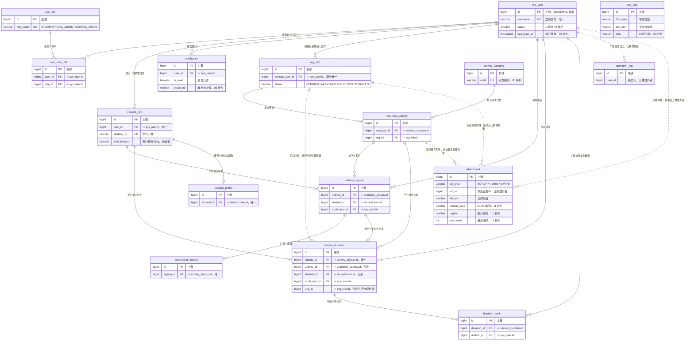

# 数据库 ER 图

> 依据 `sql/02_schema.sql` + `sql/05` + `sql/06` + `sql/07` + `sql/11` 整理，反映 2026-09-24 的最终结构。
> 共 16 张表。

数据库：PostgreSQL（脚本标注 16+，当前环境 18.6），库名 `volunteer_cert_portrait`。

- `sql/02_schema.sql` —— 基础结构：16 张表 + 表/字段注释 + 10 个命名索引
- `sql/05_backend_gap_fix.sql` —— 补列 15 个 + 索引 4 个 + 部分唯一索引 1 个
- `sql/06_backend_gap_fix2.sql` —— 补列 9 个 + 唯一约束 1 个 + 索引 11 个（另有 1 条是 05 已建索引的幂等重申）
- `sql/07_demo_scale.sql` —— 补列 1 个（`activity_category.remark`）+ 演示数据放大（活动 386 / 学生 1500 / 报名 10719）
- `sql/11_activity_images.sql` —— `attachment` 补 3 个图片元数据列 + 1 个排序索引

即本图反映的是 **02 + 05 + 06 + 07 + 11 叠加后**的最终结构，不是单独 `02` 的样子。
`sql/03_init_data.sql`、`sql/04_demo_data.sql`、`sql/08_password_bcrypt.sql` 只写数据、不改结构，不影响本图。

## 一、总览图



图例：实线 `--` 表示有物理外键约束，虚线 `..` 表示只有业务关联、库里没有外键。
`||--o{` 为 1:N，`||--o|` 为 1:1（0 或 1 行）。

## 二、表清单与字段

字段表里「约束」列标注 `PK` / `UK` / `FK` / `NOT NULL` / 默认值，
并标明该字段是 05 还是 06 补的；未标注补列来源的字段都来自 `02_schema.sql`。

### 1. sys_user —— 用户表

系统登录账号，三种角色（学生 / 组织管理员 / 学校管理员）共用这一张表。

| 字段 | 类型 | 约束 | 说明 |
|---|---|---|---|
| id | BIGSERIAL | PK | 主键，自增 |
| username | VARCHAR(50) | NOT NULL, UK | 登录账号，唯一 |
| password | VARCHAR(100) | NOT NULL | 密码；初始化数据为明文，接入加密后必须替换 |
| real_name | VARCHAR(50) | | 真实姓名（前端字段名 `name`） |
| phone | VARCHAR(20) | | 手机号 |
| email | VARCHAR(100) | | 邮箱 |
| avatar | VARCHAR(255) | | 头像地址 |
| status | SMALLINT | DEFAULT 1 | 1 启用 / 0 停用；前端用 ACTIVE / DISABLED，由服务层翻译 |
| deleted | SMALLINT | DEFAULT 0 | 逻辑删除：0 未删除 / 1 已删除 |
| create_time | TIMESTAMP | DEFAULT CURRENT_TIMESTAMP | 创建时间 |
| update_time | TIMESTAMP | DEFAULT CURRENT_TIMESTAMP | 更新时间；PG 无 ON UPDATE，由应用层填充 |
| last_login_at | TIMESTAMP | 05 补列 | 最近一次登录成功时间 |

索引：`username` 唯一约束即索引，无额外命名索引。

### 2. sys_role —— 角色表

三角色固定权限模型，只有种子数据，不支持新增/删除角色。

| 字段 | 类型 | 约束 | 说明 |
|---|---|---|---|
| id | BIGSERIAL | PK | 主键 |
| role_code | VARCHAR(50) | NOT NULL, UK | STUDENT / ORG_ADMIN / SCHOOL_ADMIN |
| role_name | VARCHAR(50) | NOT NULL | 角色名称 |
| remark | VARCHAR(255) | | 备注 |
| deleted | SMALLINT | DEFAULT 0 | 逻辑删除 |
| create_time | TIMESTAMP | DEFAULT CURRENT_TIMESTAMP | 创建时间 |
| update_time | TIMESTAMP | DEFAULT CURRENT_TIMESTAMP | 更新时间 |

索引：`role_code` 唯一约束即索引。

### 3. sys_user_role —— 用户角色关联表

用户与角色的多对多中间表，按物理删除设计。

| 字段 | 类型 | 约束 | 说明 |
|---|---|---|---|
| id | BIGSERIAL | PK | 主键 |
| user_id | BIGINT | NOT NULL, FK → sys_user.id | 用户 ID |
| role_id | BIGINT | NOT NULL, FK → sys_role.id | 角色 ID |
| create_time | TIMESTAMP | DEFAULT CURRENT_TIMESTAMP | 创建时间 |

- 唯一约束：`uk_user_role UNIQUE (user_id, role_id)`
- 无 `deleted`、无 `update_time`（关联表按物理删除）
- 索引：`idx_user_role_role (role_id)`（06 补，`uk_user_role` 最左前缀是 user_id，不含 role_id）

### 4. student_info —— 学生信息表

学生档案，与账号一对一；`total_duration` 是累计时长的权威值。

| 字段 | 类型 | 约束 | 说明 |
|---|---|---|---|
| id | BIGSERIAL | PK | 主键 |
| user_id | BIGINT | NOT NULL, UK, FK → sys_user.id | 关联账号，一个账号一份档案 |
| student_no | VARCHAR(30) | NOT NULL, UK | 学号 |
| college | VARCHAR(100) | | 学院 |
| major | VARCHAR(100) | | 专业 |
| class_name | VARCHAR(100) | | 班级 |
| total_duration | NUMERIC(10,1) | DEFAULT 0 | 累计有效志愿时长（小时），学院排名与画像的依据 |
| public_welfare_level | VARCHAR(50) | | 公益等级，当前直接存中文等级名 |
| deleted | SMALLINT | DEFAULT 0 | 逻辑删除 |
| create_time | TIMESTAMP | DEFAULT CURRENT_TIMESTAMP | 创建时间 |
| update_time | TIMESTAMP | DEFAULT CURRENT_TIMESTAMP | 更新时间 |
| gender | VARCHAR(10) | 06 补列 | MALE / FEMALE |
| grade | VARCHAR(20) | 06 补列 | 年级（入学年份），如 2022 / 2023 / 2024 |

索引：`idx_student_college (college)`；`user_id`、`student_no` 的唯一约束即索引。

### 5. sys_dict —— 数据字典表

英文枚举码 → 中文展示值 + 标签色调的翻译层。

| 字段 | 类型 | 约束 | 说明 |
|---|---|---|---|
| id | BIGSERIAL | PK | 主键 |
| dict_type | VARCHAR(50) | NOT NULL | activity_status / signup_status / attendance_status / duration_status / org_status / user_status / notification_type / audit_action / attachment_biz_type |
| dict_key | VARCHAR(50) | NOT NULL | 入库的英文枚举码 |
| dict_value | VARCHAR(100) | NOT NULL | 前端展示的中文 |
| sort | INT | DEFAULT 0 | 同类型内排序 |
| status | SMALLINT | DEFAULT 1 | 1 启用 / 0 停用 |
| create_time | TIMESTAMP | DEFAULT CURRENT_TIMESTAMP | 创建时间 |
| update_time | TIMESTAMP | DEFAULT CURRENT_TIMESTAMP | 更新时间 |
| tone | VARCHAR(20) | DEFAULT 'mute', 05 补列 | 标签色调：mute 灰 / ok 绿 / warn 橙 / bad 红 / info 蓝 |

- 唯一约束：`uk_dict_type_key UNIQUE (dict_type, dict_key)`
- 无 `deleted`（用 `status` 表达停用）

### 6. notification —— 通知表

按收件人一行存储，群发公告靠 `batch_no` 串成一批。

| 字段 | 类型 | 约束 | 说明 |
|---|---|---|---|
| id | BIGSERIAL | PK | 主键 |
| user_id | BIGINT | NOT NULL, FK → sys_user.id | 接收人 |
| title | VARCHAR(200) | | 通知标题 |
| content | TEXT | | 通知内容 |
| type | VARCHAR(50) | | SIGNUP 报名结果 / DURATION 时长审核 / SYSTEM 系统公告 |
| is_read | BOOLEAN | DEFAULT FALSE | 是否已读 |
| create_time | TIMESTAMP | DEFAULT CURRENT_TIMESTAMP | 创建时间 |
| source | VARCHAR(50) | 05 补列 | 通知来源；列名不能叫 from（SQL 关键字），出参映射回前端字段 `from` |
| is_top | BOOLEAN | DEFAULT FALSE, 05 补列 | 是否置顶 |
| batch_no | VARCHAR(36) | 05 补列 | 群发批次号（UUID），按批次整批删除 |

- 无 `deleted`（用 `is_read` 表达已读）、无 `update_time`
- 索引：`idx_notification_user (user_id)`（02）、`idx_notification_user_read (user_id, is_read)`（05，06 幂等重申）

### 7. operation_log —— 操作日志表

只追加的审计流水，`role` 列刻意不落库（由 user_id 实时推导）。

| 字段 | 类型 | 约束 | 说明 |
|---|---|---|---|
| id | BIGSERIAL | PK | 主键 |
| user_id | BIGINT | | 操作人 ID，未登录可为空；**无物理外键** |
| username | VARCHAR(50) | | 操作人用户名，冗余留存 |
| operation | VARCHAR(200) | | 操作描述，形如「志愿活动 - 发布活动」 |
| method | VARCHAR(200) | | 调用的方法签名 |
| params | TEXT | | 请求参数，建议脱敏后落库 |
| ip | VARCHAR(50) | | 来源 IP |
| create_time | TIMESTAMP | DEFAULT CURRENT_TIMESTAMP | 创建时间 |
| module | VARCHAR(50) | 05 补列 | 所属模块，取值必须是日志页筛选项里的中文名 |
| action | VARCHAR(50) | 05 补列 | 动作描述，如「新增用户」 |
| target | VARCHAR(200) | 05 补列 | 操作对象描述，切面暂未采集 |
| result | VARCHAR(20) | 05 补列 | SUCCESS / FAIL |
| cost | BIGINT | 05 补列 | 业务方法耗时（毫秒） |

- 无 `deleted`、无 `update_time`
- 索引：`idx_operation_log_module (module)`、`idx_operation_log_create_time (create_time DESC)`（均 05 补）

### 8. attachment —— 附件表

通用附件表，`biz_type + biz_id` 组成多态外键，因此不建物理外键。

| 字段 | 类型 | 约束 | 说明 |
|---|---|---|---|
| id | BIGSERIAL | PK | 主键 |
| biz_type | VARCHAR(50) | | ACTIVITY 活动图片 / ORG 组织资质 / AVATAR 用户头像 |
| biz_id | BIGINT | | 业务 ID（多态，不加外键约束） |
| file_name | VARCHAR(255) | | 原始文件名 |
| file_url | VARCHAR(255) | | 访问地址 |
| file_size | BIGINT | | 文件大小（字节） |
| content_type | VARCHAR(100) | 11 补列 | MIME 类型，如 image/png |
| caption | VARCHAR(255) | 11 补列 | 图片说明 |
| sort_order | INT | DEFAULT 0，11 补列 | 同一业务下的展示顺序 |
| create_time | TIMESTAMP | DEFAULT CURRENT_TIMESTAMP | 创建时间 |

无 `deleted`、无 `update_time`；索引 `idx_attachment_biz_sort (biz_type, biz_id, sort_order, id)`。

### 9. org_info —— 志愿组织信息表

志愿组织档案，由学校管理员审核资质。

| 字段 | 类型 | 约束 | 说明 |
|---|---|---|---|
| id | BIGSERIAL | PK | 主键 |
| contact_user_id | BIGINT | FK → sys_user.id | 组织管理员账号 ID |
| org_name | VARCHAR(100) | NOT NULL | 组织名称 |
| org_type | VARCHAR(50) | | 组织类型：学院组织、社会团体等 |
| contact_name | VARCHAR(50) | | 负责人姓名 |
| phone | VARCHAR(20) | | 联系电话 |
| email | VARCHAR(100) | | 联系邮箱 |
| description | TEXT | | 组织简介 |
| status | VARCHAR(20) | DEFAULT 'PENDING' | PENDING / APPROVED / REJECTED / DISABLED |
| deleted | SMALLINT | DEFAULT 0 | 逻辑删除 |
| create_time | TIMESTAMP | DEFAULT CURRENT_TIMESTAMP | 创建时间 |
| update_time | TIMESTAMP | DEFAULT CURRENT_TIMESTAMP | 更新时间 |
| code | VARCHAR(50) | 05 补列 | 组织编码 |
| college | VARCHAR(100) | 05 补列 | 挂靠学院 |
| member_count | INTEGER | DEFAULT 0, 05 补列 | 成员人数 |
| founded_at | DATE | 05 补列 | 成立时间 |
| audit_remark | TEXT | 05 补列 | 资质审核备注，驳回时必填 |

- 索引：`idx_org_info_status_deleted (status, deleted)`（05）
- 部分唯一索引：`uk_org_info_contact_user UNIQUE (contact_user_id) WHERE contact_user_id IS NOT NULL AND deleted = 0`（05）
  —— 即「每个账号最多挂 1 个未删除的组织」，不是全量唯一

### 10. activity_category —— 活动分类表

活动分类字典，供活动选择与画像统计使用。

| 字段 | 类型 | 约束 | 说明 |
|---|---|---|---|
| id | BIGSERIAL | PK | 主键 |
| category_name | VARCHAR(50) | NOT NULL | 分类名称 |
| sort | INT | DEFAULT 0 | 排序（升序） |
| status | SMALLINT | DEFAULT 1 | 1 启用 / 0 禁用；本表状态用 SMALLINT，是全库唯一例外 |
| deleted | SMALLINT | DEFAULT 0 | 逻辑删除 |
| create_time | TIMESTAMP | DEFAULT CURRENT_TIMESTAMP | 创建时间 |
| update_time | TIMESTAMP | DEFAULT CURRENT_TIMESTAMP | 更新时间 |
| code | VARCHAR(50) | 06 补列, UK | 分类编码，如 CAMPUS / COMMUNITY |
| remark | VARCHAR(255) | 07 补列 | 分类说明；前端分类管理页的「说明」列与编辑弹窗 |

- 补列：`remark`（07 补列，见 `sql/07_demo_scale.sql`）—— 前端分类管理页的「说明」列与编辑弹窗
- 唯一约束：`uk_category_code UNIQUE (code)`（06 用 DO 块幂等创建）
- 注意：唯一约束是全量唯一（不含 `deleted = 0` 条件），软删除的行仍占着 code

### 11. volunteer_activity —— 志愿活动表

由组织发布的活动，`signed_count` 是冗余计数列，报名时用原子 UPDATE 维护。

| 字段 | 类型 | 约束 | 说明 |
|---|---|---|---|
| id | BIGSERIAL | PK | 主键 |
| title | VARCHAR(200) | NOT NULL | 活动名称 |
| category_id | BIGINT | FK → activity_category.id | 活动分类 |
| org_id | BIGINT | FK → org_info.id | 发布组织 |
| start_time | TIMESTAMP | | 开始时间 |
| end_time | TIMESTAMP | | 结束时间，由 start_time + duration 推导 |
| location | VARCHAR(200) | | 活动地点 |
| max_count | INT | DEFAULT 0 | 人数上限；0 表示不限 |
| signed_count | INT | DEFAULT 0 | 已报名人数（冗余计数，用于判断是否报满） |
| duration | NUMERIC(10,1) | DEFAULT 0 | 预计志愿时长（小时） |
| status | VARCHAR(20) | DEFAULT 'DRAFT' | DRAFT / PUBLISHED / CLOSED / CANCELED |
| cover | VARCHAR(255) | | 封面图地址 |
| description | TEXT | | 活动详情 |
| deleted | SMALLINT | DEFAULT 0 | 逻辑删除 |
| create_time | TIMESTAMP | DEFAULT CURRENT_TIMESTAMP | 创建时间 |
| update_time | TIMESTAMP | DEFAULT CURRENT_TIMESTAMP | 更新时间 |
| deadline | TIMESTAMP | 06 补列 | 报名截止时间 |
| contact | VARCHAR(100) | 06 补列 | 活动联系方式 |

索引：`idx_activity_status (status)`、`idx_activity_start_time (start_time)`、
`idx_activity_org_status (org_id, status)`、`idx_activity_create_time (create_time)`（均 02）、
`idx_activity_category (category_id)`（06 补）。

### 12. activity_signup —— 活动报名表

学生报名记录，也是签到与时长两条链路的起点。

| 字段 | 类型 | 约束 | 说明 |
|---|---|---|---|
| id | BIGSERIAL | PK | 主键 |
| activity_id | BIGINT | NOT NULL, FK → volunteer_activity.id | 活动 ID |
| student_id | BIGINT | NOT NULL, FK → student_info.id | 学生**档案** ID，不是 sys_user.id |
| signup_time | TIMESTAMP | DEFAULT CURRENT_TIMESTAMP | 报名时间 |
| status | VARCHAR(20) | DEFAULT 'PENDING' | PENDING / APPROVED / REJECTED / CANCELED / COMPLETED |
| audit_remark | VARCHAR(255) | | 审核意见，驳回时为驳回理由 |
| audit_user_id | BIGINT | FK → sys_user.id | 审核人（组织管理员） |
| audit_time | TIMESTAMP | | 审核时间 |
| deleted | SMALLINT | DEFAULT 0 | 逻辑删除 |
| create_time | TIMESTAMP | DEFAULT CURRENT_TIMESTAMP | 创建时间 |
| update_time | TIMESTAMP | DEFAULT CURRENT_TIMESTAMP | 更新时间 |
| reason | VARCHAR(500) | 06 补列 | 报名理由，学生提交报名时填写 |

- 唯一约束：`uk_activity_student UNIQUE (activity_id, student_id)`
  —— 取消报名只改 status、不软删除，否则重新报名会撞该约束
- 索引：`idx_signup_student_status (student_id, status)`（02）、
  `idx_signup_audit_user (audit_user_id)`、`idx_signup_time (signup_time)`（均 06）

### 13. attendance_record —— 签到签退记录表

一条报名对应一条签到记录，记录在报名审核通过时生成。

| 字段 | 类型 | 约束 | 说明 |
|---|---|---|---|
| id | BIGSERIAL | PK | 主键 |
| signup_id | BIGINT | NOT NULL, UK, FK → activity_signup.id | 报名 ID，唯一 |
| sign_in_time | TIMESTAMP | | 签到时间 |
| sign_out_time | TIMESTAMP | | 签退时间 |
| status | VARCHAR(20) | DEFAULT 'NOT_SIGNED' | NOT_SIGNED / SIGNED_IN / SIGNED_OUT / ABNORMAL / ABSENT |
| remark | VARCHAR(255) | | 备注（异常原因等） |
| deleted | SMALLINT | DEFAULT 0 | 逻辑删除 |
| create_time | TIMESTAMP | DEFAULT CURRENT_TIMESTAMP | 创建时间 |
| update_time | TIMESTAMP | DEFAULT CURRENT_TIMESTAMP | 更新时间 |

- 表里**没有 hours 列**：实得时长由「签退 − 签到」实时算出，避免与时间字段漂移
- 索引：`idx_attendance_sign_in_time (sign_in_time)`、
  `idx_attendance_status_sign_in_time (status, sign_in_time)`（均 06，供 analytics 聚合）
- `signup_id` 的唯一约束即索引，无需另建

### 14. service_duration —— 服务时长表

一条报名对应一条时长记录，是时长认证与画像统计的核心事实表。

| 字段 | 类型 | 约束 | 说明 |
|---|---|---|---|
| id | BIGSERIAL | PK | 主键 |
| signup_id | BIGINT | NOT NULL, UK, FK → activity_signup.id | 报名 ID，唯一 |
| activity_id | BIGINT | NOT NULL, FK → volunteer_activity.id | 活动 ID（冗余，便于按活动统计） |
| student_id | BIGINT | NOT NULL, FK → student_info.id | 学生档案 ID（冗余，便于按学生/学院统计） |
| duration | NUMERIC(10,1) | DEFAULT 0 | 实际服务时长（小时） |
| status | VARCHAR(20) | DEFAULT 'PENDING_SUBMIT' | PENDING_SUBMIT / PENDING_AUDIT / APPROVED / REJECTED |
| submit_time | TIMESTAMP | | 提交时间 |
| audit_user_id | BIGINT | FK → sys_user.id | 审核人（学校管理员），重新提交时清空 |
| audit_time | TIMESTAMP | | 审核时间，重新提交时清空 |
| audit_remark | VARCHAR(255) | | 审核意见（驳回原因），重新提交时清空 |
| deleted | SMALLINT | DEFAULT 0 | 逻辑删除 |
| create_time | TIMESTAMP | DEFAULT CURRENT_TIMESTAMP | 创建时间 |
| update_time | TIMESTAMP | DEFAULT CURRENT_TIMESTAMP | 更新时间 |
| proof | VARCHAR(255) | 06 补列 | 服务证明附件（文件名或 URL） |
| org_id | BIGINT | 06 补列 | 所属组织 → org_info.id（冗余，**无物理外键**） |
| activity_type | VARCHAR(50) | 06 补列 | 活动分类名快照，按名存而非 category_id |

索引：`idx_duration_status (status)`、`idx_duration_student_status (student_id, status)`、
`idx_duration_activity (activity_id)`（均 02）、`idx_duration_audit_user (audit_user_id)`、
`idx_duration_org (org_id)`、`idx_duration_create_time (create_time)`（均 06）。
`signup_id` 的唯一约束即索引。

### 15. duration_audit —— 时长审核记录表

每次提交/审核动作留痕，是「驳回 → 重新提交 → 再审核」链路的唯一凭据。

| 字段 | 类型 | 约束 | 说明 |
|---|---|---|---|
| id | BIGSERIAL | PK | 主键 |
| duration_id | BIGINT | NOT NULL, FK → service_duration.id | 时长记录 ID |
| auditor_id | BIGINT | FK → sys_user.id | 操作人；提交时是组织管理员，审核时是学校管理员 |
| action | VARCHAR(20) | | SUBMIT / APPROVE / REJECT（动词原形，与状态值的 APPROVED / REJECTED 不同形） |
| remark | VARCHAR(255) | | 备注，驳回时存驳回理由 |
| create_time | TIMESTAMP | DEFAULT CURRENT_TIMESTAMP | 发生时间 |

- 无 `deleted`、无 `update_time`（流水只追加）
- 索引：`idx_duration_audit_duration (duration_id)`、`idx_duration_audit_auditor (auditor_id)`（均 06）

### 16. student_profile —— 学生公益画像表

每个学生一行，由定时/手动任务重算；本表是**快照**，不是权威数据。

| 字段 | 类型 | 约束 | 说明 |
|---|---|---|---|
| id | BIGSERIAL | PK | 主键 |
| student_id | BIGINT | NOT NULL, UK, FK → student_info.id | 学生档案 ID，唯一 |
| total_activities | INT | DEFAULT 0 | 参与活动次数，按已完成 COMPLETED 的报名计 |
| total_duration | NUMERIC(10,1) | DEFAULT 0 | 累计志愿时长快照；权威值在 student_info.total_duration |
| category_preference | VARCHAR(255) | | 偏好活动类型（参与最多的分类名） |
| tags | VARCHAR(255) | | 公益标签，逗号分隔字符串 |
| portrait_desc | TEXT | | 画像描述文本 |
| create_time | TIMESTAMP | DEFAULT CURRENT_TIMESTAMP | 创建时间 |
| update_time | TIMESTAMP | DEFAULT CURRENT_TIMESTAMP | 更新时间 |

- 无 `deleted`（快照表，重算即覆盖）
- `student_id` 的唯一约束即索引

## 三、关系说明

### 物理外键（18 条）

| # | 从表.字段 | → 主表.字段 | 基数 | 业务含义 |
|---|---|---|---|---|
| 1 | sys_user_role.user_id | sys_user.id | N:1 | 用户拥有的角色关联行 |
| 2 | sys_user_role.role_id | sys_role.id | N:1 | 角色被授予的用户 |
| 3 | student_info.user_id | sys_user.id | 1:1 | 账号对应唯一一份学生档案（NOT NULL UNIQUE） |
| 4 | notification.user_id | sys_user.id | N:1 | 通知的接收人 |
| 5 | org_info.contact_user_id | sys_user.id | N:1 | 组织的联系人账号；部分唯一索引限制每个账号最多 1 个未删除组织 |
| 6 | volunteer_activity.category_id | activity_category.id | N:1 | 活动所属分类 |
| 7 | volunteer_activity.org_id | org_info.id | N:1 | 活动的发布组织 |
| 8 | activity_signup.activity_id | volunteer_activity.id | N:1 | 报名所属活动 |
| 9 | activity_signup.student_id | student_info.id | N:1 | 报名学生（档案 ID，非账号 ID） |
| 10 | activity_signup.audit_user_id | sys_user.id | N:1 | 报名审核人（组织管理员），可空 |
| 11 | attendance_record.signup_id | activity_signup.id | 1:1 | 一条报名最多一条签到记录（NOT NULL UNIQUE） |
| 12 | service_duration.signup_id | activity_signup.id | 1:1 | 一条报名最多一条时长记录（NOT NULL UNIQUE） |
| 13 | service_duration.activity_id | volunteer_activity.id | N:1 | 冗余列，便于按活动统计 |
| 14 | service_duration.student_id | student_info.id | N:1 | 冗余列，便于按学生/学院统计 |
| 15 | service_duration.audit_user_id | sys_user.id | N:1 | 时长终审人（学校管理员），可空 |
| 16 | duration_audit.duration_id | service_duration.id | N:1 | 时长记录的全部审核流水 |
| 17 | duration_audit.auditor_id | sys_user.id | N:1 | 流水操作人，可空 |
| 18 | student_profile.student_id | student_info.id | 1:1 | 学生对应的画像快照（NOT NULL UNIQUE） |

### 业务关联（无物理外键，5 条）

| # | 从表.字段 | → 目标 | 基数 | 业务含义 |
|---|---|---|---|---|
| 19 | service_duration.org_id | org_info.id | N:1 | 冗余的所属组织，供看板按组织汇总时长；只建了 `idx_duration_org`，不加约束 |
| 20 | operation_log.user_id | sys_user.id | N:1 | 操作人；日志只追加，不加外键（且未登录时可为空） |
| 21 | attachment.biz_id（biz_type='ACTIVITY'） | volunteer_activity.id | N:1 | 活动图片附件，多态指向 |
| 22 | attachment.biz_id（biz_type='ORG'） | org_info.id | N:1 | 组织资质附件，多态指向 |
| 23 | attachment.biz_id（biz_type='AVATAR'） | sys_user.id | N:1 | 用户头像附件，多态指向 |

### N:N 关系

| 关系 | 经中间表 | 说明 |
|---|---|---|
| sys_user ↔ sys_role | sys_user_role | 多对多；`uk_user_role(user_id, role_id)` 保证同一组合不重复。业务上一个账号目前只用一个角色，代码按「取第一条」处理 |

### 关系链一览

- 报名链路：`student_info` / `volunteer_activity` → `activity_signup`
- 签到链路：`activity_signup` → `attendance_record`
- 时长链路：`activity_signup` → `service_duration` → `duration_audit`
- 组织链路：`sys_user` → `org_info` → `volunteer_activity`
- 画像链路：`student_info` → `student_profile`

## 四、按业务域分组

| 业务域 | 模块 | 表 | 说明 |
|---|---|---|---|
| 用户与权限 | vcp-system | sys_user、sys_role、sys_user_role、student_info、sys_dict | 账号、角色、学生档案与全局字典 |
| 组织 | vcp-org | org_info | 志愿组织档案与资质审核状态 |
| 活动与报名 | vcp-volunteer | activity_category、volunteer_activity、activity_signup、attendance_record | 活动发布、学生报名、签到签退 |
| 时长认证与审核 | vcp-certification | service_duration、duration_audit | 时长提交与学校终审流水 |
| 公益画像 | vcp-portrait | student_profile | 画像快照与公益标签 |
| 系统支撑 | vcp-system / 跨模块 | notification、operation_log、attachment | 通知、审计日志、附件 |

### 各域内部协作

**用户与权限（5 张）**
`sys_user` 是全局主体，`sys_user_role` 把它和 `sys_role` 连起来决定权限；
学生账号在 `student_info` 上有一份档案（1:1），后续所有报名、时长都挂在这份档案上而不是账号上；
`sys_dict` 与谁都不建外键，只做「英文码 → 中文 + 色调」的翻译层，被所有前端页面共用。

**组织（1 张）**
`org_info` 通过 `contact_user_id` 绑定一个组织管理员账号，是被授予 ORG_ADMIN 角色的那个账号；
组织的 `status` 由学校管理员审核，未通过的组织不应发布活动。

**活动与报名（4 张）**
`volunteer_activity` 同时挂 `activity_category`（分类）与 `org_info`（发布组织）；
`activity_signup` 是学生与活动的连接点（`uk_activity_student` 保证同一学生同一活动只有一行）；
报名审核通过时同步生成 `attendance_record`（1:1，靠 `signup_id` 唯一约束保证），
活动 `signed_count` 随报名状态原子增减。

**时长认证与审核（2 张）**
`service_duration` 由 `attendance_record` 的签到签退结果派生，一条报名一条（`signup_id` 唯一），
并冗余存 `activity_id` / `student_id` / `org_id` / `activity_type` 四个列，避免统计时反复 JOIN；
`duration_audit` 记录每一次提交与审核动作，是重新提交会清空 `service_duration` 审核字段后唯一的轨迹。

**公益画像（1 张）**
`student_profile` 与 `student_info` 一对一，由已完成（COMPLETED）的报名与已通过（APPROVED）的时长聚合而来；
`tags` 是逗号分隔字符串而不是关联表，分类维度靠 `category_preference` 与 `service_duration.activity_type`。

**系统支撑（3 张）**
`notification` 按收件人一行挂在 `sys_user` 上；
`operation_log`、`attachment` 都不建外键：前者按只追加设计，后者的 `biz_id` 是多态外键。

## 五、已知偏差

### 1. `student_info.gender` / `student_info.grade`：脚本已补列，实体类没有

- 脚本侧：`sql/06_backend_gap_fix2.sql` 第 118–119 行给 `student_info` 补了
  `gender VARCHAR(10)` 与 `grade VARCHAR(20)`，并按 `(id - 1)` 的确定性规则回填了演示数据。
- 实体侧：`vcp-system` 的 `StudentInfo.java` **没有**这两个字段，
  `StudentVO.java`、`StudentQuery.java`、`StudentInfoMapper.java` 的注释里仍写着
  「库里没有 gender / grade 列，本轮未扩」——这些注释在 `06` 执行后已经过期。
- 更不一致的是：`vcp-portrait` 的 `PortraitAggregateMapper.java` 已经在
  `SELECT si.grade AS grade`（画像分页与画像明细两处），也就是说同一批代码里
  一处认为该列不存在、另一处已经依赖它。
- 处理：**以脚本为准**，本图已收录 `gender` / `grade` 两列。
  待办是给 `StudentInfo` 补这两个字段，并让 `StudentQuery.grade` 真正参与筛选、`StudentVO` 输出该列。
- 另注：`gender` 目前没有任何消费方（代码里只用到 `grade`），补字段前无需改查询。

### 2. 非偏差、但值得记一笔的命名差异

- `notification.is_top`：实体字段名是 `top`，用 `@TableField("is_top")` 显式映射，列名与脚本一致。
- `sys_user.status`、`activity_category.status` 是 `SMALLINT`（1/0），
  而前端用 `ACTIVE` / `DISABLED` 字符串码，翻译在服务层（`UserStatusEnum` / VO 层）完成，属既定设计而非偏差。
- `notification.source` 对应前端字段 `from`（`from` 是 SQL 关键字），出参时映射，非偏差。

### 3. 未收录、也未猜测的内容

- `attachment.biz_id` 的多态指向取自列注释（`ACTIVITY` / `ORG` / `AVATAR` 三个枚举值），
  库里没有对应约束，因此图中用虚线表示、关系表中单列。
- 除上述外，未发现脚本与实体之间的字段名或类型偏差：
  16 张表的全部列都与实体字段一一对得上（`gender` / `grade` 除外）。

## 六、如何导出为图片

### 直接预览（无需导出）

- **GitHub**：提交后打开 `docs/ER图.md`，Mermaid 代码块会自动渲染成图。
- **VS Code**：安装扩展 **Markdown Preview Mermaid Support**（`bierner.markdown-mermaid`），
  打开本文件按 `Ctrl+Shift+V` 预览即可看到图；
  若图表未渲染，检查是否只装了通用 Markdown 预览而没有该扩展。
- 其它支持 Mermaid 的编辑器：Typora、Obsidian、JetBrains 系列（需装 Mermaid 插件）。

### 导出 PNG / SVG

1. **在线编辑器（最快）**
   打开 <https://mermaid.live>，把第一节 Mermaid 代码块的内容（不含首尾的围栏行）粘进左侧编辑区，
   右侧预览确认无误后，用右上角 Actions → PNG / SVG 导出。
   注意：导出中文需要浏览器能正常渲染中文字体，导出的 SVG 在任何环境都正常，PNG 建议选较大宽度。

2. **VS Code 导出**
   用 **Markdown Preview Enhanced** 扩展打开本文件预览，在图上右键 →「Chrome (Puppeteer) → PNG」，
   即可导出 PNG；Mermaid 预览类扩展一般也提供「Export diagram」菜单项。

3. **命令行（mermaid-cli，适合进 CI 或批量）**
   先把代码块另存为 `docs/er.mmd`，再执行：

   ```bash
   npx -y @mermaid-js/mermaid-cli -i docs/er.mmd -o docs/ER图.png -w 2400 -b white
   npx -y @mermaid-js/mermaid-cli -i docs/er.mmd -o docs/ER图.svg -b white
   ```

   也可以直接喂 Markdown 文件（会为其中每个图各生成一张图）：

   ```bash
   npx -y @mermaid-js/mermaid-cli -i docs/ER图.md -o docs/ER图.png -w 2400 -b white
   ```

   首次执行需要下载依赖（`npx` 走网络）与 Puppeteer 的 Chromium；离线环境改用在线编辑器导出。

4. **从数据库反向生成（可选，用于核对）**
   用 DBeaver / pgAdmin 连上 `volunteer_cert_portrait` 库，选中全部表右键生成 ER 图。
   这条路径反映的是**库里实际执行过 02 + 05 + 06 + 07（老库还有 08）之后**的状态，
   与本文档的差异即为「脚本没跑全」，可作为上线前的核对手段。
