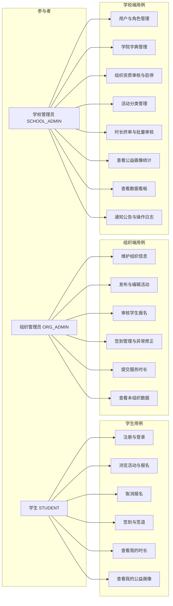
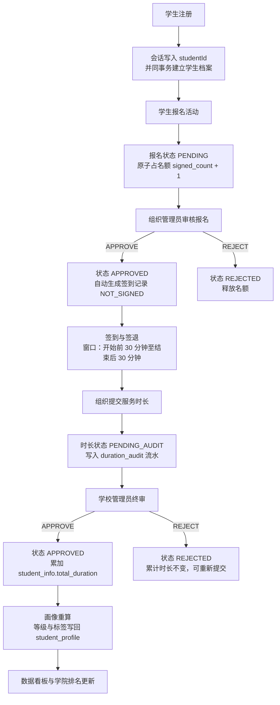

# 第一章 需求分析

> **本章写作约定**：本章所有功能与非功能需求均来自仓库内已存在的设计文档、脚本与实测记录，
> 每条结论后标注 `文件:行` 出处，便于答辩时当场翻阅。
> 凡"计划中但未实现"的内容，一律在 1.8 节如实列出，不写入正文需求。
>
> **数据口径提示（全文通用）**：本论文涉及两套演示数据口径与一套 mock 口径，三者**不可混用**：
> ① `sql/07_demo_scale.sql` 口径：**1500 学生 / 386 活动 / 10719 报名 / 19319.3 小时**；
> ② 在 ① 之后叠加 `sql/12_activity_images_demo.sql` 的当前库值：**1503 学生 / 389 活动**（报名与时长不变）；
> ③ 前端 mock 口径：**12,480 报名 / 86,420 小时**，是纯前端独立演示用的假数据，**不是真库数字**。
> 依据：`docs/测试报告.md:15`、`docs/测试报告.md:283-291`、`docs/待办清单.md:847-849`。

---

## 1.1 引言

### 1.1.1 选题背景

高校志愿服务是学生思想政治教育与综合素质评价的重要载体。学生在校期间参与的志愿活动，
最终要落到"服务时长"这一可计量的凭证上，用于综合素质测评、评奖评优与志愿服务星级认定。
传统做法存在三个突出问题：

1. **过程靠纸质与表格**：报名表、签到表、时长认定表分散在各组织手里，学生无法自助查询。
2. **认证链条缺乏复核**：组织自报时长、学校事后抽查，缺少"谁提交、谁审核、何时审核"的可追溯流水。
3. **数据只用于记录，不用于分析**：全校志愿服务数据躺在表格里，无法回答"哪个学院参与度高""哪类活动
   最缺人""学生的参与是否有持续性"这类管理问题。

本课题把上述问题收敛为一条**多角色审核的完整业务闭环**，并在此基础上做**公益画像**与**数据分析看板**
两个增值模块，使系统不止于"活动管理系统"。

### 1.1.2 选题来源与依据

本课题的选题、命名体系、角色划分与功能范围**并非在写作阶段临时拟定**，而是在项目开发前
即由小组三人共同确认，并固化为仓库内的设计文档：

| 项 | 内容 | 出处 |
|---|---|---|
| 正式题目 | 基于多角色审核的高校志愿服务时长认证与公益画像数据分析系统设计与实现 | `docs/知识库已确认项目选题与技术背景.md:21` |
| 系统名称 | 高校志愿服务时长认证与公益画像数据分析系统 | 同上 `:22` |
| 英文名 | Volunteer Service Certification and Public Welfare Portrait Analysis System | 同上 `:23` |
| 项目代号 | **VCP**（Volunteer Cert Portrait） | 同上 `:24` |
| 仓库名 | `volunteer-cert-portrait` | 同上 `:25` |
| 三个角色 | `STUDENT` / `ORG_ADMIN` / `SCHOOL_ADMIN` | 同上 `:32` |
| 技术栈限定 | 后端 Spring Boot、前端 Vue、数据库 PostgreSQL | `docs/高校志愿服务时长认证与公益画像数据分析系统_开发计划与分工.md:19-21` |
| 开发阶段 | 十阶段开发计划，本章对应第一、二阶段，第五章对应第九、十阶段 | 同上 `:412-930` |

项目定位在计划书中被明确表述为"**本系统不是普通的'活动管理系统'**"，而是围绕
"志愿活动发布 → 学生报名审核 → 活动签到签退 → 服务时长记录 → 多角色时长审核 → 学生公益画像 →
志愿服务数据分析"形成完整闭环（`docs/高校志愿服务时长认证与公益画像数据分析系统_开发计划与分工.md:34-46`）。

### 1.1.3 建设目标

1. **打通闭环**：让一名学生从注册到拿到时长，全程在线完成，且每一步都有状态与责任人。
2. **可追溯认证**：时长认定形成"组织提交 → 学校终审 → 流水留痕"的三段式链条。
3. **数据可用**：把闭环中沉淀的数据聚合成看板指标与个人画像，支撑管理决策。
4. **工程规范**：以后端多模块、前端分层、脚本化数据库的方式实现，保证三人可并行开发且互不干扰。

---

## 1.2 需求获取方式

本项目的需求**不是通过问卷或访谈一次性获得**，而是通过三条相互印证的路径逐步收敛。
这一节如实说明需求的来源与验证方式，以便评审判断需求的可靠性。

### 1.2.1 路径一：开发计划书给定的功能范围

《开发计划与分工》第三章列出 10 个核心功能模块及其涉及的表
（`docs/高校志愿服务时长认证与公益画像数据分析系统_开发计划与分工.md:103-302`），
第四章给出 16 张表的清单建议（同上 `:309-328`），第九阶段给出功能 / 流程 / 异常三组测试要求
（同上 `:812-877`）。这是需求的**主干**。

### 1.2.2 路径二：原型与前端页面的反推

第二阶段要求完成页面规划（同上 `:451-505`）。前端按原型实现了 **29 个页面**
（`docs/前端进展与待办.md:34`、`:61-66`），页面上的每一个输入框与筛选条件都对应一条后端契约。
**页面反推**是发现"文档未写但实际需要"的需求的主要手段，例如：活动分类的"备注"字段、
学生列表的"年级"字段、通知公告的正文与批次号，都是先出现在页面上、后补进数据库与接口的
（`sql/05_backend_gap_fix.sql`、`sql/06_backend_gap_fix2.sql`，见 `docs/后端进展与待办.md:178-180`、`:274-283`）。

### 1.2.3 路径三：需求歧义项的显式拍板

开发计划与知识库文档中存在若干**未定义或互相矛盾**之处。项目组把这些点集中登记为
"A 组：需要先拍板（不定就无法开工）"，共 12 项，逐项给出结论、理由与落地位置
（`docs/待办清单.md:185-289`）。**这是本课题需求分析中最有工程价值的部分**：
它把"文档里没写"变成了"有据可依的决定"。12 项结论汇总如下。

| 编号 | 议题 | 结论（摘） | 出处 |
|---|---|---|---|
| A1 | 服务时长如何计算 | `hours =（签退时间 − 签到时间）/ 3600`，保留 2 位小数；缺签退或签到状态为 `ABNORMAL` 时取活动预计时长；上限为活动预计时长的 **1.5 倍** | `docs/待办清单.md:192-195` |
| A2 | 签到/签退时间窗口 | 活动开始前 **30 分钟**开放签到；活动结束后 **30 分钟内**必须签退；未签退记 `ABSENT`，实现为**查询时惰性判定** | `docs/待办清单.md:197-200` |
| A3 | 报名人数上限的并发控制 | 用 `UPDATE ... SET signed_count = signed_count + 1 WHERE id = ? AND signed_count < max_count` 原子更新，**影响行数为 0 即"已满"**；不做"先查再写" | `docs/待办清单.md:202-205` |
| A4 | 审核驳回后如何重新提交 | `REJECTED` **允许重新提交**，回到 `PENDING_AUDIT`，并向 `duration_audit` 追加一条新的 `SUBMIT` 流水（保留驳回历史） | `docs/待办清单.md:207-209` |
| A5 | `total_duration` 以哪张表为准 | **以 `student_info.total_duration` 为准**；`student_profile` 仅作画像快照 | `docs/待办清单.md:211-213` |
| A6 | 时间类型是否改 `timestamptz` | **不改**，继续 `TIMESTAMP` + `LocalDateTime`；理由：单一部署、无跨时区需求，改动需动 16 张表 + 全部实体 + 前端渲染 + 演示数据重跑 | `docs/待办清单.md:215-218` |
| A7 | 逻辑删除与唯一约束的冲突 | **取消 = 改 `status = 'CANCELED'`、复用同一行**，`deleted` 保持 0；不改唯一约束 | `docs/待办清单.md:220-223` |
| A8 | 演示数据尺度对齐 | 目标规模 **386 场活动 / 约 1500 学生 / 约 1 万报名 / 约 2 万小时** | `docs/待办清单.md:225-232` |
| A9 | `sys_user.status` 用什么类型 | DB 存 `SMALLINT` 1/0，API 返回英文码（`ACTIVE`/`DISABLED`），前端字典用英文码 —— **三层天然对齐，无需改代码** | `docs/待办清单.md:234-240` |
| A10 | 组织"停用/启用"是否保留 | **保留**：`org_info.status` 在资质审核态之外增加 `DISABLED`，可在 `APPROVED` ⇄ `DISABLED` 间往返 | `docs/待办清单.md:242-246` |
| A11 | 演示账号名不一致 | 统一为 `org_admin`（以后端种子为准） | `docs/待办清单.md:252-257` |
| A12 | 活动分类前后端口径不一致 | 以后端（库 + 标签规则文档）为准，改前端 mock 的 6 个分类名称与顺序；分类→标签映射**按 `code` 而非中文名** | `docs/待办清单.md:259-289` |

> **A12 是本课题最典型的一处需求缺陷**：库里的 6 条 `activity_category` 与前端 mock 的 6 条
> **名称与顺序都不同**（如库 id=1 是"校园服务"、mock id=1 是"社区服务"）。这不只是文案问题 ——
> 公益标签的类型判定依赖活动分类，若按中文名映射，一旦改名就会**静默错位**。
> 最终收敛为：分类表增加 `code` 列（`CAMPUS`/`COMMUNITY`/`ENVIRONMENT`/`EVENT`/`ELDERLY`/`CULTURE`），
> 标签映射按 `code` 走，中文名只作兜底（`docs/待办清单.md:271-278`、`:289`）。

---

## 1.3 系统定位与范围

### 1.3.1 定位

**前后端分离 + 后端"模块化单体（Modular Monolith）"**。知识库文档给出的定位理由是可被三人小组落地：
"一个仓库、一次部署，但代码按业务域拆成独立 Maven 模块，答辩时能讲清'高内聚、低耦合'"
（`docs/知识库已确认项目选题与技术背景.md:49`）。

### 1.3.2 系统边界

**纳入范围**（已实现，见第四章）：

- 用户注册 / 登录 / 退出、本人资料维护、本人改密、管理员重置口令
- 学生档案、学院字典、角色与权限
- 志愿组织信息维护与资质审核、组织启停
- 活动分类管理、活动发布 / 编辑 / 关闭、活动图片上传
- 学生报名、取消报名、组织审核报名
- 签到 / 签退 / 异常标记 / 组织端人工修正
- 组织提交服务时长、学校终审（通过 / 驳回 / 批量审核）
- 学生公益画像（累计时长、参与次数、偏好分类、6 档等级、8 类标签）
- 数据分析看板（概览、趋势、类型占比、学院排名、组织活跃度、签到率、审核三态、标签分布、热力图）
- 通知公告、操作日志
- 数据一致性自检脚本（20 项，只读）

**不纳入范围**（明确不做，见 1.8 节）：志愿证书生成、活动收藏、积分商城、活动评论、
活动推荐、移动端适配、扫码签到、组织资质材料上传、用户头像上传。

---

## 1.4 角色与权限需求

### 1.4.1 角色定义

系统设三个角色，角色编码入库为英文大写码（`sql/02_schema.sql:91`）：

| 角色码 | 中文 | 主要职责 | 出处 |
|---|---|---|---|
| `STUDENT` | 学生 | 注册登录、浏览活动、报名、签到签退、查看时长与画像 | `docs/高校志愿服务时长认证与公益画像数据分析系统_开发计划与分工.md:62-74` |
| `ORG_ADMIN` | 组织管理员 | 维护组织信息、发布活动、审核报名、管理签到、提交时长、查看本组织数据 | 同上 `:76-87` |
| `SCHOOL_ADMIN` | 学校管理员 | 管理用户与角色、审核组织资质、审核时长、管理分类与学院、查看全校数据、管理通知、查看日志 | 同上 `:89-99` |

### 1.4.2 权限模型

权限标识统一采用 **`域:资源:操作`** 三段式（`CLAUDE.md:100`），由后端静态映射表决定。
**系统不建权限表**：`sys_role` 只有 `role_code` / `role_name` 两列，没有 perms 列，
也没有 role-permission 关联表；三个角色的权限边界固定，因此映射写在代码里，
避免为了形式上的"动态权限"多加两张表（`volunteer-cert-portrait-server/vcp-framework/src/main/java/com/vcp/framework/security/StpInterfaceImpl.java:19-22`）。

权限数量：**学生 5 条 / 组织管理员 7 条 / 学校管理员 17 条**
（`StpInterfaceImpl.java:35-37`，映射表本体见 `:39-75`）。

| 角色 | 权限码 |
|---|---|
| `STUDENT`（5） | `volunteer:activity:list`、`volunteer:signup:create`、`volunteer:signup:cancel`、`certification:duration:mine`、`portrait:profile:mine` |
| `ORG_ADMIN`（7） | `volunteer:activity:list`、`volunteer:activity:create`、`volunteer:activity:update`、`volunteer:activity:publish`、`volunteer:signup:audit`、`volunteer:attendance:manage`、`certification:duration:submit` |
| `SCHOOL_ADMIN`（17） | `volunteer:activity:list`、`volunteer:activity:update`、`volunteer:signup:audit`、`volunteer:attendance:manage`、`volunteer:category:manage`、`org:info:audit`、`certification:duration:approve`、`portrait:profile:list`、`system:user:list`、`system:user:create`、`system:user:update`、`system:user:delete`、`system:role:list`、`system:college:manage`、`system:notice:manage`、`system:log:list`、`analytics:dashboard:view` |

> 出处：`StpInterfaceImpl.java:40-46`（学生）、`:47-55`（组织）、`:56-74`（学校）。

**前后端权限必须同步**：前端 `volunteer-cert-portrait-web/src/stores/user.js` 的 `ROLE_PERMS`
与后端这份映射逐条对应，按钮级显隐（`v-perm` 指令）读的是前端那份，接口级拦截读后端那份。
两边不一致会出现"按钮点得到、接口报 20003"或"有接口权限、页面却不给入口"的错位
（`StpInterfaceImpl.java:24-27`）。

### 1.4.3 数据范围约束（需求级）

除权限码外，系统还有一层**数据范围**约束，且口径统一为"**以登录态为准，忽略前端传的
`studentId` / `orgId`**"（`docs/后端进展与待办.md:262`）：

- 学生只能看到自己的报名、时长与画像；
- 组织管理员只能看到本组织的活动、报名、签到与时长；
- 学校管理员可看全校数据。

越权与数据范围外统一返回"**不存在**"（错误码 `30001` / `30008` / `30011`），
**不复用 `20003`**。理由：前端把 `20003` 当登录失效处理，会清 token 跳登录；
且报"无权限"等于确认这条记录存在（`docs/后端进展与待办.md:263`、`:170`）。

---

## 1.5 功能需求

本节按 10 个功能模块展开，每个模块给出需求描述与**落地依据**。用例编号对应
`docs/测试用例表.md` 的 `TC-F-*`，便于与第五章交叉阅读。

### 1.5.1 用户与权限模块

**需求**：用户注册、登录、退出、个人信息管理、修改密码、角色与权限控制。

**已实现要点**：

| 需求点 | 实现口径 | 出处 |
|---|---|---|
| 登录 | `POST /api/v1/auth/login`，写 token 并往会话写 `roleCode` / `orgId` / `studentId` | `docs/后端进展与待办.md:144` |
| 学生自助注册 | `POST /api/v1/auth/register`，注册即登录；**必选学院** | 同上 `:145` |
| 注册即建档 | 新增 `StudentArchiveRegistrar.ensureArchive(userId)`，与账号插入**同一事务**；占位学号 `S` + 六位零填充 userId | `docs/测试报告.md:186-188` |
| 本人资料 | `GET` / `PUT /api/v1/auth/me`，**只能改姓名、手机号、邮箱** | `docs/后端进展与待办.md:147` |
| 本人改密 | `PUT /api/v1/auth/password`，校验旧口令，改完**踢掉该账号其它会话、保留当前会话** | `docs/下一步待办.md:200-201` |
| 管理员重置 | `PUT /api/v1/system/users/{id}/password`，留空重置为默认 `123456`，重置后**踢掉全部会话** | 同上 `:202-203` |
| 用户管理 | `/system/users` 增删改查 + `/status` 启停 | `docs/后端进展与待办.md:148-150` |
| 角色管理 | `GET /api/v1/system/roles`，**只读**，角色不可增删改；同时返回每个角色的权限清单 | 同上 `:151` |
| 字典 | `GET /api/v1/system/dicts`，**仅需登录**（三种角色都要用，不能挂 `system:*`） | 同上 `:152` |
| 停用/删除自己 | **被拒绝** —— 管理员把自己停掉后登录接口会以 20002 拒绝，而恢复又需要登录 | 同上 `:168-169` |

**安全需求**（非功能，但与本节强相关，详见 1.6.2）：

- 口令以 **BCrypt 密文**入库，明文不落库（`sql/02_schema.sql:67`）；
- 登录**连续 5 次失败锁 15 分钟**（`docs/下一步待办.md:178-179`）；
- 登录 / 注册 / 本人改密 / 管理员重置四类操作**不采集请求参数**，避免明文口令被序列化进
  `operation_log.params` 永久留存（`docs/后端进展与待办.md:165-167`）。

**用例**：`TC-F-01` ~ `TC-F-13`（`docs/测试用例表.md:32-44`）。

### 1.5.2 学生信息与学院字典模块

**需求**：学生基本信息（学号、学院、专业、班级）、累计志愿时长、公益标签。

**关键设计决策**：**学院不是独立表**，而是 `sys_dict` 里 `dict_type = 'college'` 的字典行
（`dict_key` = `dict_value` = 学院名）。理由：注册页下拉、注册校验、按学院筛学生与组织，
全都按"学院名"这一列匹配；多一张表只会多一份可能与字典漂移的名字清单
（`docs/后端进展与待办.md:453`、`:467`）。

**学院链路的四条写/读路径**：

1. **免登录读**：`GET /api/v1/auth/colleges` —— 注册页在登录之前，必须免登录（`docs/后端进展与待办.md:486`）。
2. **管理端读/写**：`GET` / `POST /api/v1/system/colleges`、`PUT /{id}/status`、`DELETE /{id}`，
   全部挂权限码 `system:college:manage`（`docs/后端进展与待办.md:456-463`）。
3. **注册写**：`AuthServiceImpl` 调用 `DictService.containsEnabled('college', key)` 校验，失败文案"请选择学院"。
4. **管理员新增用户写**：`UserServiceImpl.createUser` 复用**同一个** `containsEnabled`，
   保证两条写路径的失败文案逐字一致（`docs/后端进展与待办.md:475-476`）。

**约束**：学院下还有学生或组织时**拒绝删除**，文案带具体数量
（"该学院下还有 N 名学生、M 个组织，不能删除"）（`docs/后端进展与待办.md:463`）。

**未完成**：`student_info` 的 `major` / `class_name`（以及同源的 `gender` / `grade`）
**仍然没有写入入口**（`docs/后端进展与待办.md:493`）。

### 1.5.3 志愿组织模块

**需求**：组织名称、类型、简介、负责人、联系方式、审核状态。

**状态机需求**：资质审核态为 `PENDING` / `APPROVED` / `REJECTED`；在此基础上**增加 `DISABLED`**，
使学校管理员可在 `APPROVED` ⇄ `DISABLED` 之间往返切换，从而在保留组织历史数据的前提下
暂停其发布活动与提交时长（`docs/待办清单.md:243-246`）。

**接口**：`GET /api/v1/orgs`、`GET` / `PUT /orgs/{id}`、`PUT /orgs/{id}/audit`、
`PUT /orgs/{id}/status`（`docs/后端进展与待办.md:197-203`）。

**设计约束**：

- **`DISABLED` 与 `REJECTED` 分离**：停用不改变资质结论，历史活动与时长数据继续保留；
  只有已通过审核的组织允许启停（`docs/后端进展与待办.md:207-208`）。
- **组织资料更新不带状态字段**：状态、负责人账号、审核备注只能走对应接口，
  避免资料维护绕开状态机（同上 `:213-214`）。
- **审核结果通知负责人**：通过 / 驳回各落一条系统通知，驳回理由写入正文（同上 `:211-212`）。

### 1.5.4 志愿活动模块

**需求**：活动名称、分类、时间、地点、人数限制、志愿时长、状态、封面、详情、发布组织。

**活动状态**：`DRAFT` 草稿 / `PUBLISHED` 已发布 / `CLOSED` 已结束 / `CANCELED` 已取消
（`sql/02_schema.sql:329`）。

**名额口径（重要）**：`volunteer_activity.signed_count` 是**冗余计数**，口径为
"**报名即占名额**：未取消未驳回的报名都计入，驳回与取消各释放一个"，用于快速判断是否报满
（`sql/02_schema.sql:327`）。该口径曾与演示数据脚本的"仅 `APPROVED` + `COMPLETED`"口径不一致，
已于 2026-09-24 收口为**脚本对齐实现**（`docs/后端进展与待办.md:287-300`）。

**活动图片**：`POST /api/v1/attachments/images`，发布页支持 **1 张封面 + 最多 6 张带说明图片**；
PostgreSQL 只存附件元数据，图片本体写入 `uploads/`
（`docs/后端进展与待办.md:500-506`、`docs/测试用例表.md:152`）。

**接口规模**：`vcp-volunteer` 共 18 个接口，覆盖 `/activities`、`/categories`、`/signups`、`/attendance`
（`docs/后端进展与待办.md:239`）。

**未实现**：取消活动不释放名额、不终止报名；活动结束后 `PENDING` 报名无终态
（`docs/测试报告.md:203`）。

### 1.5.5 活动报名模块

**需求**：学生报名、报名审核、通过 / 驳回、取消报名、状态查询。

**报名状态**：`PENDING` 待审核 / `APPROVED` 已通过 / `REJECTED` 已驳回 / `CANCELED` 已取消 /
`COMPLETED` 已完成（`sql/02_schema.sql:359`）。

**并发需求（A3）**：报名占名额必须是**原子操作**，不做"先查再写"（存在 TOCTOU 窗口），
也不用行锁（`volunteer_activity` 没有 `version` 列）（`docs/待办清单.md:202-205`）。

**取消需求（A7）**：取消 = 改 `status = 'CANCELED'`、**复用同一行**，`deleted` 保持 0。
理由：改部分唯一索引要动既有约束，而"同一学生对同一活动只保留一行"本来就是想要的语义
（`docs/待办清单.md:220-223`）。

**业务规则**：

| 场景 | 结果 | 错误码 | 出处 |
|---|---|---|---|
| 重复报名 | 拒绝 | `30007` | `docs/测试用例表.md:54` |
| 名额已满 | 拒绝 | `30006` | 同上 `:55` |
| 活动已结束/已关闭 | 拒绝 | `30005` | 同上 `:56` |
| 已完成的活动取消报名 | 拒绝 | `30010` | 同上 `:58` |
| 报名已审核过再审核 | 拒绝 | `30009` | 同上 `:68` |

### 1.5.6 签到签退模块

**需求**：活动开始前签到、活动结束后签退、组织管理员代签到（人工修正）、异常标记、缺勤记录。

**签到状态**：`NOT_SIGNED` 未签到 / `SIGNED_IN` 已签到 / `SIGNED_OUT` 已签退 / `ABNORMAL` 异常 /
`ABSENT` 缺勤（`sql/02_schema.sql:386`）。

**时间窗口需求（A2）**：活动开始前 **30 分钟**开放签到；活动结束后 **30 分钟内**必须签退；
未签退记 `ABSENT`。实现为**查询时惰性判定**（不引入定时任务，降低部署复杂度）；
30 分钟为可调常量，集中定义在 `vcp-volunteer` 的常量类里（`docs/待办清单.md:197-200`）。

**数据模型约束**：`attendance_record.signup_id` **唯一** —— 一条报名最多一条签到记录；
报名审核通过时**同步生成**签到记录（`sql/02_schema.sql:371`、`docs/ER图.md:513`）。

**已知限制**：**学生端自助签到无页面入口**，且报名 VO 不返回 `attendanceId`，学生无从取得该参数；
后端 `POST /api/v1/attendance/sign-in` 接口存在，仅缺前端入口（`docs/测试报告.md:74-75`、`:198`）。

### 1.5.7 服务时长认证模块

**需求**：组织管理员提交时长、学校管理员审核（通过 / 驳回）、学生查看时长、时长统计。

**时长状态**：`PENDING_SUBMIT` 待提交 / `PENDING_AUDIT` 待审核 / `APPROVED` 已通过 /
`REJECTED` 已驳回（`sql/02_schema.sql:423`）。

**计算口径（A1）**：`hours =（签退时间 − 签到时间）/ 3600`，保留 2 位小数；
缺签退或签到状态为 `ABNORMAL` 时取活动预计时长；上限为活动预计时长的 **1.5 倍**
（`docs/待办清单.md:192-195`）。

**权威值口径（A5）**：`student_info.total_duration` 为权威值，时长审核通过时由后端累加；
`student_profile` 仅作画像快照，可随时由前者重算（`docs/待办清单.md:211-213`、
`sql/02_schema.sql:475`）。

**驳回重提口径（A4）**：`REJECTED` 允许重新提交，回到 `PENDING_AUDIT`，
并往 `duration_audit` 写一条新的 `SUBMIT` 流水（保留驳回历史，不覆盖）
（`docs/待办清单.md:207-209`）。

**流水表设计**：`duration_audit.action` 存 `SUBMIT` / `APPROVE` / `REJECT`，
注意与状态值的 `APPROVED` / `REJECTED` **不同形**（`sql/02_schema.sql:448`、`CLAUDE.md:101`）。
该表按**只追加**设计，不加 `deleted` / `update_time`（`sql/02_schema.sql:432`）。

**业务规则**：

| 场景 | 结果 | 错误码 | 出处 |
|---|---|---|---|
| 对未通过审核的报名提交时长 | 拒绝 | `30008` | `docs/测试报告.md:176-178` |
| 时长已审核过再审核 | 拒绝 | `40002` | `docs/测试用例表.md:92` |
| 时长重复提交 | 拒绝 | `10001` | `docs/测试报告.md:80-81` |

> **P0 缺陷修复记录（本章作为"需求被真正验证"的证据）**：`DurationRefMapper.selectSignupId`
> 原先只过滤 `deleted = 0`，而取消报名 / 驳回按 A7 只改 `status` 不软删，
> 于是"待审核 / 已驳回 / 已取消"的报名**也能开时长**，审核通过后 `total_duration` 被错误累加，
> 且当时没有任何撤销接口。修复为反查 SQL 增加 `AND status IN ('APPROVED','COMPLETED')`
> （`docs/测试报告.md:169-178`、`docs/后端进展与待办.md:433`）。

**未实现**：`PENDING_SUBMIT`（待提交）状态**全链路无生产者**，
组织端"时长提交"页的状态分布真后端恒为 0（`docs/测试报告.md:201`）。

### 1.5.8 公益画像模块

**需求**：学生志愿总时长、活动类型偏好、参与频率、学院排名、公益等级、公益标签。

**数据模型**：`student_profile` 每个学生一行，字段含 `total_activities`（参与活动次数）、
`total_duration`（画像快照）、`category_preference`（偏好分类名）、`tags`（逗号分隔标签）、
`portrait_desc`（画像描述文本）（`sql/02_schema.sql:459-470`）。

**"参与活动次数"的口径**：按**已完成 `COMPLETED`** 的报名计，即真的签到参加了，
而非仅报名被批准（`sql/02_schema.sql:474`）。

**公益等级：6 档（演示尺度）**

| 等级 | 累计有效时长（小时） |
|---|---|
| 普通志愿者 | `x < 3` |
| 一星志愿者 | `3 ≤ x < 6` |
| 二星志愿者 | `6 ≤ x < 10` |
| 三星志愿者 | `10 ≤ x < 20` |
| 四星志愿者 | `20 ≤ x < 40` |
| 五星志愿者 | `x ≥ 40` |

出处：`docs/公益等级与标签规则方案.md:47-56`、`sql/02_schema.sql:139`。

> **阈值取舍是显式的需求决策**：方案 B（贴近中国青年志愿者星级标准：一星 100h / 二星 300h /
> 三星 600h / 四星 1000h / 五星 1500h）虽然"说得出处"，但在当时的演示数据下
> **31 人全部是"普通志愿者"**，等级分布图完全看不出层次。故采用方案 A，
> 并在论文与文档中注明"本项目为便于演示采用较低的阈值，实际部署时应按学校标准调整"
> （`docs/公益等级与标签规则方案.md:65-77`）。

**公益标签：8 类**

| 标签 | 判定条件 |
|---|---|
| 热心志愿者 | 累计有效时长 `> 0` |
| 长期坚持型 | 已完成活动次数 `≥ 3` |
| 校园服务型 / 社区服务型 / 环保行动型 / 大型活动型 / **助老服务型** / **文化传播型** | 取**参与次数最多**的活动分类映射，互斥，最多一个 |

出处：`docs/公益等级与标签规则方案.md:83-95`、`:112-123`；`sql/02_schema.sql:477`。

**两项标签需求决策**：

1. **新增"助老服务型""文化传播型"**：文档给出的 6 个标签名里没有它们，
   而**文化传播恰是人次最多的分类**，这两类参与者将拿不到任何类型标签
   （`docs/公益等级与标签规则方案.md:37-38`、`:181-183`）。
2. **类型标签不设"同分类 ≥2 次"下限**：当时演示数据里"同一分类下参与 2 次的仅 1 组"，
   设下限会让**只有 1 个学生**拿到类型标签（同上 `:29`、`:128-135`）。

**打破并列的规则**：分类并列时用**分类 id 升序**打破，**不用中文名排序** ——
中文串的排序结果依赖数据库 collation，会导致不同机器执行结果不一致
（`docs/公益等级与标签规则方案.md:125-126`）。

**未落地项**：6 档阈值目前仍**硬编码在 3 处**（`sql/04_demo_data.sql`、`sql/07_demo_scale.sql`、
`PublicWelfareLevelEnum.java`），未集中成配置（`docs/公益等级与标签规则方案.md:172-173`）。

### 1.5.9 数据分析看板模块

**需求**（计划书 `:273-286`）：活动总数、报名总人数、累计志愿时长、本月新增活动数、
活动数量趋势图、活动类型占比图、各学院志愿时长排名、组织活跃度排名、签到率统计、
时长审核通过率、学生公益画像分布、月度志愿服务热力图。

**实现口径**：`vcp-analytics` 共 **10 个接口**；`/dashboard` **仅需登录**，
其余挂 `analytics:dashboard:view`（`docs/后端进展与待办.md:242`）。

> **`/dashboard` 刻意不挂权限码**：否则学生端与组织端会被打成 `20003`
> （`docs/后端进展与待办.md:248-249`）。

**实测输出（`07` 口径）**：活动 386、报名 10719、时长 19319.3 小时、**签到率 90.1%**、
**审核通过率 75.6%**（5614 通过 / 1115 待审 / 694 驳回）、5 个学院各约 300 人、
8 类画像标签、12 个月趋势、签到热力图（`docs/后端进展与待办.md:376`）。

**架构取舍**：`vcp-analytics` **直接只读跨域表** —— 一次看板跨 8 张表，
走各域 Service 会退化成"查明细再内存聚合"，取舍写在 `AnalyticsMapper` 类注释里
（`docs/后端进展与待办.md:268-269`）。

### 1.5.10 通知与日志模块

**通知需求**：报名结果通知、时长审核通知、系统公告。通知类型：`SIGNUP` / `DURATION` / `SYSTEM`
（`sql/02_schema.sql:183`）。

**设计取舍**：通知**按收件人一行存，用 `batch_no` 串批次** —— `is_read` 天然是按人记的；
删除时只有自己那一行的 id，不按批次整批删就会"删了但学生端还在"
（`docs/后端进展与待办.md:162-163`）。通知用 `is_read` 表达已读，**不做逻辑删除**
（`sql/02_schema.sql:166`）。

**越权口径**：访问别人的通知报 `10004` 而**不是** `20003` —— 报"无权限"等于确认这条通知存在
（`docs/后端进展与待办.md:170`）。

**操作日志需求**：记录操作人、操作描述、调用方法、来源 IP。表按**只追加**设计，
不加 `deleted` / `update_time`（`sql/02_schema.sql:188`）。

**已知缺口**：`operation_log.target`（操作对象）**写入侧从不填** ——
`@OperationLog` 注解缺 `target` 属性，前端只能"止血"（`docs/测试报告.md:202`、
`docs/待办清单.md:869-870`）。

### 1.5.11 附件与活动图片模块

**需求**：活动封面、活动图文说明。

**存储需求**：**数据库存元数据、文件系统存本体**，不把图片写进 `BYTEA`
（`docs/后端进展与待办.md:498`）。

**校验需求**：仅 JPG/PNG，单张不超过 **5MB**；通过 Java `ImageIO` 识别**真实格式**并限制最大像素；
文件名由服务端生成，不采用客户端原始路径（`docs/后端进展与待办.md:507-508`）。

**安全需求**：`/uploads/**` 静态响应带 `X-Content-Type-Options: nosniff`
（`docs/测试报告.md:150`）。

**事务需求**：活动保存失败会回滚 `attachment` 记录；文件系统不在数据库事务内，
当前保留"失败上传或替换后的旧文件不自动删除"的已知限制（`docs/后端进展与待办.md:513-514`）。

**未实现**：组织资质材料（`biz_type = 'ORG'`）与用户头像（`biz_type = 'AVATAR'`）上传
**仍未接入**；`attachment.biz_type` 的三个取值已在字典中定义（`sql/02_schema.sql:227`、
`CLAUDE.md` 当前进度一节）。

---

## 1.6 非功能需求

### 1.6.1 性能与容量需求

| 项 | 要求 | 实现证据 |
|---|---|---|
| 数据库容量 | 支持 1500 学生 / 386 活动 / 10719 报名的演示规模 | `docs/测试报告.md:15` |
| 聚合查询 | 看板一次跨 8 张表，须走 SQL 聚合而非内存聚合 | `docs/后端进展与待办.md:268-269` |
| 索引 | 看板与列表页的关键查询须有索引支撑 | `sql/02_schema.sql:497-521`（10 个命名索引） |
| 分页 | 统一 `{ total, list }` 结构 | `docs/知识库已确认项目选题与技术背景.md:198` |
| 签到聚合 | `attendance_record` 原先除唯一键外**没有任何索引**，而 analytics 有 10 个接口要按签到时间聚合它 → 已补 `attendance_record(sign_in_time)` | `docs/后端进展与待办.md:279-280` |

**已知性能问题**：组织列表存在 **N+1 查询**（`docs/后端进展与待办.md:422`）。

### 1.6.2 安全需求

| 需求 | 实现口径 | 出处 |
|---|---|---|
| 口令不可逆存储 | BCrypt 强度 **10**，`PasswordUtils` 提供 `encode` / `matches` / `isEncoded` / `checkPolicy`，策略 **6–32 位** | `docs/下一步待办.md:189-191` |
| 口令读写单一出口 | 登录校验、注册写入、管理员新增用户、本人改密、管理员重置**五处**全经 `PasswordUtils` | 同上 `:192` |
| 不做明文兜底 | `matches` 对"库里还是明文"的行**一律返回 false** | 同上 `:193` |
| 登录防爆破 | 连续 **5 次**失败锁 **15 分钟**、登录成功清零、15 分钟无新失败则计数作废；新增错误码 `ACCOUNT_LOCKED(20004)` | 同上 `:178-183` |
| 防账号探测 | 对**不存在的用户名同样计数**，否则"第 5 次会不会被锁"就成了账号是否存在的探针 | 同上 `:181` |
| 锁定判定顺序 | 排在**查库与口令校验之前**，否则锁定期间正确口令能登录，且两条路径耗时不同会变成旁路信息 | 同上 `:182` |
| 会话 | Sa-Token，token 名 `Authorization` + 前缀 `Bearer`，超时 30 天（`timeout: 2592000`） | `docs/下一步待办.md:176-177` |
| 口令不入日志 | 登录 / 注册 / 本人改密 / 管理员重置四类操作 `@OperationLog(params = false)`；实测这四类日志的 `params` 均为空 | `docs/后端进展与待办.md:165-167` |
| 上线三处收紧 | CORS 白名单、`knife4j.enable=false`（连带文档路径不免登录）、SQL 日志回 `info`；由 `application-prod.yml` 控制 | `docs/下一步待办.md:220-226` |
| 凭证外置 | 数据库凭证放 `application-local.yml`（已 gitignore）或环境变量，**不得写回被跟踪文件** | `CLAUDE.md` 踩坑第 17 条 |
| 口令残留自检 | `sql/08_password_bcrypt.sql` 末尾自检残留数；实测 1509 个账号 **100% 为 60 位 `$2a$10$` 密文、明文残留 0** | `docs/下一步待办.md:196` |

**明确未做的安全项**：**验证码** —— 本项目无图片验证码基础设施，
登录失败锁定已覆盖脚本化爆破（`docs/下一步待办.md:186`）。

### 1.6.3 可用性与一致性需求

| 需求 | 口径 | 出处 |
|---|---|---|
| 统一返回 | `{ code, message, data }`，成功 `code = 0`；**`R<T>` 只有这三个字段**，不得给它加 `isXxx()` 方法（会被 Jackson 当属性序列化，导致每个响应都多一个字段） | `CLAUDE.md:16`（踩坑第 16 条） |
| 错误码分段 | 1xxxx 通用 / 2xxxx 认证权限 / 3xxxx 活动报名 / 4xxxx 时长认证 / 5xxxx 画像统计 | `docs/知识库已确认项目选题与技术背景.md:199` |
| 状态码统一 | 状态字段统一存**英文大写码**，中文由 `sys_dict` 翻译 | `sql/02_schema.sql:11`、`CLAUDE.md:96` |
| 时间字段 | 统一 `create_time` / `update_time`，类型 `TIMESTAMP`（A6 决策：不改 `timestamptz`） | `sql/README.md:161`、`docs/待办清单.md:215-218` |
| 时长字段 | 统一 `NUMERIC(10,1)`，单位**小时** | `sql/README.md:162` |
| 主键 | `BIGSERIAL`（数据库自增），MyBatis-Plus 必须配 `id-type: auto`；配成默认的 `assign_id`（雪花 ID）会绕过序列并与脚本显式写入的初始 id 冲突 | `sql/README.md:156-158` |
| 逻辑删除覆盖范围 | `deleted SMALLINT` **仅用于 9 张业务数据表**；关联表、流水/日志表、`notification`、`sys_dict`、`attachment` **不加** | `sql/README.md:167-176` |
| 数据一致性自检 | 20 项只读自检脚本，违规数全 0 即通过 | `sql/09_consistency_check.sql:29-35` |

### 1.6.4 可维护性需求

- **模块化单体**：11 个 Maven 模块，禁止反向依赖与循环依赖；跨模块只调用对方 **Service 接口**，
  禁止直接访问对方 Mapper/表；通知类耦合用 Spring Event 解耦（`CLAUDE.md:87-89`）。
- **依赖端口化**：跨模块的"回读"通过端口接口实现，例如 `vcp-system` 定义 `OrgLookupPort`、
  `OrgCollegeCountPort`，由 `vcp-org` 提供实现，**依赖方向仍是 `vcp-org → vcp-system`**，
  没有反向依赖（`docs/后端进展与待办.md:209-210`、`:468`）。
- **演示数据确定性**：用**确定性算法**（取模）而非 `random()`，保证三人执行结果一致；
  排序打破并列时用 **id** 而非中文名（中文串排序依赖数据库 collation）（`CLAUDE.md` 工作方式约定）。
- **文档即交付物**：需求、设计、测试、部署均落为仓库内文档，每条结论标注来源。

### 1.6.5 环境与兼容性需求

| 组件 | 版本 | 出处 |
|---|---|---|
| JDK | **21**（Boot 4 要求 21，**17 不行**） | `docs/部署文档.md:39` |
| Spring Boot | 4.1.1（Spring Framework 7.0.9、内嵌 Tomcat 11） | `CLAUDE.md:28` |
| ORM | MyBatis-Plus 3.5.17（**必须用 `mybatis-plus-spring-boot4-starter`**） | `CLAUDE.md:31` |
| 认证框架 | Sa-Token 1.46.0（**必须用 `sa-token-spring-boot4-starter`**） | `CLAUDE.md:32` |
| 接口文档 | Knife4j Next 5.7.5（groupId 是 `com.baizhukui`） | `CLAUDE.md:33` |
| 数据库 | PostgreSQL **18.6** | `CLAUDE.md:34` |
| Node.js | `^22.18.0 \|\| >=24.12.0`（**只在构建机需要**） | `volunteer-cert-portrait-web/package.json:38-40`、`docs/部署文档.md:42` |

**部署形态需求**：Nginx 静态托管前端 `dist/` + `/api/` 反代到 `127.0.0.1:8080` + PostgreSQL；
前端为 SPA 使用 history 路由，Nginx 必须做 `index.html` 回退（`docs/部署文档.md:14-31`）。

---

## 1.7 用例与业务流程

### 1.7.1 用例总览

### 1.7.2 核心业务闭环

计划书第九阶段给定的流程为："学生注册 → 学生报名 → 组织审核通过 → 学生签到签退 →
组织提交时长 → 学校审核通过 → 学生时长增加 → 看板数据更新"
（`docs/高校志愿服务时长认证与公益画像数据分析系统_开发计划与分工.md:833-844`）。
系统据此实现为下图，并对应 `TC-E-01` ~ `TC-E-10` 十条流程用例（`docs/测试用例表.md:112-123`）。

### 1.7.3 用例与测试用例的对应

| 功能组 | 用例编号区间 | 条数 | 出处 |
|---|---|---|---|
| 登录与账号 | `TC-F-01` ~ `TC-F-13` | 13 | `docs/测试用例表.md:32-44` |
| 活动与报名 | `TC-F-14` ~ `TC-F-24` | 11 | 同上 `:50-60` |
| 审核 | `TC-F-25` ~ `TC-F-31` | 7 | 同上 `:66-72` |
| 签到 | `TC-F-32` ~ `TC-F-36` | 5 | 同上 `:78-82` |
| 时长审核 | `TC-F-37` ~ `TC-F-43` | 7 | 同上 `:88-94` |
| 画像与看板 | `TC-F-44` ~ `TC-F-48` | 5 | 同上 `:100-104` |
| **功能测试合计** | | **48** | |
| 流程测试 | `TC-E-01` ~ `TC-E-10` | 10 | 同上 `:114-123` |
| 异常测试 | `TC-X-01` ~ `TC-X-15` | 15 | 同上 `:129-143` |
| 活动图片（补充） | `TC-IMG-01` ~ `TC-IMG-08` | 8 | 同上 `:149-156` |

---

## 1.8 需求边界：明确不做与已知限制

本节内容**不是"待办"而是"范围决定"**，与 `docs/答辩前待办.md` 第 4 节"明确不做"一致
（`docs/答辩前待办.md:105-108`），答辩时按"已知限制"陈述。

### 1.8.1 明确不做（P2 可选功能）

| 项 | 说明 | 出处 |
|---|---|---|
| 志愿证书生成 | 计划书 P2 项，未实现 | `docs/答辩前待办.md:108` |
| 活动收藏 | 同上，未实现 | 同上 |
| 组织资质材料上传 | `attachment.biz_type = 'ORG'` 已定义但未接 | 同上 `:107` |
| 用户头像上传 | `attachment.biz_type = 'AVATAR'` 已定义但未接 | 同上 |
| MapStruct 对象转换 | 只有版本声明、无转换器 | 同上 `:105` |
| Flyway 数据库迁移 | **当前是关闭的**（`spring.flyway.enabled: false`），原因：表结构在开发期频繁变动，已执行脚本受 checksum 保护不可再改 | 同上；`CLAUDE.md` 踩坑第 9 条 |
| CHECK 约束 / 触发器 / 视图 / 乐观锁列 | 未采用 | `docs/答辩前待办.md:106` |
| 等级阈值配置表 | 6 档阈值仍**硬编码在 3 处**，未集中成配置 | 同上 |
| `StudentInfo.gender` | 列已补、实体已有，但**当前无消费方** | 同上 `:107` |
| 积分商城 / 活动评论 / 活动推荐 / 移动端适配 / 扫码签到 | 计划书列为 P2 可选，均未实现 | `docs/高校志愿服务时长认证与公益画像数据分析系统_开发计划与分工.md:1330-1338` |

### 1.8.2 已知缺陷与限制（如实记录）

以下问题**已确认存在**，在第五章测试报告中逐条留档，此处仅作需求边界说明。
⚠️ **2026-09-25 更新**：下表**第 6 条「删除用户不级联」已修复并实测闭环**（当日发现、当日修复），
其余各条仍为已知限制 —— 保留第 6 条是为了记录"缺陷从发现到修复"的完整过程。

| # | 现象 | 影响 | 出处 |
|---|---|---|---|
| 1 | **学生自助签到无页面入口**，且拿不到 `attendanceId` | 后端接口存在，仅缺前端入口 | `docs/测试报告.md:198` |
| 2 | `PENDING_SUBMIT` 状态**全链路无生产者** | 组织端时长提交页的状态分布真后端恒为 0 | 同上 `:201` |
| 3 | 操作日志"操作对象"列**恒空** | `@OperationLog` 未采集 `target` | 同上 `:202` |
| 4 | 取消活动不释放名额、不终止报名；活动结束后 `PENDING` 报名无终态 | 活动管理边界情况 | 同上 `:203` |
| 5 | 后端 9 个模块 `src/test` **为空目录，零自动化测试** | 已拍板用测试用例表 + 测试报告 + `sql/09` 替代 | 同上 `:204` |
| 6 | ~~**删除用户不级联**：`DELETE /api/v1/system/users/{id}` 只置 `sys_user.deleted = 1`，其 `student_info` / 报名 / 时长仍留在库里并**继续计入看板**~~ | ✅ **2026-09-25 已修复**：同事务级联软删四张表并按 `sql/09` 第 ⑦ 项口径重算 `signed_count`；复现时实测 1503→1504 学生、10719→10720 报名、19319.3→19321.8 小时，而 `sql/09` 20 项仍全 0 —— **这正是"数据一致性检查抓不到业务语义错误"的例证** | `docs/待办清单.md:710-735`、`docs/论文/05-系统测试.md` 5.11.1 |
| 7 | 组织列表 **N+1 查询** | 性能问题 | `docs/后端进展与待办.md:422` |
| 8 | 替换/删除活动图片时只清理数据库关联，**磁盘旧文件不自动删除** | 需后续加定时清理 | `docs/测试报告.md:165` |

> **第 6 项的口径说明**：该缺陷**不在 D2 的 73 条用例编号内**，是云库重建那轮跑端到端脚本时
> 才暴露的，因此第五章的用例统计（功能 48 / 流程 10 / 异常 15）不受影响
> （`docs/测试报告.md:208-210`）。演示时**不要删用户**；万一删了，重跑整条重建链即可恢复干净口径
> （约 16 秒）（`docs/答辩前待办.md:114`）。

### 1.8.3 演示数据的口径边界（需求级约束）

**系统同时存在三套数字，必须在论文与答辩材料中标明用的是哪一套**：

| 口径 | 数字 | 性质 | 出处 |
|---|---|---|---|
| `sql/07_demo_scale.sql` | 1500 学生 / 386 活动 / 10719 报名 / 19319.3 小时 | 真实数据库，演示数据放大脚本**提交那一刻**的口径 | `docs/测试报告.md:15`、`:309` |
| 叠加 `sql/12_activity_images_demo.sql` | **1503 学生 / 389 活动**（报名与时长不变） | **当前库中的值**；差 3 = `12` 新建的 3 个图文演示学生与 3 场带图活动（id 387/388/389） | `docs/测试报告.md:287-288`、`:308-310` |
| 前端 mock | 12,480 报名 / 86,420 小时 | **不是真库数字**，是纯前端独立演示用的假数据 | `docs/待办清单.md:847-849`、`docs/前端进展与待办.md:137` |

> **为什么会存在两组真库口径**：`sql/12_activity_images_demo.sql` 是"活动图片演示数据"脚本，
> 按执行顺序**必须放在最后**（它给三场图文演示活动定的名额是 20 / 35 / 18，
> 若先跑 `12` 再跑 `07`，`07` 的"名额下限 < 46 一律抬到 46"回填会把这几个数改掉），
> 它在 `07` 之后**增量**补入 3 个学生与 3 场活动，且**不造报名、不造时长**
> —— 所以报名与时长两组数字相同，学生与活动各差 3（`docs/测试报告.md:287-291`、`CLAUDE.md` 踩坑第 20 条）。

---

## 1.9 本章小结

本章从选题来源出发，给出了系统的定位、范围、三个角色的职责与权限模型，
并按 11 个功能模块逐条列出了功能需求，随后从性能容量、安全、可用性与一致性、
可维护性、环境兼容性五个方面给出了非功能需求，最后如实划定了需求边界。

本章的三个特点值得在答辩中强调：

1. **需求有出处，不是事后编的**。功能范围来自开发计划书的 10 个模块与 16 张表清单，
   页面需求来自 29 个已实现页面的反推，**歧义项则通过 A 组 12 项显式拍板收敛**
   （`docs/待办清单.md:185-289`）。每条结论都能追到仓库内的 `文件:行`。

2. **需求与实现之间有验证闭环**。第 1.5.7 节的时长认证模块记录了一个 P0 缺陷：
   "未通过审核的报名也能开时长"曾经真实存在，是被端到端脚本打出来的
   （`docs/测试报告.md:169-178`）。这说明需求不只是写在纸上的，而是被测试真正校验过的。

3. **不做的事情写清楚了**。1.8 节把"明确不做""已知缺陷""数据口径边界"三类内容分开列出。
   其中"删除用户不级联"这条缺陷**2026-09-25 被发现、当日即修复并实测闭环**（复现 → 定位口径 →
   重建 → 回归 → 对照验证），论文里**把"发现时的现象"与"修复后的证据"都写下来**而不是只留结论 ——
   这既是学术诚实，也正好记录了一个真实缺陷从暴露到闭环的完整过程；
   其余仍未做的各项（零单元测试、真机部署未实测等）同样照实列出，不隐藏。

**下一章**将在本章需求的基础上，给出系统的总体架构、模块划分、数据库总体设计与接口约定。
