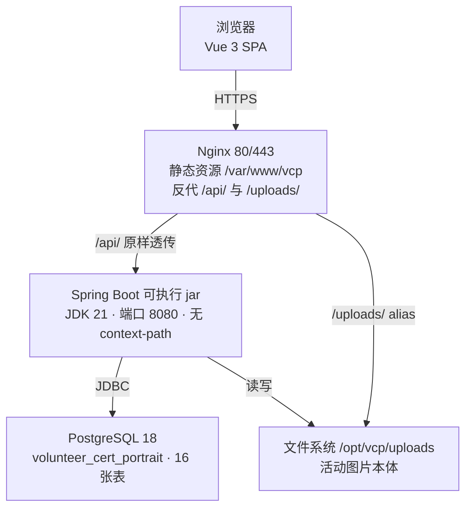
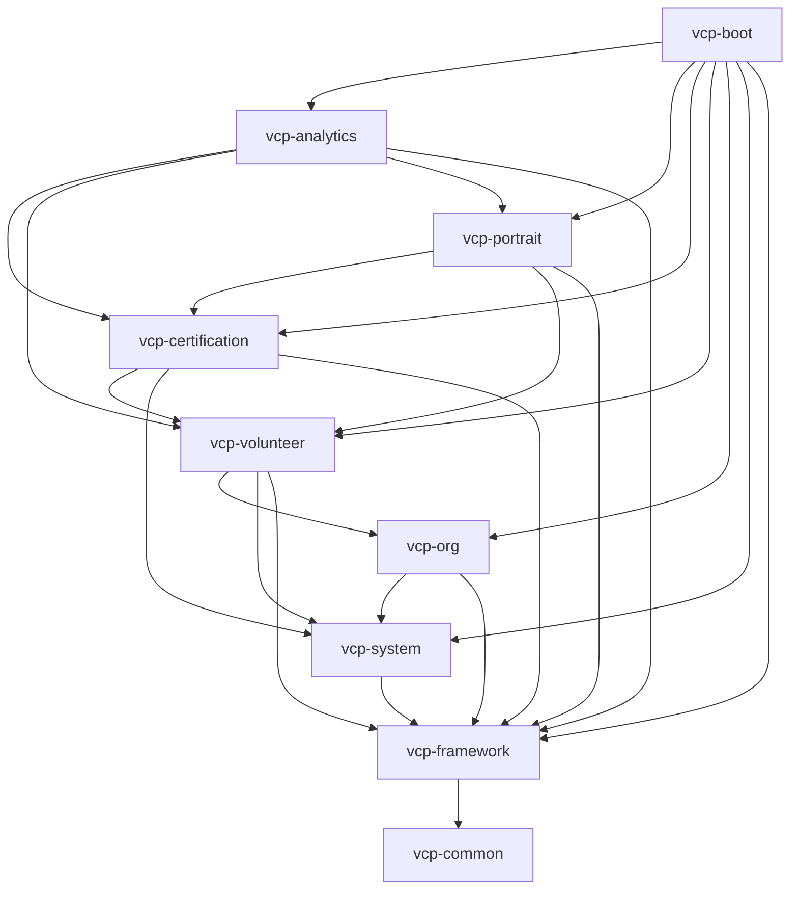
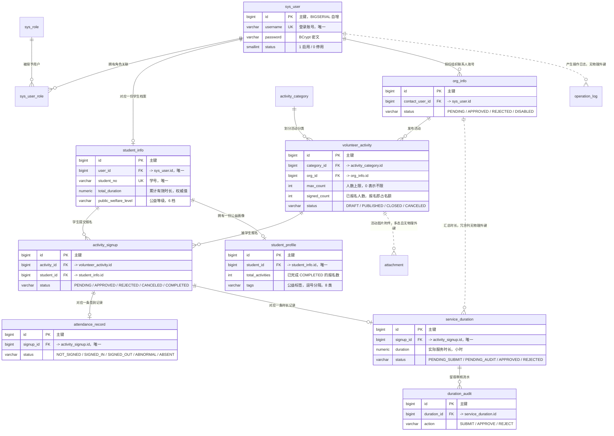
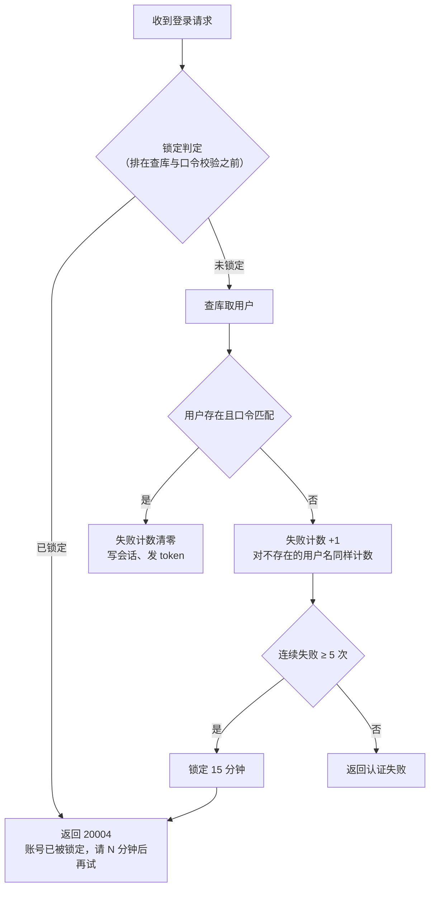

# 第二章 概要设计

> **本章写作约定**：本章给出系统的总体架构、模块划分、数据库总体设计与接口约定。
> 所有结构均以仓库中**实际存在的代码与脚本**为准，不使用规划中但未落地的设计。
> 每条结论后标注 `文件:行` 出处。
>
> **数据口径提示**：`sql/07` 口径 **1500 学生 / 386 活动 / 10719 报名 / 19319.3 小时**；
> 叠加 `sql/12` 后的当前库值 **1503 学生 / 389 活动**（报名与时长不变）；
> 前端 mock 口径 **12,480 报名 / 86,420 小时**（非真库数字）。三者不可混用。

---

## 2.1 引言

### 2.1.1 设计目标

概要设计要回答四个问题：**系统分成几块、每块负责什么、块与块之间怎么通信、数据放在哪里**。
结合第一章的需求，本章的设计目标为：

1. **可并行**：三人小组要同时写代码，模块边界必须清晰到"改 A 模块不会碰坏 B 模块"。
2. **可答辩**：结构本身要能讲出工程道理（为什么这么分、依赖为什么是这个方向），而不只是"能跑"。
3. **可验证**：每个设计决策都要有可执行的验证手段（脚本、自检、接口实测）。
4. **可部署**：一次部署、一个可执行 jar、一套静态资源，不引入答辩现场难以启动的中间件。

### 2.1.2 设计原则

| 原则 | 具体含义 | 出处 |
|---|---|---|
| 模块化单体 | 一个仓库、一次部署，但按业务域拆成独立 Maven 模块 | `docs/知识库已确认项目选题与技术背景.md:49` |
| 禁止反向与循环依赖 | 跨模块只调用对方 **Service 接口**，禁止直接访问对方 Mapper/表 | `CLAUDE.md:87-89` |
| 通知类耦合用事件解耦 | 领域事件（如"报名通过"→ 发通知）走 Spring Event | 同上 |
| 状态码统一 | 状态字段存**英文大写码**，中文由 `sys_dict` 翻译 | `sql/02_schema.sql:11`、`CLAUDE.md:96` |
| 逻辑删除克制使用 | 仅业务数据表加 `deleted`；关联表、流水/日志表不加 | `sql/README.md:165-179` |
| 确定性演示数据 | 用取模等确定性算法而非 `random()`，保证三人执行结果一致 | `CLAUDE.md` 工作方式约定 |
| 前端可独立运行 | mock 层与真实接口同契约，切换只改一个环境变量 | `docs/前端进展与待办.md:484-488` |

---

## 2.2 总体架构

### 2.2.1 架构风格选型

**前后端分离 + 后端"模块化单体（Modular Monolith）"**。

知识库文档给出了选型理由：该架构"适合三人小组：一个仓库、一次部署，
但代码按业务域拆成独立 Maven 模块，答辩时能讲清'高内聚、低耦合'"
（`docs/知识库已确认项目选题与技术背景.md:49`）。

**为什么不用微服务**：毕设场景下微服务会引入服务注册、配置中心、链路追踪等与业务无关的复杂度，
且答辩现场难以稳定启动；模块化单体在保留"按域拆分"这一架构收益的同时，
把部署复杂度压到"一个 jar"。

### 2.2.2 部署架构



出处：`docs/部署文档.md:14-25`。

**三个决定了全部配置的要点**（`docs/部署文档.md:27-31`）：

1. **后端没有配 `context-path`**，接口前缀就是 `/api/v1/...`，所以 Nginx 的 `/api/` 反代要**原样透传路径**
   （`proxy_pass` 结尾**不能带斜杠**，带了会剥掉 `/api` 前缀，后端一律 404）。
2. **前端是 SPA，用 history 路由**（`/student/profile` 这种路径磁盘上不存在），
   Nginx 必须做 `index.html` 回退（`try_files $uri $uri/ /index.html;`）。
3. **前后端同源**（都从 Nginx 出），所以浏览器不发跨域请求，CORS 在部署形态下实际不会命中。

**开发形态**：Vite dev server 监听 5173，通过 `/api` 与 `/uploads` 两个代理转发到
`VITE_API_TARGET`（默认 `http://127.0.0.1:8080`）
（`volunteer-cert-portrait-web/vite.config.js:51-67`）。

### 2.2.3 技术选型

| 层 | 组件 | 版本 | 选型说明 |
|---|---|---|---|
| 语言 | Java | **21（LTS）** | Boot 4 要求 21，**17 不行**（`docs/部署文档.md:39`） |
| 框架 | Spring Boot | **4.1.1** | Spring Framework 7.0.9、内嵌 Tomcat 11（`CLAUDE.md:28`） |
| 构建 | Maven | 3.9.16 | 11 个模块聚合构建（`CLAUDE.md:30`） |
| ORM | MyBatis-Plus | **3.5.17** | **必须用 `mybatis-plus-spring-boot4-starter`**（`CLAUDE.md:31`） |
| 认证 | Sa-Token | **1.46.0** | **必须用 `sa-token-spring-boot4-starter`**（`CLAUDE.md:32`） |
| 接口文档 | Knife4j Next | 5.7.5 | groupId 是 `com.baizhukui`，**不是** `com.github.xiaoymin`（`CLAUDE.md:33`） |
| 数据库 | PostgreSQL | **18.6** | `TIMESTAMP`（无时区）而非 `timestamptz`（A6 决策） |
| 连接池 | HikariCP | Boot 默认 | — |
| 缓存 | **未引入 Redis** | — | 登录失败计数用**单实例内存实现**，理由见 2.7.2 |
| 前端框架 | Vue | 3.5.42 | `volunteer-cert-portrait-web/package.json:20` |
| 构建工具 | Vite | **8.2.2** | 底层是 **Rolldown**（`package.json:34`） |
| 状态管理 | Pinia | 4.0.3 | `package.json:19` |
| 路由 | Vue Router | 5.3.1 | `package.json:21` |
| HTTP | Axios | 1.20.0 | `package.json:17` |
| 图表 | ECharts | 6.1.0 | **按需注册**（`package.json:18`） |
| UI 库 | **无（纯手写组件）** | — | 见 2.4.1 |
| 样式 | **原生 CSS（未用 Sass）** | — | 见 2.4.1 |
| 语言（前端） | **JavaScript（未迁 TS）** | — | 见 2.4.1 |

### 2.2.4 版本兼容性上踩过的坑（设计约束）

这些坑**直接约束了技术选型**，写进本章是因为它们决定了"不能用什么"：

| # | 约束 | 出处 |
|---|---|---|
| 1 | `vcp-dependencies` **不得声明 `parent` 为聚合根** —— 否则与聚合根的 `dependencyManagement` BOM 导入形成循环，Maven 直接拒绝读取整个工程 | `CLAUDE.md` 踩坑第 1 条 |
| 2 | Boot 4 **没有 `spring-boot-starter-aop`**，已改名为 `spring-boot-starter-aspectj` | 同上第 2 条 |
| 3 | Boot 4 已迁移到 **Jackson 3**，包名是 `tools.jackson` 而非 `com.fasterxml.jackson`；注入 `com.fasterxml` 那个会直接启动失败 | 同上第 11 条 |
| 4 | Sa-Token 1.46 只有 `SaInterceptor` 一个拦截器类；`StpInterface` 包路径是 `cn.dev33.satoken.stp.StpInterface` | 同上第 14 条 |
| 5 | **在 `StpInterfaceImpl` 里不能调用 `StpUtil.getRoleList()`** —— 它的内部实现就是回调 `StpInterface`，会无限递归，要直接读会话 | 同上第 14 条；实现在 `StpInterfaceImpl.java:130-144` |
| 6 | `PaginationInnerInterceptor` 的类文件在 `mybatis-plus-jsqlparser` jar 里；`DbType` 常量是 **`POSTGRE_SQL`**（带下划线） | `CLAUDE.md` 踩坑第 12 条 |
| 7 | Vite 8 底层是 Rolldown，`manualChunks` **不能传对象**，只接受函数；本项目改用 Rolldown 原生的 `advancedChunks.groups` | 同上前端第 8 条；`vite.config.js:38-47` |

---

## 2.3 后端模块划分

### 2.3.1 模块清单

后端为 Maven 多模块聚合工程，共 **11 个模块**（`CLAUDE.md:72-85`）：

```text
volunteer-cert-portrait-server/              # 聚合工程（父 POM，packaging=pom）
├── pom.xml
├── vcp-dependencies/                        # 独立 BOM：统一管理三方依赖版本
├── vcp-common/                              # 公共基础模块（无业务依赖）
├── vcp-framework/                           # 框架基础设施模块
├── vcp-system/                              # 系统域模块
├── vcp-org/                                 # 志愿组织域模块
├── vcp-volunteer/                           # 志愿服务活动域模块
├── vcp-certification/                       # 时长认证域模块
├── vcp-portrait/                            # 公益画像域模块
├── vcp-analytics/                           # 数据分析域模块
└── vcp-boot/                                # 启动模块（唯一可执行 jar）
```

### 2.3.2 模块职责与数据表归属

对应知识库的 10 大功能模块与 16 张表，映射如下（`docs/知识库已确认项目选题与技术背景.md:117-127`）：

| 模块 | 职责 | 归属数据表 | 表数 |
|---|---|---|---|
| `vcp-common` | 统一返回、异常体系、常量、枚举、工具类 | — | 0 |
| `vcp-framework` | 安全认证、全局异常、ORM 配置、日志、跨域 | — | 0 |
| `vcp-system` | 用户与权限、学生档案、字典、通知、操作日志、附件 | `sys_user`、`sys_role`、`sys_user_role`、`student_info`、`sys_dict`、`notification`、`operation_log`、`attachment` | 8 |
| `vcp-org` | 组织信息维护、组织资质审核 | `org_info` | 1 |
| `vcp-volunteer` | 活动分类、活动发布管理、报名审核、签到签退 | `activity_category`、`volunteer_activity`、`activity_signup`、`attendance_record` | 4 |
| `vcp-certification` | 服务时长提交、学校审核、审核记录 | `service_duration`、`duration_audit` | 2 |
| `vcp-portrait` | 公益画像生成、等级/标签、学院排名数据 | `student_profile` | 1 |
| `vcp-analytics` | 数据看板统计接口（**只读聚合，无独立表**） | — | 0 |
| `vcp-boot` | 启动类、多环境配置、打包 | — | 0 |

**表归属按业务域分组**的另一种视图（`docs/ER图.md:548-555`）：

| 业务域 | 模块 | 表 |
|---|---|---|
| 用户与权限 | `vcp-system` | `sys_user`、`sys_role`、`sys_user_role`、`student_info`、`sys_dict` |
| 组织 | `vcp-org` | `org_info` |
| 活动与报名 | `vcp-volunteer` | `activity_category`、`volunteer_activity`、`activity_signup`、`attendance_record` |
| 时长认证与审核 | `vcp-certification` | `service_duration`、`duration_audit` |
| 公益画像 | `vcp-portrait` | `student_profile` |
| 系统支撑 | `vcp-system` / 跨模块 | `notification`、`operation_log`、`attachment` |

### 2.3.3 模块依赖规则



依据：`docs/知识库已确认项目选题与技术背景.md:184-192`。

**规则**：禁止反向依赖与循环依赖；跨模块只调用对方 **Service 接口**，
禁止直接访问对方 Mapper/表；通知类耦合用 Spring Event 解耦（`CLAUDE.md:87-89`）。

**两条刻意的例外与它们的处理方式**（这是本设计里最值得答辩展开的部分）：

1. **`vcp-analytics` 直接只读跨域表**。一次看板跨 8 张表，走各域 Service 会退化成
   "查明细再内存聚合"，取舍写在 `AnalyticsMapper` 类注释里
   （`docs/后端进展与待办.md:268-269`）。即：**读路径为性能让路，写路径严守依赖规则**。

2. **"回读"通过端口接口反向提供，依赖方向不变**。例如 `vcp-system` 需要知道
   "某个账号是不是组织管理员"，但 `vcp-org` 依赖 `vcp-system`，不能反向依赖。
   做法是 `vcp-system` 定义 `OrgLookupPort`，`vcp-org` 提供实现；
   同理学院列表的"组织数"走 `OrgCollegeCountPort`，调用方用
   `ObjectProvider.getIfAvailable()` 取，取不到或查询失败时 `orgCount` 一律按 0
   （缺这一列只影响展示，不该让整个列表页打不开）
   （`docs/后端进展与待办.md:209-210`、`:468`）。

### 2.3.4 模块内部包结构

业务模块采用统一模板（`docs/知识库已确认项目选题与技术背景.md:131-151`），以 `vcp-volunteer` 为例：

```text
vcp-volunteer/
├── pom.xml
└── src/main/
    ├── java/com/vcp/volunteer/
    │   ├── controller/        # REST 接口（按资源聚合，方法上注解鉴权）
    │   ├── service/           # 业务接口
    │   │   └── impl/          # 业务实现
    │   ├── mapper/            # MyBatis-Plus Mapper
    │   ├── entity/            # 数据库实体（对应 4 张表）
    │   ├── dto/               # 请求参数（新增/修改/查询分页）
    │   ├── vo/                # 响应对象（列表/详情/统计）
    │   ├── enums/             # 模块状态枚举
    │   └── event/             # 领域事件（可选）
    └── resources/mapper/volunteer/   # MyBatis XML（复杂查询）
```

基础设施模块结构（`docs/知识库已确认项目选题与技术背景.md:155-180`）：

```text
vcp-common/java/com/vcp/common/
    ├── core/          # R<T> 统一返回、PageResult、BaseEntity、错误码
    ├── exception/     # 业务异常体系（ServiceException 等）
    ├── constant/      # 常量（角色码、缓存 Key、通用状态）
    ├── enums/         # 通用枚举
    └── util/          # 字符串/时间/校验等工具

vcp-framework/java/com/vcp/framework/
    ├── config/        # WebMvc、Jackson、MyBatis-Plus（分页插件）、跨域
    ├── security/      # Sa-Token 配置、StpInterface 权限实现、登录拦截器
    ├── context/       # 登录用户上下文（LoginUser、SecurityUtils）
    ├── web/           # 全局异常处理、请求日志过滤器、响应包装
    ├── mybatis/       # 字段自动填充（create_time 等）、逻辑删除
    └── log/           # 操作日志注解 + AOP 切面
```

**实际代码规模**（可作为"模块划分确实被执行了"的证据）：

| 模块 | 规模 | 出处 |
|---|---|---|
| `vcp-system` | entity 8 / mapper 8 / dto 10 / vo 8 / service 接口 6 + 实现 7 / controller 7 / 事件监听器 1 | `docs/后端进展与待办.md:138` |
| `vcp-org` | entity 1 / mapper 1 / dto 4 / vo 1 / service 接口 1 + 实现 2 / controller 1 | 同上 `:193` |
| `vcp-volunteer` | 52 个文件（含 4 个 Mapper XML） | 同上 `:232` |
| `vcp-certification` | 24 个文件 | 同上 `:232` |
| `vcp-portrait` | 21 个文件 | 同上 `:233` |
| `vcp-analytics` | 21 个文件 | 同上 `:233` |

> 说明：以上为 `src/main` 下的 `.java` + `.xml` 文件数（`docs/后端进展与待办.md:233`）。

---

## 2.4 前端总体设计

### 2.4.1 分层与三项"不引入"决策

前端按 `api/`（接口层）→ `stores/`（状态）→ `views/`（页面）→ `components/`（组件）分层，
另有 `router/`、`utils/`、`mock/`、`styles/` 支撑。目录规划见
`docs/知识库已确认项目选题与技术背景.md:225-271`。

**三项刻意的"不引入"决策**（都写在文档里，答辩时是"取舍"而不是"缺漏"）：

| 决策 | 理由 | 出处 |
|---|---|---|
| **不引入 Element Plus**，21 个组件全部手写 | 原型是一套完整的设计系统（零圆角、墨线分隔、印章式标签），与 Element Plus 默认视觉冲突很大，用它会需要大量样式覆盖且很难摆脱其观感；手写视觉一致性最好，答辩时也讲得清"这部分是自己实现的" | `docs/前端进展与待办.md:465-469`、`:68-76` |
| **保持 JavaScript，不迁 TypeScript** | 脚手架现成，省下的时间用于多铺页面；架构文档虽规划了 TS，但毕设答辩中 TS 并非必需项 | 同上 `:471-473` |
| **用原生 CSS，不引入 Sass** | 原型本身就是纯 CSS，加 Sass 只会多一个构建依赖，没有实际收益 | 同上 `:475-477` |

### 2.4.2 页面清单

**29 个页面**（`docs/前端进展与待办.md:34`、`:61-66`），按角色分区：

| 端 | 数量 | 页面 |
|---|---|---|
| 学生端 | 9 | 首页、活动列表、活动详情、我的报名、我的时长、我的公益画像、通知公告、通知详情、个人中心 |
| 组织端 | 6 | 组织数据、活动管理、发布活动、报名审核、签到管理、时长提交 |
| 学校端 | 10 | 数据看板、时长审核、公益画像、组织管理、分类管理、用户管理、角色管理、学院管理、通知公告、操作日志 |
| 公共 | 4 | 登录、注册、403、404 |

> **与规划文档的差异（如实记录）**：知识库 §4.3 写"学校端 7 页"，实际是 **10 页**
> —— 多出「公益画像」「角色管理」「学院管理」三页
> （`docs/知识库已确认项目选题与技术背景.md:273-275`、`docs/待办清单.md:899`）。
> 页面文件可直接在 `volunteer-cert-portrait-web/src/views/` 下核对（**实测 29 个 `.vue` 文件**）。

### 2.4.3 路由与权限

- 三套布局对应三个角色前缀：`/student/*`、`/org/*`、`/admin/*`，登录/注册用空白布局。
- 路由 `meta` 携带 `{ title, roles, menu, group }`，**侧边栏菜单从路由表派生**，
  避免菜单和路由两份定义不同步（`docs/前端进展与待办.md:95-96`）。
- **守卫流程**：无 token → `/login`（带 redirect 回跳）；有 token 无用户信息 → 拉取；角色不符 → `/403`
  （同上 `:97`）。
- **按钮级权限**用 `v-perm` 指令，不满足时**把元素移出 DOM**，而非隐藏（同上 `:98`）。
- 权限数据源与后端 `StpInterfaceImpl` 的静态映射**逐条对应**，改动需两边同时改
  （`StpInterfaceImpl.java:24-27`）。

### 2.4.4 接口层与 mock 分流

- `src/api/*.js` 按后端模块拆分，**按真实后端契约书写**（`docs/前端进展与待办.md:87`）。
- `utils/request.js` 按 `VITE_USE_MOCK` 分流：`true` 走 `src/mock`，`false` 走真实 axios
  （同上 `:88`）。
- 响应外壳 `{ code, message, data }`，成功 `code = 0`；分页统一 `{ total, list }`（同上 `:89`）。
- 认证失败码 `20001/20002/20003` 命中即清 token 并跳登录（同上 `:90`）。
- `src/mock/` 按 `method + path` 分发，支持 `:id` 占位，共 **60+ 个接口**（同上 `:91`）。

> **mock 分流的一条硬约束**：`utils/request.js` 里对 mock 必须用**动态 `import()`**，
> 不能写成顶部静态 import。静态 import 会让整套 mock（数据集 + 60 多个 handler，
> **含演示账号明文口令**）**无条件打进产物**，连 `VITE_USE_MOCK=false` 的正式部署包也一样
> —— mock 模块顶层有副作用（`loadPersistedUsers()` 读写 `localStorage`），
> tree-shaking 证明不了它无副作用。实测：静态 import 时 `request` chunk 165.0 kB；
> 改动态后 **113.0 kB**，且 `VITE_USE_MOCK=false` 时**连 mock chunk 都不生成**
> （`CLAUDE.md` 前端踩坑第 10 条）。

### 2.4.5 设计系统与图表层

**样式三层顺序不可颠倒**：`tokens.css`（令牌）→ `base.css`（reset/无障碍/容器）→
`ink.css`（组件类）。令牌层没先加载，后面的组件类会全部取不到 CSS 变量
（`docs/前端进展与待办.md:56`、`CLAUDE.md` 前端踩坑第 6 条）。

**视觉约束**：零圆角、细墨线分隔而非卡片阴影、区块间距 88px、标题走衬线体、数据走等宽体
（`docs/前端进展与待办.md:57`）。

**图表层**：13 个 ECharts 图表配置写成 `(data) => option` 的纯函数，
**配色通过 `getComputedStyle` 从 `:root` 读取 —— CSS 是配色的唯一数据源**，改令牌图表跟着变
（同上 `:80-81`）。

**ECharts 按需注册**（`volunteer-cert-portrait-web/src/components/charts/echarts.js:27-43`）：

| 类别 | 已注册项 |
|---|---|
| 图表（6） | `LineChart`、`BarChart`、`PieChart`、`GaugeChart`、`HeatmapChart`、`RadarChart` |
| 组件（7） | `GridComponent`、`TooltipComponent`、`LegendComponent`、`VisualMapComponent`、`TitleComponent`、`RadarComponent`、`CalendarComponent` |
| 特性/渲染器 | `LabelLayout`、`CanvasRenderer` |

> **约束**：新增图表类型必须在此处补注册，否则运行时**静默不渲染且不报错**，很难排查
> （`echarts.js:4`、`CLAUDE.md` 前端踩坑第 2 条）。
> 2026-09-24 核对过一次，无缺口：`options.js` 用到的 6 类图表与相关组件全部已注册；
> `axisPointer` 全嵌在 `tooltip` 内，由 `TooltipComponent` 覆盖，不需要单独注册
> （`CLAUDE.md` 前端踩坑第 2 条）。

**图表内圆角是刻意选择**：页面 UI 零圆角、图表内柱状元素轻微圆角（`borderRadius: [6,6,0,0]`），
不要"顺手统一"成零圆角（`docs/前端进展与待办.md:479-482`）。

### 2.4.6 构建与拆包设计

```javascript
// volunteer-cert-portrait-web/vite.config.js:45-47
advancedChunks: {
  groups: [{ name: 'echarts', test: /node_modules[\\/]echarts/ }],
},
```

**设计意图与实测效果**：

| 项 | 值 | 说明 |
|---|---|---|
| 主 chunk | **~57 kB** | 一直不大；"Some chunks are larger than 500 kB"这条警告说的**不是主包** |
| `request` chunk | 165.0 kB → **113.0 kB** | mock 改动态 import 后（`VITE_USE_MOCK=false` 构建） |
| `echarts` chunk | **653 kB** | 懒加载，**不在** `dist/index.html` 的 modulepreload 列表里，只在打开图表页时才下载 |
| `options` chunk | **9.9 kB** | 拆包前它与 ECharts 被熔进同一个 662.7 kB 的 chunk，rolldown 给它起名 `options`，容易误读成主包 |

出处：`volunteer-cert-portrait-web/vite.config.js:29-47`、`CLAUDE.md` 前端踩坑第 8、9、10 条、
`docs/部署文档.md:223-224`。

> **正则必须用 `[\\/]` 而不是 `/`**：Windows 上模块 id 是反斜杠，
> 写成 `/node_modules\/echarts/` 会匹配不到（rolldown 文档明确警告，本项目正是 Windows 开发）
> （`vite.config.js:43-44`）。

---

## 2.5 数据库总体设计

### 2.5.1 设计约定

数据库为 PostgreSQL 18.6，库名 `volunteer_cert_portrait`，共 **16 张表**
（`sql/02_schema.sql:3`、`docs/ER图.md:4-6`）。全局约定如下（`sql/README.md:152-163`、
`sql/02_schema.sql:7-15`）：

| 约定 | 内容 |
|---|---|
| 主键 | 统一 `id BIGSERIAL PRIMARY KEY`（数据库自增）→ 对应 `mybatis-plus.global-config.db-config.id-type: auto` |
| 命名 | 统一 `snake_case` |
| 状态字段 | 统一 `VARCHAR` 存**英文大写枚举码**，中文由 `sys_dict` 翻译 |
| 时间字段 | 统一 `create_time` / `update_time`，类型 `TIMESTAMP` |
| 时长字段 | 统一 `NUMERIC(10,1)`，单位**小时** |
| 逻辑删除 | 统一 `deleted SMALLINT`（0 未删除 / 1 已删除） |

> **主键类型是一个真实的坑**：若把 `id-type` 配成 MyBatis-Plus 默认的 `assign_id`（雪花 ID），
> 会绕过序列并与脚本里显式写入的初始 id 冲突（`sql/README.md:156-158`）。

### 2.5.2 表清单

| # | 表名 | 说明 | 归属模块 |
|---|---|---|---|
| 1 | `sys_user` | 用户表 | `vcp-system` |
| 2 | `sys_role` | 角色表 | `vcp-system` |
| 3 | `sys_user_role` | 用户角色关联表 | `vcp-system` |
| 4 | `student_info` | 学生信息表 | `vcp-system` |
| 5 | `sys_dict` | 数据字典表 | `vcp-system` |
| 6 | `notification` | 通知表 | `vcp-system` |
| 7 | `operation_log` | 操作日志表 | `vcp-system` |
| 8 | `attachment` | 附件表 | `vcp-system` |
| 9 | `org_info` | 志愿组织信息表 | `vcp-org` |
| 10 | `activity_category` | 活动分类表 | `vcp-volunteer` |
| 11 | `volunteer_activity` | 志愿活动表 | `vcp-volunteer` |
| 12 | `activity_signup` | 活动报名表 | `vcp-volunteer` |
| 13 | `attendance_record` | 签到签退记录表 | `vcp-volunteer` |
| 14 | `service_duration` | 服务时长表 | `vcp-certification` |
| 15 | `duration_audit` | 时长审核记录表 | `vcp-certification` |
| 16 | `student_profile` | 学生公益画像表 | `vcp-portrait` |

出处：`sql/02_schema.sql:45-479`（按域分段建表）、`docs/ER图.md:152-495`（逐表字段）、
`docs/高校志愿服务时长认证与公益画像数据分析系统_开发计划与分工.md:311-328`（计划书表清单）。

### 2.5.3 ER 图（核心实体与关系）

完整的 16 表 Mermaid ER 图见 `docs/ER图.md:19-147`。此处给出**核心业务链路的 ER 要点**，
省略字段细节以便看清关系：



图例：实线 `--` 表示有物理外键约束，虚线 `..` 表示只有业务关联、库里没有外键；
`||--o{` 为 1:N，`||--o|` 为 1:1（0 或 1 行）（`docs/ER图.md:149-150`）。

### 2.5.4 关系设计：18 条物理外键 + 5 条业务关联

**共 23 条关系**（`docs/待办清单.md:831-832`、`docs/ER图.md:499-530`）。

**物理外键（18 条）**

| # | 从表.字段 | → 主表.字段 | 基数 | 业务含义 |
|---|---|---|---|---|
| 1 | `sys_user_role.user_id` | `sys_user.id` | N:1 | 用户拥有的角色关联行 |
| 2 | `sys_user_role.role_id` | `sys_role.id` | N:1 | 角色被授予的用户 |
| 3 | `student_info.user_id` | `sys_user.id` | 1:1 | 账号对应唯一一份学生档案（`NOT NULL UNIQUE`） |
| 4 | `notification.user_id` | `sys_user.id` | N:1 | 通知的接收人 |
| 5 | `org_info.contact_user_id` | `sys_user.id` | N:1 | 组织的联系人账号 |
| 6 | `volunteer_activity.category_id` | `activity_category.id` | N:1 | 活动所属分类 |
| 7 | `volunteer_activity.org_id` | `org_info.id` | N:1 | 活动的发布组织 |
| 8 | `activity_signup.activity_id` | `volunteer_activity.id` | N:1 | 报名所属活动 |
| 9 | `activity_signup.student_id` | `student_info.id` | N:1 | 报名学生（**档案 ID，非账号 ID**） |
| 10 | `activity_signup.audit_user_id` | `sys_user.id` | N:1 | 报名审核人（组织管理员），可空 |
| 11 | `attendance_record.signup_id` | `activity_signup.id` | 1:1 | 一条报名最多一条签到记录（`NOT NULL UNIQUE`） |
| 12 | `service_duration.signup_id` | `activity_signup.id` | 1:1 | 一条报名最多一条时长记录（`NOT NULL UNIQUE`） |
| 13 | `service_duration.activity_id` | `volunteer_activity.id` | N:1 | 冗余列，便于按活动统计 |
| 14 | `service_duration.student_id` | `student_info.id` | N:1 | 冗余列，便于按学生/学院统计 |
| 15 | `service_duration.audit_user_id` | `sys_user.id` | N:1 | 时长终审人（学校管理员），可空 |
| 16 | `duration_audit.duration_id` | `service_duration.id` | N:1 | 时长记录的全部审核流水 |
| 17 | `duration_audit.auditor_id` | `sys_user.id` | N:1 | 流水操作人，可空 |
| 18 | `student_profile.student_id` | `student_info.id` | 1:1 | 学生对应的画像快照（`NOT NULL UNIQUE`） |

**业务关联（无物理外键，5 条）**

| # | 从表.字段 | → 目标 | 基数 | 为何不加外键 |
|---|---|---|---|---|
| 19 | `service_duration.org_id` | `org_info.id` | N:1 | 冗余的所属组织，供看板按组织汇总时长；只建了 `idx_duration_org` |
| 20 | `operation_log.user_id` | `sys_user.id` | N:1 | 日志只追加，且未登录时可为空 |
| 21 | `attachment.biz_id`（`biz_type='ACTIVITY'`） | `volunteer_activity.id` | N:1 | 多态指向 |
| 22 | `attachment.biz_id`（`biz_type='ORG'`） | `org_info.id` | N:1 | 多态指向 |
| 23 | `attachment.biz_id`（`biz_type='AVATAR'`） | `sys_user.id` | N:1 | 多态指向 |

**N:N 关系**：`sys_user` ↔ `sys_role` 经中间表 `sys_user_role`，
`uk_user_role(user_id, role_id)` 保证同一组合不重复；业务上一个账号目前只用一个角色，
代码按"取第一条"处理（`docs/ER图.md:532-536`）。

**关系链一览**（`docs/ER图.md:538-544`）：

- 报名链路：`student_info` / `volunteer_activity` → `activity_signup`
- 签到链路：`activity_signup` → `attendance_record`
- 时长链路：`activity_signup` → `service_duration` → `duration_audit`
- 组织链路：`sys_user` → `org_info` → `volunteer_activity`
- 画像链路：`student_info` → `student_profile`

### 2.5.5 逻辑删除的覆盖范围

**并非所有表都有 `deleted`**，这是有意为之（`sql/README.md:165-179`）：

| 表 | 有 `deleted` | 原因 |
|---|---|---|
| `sys_user`、`sys_role`、`student_info`、`org_info`、`activity_category`、`volunteer_activity`、`activity_signup`、`attendance_record`、`service_duration` | ✅ 有（9 张） | 业务数据，删除需留痕，且外键引用需要保留行 |
| `sys_user_role` | ❌ 无 | 关联表，按物理删除设计 |
| `duration_audit`、`operation_log` | ❌ 无 | 流水/日志，只追加不修改 |
| `notification` | ❌ 无 | 用 `is_read` 表达已读状态 |
| `sys_dict` | ❌ 无 | 用 `status` 表达启用/禁用 |
| `attachment` | ❌ 无 | 文件按物理删除 |

> 知识库中"全表逻辑删除"的表述与最初的 AI 生成脚本并不一致（脚本只给了 9 张表 `deleted`），
> 本项目**采用脚本的做法**，因为上面这些表加 `deleted` 没有实际意义、只会增加查询负担
> （`sql/README.md:178-179`）。

### 2.5.6 索引设计

`sql/02_schema.sql` 建 **10 个命名索引**（`:497-521`），设计时做过一次**删冗余 + 补复合**：

**删除的冗余索引**（被约束覆盖，重复占用空间与写入开销）（`sql/02_schema.sql:486-490`）：

- `sys_user(username)`、`sys_role(role_code)`、`student_info(student_no)` —— 被各自的 `UNIQUE` 约束覆盖
- `activity_signup(activity_id)` —— 被 `uk_activity_student(activity_id, student_id)` 最左前缀覆盖
- `attendance_record(signup_id)` —— 同理被其 `UNIQUE` 约束覆盖

**保留与新增的索引**：

| 索引 | 支撑的查询 |
|---|---|
| `idx_activity_status` | 活动列表按状态筛选 |
| `idx_activity_start_time` | 活动列表按开始时间排序 |
| `idx_activity_org_status` | 组织端"本组织的活动"按状态筛选 |
| `idx_activity_create_time` | 看板"本月新增活动数"与活动数量趋势图 |
| `idx_attachment_biz_sort` | 按业务对象读取图片，并保持展示顺序 |
| `idx_signup_student_status` | 学生端"我的报名"按状态筛选（`student_id` 为最左前缀，同时覆盖仅按 `student_id` 的查询） |
| `idx_duration_status` | 学校端"待审核时长"列表 |
| `idx_duration_student_status` | 学生端"我的时长"按状态筛选 |
| `idx_duration_activity` | 看板按活动统计 |
| `idx_student_college` | 学院排名与学院维度统计按学院分组 |
| `idx_notification_user` | 学生端"我的通知"与未读数 |

**后续脚本补的索引**：`sql/06_backend_gap_fix2.sql` 补 **12 条**索引，
其中最关键的是 `attendance_record(sign_in_time)` —— 该表原先除唯一键外**没有任何索引**，
而 `vcp-analytics` 有 10 个接口要按签到时间聚合它（`docs/后端进展与待办.md:279-280`）。

### 2.5.7 脚本组织与执行顺序

数据库不通过 Flyway 管理（**Flyway 当前是关闭的**，`spring.flyway.enabled: false`），
而是以编号脚本顺序执行（`CLAUDE.md` 踩坑第 9 条、`docs/部署文档.md:88-89`）。

**完整顺序（整链实测约 16 秒）**（`CLAUDE.md` 踩坑第 20 条）：

```text
02 → 03 → 04 → 05 → 06 → 07 → 10 → 11 → 12，最后只读跑 09 复验
```

| 脚本 | 作用 | 是否必需 |
|---|---|---|
| `01_create_database.sql` | 建库 | **必须单独执行**（`CREATE DATABASE` 不能在事务块内运行） |
| `02_schema.sql` | 16 张表 + 注释 + 10 个索引 | 必需 |
| `03_init_data.sql` | 角色、字典、分类等基础数据 | 必需 |
| `04_demo_data.sql` | 演示数据（创建 `org_info` id 2~8） | **跑 `07` 时必需**（硬前置） |
| `05_backend_gap_fix.sql` | 补 15 列 + 4 索引 + 1 部分唯一索引 | **必执行，缺了登录接口直接报错** |
| `06_backend_gap_fix2.sql` | 补 9 列 + 1 唯一约束 + 12 索引 | 必执行 |
| `07_demo_scale.sql` | 演示数据放大（1500 学生 / 386 活动 / 10719 报名） | 答辩全量演示时执行 |
| `08_password_bcrypt.sql` | 老库刷 BCrypt 密文 | **仅老库需要**；新库种子口令已是密文 |
| `09_consistency_check.sql` | **只读** 20 项一致性自检 | 验收用，可随时单独执行 |
| `10_base_and_test_accounts.sql` | 基础数据 + 测试账号 + **5 条学院字典** | **新环境必需** |
| `11_activity_images.sql` | `attachment` 补 3 个图片元数据列 + 1 索引 | 必执行 |
| `12_activity_images_demo.sql` | 少量图文演示数据 | 可选；**必须放最后** |

**三条容易踩的顺序约束**（`CLAUDE.md` 踩坑第 20 条）：

1. **`04` 是 `07` 的硬前置**：`07` 的新活动按 `org_id = 1 + (g % 6)` 取组织，
   要求 `org_info` 里存在 id 1~6，而 **id 2~8 全部由 `04` 创建**。跳过 `04` 直接跑 `07`，
   新活动的组织外键就会落错。（`sql/README.md:16` 曾把 `04` 标成"可选"，那是**错的**，已修正。）
2. **5 条学院字典（`dict_type = 'college'`）不在 `03` 里，只在 `10` 里**；
   新环境**必须跑到 `10`**，否则注册页下拉为空、注册必被拒（"请选择学院"）。
3. **`12` 要放最后**：它给三场图文演示活动定的名额是 20 / 35 / 18，
   先跑 `12` 再跑 `07` 的话，`07` 的"名额下限 < 46 一律抬到 46"回填会把这几个数改掉。

**两个脚本层面的坑**：

- **`04_demo_data.sql` 是多语句隐式事务**：任何一条失败会**整批回滚**（不是"少几条数据"）
  （`CLAUDE.md` 踩坑第 8 条）。
- **动 DDL 前先清 `idle in transaction` 陈旧会话**：2026-09-25 实测中 `02` 的 `DROP TABLE`
  一开始**卡了 618 秒**，原因是上一次会话遗留的两个 `idle in transaction` 连接持有锁。
  清掉后 `02` 只花 **208 ms**（`CLAUDE.md` 踩坑第 19 条）。

---

## 2.6 接口设计约定

### 2.6.1 路径与返回

| 项 | 约定 | 出处 |
|---|---|---|
| 路径前缀 | 统一 `/api/v1/` | `CLAUDE.md:99` |
| 统一返回 | `{ code, message, data }`，成功 `code = 0` | `docs/知识库已确认项目选题与技术背景.md:198` |
| 分页返回 | 统一 `{ total, list }` | 同上 |
| 认证头 | `Authorization: Bearer <token>`（Sa-Token `token-name: Authorization` + `token-prefix: Bearer`） | `docs/前端进展与待办.md:503` |
| 错误码分段 | 1xxxx 通用 / 2xxxx 认证权限 / 3xxxx 活动报名 / 4xxxx 时长认证 / 5xxxx 画像统计 | `docs/知识库已确认项目选题与技术背景.md:199` |

**接口分组**（`docs/知识库已确认项目选题与技术背景.md:288-296`）：

| 分组 | 前缀 | 典型接口 |
|---|---|---|
| 认证 | `/api/v1/auth` | 登录、注册、退出、当前用户、改密、学院下拉 |
| 系统 | `/api/v1/system` | 用户、角色、字典、学院、通知、日志、学生档案 |
| 组织 | `/api/v1/orgs` | 组织列表、详情、资质审核、启停 |
| 志愿服务活动 | `/api/v1/activities`、`/signups`、`/attendance`、`/categories` | 发布、分页查询、报名、审核、签到签退 |
| 时长认证 | `/api/v1/durations`、`/duration-audits` | 提交时长、审核通过/驳回、我的时长 |
| 公益画像 | `/api/v1/portraits` | 我的画像、画像分布、手动重算 |
| 数据分析 | `/api/v1/analytics` | 看板概览、趋势、学院排名、活跃度、签到率 |
| 附件 | `/api/v1/attachments` | 图片上传 |

**接口规模（实测）**：后端 **60 条路径 / 73 个「方法 + 路径」**
（运行实例 `GET /v3/api-docs` 实查，**2026-09-26**；2026-09-24 为 59 / 72，
此后 B24 新增 `GET /api/v1/attendance/mine`，学生自助签到闭环补齐）；
前端 `src/api/` **71 个调用**（2026-09-24 为 70）；
差额 2 个是后端有、前端没调的 `POST /portraits/recompute` 与 `PUT /orgs/{id}`
（`docs/测试报告.md:16`、`docs/前端进展与待办.md:122-124`）。

> **前端调用数可复核**：`src/api/` 下 8 个文件共 **71** 个导出接口函数
> （`analytics.js` 10 / `attachment.js` 1 / `auth.js` 7 / `certification.js` 6 /
> `org.js` 4 / `portrait.js` 4 / `system.js` 20 / **`volunteer.js` 19**；
> `volunteer.js` 由 18 增至 19，新增的是 `listMyAttendance`）。

### 2.6.2 状态码字典（英文码 + `sys_dict` 翻译）

数据库统一存**英文大写码**，中文由 `sys_dict` 表翻译（`docs/后端进展与待办.md:659`）。

| 字典类型 | 码 → 中文 |
|---|---|
| `activity_status` | `DRAFT` 草稿 / `PUBLISHED` 已发布 / `CLOSED` 已结束 / `CANCELED` 已取消 |
| `signup_status` | `PENDING` 待审核 / `APPROVED` 已通过 / `REJECTED` 已驳回 / `CANCELED` 已取消 / `COMPLETED` 已完成 |
| `attendance_status` | `NOT_SIGNED` 未签到 / `SIGNED_IN` 已签到 / `SIGNED_OUT` 已签退 / `ABNORMAL` 异常 / `ABSENT` 缺勤 |
| `duration_status` | `PENDING_SUBMIT` 待提交 / `PENDING_AUDIT` 待审核 / `APPROVED` 已通过 / `REJECTED` 已驳回 |
| `org_status` | `PENDING` 待审核 / `APPROVED` 已通过 / `REJECTED` 已驳回 / `DISABLED` 已停用 |
| `notification_type` | `SIGNUP` 报名结果 / `DURATION` 时长审核 / `SYSTEM` 系统公告 |
| `audit_action` | `SUBMIT` 提交 / `APPROVE` 通过 / `REJECT` 驳回 |
| `attachment_biz_type` | `ACTIVITY` 活动图片 / `ORG` 组织资质 / `AVATAR` 用户头像 |
| `user_status` | `ACTIVE` 正常 / `DISABLED` 已停用（库里存 1/0，由服务层翻译） |

出处：`docs/后端进展与待办.md:661-671`；字段级注释见 `sql/02_schema.sql:158`、`:183`、`:268`、
`:329`、`:359`、`:386`、`:423`、`:448`。

> **两条必须记住的命名细节**：
> ① `APPROVED`/`REJECTED`（**状态**）与 `APPROVE`/`REJECT`（**审核动作**）**不同形**，
> 别混（`CLAUDE.md:101`、`sql/02_schema.sql:448`）。
> ② `CANCELED` **同时属于** `activity_status` 与 `signup_status`，
> 字典色调必须按 `(dict_type, dict_key)` **精确指定**，只按 `dict_key` 更新会把它们刷成同一种色调，
> 而前端取值并不相同（一个是 bad 红、一个是 mute 灰）。这类错配**不报错**，
> 只表现为"这个标签的颜色跟别处不一样"（`docs/后端进展与待办.md:182-185`）。

### 2.6.3 字典接口的一条硬约束

`sys_dict` 接口**必须返回 `tone`**（色调）：前端 `stores/dict.js` 的 `load()` 是**整体替换**语义，
接口不返回 `tone` 会把所有状态标签刷成灰色。这是"**不报错但页面全变样**"的典型静默失效
（`docs/后端进展与待办.md:160-161`）。

### 2.6.4 鉴权的三个层次

| 层次 | 手段 | 说明 |
|---|---|---|
| 接口级 | `@SaCheckPermission("域:资源:操作")` | 权限码由 `StpInterfaceImpl` 的静态映射表提供 |
| 数据范围级 | 服务层按登录态过滤 | **忽略前端传的 `studentId` / `orgId`**，一律以会话为准 |
| 按钮级 | 前端 `v-perm` 指令 | 不满足时把元素移出 DOM，而非隐藏 |

**放行清单**（`CLAUDE.md` 踩坑第 5 条）：

- **无条件放行**：登录 / 注册两个认证入口（`SaTokenConfig.EXCLUDE_PATHS`）；
  另含注册页要用的 `GET /api/v1/auth/colleges`（`docs/后端进展与待办.md:486`）。
- **随开关联动放行**：`/doc.html`、`/webjars/**`、`/v3/api-docs/**`、`/knife4j/**`
  四个文档路径跟随 `knife4j.enable` 联动（`SaTokenConfig.DOC_EXCLUDE_PATHS`）：
  开关为 `true`（开发默认）时免登录；`application-prod.yml` 设为 `false` 后不再放行。
- **静态资源放行**：`/uploads/**` 由后端资源映射提供，Sa-Token 放行，
  响应带 `X-Content-Type-Options: nosniff`（`docs/后端进展与待办.md:511-512`）。

> **两个极易误判的坑**：① `knife4j.enable` **默认为 `false` 且没有 `matchIfMissing`**，
> 不显式开启则增强能力静默失效，但 `/doc.html` 仍能打开，极易误判为已接好；
> ② Sa-Token 拦截器覆盖 `/**` 后**必须放行文档路径**，否则文档页 401
> （`CLAUDE.md` 踩坑第 4、5 条）。

### 2.6.5 跨域设计

开发形态下前端 5173、后端 8080 不同源，需要 CORS。**一条硬约束**：
`allowedOrigins("*")` 配 `allowCredentials(true)` 会**直接抛异常** ——
Spring 的 `validateAllowCredentials()` 禁止该组合，必须改用 `allowedOriginPatterns`；
另外 `allowedHeaders` 要放开 `Content-Type`（前端固定发 JSON），
只放 `Authorization` 会让业务请求跨域失败（`CLAUDE.md` 踩坑第 13 条）。

生产形态下前后端同源（都从 Nginx 出），**CORS 实际不会命中**，
`application-prod.yml` 仍把它由 `*` 收紧为白名单（`docs/部署文档.md:31`、`:188`）。

---

## 2.7 安全与权限总体设计

### 2.7.1 认证与会话

- 认证框架为 **Sa-Token 1.46.0**，token 名 `Authorization`、前缀 `Bearer`、超时 30 天
  （`timeout: 2592000`）（`docs/下一步待办.md:176-177`、`docs/前端进展与待办.md:503`）。
- 登录成功时往会话写入 `roleCode` / `orgId` / `studentId` 三个键
  （`docs/后端进展与待办.md:144`）；`StpInterfaceImpl` 从会话读 `roleCode` 再查静态权限表
  （`StpInterfaceImpl.java:137-144`）。
- 会话缺失或未写入角色码时**返回空集合，即不授予任何权限 —— 宁可拒绝也不放行**
  （`StpInterfaceImpl.java:96-97`、`:104-110`）。

### 2.7.2 口令安全

| 项 | 设计 | 出处 |
|---|---|---|
| 算法 | BCrypt，强度 **10** | `docs/下一步待办.md:190-191` |
| 唯一出口 | `vcp-framework/.../util/PasswordUtils.java`，提供 `encode` / `matches` / `isEncoded` / `checkPolicy` | 同上 |
| 策略 | 口令长度 **6–32 位** | 同上 `:191` |
| 覆盖范围 | 登录校验、注册写入、管理员新增用户、本人改密、管理员重置**五处** | 同上 `:192` |
| 明文兜底 | **刻意不做** —— `matches` 对"库里还是明文"的行一律返回 false，留兜底等于加密白做 | 同上 `:193` |
| 入库形态 | `$2a$10$` 开头的 60 字符密文 | `sql/02_schema.sql:67` |
| 依赖 | `vcp-framework/pom.xml` 加 `spring-security-crypto`（版本由 Boot BOM 的 `spring-security.version` 管） | `docs/下一步待办.md:189-190` |

### 2.7.3 登录防护



设计要点（`docs/下一步待办.md:178-186`）：

- 实现为 `vcp-system/.../service/impl/LoginAttemptGuard.java`，内存 `ConcurrentHashMap`。
- **连续 5 次失败锁 15 分钟**、登录成功清零、15 分钟无新失败则计数作废。
- **三个刻意的取舍**：① 单实例内存实现、重启即清空；② 不落表列也不上 Redis
  （加表列要动 `sql/02` 与 ER 图，工程未引 Redis）；③ **对不存在的用户名同样计数**
  —— 否则"第 5 次会不会被锁"就成了账号是否存在的探针。
- **锁定判定排在查库与口令校验之前** —— 否则锁定期间正确口令能登录，
  且两条路径耗时不同会变成旁路信息。
- 新错误码 `ACCOUNT_LOCKED(20004)`，文案带剩余分钟数。
- **未做**：验证码（本项目无图片验证码基础设施，锁定已覆盖脚本化爆破）。

**实测**（云库真后端）：第 5 次错口令返回 `20004 账号已被锁定，请 15 分钟后再试`、
锁定期内用正确口令仍返回 20004、不存在账号 `probe_nobody_xyz` 第 5 次同样返回 20004、
`admin`/`student` 不受影响照常登录（`docs/下一步待办.md:183-185`）。

### 2.7.4 改密与重置的会话处理

| 场景 | 接口 | 会话处理 | 理由 |
|---|---|---|---|
| 本人改密 | `PUT /api/v1/auth/password` | 踢掉该账号**其它**会话，**保留当前会话** | 免得用户以为改密失败 |
| 管理员重置 | `PUT /api/v1/system/users/{id}/password` | 踢掉该账号**全部**会话（`StpUtil.logout(id)`） | 重置的典型场景就是口令外泄 |

出处：`docs/下一步待办.md:200-203`。新错误码 `OLD_PASSWORD_ERROR(20005)`；
两处 `@OperationLog` 均 `params = false`（同上 `:204`）。

### 2.7.5 审计日志的隐私设计

**登录 / 注册 / 本人改密 / 管理员重置口令都不采集请求参数**
（`@OperationLog(params = false)`）：请求体里是明文口令，
采集会把口令序列化进 `operation_log.params` 永久留存。
2026-09-24 实测确认这四类日志的 `params` 均为空（`docs/后端进展与待办.md:165-167`）。

**另外三条日志设计决策**：

- `operation_log` **不存 `role` 列**：由 `user_id` 实时关联推导，冗余存一列在角色调整后会失真
  （`docs/后端进展与待办.md:164`）。
- 操作日志表按**只追加**设计，不加 `deleted` / `update_time`（`sql/02_schema.sql:188`）。
- **已知缺口**：`target`（操作对象）写入侧从不填 —— `@OperationLog` 缺 `target` 属性
  （`docs/测试报告.md:212`）。

### 2.7.6 上线口径的三处收紧

由 `vcp-boot/src/main/resources/application-prod.yml` 控制，**不激活 prod 时行为与开发态逐项一致**
（`docs/下一步待办.md:220-226`、`docs/部署文档.md:184-197`）：

| 收口项 | 开发态 | prod 态 |
|---|---|---|
| CORS | `allowed-origin-patterns: *` | 白名单（**占位值，部署前必改**） |
| 接口文档 | `knife4j.enable: true`，文档路径免登录 | `false`，`/doc.html` 与 `/v3/api-docs` **要求登录** |
| SQL 日志 | `logging.level.com.vcp: debug`（全量打印 SQL） | `info` |

> **坑**：不激活 prod，这三项**一律不生效** —— 忘了加 `SPRING_PROFILES_ACTIVE=prod` 的话，
> 接口文档会对着公网免登录敞开（`docs/部署文档.md:192-193`）。

### 2.7.7 凭证管理

- 数据库凭证一律外置：放 `application-local.yml`（已 gitignore）或环境变量
  `VCP_DB_USERNAME` / `VCP_DB_PASSWORD`，**不得写回 `application.yml`**
  （`CLAUDE.md` 踩坑第 17 条）。
- 本地构建**不再**把 `application-local.yml` 打进 jar（由 `vcp-boot/pom.xml` 的
  `<resources>` 精确排除，clean 重打后实测确认）（`docs/下一步待办.md:216-219`）。
- **注意缺凭证不会启动失败**：`@ConfigurationProperties` 绑定对解析不了的占位符**不报错**，
  会把它当普通字符串用，要到**第一次访问数据库**才报认证失败 ——
  排查"连不上库"时先看这里（`CLAUDE.md` 踩坑第 17 条、`docs/部署文档.md:151-153`）。
- **YAML 会把以 0 开头的数字串当八进制整数**（实测 `012345` → `5349`），
  口令、手机号等一律**加引号**（`CLAUDE.md` 踩坑第 3 条）。

---

## 2.8 部署总体设计

### 2.8.1 组件与端口

| 组件 | 端口 | 说明 |
|---|---|---|
| 前端开发服务器 | 5173 | Vite dev server，代理 `/api` 与 `/uploads` 到 8080 |
| 后端 | 8080 | Spring Boot，**无 `context-path`** |
| PostgreSQL | 5432 | `volunteer_cert_portrait` |
| Nginx | 80 / 443 | 静态托管 + 反代 |
| 接口文档 | 8080 `/doc.html` | 开发态免登录，prod 态要求登录 |

出处：`docs/知识库已确认项目选题与技术背景.md:302`、`docs/部署文档.md:14-25`。

### 2.8.2 部署步骤概要

```text
① 数据库：按 sql/README.md 顺序导入脚本（01 单独执行 → 02 → 03 → 04 → 05 → 06 → 07 → 10 → 11 → 12 → 只读 09）
② 后端：mvn -B package -DskipTests → vcp-boot/target/vcp-boot-1.0.0.jar（约 42 MB fat jar）
        → /opt/vcp/ + systemd 托管（deploy/vcp.service，SPRING_PROFILES_ACTIVE=prod）
③ 前端：.env.production 的 VITE_USE_MOCK 改成 false → npm run build → dist/ → /var/www/vcp
④ Nginx：deploy/nginx.conf（必改 server_name 与 root 两处）→ nginx -t → reload
⑤ 验收：按 docs/部署文档.md 第七节的 8 条清单逐条过
```

出处：`docs/部署文档.md:71-85`、`:99-103`、`:203-235`、`:244-249`、`:261-274`。

### 2.8.3 部署设计的三个"不写会出事"

| 配置 | 不写会怎样 | 出处 |
|---|---|---|
| `try_files $uri $uri/ /index.html;` | **刷新任何深层页面都 404**（history 路由的命门） | `docs/部署文档.md:255` |
| `location = /index.html` 的 `no-cache` | 发版后浏览器拿旧 `index.html` 请求已删除的旧 chunk → **白屏** | 同上 `:256` |
| `proxy_pass http://127.0.0.1:8080;`（**结尾不带斜杠**） | 带了斜杠会剥掉 `/api` 前缀，后端**一律 404** | 同上 `:257` |

**部署设计中最容易犯的错**：构建前忘了把 `VITE_USE_MOCK` 改成 `false`。
**它不报错** —— `VITE_USE_MOCK=true` 的产物页面能正常打开、有数据、有图表，
看起来一切正常，只是**根本不请求后端**，数字是 mock 的（12,480 报名 / 86,420 小时），
与真库（10,719 / 19,319.3）不是同一套，演示时和论文里的数字对不上
（`docs/部署文档.md:203-207`）。

### 2.8.4 部署的现状与边界（如实记录）

**文档与配置侧已完成，未实际部署**（`docs/待办清单.md:854-863`）：

- 已产出 `docs/部署文档.md`（九节：架构 / 前置 / 数据库 / 后端 / 前端 / Nginx /
  验收清单 / 故障排查 / **核实到什么程度**）+ `deploy/nginx.conf` + `deploy/vcp.service`；
- 前端 `npm run build` 通过（产物 `dist/`）；
- **两个配置文件未经 `nginx -t`**、**未做实际联调**；`vcp.service` 在 systemd 上的行为未验证。

**文档自己划定的"未核实"清单**（`docs/部署文档.md:312-319`）：
`nginx.conf` 语法正确性、起 jar + Nginx 反代的实际联调、`vcp.service` 的 systemd 行为、
`--server.address=127.0.0.1` 的实际效果。

**已有实跑证据的部分**（`docs/部署文档.md:299-310`、`:329-332`）：
`VITE_USE_MOCK=false` 构建通过且产物不含 mock、`pom.xml` 要求 Java 21、
`application.yml` 未配 `server.address`（默认 `0.0.0.0`）、
`application-prod.yml` 三处收口、Flyway 关闭、后端无 `context-path`；
后端已在开发机上用云库真实凭证起过并端到端实测通过。

---

## 2.9 本章小结

本章给出了系统的总体设计：

1. **架构**：前后端分离 + 后端模块化单体；生产形态为 Nginx + 可执行 jar + PostgreSQL 的三层结构，
   三个决定全部配置的要点是"后端无 `context-path`""前端 history 路由需回退""前后端同源"。

2. **模块划分**：11 个 Maven 模块，8 个承载业务（其中 `vcp-analytics` 无独立表），
   16 张表按业务域归属到 6 个模块；依赖规则是"禁止反向与循环依赖，跨模块只调 Service 接口"，
   两条刻意的例外（analytics 只读跨表、端口接口反向提供实现）都给出了取舍理由。

3. **数据库**：16 张表、23 条关系（18 条物理外键 + 5 条业务关联）、
   10 个基础索引 + 后续补的 12 个索引；逻辑删除只覆盖 9 张业务表；
   脚本以编号顺序执行，三条顺序约束（`04` 是 `07` 的前置、学院字典只在 `10`、`12` 必须放最后）都已写明。

4. **接口**：`/api/v1/` 前缀、`{code,message,data}` 外壳、9 类状态字典；
   实测后端 **60 条路径 / 73 个操作**、前端 **71 个调用**（2026-09-26；2026-09-24 为 59 / 72 / 70），
   差额 2 个已说明原因。

5. **安全**：BCrypt + 五处单一出口 + 不做明文兜底；登录 5 次失败锁 15 分钟且对不存在的用户名同样计数；
   本人改密踢其它会话、管理员重置踢全部会话；四类口令相关操作不采集请求参数；
   上线三处收紧由 prod profile 控制。

6. **部署**：文档与配置已就绪，真机实操待做 —— 这一点在本章明确写出，
   并在文档中逐条标明了"哪些结论有实跑证据、哪些是照配置推的"。

**下一章**将深入到表结构、状态机、关键算法与流程时序的详细设计层面。
