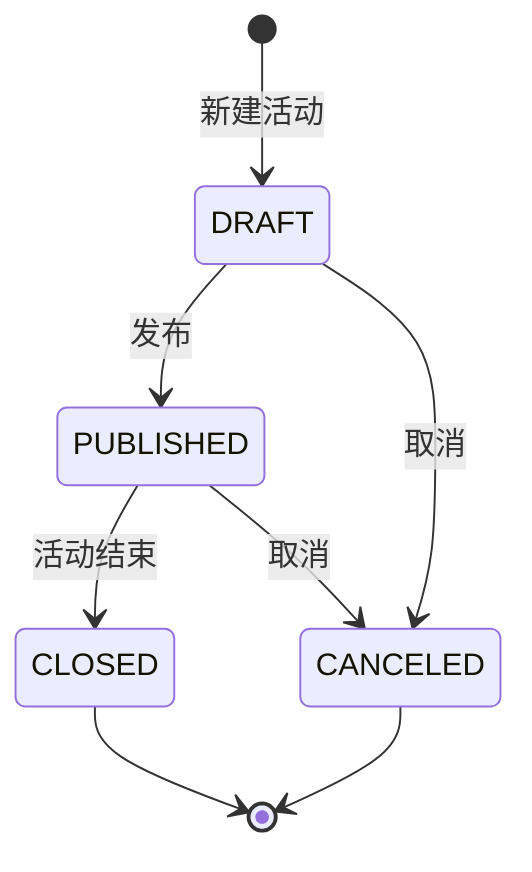
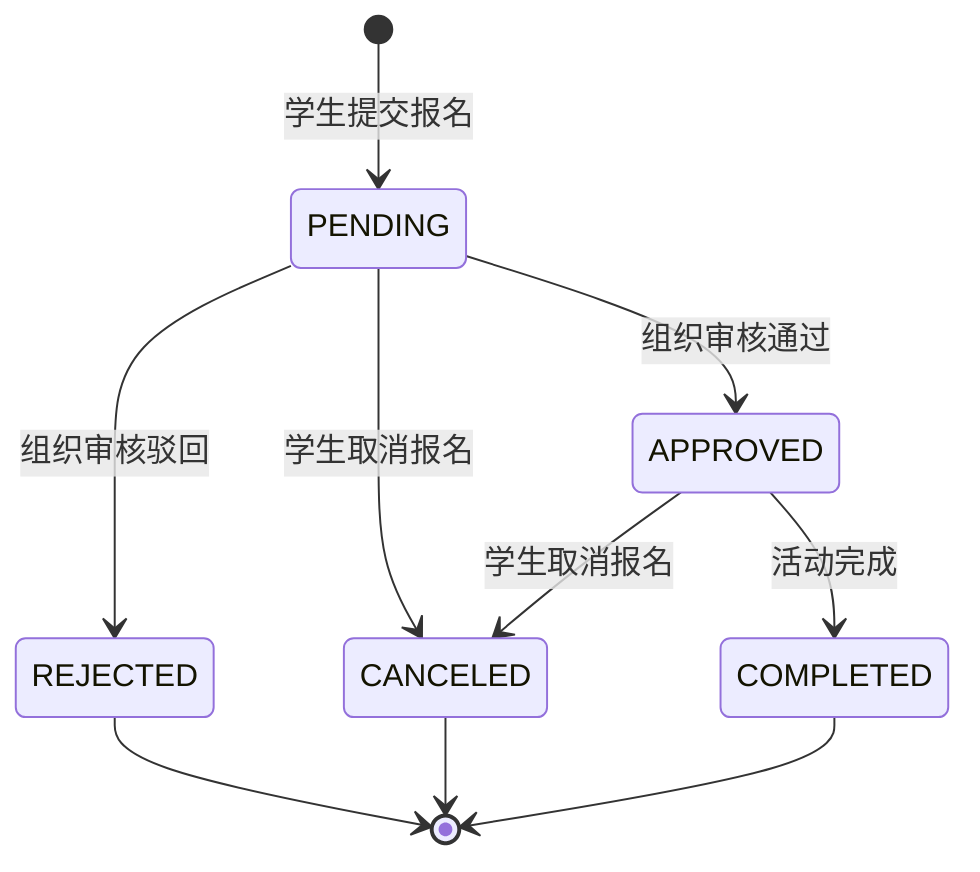
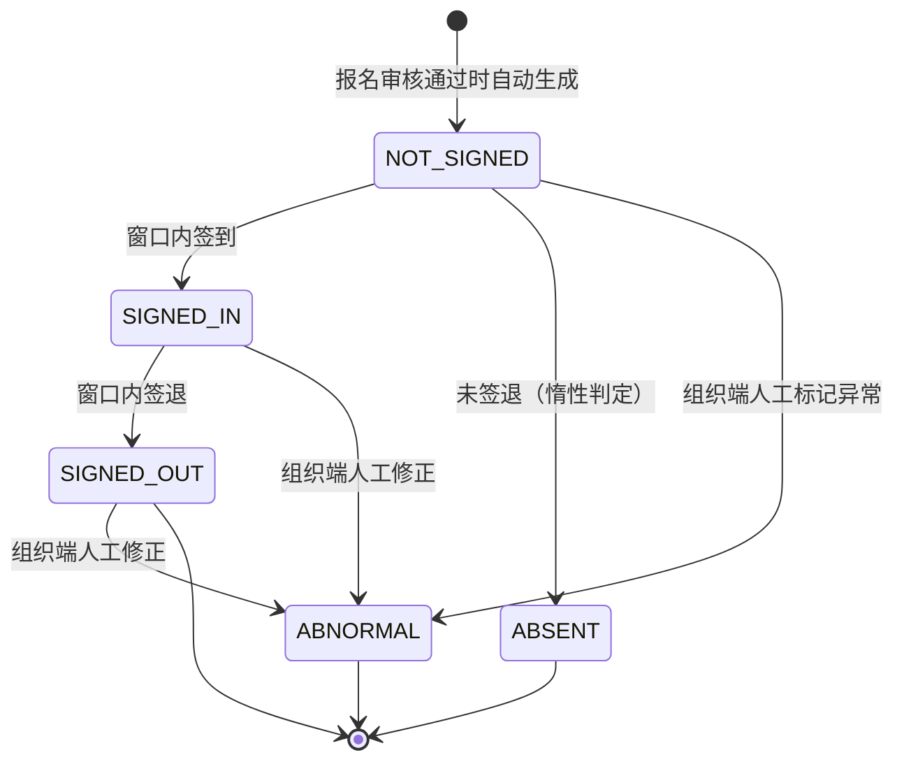
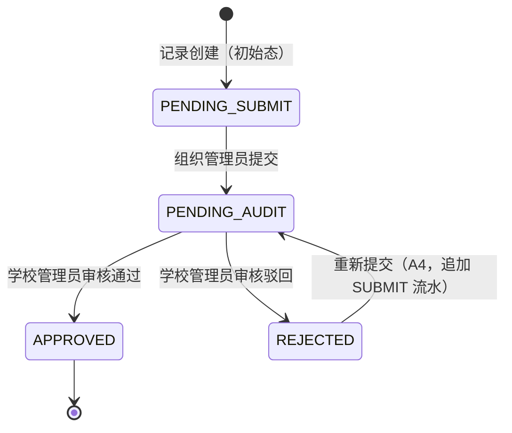
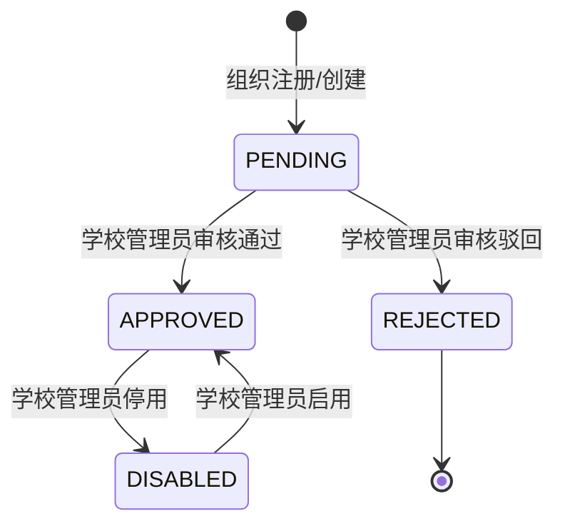
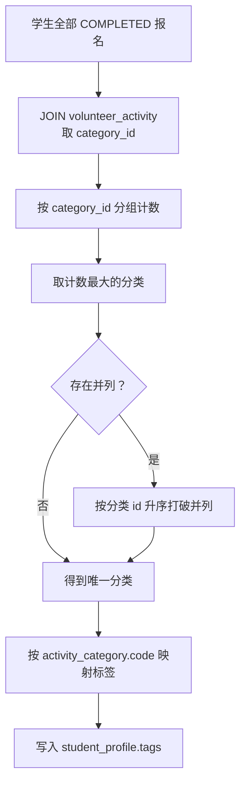
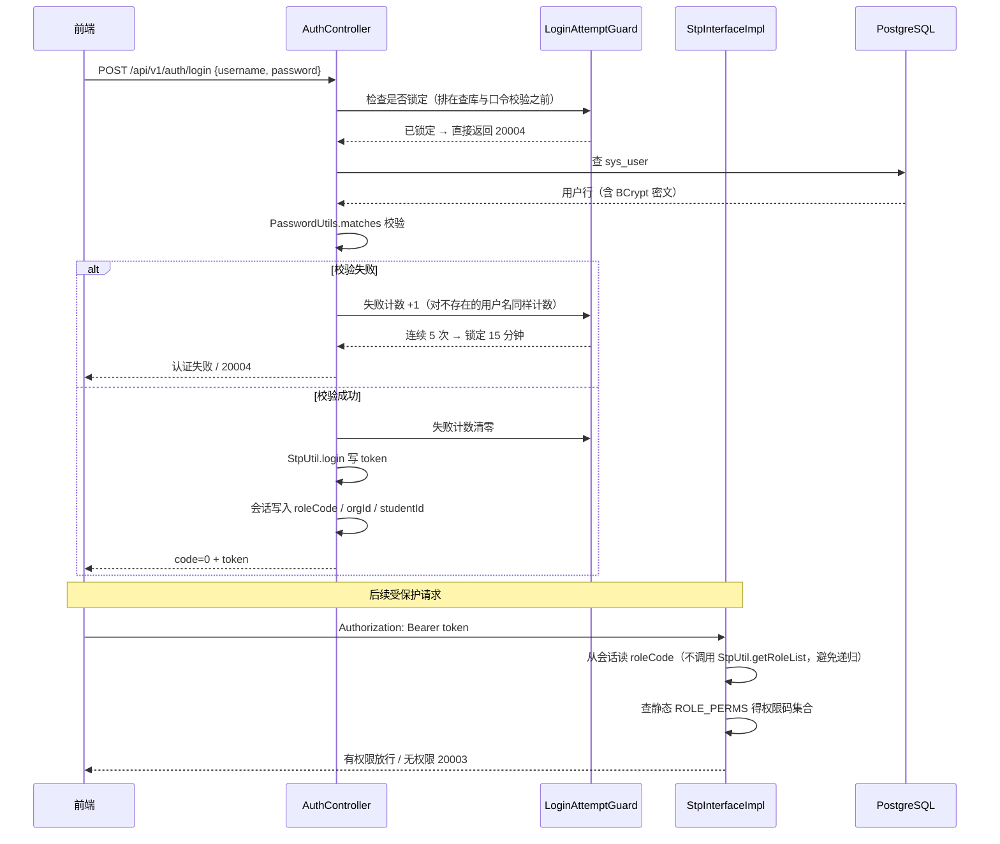
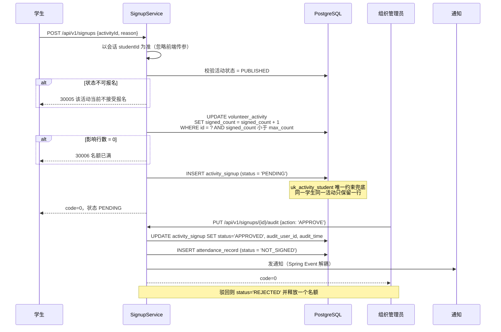
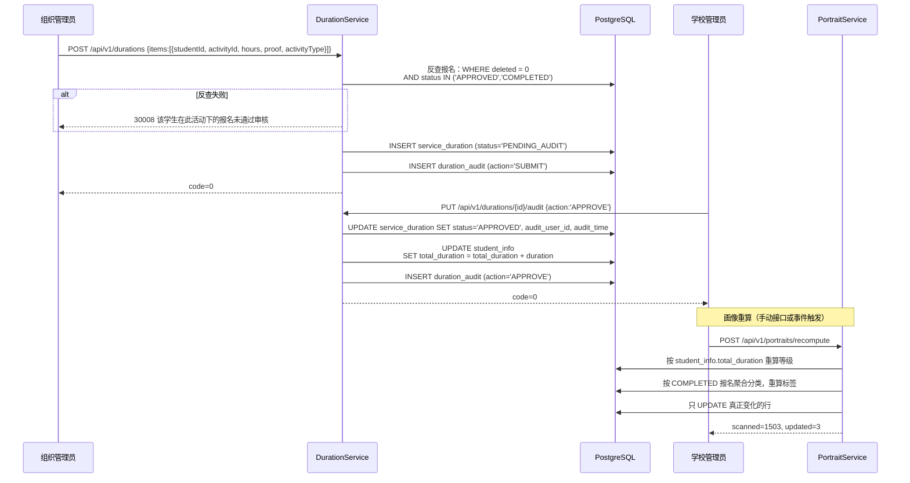
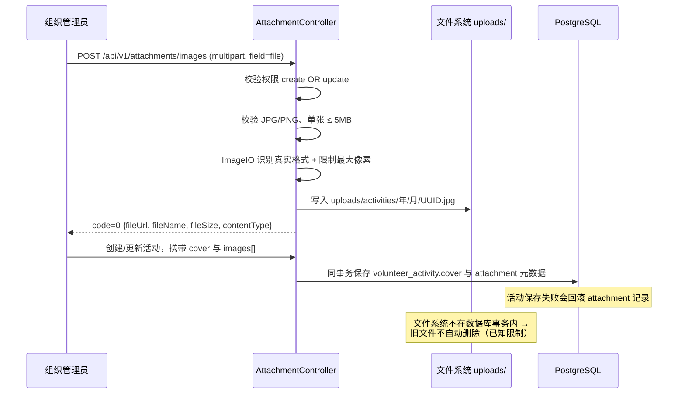

# 第三章 详细设计

> **本章写作约定**：本章给出表级结构、状态机、关键算法、流程时序与接口的详细设计。
> **3.4 节的关键算法与决策是全文的技术亮点**，12 项决策均来自仓库中显式登记的
> "A 组：需要先拍板"清单（`docs/待办清单.md:185-289`），每项都有结论、理由与落地位置。
> 每条结论后标注 `文件:行` 出处。
>
> **数据口径提示**：`sql/07` 口径 **1500 学生 / 386 活动 / 10719 报名 / 19319.3 小时**；
> 叠加 `sql/12` 后的当前库值 **1503 学生 / 389 活动**（报名与时长不变）；
> 前端 mock 口径 **12,480 报名 / 86,420 小时**（非真库数字）。三者不可混用。

---

## 3.1 引言

### 3.1.1 本章范围

概要设计回答了"系统分成几块"，详细设计要回答"每一块内部怎么做"。本章覆盖五个方面：

1. **表级结构**：16 张表的字段、约束、默认值与设计理由；
2. **状态机**：4 个核心业务状态字段 + 组织状态的迁移规则与守卫条件；
3. **关键算法与决策**：时长计算、签到窗口、并发占名额、驳回重提、权威值、
   时间类型、取消语义等 12 项（A1~A12）；
4. **画像算法**：6 档等级与 8 类标签的判定规则、并列打破规则与重算时机；
5. **流程与接口**：关键流程的时序、权限矩阵、错误码与数据一致性自检设计。

### 3.1.2 详细设计的三条原则

| 原则 | 含义 | 体现 |
|---|---|---|
| **口径单一** | 同一业务含义只能有一处权威定义，其余为派生或快照 | A5：`student_info.total_duration` 为权威值，`student_profile.total_duration` 仅快照 |
| **状态可枚举** | 所有状态必须落进字典，不留"临时状态" | 9 类字典，见 `docs/后端进展与待办.md:661-671` |
| **失败可判定** | 每个业务分支都要有明确的错误码，不靠"猜" | 错误码分段 1xxxx~5xxxx，见 `docs/知识库已确认项目选题与技术背景.md:199` |

---

## 3.2 数据库详细设计

### 3.2.1 系统域（`vcp-system`，8 张表）

#### 3.2.1.1 `sys_user` —— 用户表

| 字段 | 类型 | 约束/默认 | 说明 |
|---|---|---|---|
| `id` | `BIGSERIAL` | PK | 主键，数据库自增 |
| `username` | `VARCHAR(50)` | `NOT NULL UNIQUE` | 登录账号，唯一 |
| `password` | `VARCHAR(100)` | `NOT NULL` | **BCrypt 密文**（`$2a$10$` 开头的 60 字符），明文口令不落库；比对见 `vcp-framework` 的 `PasswordUtils` |
| `real_name` | `VARCHAR(50)` | | 真实姓名 |
| `phone` | `VARCHAR(20)` | | 手机号 |
| `email` | `VARCHAR(100)` | | 邮箱 |
| `avatar` | `VARCHAR(255)` | | 头像地址 |
| `status` | `SMALLINT` | `DEFAULT 1` | 状态：1 启用，0 禁用 |
| `deleted` | `SMALLINT` | `DEFAULT 0` | 逻辑删除：0 未删除，1 已删除 |
| `create_time` / `update_time` | `TIMESTAMP` | `DEFAULT CURRENT_TIMESTAMP` | 创建 / 更新时间 |

出处：`sql/02_schema.sql:51-75`。

**补充列**（由 `sql/05_backend_gap_fix.sql` 补）：`last_login_at`。
**不执行 `05`，登录接口会直接报错**（`sys_user.last_login_at` 不存在）
（`docs/后端进展与待办.md:178-180`）。

**设计说明**：`password` 列宽 100 而不是 60，是为将来的算法升级留余量；
状态用 `SMALLINT` 1/0 存库、由服务层 `UserStatusEnum` 双向翻译为 `ACTIVE` / `DISABLED`
英文码对外返回（A9，见 3.4.9）。

#### 3.2.1.2 `sys_role` —— 角色表

| 字段 | 类型 | 约束/默认 | 说明 |
|---|---|---|---|
| `id` | `BIGSERIAL` | PK | 主键 |
| `role_code` | `VARCHAR(50)` | `NOT NULL UNIQUE` | 角色编码：`STUDENT` 学生，`ORG_ADMIN` 组织管理员，`SCHOOL_ADMIN` 学校管理员 |
| `role_name` | `VARCHAR(50)` | `NOT NULL` | 角色名称 |
| `remark` | `VARCHAR(255)` | | 备注 |
| `deleted` | `SMALLINT` | `DEFAULT 0` | 逻辑删除 |
| `create_time` / `update_time` | `TIMESTAMP` | `DEFAULT CURRENT_TIMESTAMP` | |

出处：`sql/02_schema.sql:80-94`。

**设计说明（重要）**：该表**只有 `role_code` / `role_name` 两列业务字段，没有 perms 列**，
也没有 role-permission 关联表。系统的权限映射**写在代码里**
（`StpInterfaceImpl` 的静态 `ROLE_PERMS`），理由是"三个角色权限边界固定，
避免为了形式上的'动态权限'而多加两张表"
（`StpInterfaceImpl.java:19-22`）。角色管理接口因此是**只读**的
（`docs/后端进展与待办.md:151`）。

#### 3.2.1.3 `sys_user_role` —— 用户角色关联表

| 字段 | 类型 | 约束 | 说明 |
|---|---|---|---|
| `id` | `BIGSERIAL` | PK | 主键 |
| `user_id` | `BIGINT` | `NOT NULL`，FK → `sys_user(id)` | 用户 ID |
| `role_id` | `BIGINT` | `NOT NULL`，FK → `sys_role(id)` | 角色 ID |
| `create_time` | `TIMESTAMP` | `DEFAULT CURRENT_TIMESTAMP` | |
| — | — | `UNIQUE (user_id, role_id)` | 同一组合不重复 |

出处：`sql/02_schema.sql:100-112`。

**设计说明**：关联表按**物理删除**设计，**不加 `deleted` / `update_time`**
（`sql/02_schema.sql:98`）。这是"逻辑删除只覆盖业务数据表"这一约定的具体体现
（`sql/README.md:172`）。

#### 3.2.1.4 `student_info` —— 学生信息表

| 字段 | 类型 | 约束/默认 | 说明 |
|---|---|---|---|
| `id` | `BIGSERIAL` | PK | 主键 |
| `user_id` | `BIGINT` | `NOT NULL UNIQUE`，FK → `sys_user(id)` | 一个用户对应一个学生档案 |
| `student_no` | `VARCHAR(30)` | `NOT NULL UNIQUE` | 学号（唯一） |
| `college` | `VARCHAR(100)` | | 学院 |
| `major` | `VARCHAR(100)` | | 专业 |
| `class_name` | `VARCHAR(100)` | | 班级 |
| `total_duration` | `NUMERIC(10,1)` | `DEFAULT 0` | **累计有效志愿时长（小时），权威值**；由 `service_duration` 审核通过的数据汇总而来，是学院排名与画像的依据 |
| `public_welfare_level` | `VARCHAR(50)` | | 公益等级；按累计有效时长分 6 档 |
| `deleted` | `SMALLINT` | `DEFAULT 0` | 逻辑删除 |
| `create_time` / `update_time` | `TIMESTAMP` | `DEFAULT CURRENT_TIMESTAMP` | |

出处：`sql/02_schema.sql:117-140`。

**补充列**（`sql/06_backend_gap_fix2.sql` 补）：`gender`、`grade`。
**已知限制**：`major` / `class_name` / `gender` / `grade` **仍然没有写入入口**
（`docs/后端进展与待办.md:493`）。

**`student_no` 的生成口径**：注册表单**不收集学号**，而该列 `NOT NULL UNIQUE`，
因此建档时用占位学号 **`S` + 六位零填充 userId**（如 `S001513`）
（`docs/测试报告.md:196-198`、`docs/后端进展与待办.md:436`）。

**建档时的三个口径决定**（`docs/后端进展与待办.md:436-440`）：

- `total_duration` 写 **0**；
- `public_welfare_level` **留空** —— 等级由画像重算补写，
  这样 `vcp-system` **不必反向依赖** `vcp-portrait`；
- **不建 `student_profile`**（画像首次生成时再建）。

**幂等实现**：先按 `user_id` 查，并发撞唯一约束时捕获 `DuplicateKeyException` 转可读文案
（catch 里**刻意不回查**：PostgreSQL 事务此时已 aborted，回查必然失败）（同上 `:439-440`）。

#### 3.2.1.5 `sys_dict` —— 数据字典表

| 字段 | 类型 | 约束/默认 | 说明 |
|---|---|---|---|
| `id` | `BIGSERIAL` | PK | 主键 |
| `dict_type` | `VARCHAR(50)` | `NOT NULL` | 字典类型（9 类，见 2.6.2） |
| `dict_key` | `VARCHAR(50)` | `NOT NULL` | 字典键（入库的英文枚举码） |
| `dict_value` | `VARCHAR(100)` | `NOT NULL` | 字典值（前端展示的中文） |
| `sort` | `INT` | `DEFAULT 0` | 同类型内的排序 |
| `status` | `SMALLINT` | `DEFAULT 1` | 状态：1 启用，0 禁用 |
| `create_time` / `update_time` | `TIMESTAMP` | `DEFAULT CURRENT_TIMESTAMP` | |
| — | — | `UNIQUE (dict_type, dict_key)` | 同类型下键唯一 |

出处：`sql/02_schema.sql:145-162`。

**补充列**（`sql/05` 补）：`tone`（标签色调）。
**接口必须返回 `tone`** —— 前端 `stores/dict.js` 的 `load()` 是**整体替换**语义，
接口不返回 `tone` 会把所有状态标签刷成灰色（`docs/后端进展与待办.md:160-161`）。

**色调必须按 `(dict_type, dict_key)` 精确指定**，不能只按 `dict_key` 匹配 ——
不同字典类型里有同名键（`CANCELED` 同时属于 `activity_status` 与 `signup_status`），
只按 `dict_key` 更新会把它们刷成同一种色调，而前端的取值并不相同
（一个是 bad 红、一个是 mute 灰）。这类错配**不报错**，只表现为"这个标签的颜色跟别处不一样"
（`docs/后端进展与待办.md:182-185`）。

**"学院即字典行"的设计**：学院不是独立表，而是 `dict_type = 'college'` 的字典行
（`dict_key` = `dict_value` = 学院名）。理由：注册页下拉、注册校验、按学院筛学生与组织，
全都按"学院名"这一列匹配；多一张表只会多一份可能与字典漂移的名字清单
（`docs/后端进展与待办.md:453`、`:467`）。

**字典的物理删除**：`sys_dict` 没有 `deleted` 列，字典行的下架手段本来是停用；
学院管理的 `DELETE` 是**物理删除**，只用于"建错了、还没被引用"的行，
学院下还有学生或组织时**拒绝**，文案带具体数量
（"该学院下还有 N 名学生、M 个组织，不能删除"）（`docs/后端进展与待办.md:463`）。

#### 3.2.1.6 `notification` —— 通知表

| 字段 | 类型 | 约束/默认 | 说明 |
|---|---|---|---|
| `id` | `BIGSERIAL` | PK | 主键 |
| `user_id` | `BIGINT` | `NOT NULL`，FK → `sys_user(id)` | 接收人 |
| `title` | `VARCHAR(200)` | | 通知标题 |
| `content` | `TEXT` | | 通知内容 |
| `type` | `VARCHAR(50)` | | 通知类型：`SIGNUP` 报名结果，`DURATION` 时长审核，`SYSTEM` 系统公告 |
| `is_read` | `BOOLEAN` | `DEFAULT FALSE` | 是否已读 |
| `create_time` | `TIMESTAMP` | `DEFAULT CURRENT_TIMESTAMP` | |

出处：`sql/02_schema.sql:168-184`。

**补充列**（`sql/05` 补）：`batch_no`（群发批次号）。

**设计说明**：通知**按收件人一行存，用 `batch_no` 串批次** —— `is_read` 天然是按人记的；
删除时只有自己那一行的 id，**不按批次整批删就会"删了但学生端还在"**
（`docs/后端进展与待办.md:162-163`）。通知用 `is_read` 表达已读，**不做逻辑删除**
（`sql/02_schema.sql:166`）。

#### 3.2.1.7 `operation_log` —— 操作日志表

| 字段 | 类型 | 说明 |
|---|---|---|
| `id` | `BIGSERIAL` PK | 主键 |
| `user_id` | `BIGINT` | 操作人 ID（未登录可为空） |
| `username` | `VARCHAR(50)` | 操作人用户名（**冗余留存，用户改名后仍可追溯**） |
| `operation` | `VARCHAR(200)` | 操作描述 |
| `method` | `VARCHAR(200)` | 调用的方法签名 |
| `params` | `TEXT` | 请求参数（**建议脱敏后再落库**） |
| `ip` | `VARCHAR(50)` | 来源 IP |
| `create_time` | `TIMESTAMP` | `DEFAULT CURRENT_TIMESTAMP` |

出处：`sql/02_schema.sql:190-207`。

**补充列**（`sql/05` 补）：`module`、`action`、`result`、`target` 等。

**设计说明**：

- 表按**只追加**设计，**不加 `deleted` / `update_time`**（`sql/02_schema.sql:188`）。
- **不存 `role` 列**：由 `user_id` 实时关联推导，冗余存一列在角色调整后会失真
  （`docs/后端进展与待办.md:164`）。
- **四类口令相关操作不采集 `params`**（`@OperationLog(params = false)`），
  避免明文口令被序列化进库永久留存（同上 `:165-167`）。
- **已知缺口**：`target`（操作对象）**写入侧从不填** —— `@OperationLog` 注解缺 `target` 属性
  （`docs/测试报告.md:212`、`docs/待办清单.md:869-870`）。

#### 3.2.1.8 `attachment` —— 附件表

| 字段 | 类型 | 约束/默认 | 说明 |
|---|---|---|---|
| `id` | `BIGSERIAL` | PK | 主键 |
| `biz_type` | `VARCHAR(50)` | | 业务类型：`ACTIVITY` 活动图片，`ORG` 组织资质，`AVATAR` 用户头像 |
| `biz_id` | `BIGINT` | | 业务 ID（**多态，不加外键约束**） |
| `file_name` | `VARCHAR(255)` | | 原始文件名 |
| `file_url` | `VARCHAR(255)` | | 访问地址 |
| `file_size` | `BIGINT` | | 文件大小（字节） |
| `content_type` | `VARCHAR(100)` | | MIME 类型，如 `image/png` |
| `caption` | `VARCHAR(255)` | | 图片说明 |
| `sort_order` | `INT` | `DEFAULT 0` | 同一业务下的展示顺序，从 0 开始 |
| `create_time` | `TIMESTAMP` | `DEFAULT CURRENT_TIMESTAMP` | |

出处：`sql/02_schema.sql:213-234`。

**补充列**（`sql/11_activity_images.sql` 补）：`content_type` / `caption` / `sort_order` 三个图片元数据列
（`docs/后端进展与待办.md:520`）。

**设计说明**：`biz_id` 是**多态外键**（指向不同业务表），**故不建物理外键**
（`sql/02_schema.sql:211`）。这也是 ER 图里 5 条"业务关联"中占 3 条的原因
（`docs/ER图.md:528-530`）。

**存储策略**：PostgreSQL 只保存元数据，图片本体保存到后端 `uploads/`，
活动封面另存于 `volunteer_activity.cover`（`docs/测试报告.md:156-158`）。

### 3.2.2 组织域（`vcp-org`，1 张表）

#### 3.2.2.1 `org_info` —— 志愿组织信息表

| 字段 | 类型 | 约束/默认 | 说明 |
|---|---|---|---|
| `id` | `BIGSERIAL` | PK | 主键 |
| `contact_user_id` | `BIGINT` | FK → `sys_user(id)` | 组织管理员账号 ID |
| `org_name` | `VARCHAR(100)` | `NOT NULL` | 组织名称 |
| `org_type` | `VARCHAR(50)` | | 组织类型：学院组织、社会团体等 |
| `contact_name` | `VARCHAR(50)` | | 负责人姓名 |
| `phone` | `VARCHAR(20)` | | 联系电话 |
| `email` | `VARCHAR(100)` | | 联系邮箱 |
| `description` | `TEXT` | | 组织简介 |
| `status` | `VARCHAR(20)` | `DEFAULT 'PENDING'` | 审核状态：`PENDING` 待审核，`APPROVED` 已通过，`REJECTED` 已驳回（由学校管理员审核）；`sql/05` 追加 `DISABLED` |
| `deleted` | `SMALLINT` | `DEFAULT 0` | 逻辑删除 |
| `create_time` / `update_time` | `TIMESTAMP` | `DEFAULT CURRENT_TIMESTAMP` | |

出处：`sql/02_schema.sql:244-269`。

**补充列**（`sql/05` 补）：`code` / `college` / `member_count` / `founded_at` / `audit_remark`，
并增加状态查询索引与"**在用组织负责人**"**部分唯一索引**
（`docs/后端进展与待办.md:218-220`）。

**部分唯一索引的作用**：限制每个账号最多 **1 个未删除组织**
（`docs/ER图.md:507`）。

**`07` 回填后的实测值**：`code` `ORG001`–`ORG008`、`college`（5 个学院）、
`founded_at` 2015–2018、`member_count` 97–282（`docs/后端进展与待办.md:360-361`）。

### 3.2.3 活动与报名域（`vcp-volunteer`，4 张表）

#### 3.2.3.1 `activity_category` —— 活动分类表

| 字段 | 类型 | 约束/默认 | 说明 |
|---|---|---|---|
| `id` | `BIGSERIAL` | PK | 主键 |
| `category_name` | `VARCHAR(50)` | `NOT NULL` | 分类名称 |
| `sort` | `INT` | `DEFAULT 0` | 排序（升序） |
| `status` | `SMALLINT` | `DEFAULT 1` | 状态：1 启用，0 禁用 |
| `deleted` | `SMALLINT` | `DEFAULT 0` | 逻辑删除 |
| `create_time` / `update_time` | `TIMESTAMP` | `DEFAULT CURRENT_TIMESTAMP` | |

出处：`sql/02_schema.sql:279-293`。

**补充列**：
- `code`（`sql/06_backend_gap_fix2.sql` 补，并加 `uk_category_code` 唯一约束）
  —— 取值 `CAMPUS` / `COMMUNITY` / `ENVIRONMENT` / `EVENT` / `ELDERLY` / `CULTURE`
  （`docs/待办清单.md:271-273`、`docs/后端进展与待办.md:277`）；
- `remark`（`sql/07_demo_scale.sql:69` 补列并回填 6 条）
  —— **注意：跑过 `07` 之后必须重启后端**，否则分类接口会查不存在的列报错
  （`docs/待办清单.md:874-875`、`docs/部署文档.md:287`）。

**`code` 列是 A12 的落地手段**（见 3.4.12）：分类→标签的映射**按 `code` 而不是中文名**做，
中文名只作兜底。若按中文名映射，一旦改名就会**静默错位**
（`docs/待办清单.md:278`、`:289`）。

**6 条分类的实际取值与顺序**（库为准）：校园服务 / 社区服务 / 环保公益 / 大型赛事 / 助老服务 / 文化传播
（`docs/待办清单.md:264-269`、`sql/03_init_data.sql:60-66`）。

#### 3.2.3.2 `volunteer_activity` —— 志愿活动表

| 字段 | 类型 | 约束/默认 | 说明 |
|---|---|---|---|
| `id` | `BIGSERIAL` | PK | 主键 |
| `title` | `VARCHAR(200)` | `NOT NULL` | 活动名称 |
| `category_id` | `BIGINT` | FK → `activity_category(id)` | 活动分类 |
| `org_id` | `BIGINT` | FK → `org_info(id)` | 发布组织 |
| `start_time` | `TIMESTAMP` | | 开始时间 |
| `end_time` | `TIMESTAMP` | | 结束时间 |
| `location` | `VARCHAR(200)` | | 活动地点 |
| `max_count` | `INT` | `DEFAULT 0` | 人数上限；**0 表示不限** |
| `signed_count` | `INT` | `DEFAULT 0` | **已报名人数（冗余计数）**，口径见下 |
| `duration` | `NUMERIC(10,1)` | `DEFAULT 0` | 预计志愿时长（小时） |
| `status` | `VARCHAR(20)` | `DEFAULT 'DRAFT'` | `DRAFT` 草稿，`PUBLISHED` 已发布，`CLOSED` 已结束，`CANCELED` 已取消 |
| `cover` | `VARCHAR(255)` | | 封面图地址 |
| `description` | `TEXT` | | 活动详情 |
| `deleted` | `SMALLINT` | `DEFAULT 0` | 逻辑删除 |
| `create_time` / `update_time` | `TIMESTAMP` | `DEFAULT CURRENT_TIMESTAMP` | |

出处：`sql/02_schema.sql:298-332`。

**`signed_count` 的权威口径**（列注释原文）：

> 已报名人数（冗余计数，**报名即占名额：未取消未驳回的报名都计入，驳回与取消各释放一个**，
> 用于快速判断是否报满）

出处：`sql/02_schema.sql:327`。

**该口径曾与演示数据脚本不一致**（实现是"提交即占名额"，而 `04_demo_data.sql` 按
"`APPROVED` + `COMPLETED`"回填），2026-09-24 已收口，方向是**脚本对齐实现、实现未改**：

- `sql/02_schema.sql` 的列注释、`sql/04_demo_data.sql`、`sql/07_demo_scale.sql` 的回填统一为
  "未取消未驳回的报名"（`PENDING` + `APPROVED` + `COMPLETED`）口径；
- `sql/07` 的新活动名额下限由 **40 抬到 46**（公式 `40 + ((n.seq * 7) % 36)` →
  `46 + ((n.seq * 7) % 30)`，即 46..75），并补了一条幂等修正语句；
- **理由**：报名数上限是 45，新口径下已发布活动占位 60% + 35% = 95%，
  45 × 0.95 = 42.75 > 40 会顶破名额下限、使 `sql/07` 末尾自检第 4 项失败；
  **名额 ≥ 46 > 45 是硬保证**。

出处：`docs/后端进展与待办.md:287-300`。

**实测验证**：`sql/07` 事务内执行、末尾自检全部通过；实测"已报名 > 名额"的活动数 **0**、
全库名额范围 **46..75**、与明细按新口径不一致的活动数 **0**（按旧口径不一致的有 36 场）；
报名 10,719 条中**占名额 9,201 条**（`docs/后端进展与待办.md:298-300`）。

**补充列**（`sql/06` 补）：`deadline`（报名截止）、`contact`（联系人）
（`docs/后端进展与待办.md:276`）。

**`signed_count` 是应用层维护的派生列（重要踩坑）**：直接用 SQL 删 `activity_signup` 行
**不会回退它**，会让 `sql/09` 第 7 项报出不一致；手工清理数据后必须同步重算该列
（`docs/测试报告.md:307-309`、`docs/后端进展与待办.md:449-450`）。

#### 3.2.3.3 `activity_signup` —— 活动报名表

| 字段 | 类型 | 约束/默认 | 说明 |
|---|---|---|---|
| `id` | `BIGSERIAL` | PK | 主键 |
| `activity_id` | `BIGINT` | `NOT NULL`，FK → `volunteer_activity(id)` | 活动 ID |
| `student_id` | `BIGINT` | `NOT NULL`，FK → `student_info(id)` | **学生档案 ID，不是 `sys_user.id`** |
| `signup_time` | `TIMESTAMP` | `DEFAULT CURRENT_TIMESTAMP` | 报名时间 |
| `status` | `VARCHAR(20)` | `DEFAULT 'PENDING'` | `PENDING` 待审核，`APPROVED` 已通过，`REJECTED` 已驳回，`CANCELED` 已取消，`COMPLETED` 已完成 |
| `audit_remark` | `VARCHAR(255)` | | 审核意见 |
| `audit_user_id` | `BIGINT` | FK → `sys_user(id)` | 审核人（组织管理员） |
| `audit_time` | `TIMESTAMP` | | 审核时间 |
| `deleted` | `SMALLINT` | `DEFAULT 0` | 逻辑删除 |
| `create_time` / `update_time` | `TIMESTAMP` | `DEFAULT CURRENT_TIMESTAMP` | |
| — | — | `UNIQUE (activity_id, student_id)` | `uk_activity_student`，同一学生同一活动只有一行 |

出处：`sql/02_schema.sql:337-363`。

**两个极易搞错的字段口径**：

1. **`student_id` 指向 `student_info.id` 而不是 `sys_user.id`** ——
   列注释里明确写了这一点（`sql/02_schema.sql:357`）。后续所有报名、时长都挂在这份**档案**上
   而不是账号上（`docs/ER图.md:561`）。
2. **取消报名不改 `deleted`**（A7）—— `status = 'CANCELED'` 复用同一行，
   `deleted` 保持 0（`docs/待办清单.md:221`）。

**补充列**（`sql/06` 补）：`reason`（报名理由）。`07` 回填后空值从 **149/149 降到 49/10719**
（`docs/后端进展与待办.md:362`）。

#### 3.2.3.4 `attendance_record` —— 签到签退记录表

| 字段 | 类型 | 约束/默认 | 说明 |
|---|---|---|---|
| `id` | `BIGSERIAL` | PK | 主键 |
| `signup_id` | `BIGINT` | `NOT NULL UNIQUE`，FK → `activity_signup(id)` | **一条报名对应一条签到记录** |
| `sign_in_time` | `TIMESTAMP` | | 签到时间 |
| `sign_out_time` | `TIMESTAMP` | | 签退时间 |
| `status` | `VARCHAR(20)` | `DEFAULT 'NOT_SIGNED'` | `NOT_SIGNED` 未签到，`SIGNED_IN` 已签到，`SIGNED_OUT` 已签退，`ABNORMAL` 异常，`ABSENT` 缺勤 |
| `remark` | `VARCHAR(255)` | | 备注（异常原因等） |
| `deleted` | `SMALLINT` | `DEFAULT 0` | 逻辑删除 |
| `create_time` / `update_time` | `TIMESTAMP` | `DEFAULT CURRENT_TIMESTAMP` | |

出处：`sql/02_schema.sql:369-388`。

**生成时机**：**报名审核通过时同步生成**签到记录（1:1，靠 `signup_id` 唯一约束保证）
（`docs/ER图.md:571`、`docs/测试报告.md:60-61`）。

**索引补充（重要）**：该表原先**除唯一键外没有任何索引**，
而 `vcp-analytics` 有 10 个接口要按签到时间聚合它 —— `sql/06` 补上了
`attendance_record(sign_in_time)`，这是 `sql/06` 的 12 条索引里最关键的一条
（`docs/后端进展与待办.md:279-280`）。

### 3.2.4 时长认证域（`vcp-certification`，2 张表）

#### 3.2.4.1 `service_duration` —— 服务时长表

| 字段 | 类型 | 约束/默认 | 说明 |
|---|---|---|---|
| `id` | `BIGSERIAL` | PK | 主键 |
| `signup_id` | `BIGINT` | `NOT NULL UNIQUE`，FK → `activity_signup(id)` | 一条报名对应一条时长记录 |
| `activity_id` | `BIGINT` | `NOT NULL`，FK → `volunteer_activity(id)` | **冗余列**，便于按活动统计 |
| `student_id` | `BIGINT` | `NOT NULL`，FK → `student_info(id)` | **冗余列**，便于按学生/学院统计 |
| `duration` | `NUMERIC(10,1)` | `DEFAULT 0` | 实际服务时长（小时）；由组织管理员依据签到签退记录提交 |
| `status` | `VARCHAR(20)` | `DEFAULT 'PENDING_SUBMIT'` | `PENDING_SUBMIT` 待提交，`PENDING_AUDIT` 待审核，`APPROVED` 已通过，`REJECTED` 已驳回（由学校管理员终审） |
| `submit_time` | `TIMESTAMP` | | 提交时间 |
| `audit_user_id` | `BIGINT` | FK → `sys_user(id)` | 审核人（学校管理员） |
| `audit_time` | `TIMESTAMP` | | 审核时间 |
| `audit_remark` | `VARCHAR(255)` | | 审核意见（驳回原因） |
| `deleted` | `SMALLINT` | `DEFAULT 0` | 逻辑删除 |
| `create_time` / `update_time` | `TIMESTAMP` | `DEFAULT CURRENT_TIMESTAMP` | |

出处：`sql/02_schema.sql:398-428`。

**两处刻意的冗余**：`activity_id` 与 `student_id` 都是冗余列，列注释里写明了理由
——"便于按活动统计""便于按学生/学院统计"（`sql/02_schema.sql:420-421`）。
**代价**：冗余列需要保证一致性，因此 `sql/09` 专门用第 8、10 项检查它们与明细是否相符。

**补充列**（`sql/06` 补）：`proof`（证明材料）、`org_id`、`activity_type`。
其中 `proof` **刻意不回填** —— 库里无来源，编造会误导（`docs/后端进展与待办.md:281-282`）。

**`org_id` 是业务关联而非物理外键**：它供看板按组织汇总时长，
只建了 `idx_duration_org`，**不加约束**（`docs/ER图.md:526`）。

#### 3.2.4.2 `duration_audit` —— 时长审核记录表

| 字段 | 类型 | 约束/默认 | 说明 |
|---|---|---|---|
| `id` | `BIGSERIAL` | PK | 主键 |
| `duration_id` | `BIGINT` | `NOT NULL`，FK → `service_duration(id)` | 时长记录 ID |
| `auditor_id` | `BIGINT` | FK → `sys_user(id)` | 操作人 |
| `action` | `VARCHAR(20)` | | 审核动作：`SUBMIT` 提交，`APPROVE` 通过，`REJECT` 驳回 |
| `remark` | `VARCHAR(255)` | | 备注 |
| `create_time` | `TIMESTAMP` | `DEFAULT CURRENT_TIMESTAMP` | |

出处：`sql/02_schema.sql:434-449`。

**设计说明（本章要点之一）**：

1. 表按**只追加**设计，**不加 `deleted` / `update_time`**（`sql/02_schema.sql:432`）。
   审核历史**只追加不覆盖**，这是 A4"驳回后重提保留历史"的物理基础。
2. **`action` 与 `status` 不同形**：动作是 `APPROVE` / `REJECT`，
   状态是 `APPROVED` / `REJECTED`，列注释里专门写了"**注意与状态值的
   `APPROVED`/`REJECTED` 不同形**"（`sql/02_schema.sql:448`、`CLAUDE.md:101`）。
   这是枚举设计里最容易混的一处，故在代码约定里也单独列了一条。

### 3.2.5 公益画像域（`vcp-portrait`，1 张表）

#### 3.2.5.1 `student_profile` —— 学生公益画像表

| 字段 | 类型 | 约束/默认 | 说明 |
|---|---|---|---|
| `id` | `BIGSERIAL` | PK | 主键 |
| `student_id` | `BIGINT` | `NOT NULL UNIQUE`，FK → `student_info(id)` | 学生 ID（唯一） |
| `total_activities` | `INT` | `DEFAULT 0` | 参与活动次数（**按已完成 `COMPLETED` 的报名计**，即真的签到参加了，而非仅报名被批准） |
| `total_duration` | `NUMERIC(10,1)` | `DEFAULT 0` | 累计志愿时长（小时）；**权威值在 `student_info.total_duration`，此处为画像快照** |
| `category_preference` | `VARCHAR(255)` | | 偏好活动类型（参与最多的分类名） |
| `tags` | `VARCHAR(255)` | | 公益标签，**逗号分隔字符串**（如"热心志愿者,校园服务型"），共 8 类 |
| `portrait_desc` | `TEXT` | | 画像描述文本 |
| `create_time` / `update_time` | `TIMESTAMP` | `DEFAULT CURRENT_TIMESTAMP` | |

出处：`sql/02_schema.sql:459-478`。

**两个设计取舍**：

1. **`tags` 是逗号分隔字符串，不是数组也不是关联表**（`sql/02_schema.sql:477` 的列注释、
   `docs/公益等级与标签规则方案.md:83`）。查询时用 `string_to_array` + `unnest` 展开，
   `docs/公益等级与标签规则方案.md:104-109` 给出了复现统计 SQL。
2. **`total_duration` 与 `student_info.total_duration` 含义重复** ——
   ✅ 已拍板（A5）：**以 `student_info.total_duration` 为权威值**，`student_profile` 仅作画像快照
   （`docs/公益等级与标签规则方案.md:169-171`、`sql/02_schema.sql:475`）。

**该表不加 `deleted`**：画像快照按物理删除/重建处理（`sql/09_consistency_check.sql:43-44`
说明"无 `deleted` 列的表（关联表、流水/日志表、画像快照表）不加这个条件"）。

### 3.2.6 补充列脚本汇总

16 张表的基础结构在 `sql/02_schema.sql`，但**后端接口依赖的列分散在 4 个后续脚本里**。
这是本项目一个必须讲清楚的设计事实（也是 `docs/ER图.md` 反复强调"本图反映的是
`02 + 05 + 06 + 07 + 11` 叠加后的最终结构"的原因）：

| 脚本 | 补了什么 | 不执行会怎样 |
|---|---|---|
| `sql/05_backend_gap_fix.sql` | 补列 **15** 个 + 索引 4 个 + 部分唯一索引 1 个 | **不执行它，登录接口会直接报错**（`sys_user.last_login_at` 不存在） |
| `sql/06_backend_gap_fix2.sql` | 补列 **9** 个 + 唯一约束 1 个 + 索引 **12** 个 | 后端接口依赖这些列；`attendance_record` 会缺签到时间索引 |
| `sql/07_demo_scale.sql` | 补列 1 个（`activity_category.remark`）+ 演示数据放大 | 分类接口查不到 `remark` 列；**跑完必须重启后端** |
| `sql/11_activity_images.sql` | `attachment` 补 3 个图片元数据列 + 1 个排序索引 | 活动图片上传功能不可用 |

出处：`docs/ER图.md:8-14`、`docs/后端进展与待办.md:178-180`、`:274-283`、`:516-526`、
`docs/部署文档.md:78-83`。

**`05` / `06` 的共同设计原则**：全部是 `ADD COLUMN IF NOT EXISTS` + `ON CONFLICT DO NOTHING`，
**只做加法、可重复执行**（`docs/后端进展与待办.md:179`）。

---

## 3.3 状态机详细设计

### 3.3.1 状态字段总览

| 状态字段 | 所属表 | 取值数 | 字典类型 |
|---|---|---|---|
| `volunteer_activity.status` | `volunteer_activity` | 4 | `activity_status` |
| `activity_signup.status` | `activity_signup` | 5 | `signup_status` |
| `attendance_record.status` | `attendance_record` | 5 | `attendance_status` |
| `service_duration.status` | `service_duration` | 4 | `duration_status` |
| `org_info.status` | `org_info` | 4 | `org_status` |
| `sys_user.status` | `sys_user` | 2（1/0 → 英文码） | `user_status` |

出处：`docs/后端进展与待办.md:661-671`、`sql/02_schema.sql:158`。

**统一约定**：状态字段统一 `VARCHAR` 存**英文大写枚举码**，中文由 `sys_dict` 翻译；
这既便于 i18n，也便于前端统一渲染（`sql/README.md:160`）。

> **本节状态机的依据说明（如实交代）**：**状态取值**逐字来自 `sql/02_schema.sql` 的列注释
> 与 `sys_dict` 的种子数据（`sql/03_init_data.sql`、`sql/05_backend_gap_fix.sql`），是权威且可核对的；
> **迁移箭头**则是按状态码语义 + 已实测的行为整理的 ——
> 已实测覆盖的迁移有：`DRAFT → PUBLISHED`（`docs/测试用例表.md:50`）、
> `PENDING → APPROVED` / `REJECTED`（同上 `:66-67`）、
> `PENDING → CANCELED`（同上 `:57`）、
> `PENDING_AUDIT → APPROVED` / `REJECTED`（同上 `:89-90`）、
> `REJECTED → PENDING_AUDIT`（同上 `:134`）、
> `NOT_SIGNED → SIGNED_IN → SIGNED_OUT`（同上 `:78-79`）、
> `APPROVED ⇄ DISABLED`（`docs/后端进展与待办.md:225`）。
> **未单独做状态迁移测试的迁移**（如 `PUBLISHED → CLOSED`、`APPROVED → COMPLETED`）
> 是按语义给出的，本论文在此标明，不声称它们已被逐条验证。

### 3.3.2 活动状态机



**守卫条件**：

- 只有 `PUBLISHED` 状态的活动**接受报名**；其他状态报名返回 `30005`
  "该活动当前不接受报名"（`docs/测试用例表.md:56`）。
- `max_count = 0` 表示**不限人数**（`sql/02_schema.sql:326`）。
- **已知限制**：取消活动**不释放名额、不终止报名**；活动结束后 `PENDING` 报名**无终态**
  （`docs/测试报告.md:213`）。

### 3.3.3 报名状态机



**关键规则**：

| 规则 | 说明 | 出处 |
|---|---|---|
| 提交即占名额 | `signed_count + 1`（含 `PENDING`） | `sql/02_schema.sql:327` |
| 驳回释放名额 | `signed_count − 1` | 同上 |
| 取消释放名额 | `signed_count − 1`；**`deleted` 保持 0，复用同一行**（A7） | `docs/待办清单.md:221` |
| 审核通过**不再加**名额 | 避免重复计数 | `docs/后端进展与待办.md:266` |
| 审核通过时**生成签到记录** | `attendance_record`，状态 `NOT_SIGNED` | `docs/测试报告.md:60-61` |
| 已完成的活动不能取消 | 返回 `30010` | `docs/测试用例表.md:58` |
| 已审核过不能再审 | 返回 `30009` | 同上 `:68` |
| 重复报名 | 返回 `30007`；**库中不产生第二条有效报名**（靠 `uk_activity_student`） | 同上 `:54`、`:130` |

**`COMPLETED` 的语义**：表示"**真的签到参加了**"，而不是"报名被批准"。
`student_profile.total_activities` 就是按 `COMPLETED` 的报名数计的
（`sql/02_schema.sql:474`）。

### 3.3.4 签到状态机



**关键规则**：

| 规则 | 说明 | 出处 |
|---|---|---|
| 生成时机 | 报名**审核通过**时同步生成，初始状态 `NOT_SIGNED` | `docs/测试报告.md:60-61` |
| 签到窗口 | 活动开始前 **30 分钟**开放签到 | A2，`docs/待办清单.md:198` |
| 签退窗口 | 活动结束后 **30 分钟内**必须签退 | 同上 |
| 未签退判定 | 记 `ABSENT`，实现为**查询时惰性判定**（不引入定时任务） | 同上 `:199` |
| 未签到直接签退 | 拒绝，返回 `30013` "请先签到再签退" | `docs/测试用例表.md:80` |
| 窗口外签到 | 拒绝，返回 `10001` "签到尚未开放，活动开始前 30 分钟才可签到" | `docs/测试报告.md:70-71` |
| 签到接口是**学生专属** | 用组织管理员 token 调用返回 `10003`（按会话里的 `studentId` 定位本人） | 同上 `:72-73` |
| 组织端人工修正 | `PUT /api/v1/attendance/{id}` 可把记录修正为 `SIGNED_OUT` 并写入签到签退时间 | 同上 `:68-69` |

> **`ABNORMAL` 的语义**：列注释与 `sql/09` 第 14 项的注释都说明，
> **`ABNORMAL` 是有签退但时间异常的记录**，因此第 14 项"已签到却缺签退时间"的检查
> **不包含** `ABNORMAL`（`sql/09_consistency_check.sql:244-245`）。

### 3.3.5 时长状态机



**关键规则**：

| 规则 | 说明 | 出处 |
|---|---|---|
| 提交前置条件 | 报名状态必须是 `APPROVED` 或 `COMPLETED` | `docs/测试报告.md:184-187` |
| 审核通过 | **累加** `student_info.total_duration` | A5，`docs/待办清单.md:212` |
| 审核驳回 | 学生累计时长**不变** | `docs/测试用例表.md:90` |
| 已审核过再审 | 返回 `40002` "该记录已审核，无法重复操作" | 同上 `:92` |
| 重复提交 | 待审核中提示"请勿重复提交"；已通过提示无法重复提交 | 同上 `:133` |
| 驳回后重提 | **允许**，回到 `PENDING_AUDIT`，追加一条 `SUBMIT` 流水 | A4，`docs/待办清单.md:208-209` |
| 审核动作留痕 | 每次提交/审核动作都往 `duration_audit` 追加一行 | `sql/02_schema.sql:445` |

**A4 为什么这样设计**：审核历史**只追加不覆盖**，`duration_audit` 保留完整的
"提交 → 驳回 → 再提交 → 通过"链条，这样答辩时可以展示"同一条时长被驳回过一次"的完整证据链
（`docs/待办清单.md:209`）。

**已知限制**：`PENDING_SUBMIT`（待提交）状态**全链路无生产者** ——
记录创建后不会停留在该状态，组织端"时长提交"页的状态分布真后端**恒为 0**
（`docs/测试报告.md:211`）。

### 3.3.6 组织状态机



**关键规则**（A10）：

- 审核结果仍是 `PENDING` / `APPROVED` / `REJECTED`；
  学校管理员可在 `APPROVED` ⇄ `DISABLED` 之间往返切换
  （`docs/待办清单.md:243-246`）。
- **只有已通过审核的组织允许启停**，待审核和驳回组织**不能直接"启用"**
  （`docs/后端进展与待办.md:207-208`）。
- **`DISABLED` 与 `REJECTED` 分离**：停用**不改变资质结论**，
  历史活动与时长数据继续保留（同上 `:207`）。
- **为什么保留启停而不是改成"驳回"**：这样能保留组织历史数据，
  暂停其发布活动与提交时长，不必把资质改成"驳回"（`docs/待办清单.md:245-246`）。
- **组织资料更新不带状态字段**：状态、负责人账号、审核备注只能走对应接口，
  避免资料维护绕开状态机（`docs/后端进展与待办.md:213-214`）。

### 3.3.7 状态与动作的"不同形"约定

| 类别 | 取值 | 存于 |
|---|---|---|
| **状态** | `APPROVED` / `REJECTED` | `activity_signup.status`、`service_duration.status`、`org_info.status` |
| **动作** | `APPROVE` / `REJECT` | `duration_audit.action`；接口 body 的 `action` 字段 |
| **动作** | `SUBMIT` | `duration_audit.action` |

`CLAUDE.md:101` 专门记了这一条："枚举里 `APPROVED`/`REJECTED`（状态）与
`APPROVE`/`REJECT`（审核动作）**不同形**，别混"。实测接口 body 传的是
`{"action":"APPROVE"}`（`.tmp-verify/verify.ps1:99`），而落库的状态是 `APPROVED`。

---

## 3.4 关键算法与设计决策（技术亮点）

本节是全文的技术核心。12 项决策都登记在 `docs/待办清单.md` 的 A 组，
**每一项都有"结论 + 理由 + 落地位置"三要素**。

### 3.4.1 A1：服务时长如何计算

**算法**：

```text
hours = (签退时间 − 签到时间) / 3600        # 单位小时，保留 2 位小数
if 缺签退时间 or 签到状态 = 'ABNORMAL':
    hours = 活动预计时长
hours = min(hours, 活动预计时长 × 1.5)      # 上限封顶
```

**决策**（`docs/待办清单.md:192-195`）：

> 结论：`hours = (签退时间 − 签到时间) / 3600`，保留 2 位小数；
> **缺签退或签到状态为 `ABNORMAL` 时取活动预计时长**；
> **上限为活动预计时长的 1.5 倍**（超出按 1.5 倍封顶）。
>
> 理由：异常场景按预计时长计比按 0 计更贴近真实服务量，**1.5 倍封顶则防止签到窗口被滥用**。

**设计要点分析**：

1. **为什么异常场景取预计时长而不是 0**：若取 0，一个真的到场服务、只是签退时系统出问题的学生
   会拿不到任何时长，这比"可能多给一点"更不公平；且 0 会让组织端与学生对账时无法解释。
2. **为什么是 1.5 倍 —— 它与 A2 的签到窗口是两条互补的约束**。
   A2 的窗口是"开始前 30 分钟开放签到、结束后 30 分钟内签退"，
   因此**窗口本身允许的最大记录跨度为「活动预计时长 + 1 小时」**，换算成倍数即
   `1 + 1/预计时长`：

   | 活动预计时长 | 窗口允许的最大倍数 | 哪条约束更紧 |
   |---|---|---|
   | 0.5 小时 | 3.0 倍 | **1.5 倍封顶更紧**（窗口允许 1.5 小时，封顶只给 0.75 小时） |
   | 1 小时 | 2.0 倍 | **1.5 倍封顶更紧** |
   | 2 小时 | 1.5 倍 | 两者相等（2 + 1 = 3 小时 = 1.5 倍） |
   | 4 小时 | 1.25 倍 | 窗口更紧（封顶不生效） |

   **两条约束分工明确**：窗口管的是"**能不能**签到/签退"（时间范围），
   1.5 倍管的是"**最多能记多少**时长"（数量上限）。
   当活动预计时长 **< 2 小时**时，窗口允许的跨度反而**超过** 1.5 倍，
   此时正是 **1.5 倍封顶挡住了"短活动靠窗口刷时长"** —— 这才是这条规则真正的价值所在；
   当预计时长 ≥ 2 小时时，窗口是更紧的约束，1.5 倍退化为一道宽松的兜底，
   超出它一定意味着数据异常（例如手工改过签到时间）。
   这两条规则**互相补位**，构成本项目"时长既真实又有上限"的双重保障。

**落地位置**：`vcp-certification` 模块的时长计算逻辑（`docs/待办清单.md:189` 指明改动点集中在
`vcp-volunteer` 与 `vcp-certification` 两个模块）。

### 3.4.2 A2：签到/签退的时间窗口

**决策**（`docs/待办清单.md:197-200`）：

> 结论：**活动开始前 30 分钟开放签到**；**活动结束后 30 分钟内必须签退**；
> 未签退记 `ABSENT`，实现为**查询时惰性判定**（不引入定时任务，降低部署复杂度）。
> 30 分钟为可调常量，集中定义在 `vcp-volunteer` 的常量类里。

**"惰性判定"是本设计最值得答辩的一点**。对比两种实现：

| 方案 | 做法 | 代价 |
|---|---|---|
| 定时任务 | 起一个 scheduler，定期扫 `attendance_record` 把超时未签退的改成 `ABSENT` | 需要引入 `@Scheduled`、要考虑任务幂等与并发、单实例假设、任务失败后的补偿 |
| **惰性判定（采用）** | 查询签到记录时**按当前时间与活动时间窗口实时判断**该记什么状态 | 无后台任务、无状态漂移、部署复杂度不增加 |

**代价与边界**：惰性判定的代价是"库里 `status` 字段可能与查询时呈现的状态不一致"，
因此 `sql/09` 第 14 项专门检查"`status = 'SIGNED_IN'` 却缺 `sign_out_time`"这类
**状态与字段矛盾**（`sql/09_consistency_check.sql:246-252`）。

**实测证据**（`docs/测试报告.md:70-71`）：

> **签到窗口规则生效**：窗口外调用 `POST /api/v1/attendance/sign-in` 返回
> `10001 签到尚未开放，活动开始前 30 分钟才可签到`。

**演示数据的一个后果**：演示数据里已发布活动都在未来、已结束活动窗口早已关闭，
所以端到端脚本的签到/签退两步会记 `SKIP` —— 脚本"原样打印后端文案，
**不伪装 PASS、也不算失败**"（`.tmp-verify/verify.ps1:106-117`、`docs/测试报告.md:275-276`）。

### 3.4.3 A3：报名人数上限的并发控制

**决策**（`docs/待办清单.md:202-205`）：

> 结论：用 `UPDATE volunteer_activity SET signed_count = signed_count + 1
> WHERE id = ? AND signed_count < max_count` 原子更新，**影响行数为 0 即"已满"**。
> 不做"先查再写"（存在 TOCTOU 窗口），也不用行锁（`volunteer_activity` 没有 `version` 列）。

**三种方案对比**：

| 方案 | 是否存在 TOCTOU | 是否需要额外列 | 采用 |
|---|---|---|---|
| 先 `SELECT` 判断再 `UPDATE` | ❌ 存在窗口：两个请求可能同时读到"未满" | 否 | 否 |
| 悲观锁 `SELECT ... FOR UPDATE` | 否 | 否 | 否（持锁时间长） |
| 乐观锁（`version` 列） | 否 | **需要加 `version` 列** | 否（表里没有该列） |
| **条件原子 `UPDATE`（采用）** | 否 | 否 | ✅ |

**核心是把判断条件下推到 `WHERE` 子句**，由数据库的行锁保证原子性：

```sql
UPDATE volunteer_activity
   SET signed_count = signed_count + 1
 WHERE id = ?
   AND signed_count < max_count;
-- 影响行数 = 0 → 判定为「已满」，返回 30006
```

**注意 `max_count = 0` 表示不限**（`sql/02_schema.sql:326`），
所以实际实现需要考虑 `max_count = 0` 的分支（不限时不加 `signed_count < max_count` 条件）。

**验证**：异常用例 `TC-X-03` 明确要求"不超卖（`signed_count` 不超过 `max_count`）"
（`docs/测试用例表.md:131`），而 `sql/09` 第 18 项直接把它做成数据检查
——"`volunteer_activity.signed_count > max_count`（已报名超名额，`max_count = 0` 不限除外）"
（`sql/09_consistency_check.sql:322`）。实测该检查项违规数 **0**
（`docs/测试报告.md:301`）。

### 3.4.4 A4：审核驳回后如何重新提交

**决策**（`docs/待办清单.md:207-209`）：

> 结论：`REJECTED` **允许重新提交**，回到 `PENDING_AUDIT`，
> 并往 `duration_audit` 写一条新的 `SUBMIT` 流水（**保留驳回历史，不覆盖**）。

**为什么"不覆盖"是关键**：

- `duration_audit` 按**只追加**设计，不加 `deleted` / `update_time`（`sql/02_schema.sql:432`）；
- 因此同一条 `service_duration` 可以有多行 `duration_audit`，
  形成"提交 → 驳回 → 再提交 → 通过"的完整证据链；
- 如果改成覆盖式（只保留最后一次动作），那么"这条时长被驳回过几次、为什么被驳回"
  就永久丢失，审计价值归零。

**与 A7 的呼应**：A7 规定取消报名**不软删**（复用同一行），
A4 规定驳回**不覆盖**流水 —— **两条决策的共同取向是"保留历史、不改写过去"**，
这是本项目数据设计的一贯风格。

### 3.4.5 A5：`total_duration` 以哪张表为准

**决策**（`docs/待办清单.md:211-213`）：

> 结论：**以 `student_info.total_duration` 为准**，时长审核通过时由后端累加；
> `student_profile` 仅作画像快照，可随时由前者重算。

**两张表的字段对照**：

| 表 | 字段 | 角色 | 写入时机 |
|---|---|---|---|
| `student_info` | `total_duration` | **权威值** | 时长审核通过时**由后端累加** |
| `student_profile` | `total_duration` | **画像快照** | 画像重算时由前者派生 |

**为什么必须选一个权威值**：两个字段含义重复，如果两处都写、都读，
迟早会出现"画像页显示 22.6 小时、时长页显示 21.0 小时"这类无法解释的不一致。
拍板后规则清晰：**写路径只写 `student_info`，读路径以 `student_info` 为准**。

**一致性由自检兜底**：`sql/09` 第 9 项检查
"`student_profile.total_duration ≠ student_info.total_duration`（画像快照过期）"
（`sql/09_consistency_check.sql:169`）。

**实测验证**：端到端脚本先读 `student_info.total_duration` 作为基线，
学校审核通过后再读，断言"改后 > 改前"（`.tmp-verify/verify.ps1:121-137`）；
实测学生累计时长由 **0.0 变为 2.5**
（`docs/测试报告.md:90`）。

### 3.4.6 A6：时间类型是否改 `timestamptz`

**决策**（`docs/待办清单.md:215-218`）—— ✅ **已拍板：不改**：

> 结论：**不改** —— 继续用 `TIMESTAMP` + `LocalDateTime`。理由：单一部署、无跨时区需求；
> 改成 `timestamptz` 要动 16 张表 + 全部实体 + 前端渲染 + 演示数据重跑，**收益与代价不匹配**。

**这是一条"明确选择不优化"的决策**，在论文里同样有价值：它说明团队评估过代价并主动放弃，
而不是不知道有 `timestamptz`。约束条件是"**单一部署、无跨时区需求**"，
一旦将来跨时区部署就必须改（`CLAUDE.md` 踩坑第 10 条也记了这一点）。

### 3.4.7 A7：逻辑删除与唯一约束的冲突

**问题**：`activity_signup` 有 `uk_activity_student(activity_id, student_id)` 唯一约束
（`sql/02_schema.sql:352`）。如果"取消报名"实现为逻辑删除（`deleted = 1`），
那么学生取消后**无法再次报名同一活动** —— 因为唯一约束仍然认为那一行存在。

**决策**（`docs/待办清单.md:220-223`）：

> 结论：**「取消 = 改 `status = 'CANCELED'`、复用同一行」**，`deleted` 保持 0。
> 不改唯一约束 —— 改部分唯一索引要动 `02_schema.sql` 的既有约束，
> 而「同一学生对同一活动只保留一行」本来就是想要的语义。

**四种方案对比**：

| 方案 | 做法 | 问题 |
|---|---|---|
| 逻辑删除 + 保留原约束 | 取消时 `deleted = 1` | 取消后**无法重新报名** |
| 逻辑删除 + 改部分唯一索引 | 约束加 `WHERE deleted = 0` | 要动既有约束；且"一人一活动多行历史"语义复杂 |
| 物理删除 | 直接 `DELETE` | 丢失取消痕迹；`signed_count` 需同步回退 |
| **改状态复用同一行（采用）** | `status = 'CANCELED'`，`deleted = 0` | 无 —— 且"同一学生对同一活动只保留一行"正是想要的语义 |

**这条决策直接导致了另一个 P0 缺陷**（见 3.4.10 与第四章）：因为取消**不做软删**，
`service_duration` 反查报名的 SQL 只过滤 `deleted = 0` 就会把"已取消"的报名也放进来，
于是**未通过审核的报名也能开时长**。修复方式是反查时增加
`AND status IN ('APPROVED','COMPLETED')`（`docs/测试报告.md:181-185`）。

> **这是全文最值得答辩展开的一处"设计决策的连锁反应"**：
> A7 的选择本身是对的，但它把"报名是否有效"的判定**从 `deleted` 字段转移到了 `status` 字段**；
> 任何只检查 `deleted` 的代码都会因此出错。团队是在端到端测试中才打出这个缺陷的。

### 3.4.8 A8：演示数据尺度对齐

**决策**（`docs/待办清单.md:225-232`）：

> ✅ **已拍板：量级对齐、口径自洽**（不追求与原型逐字相等）。
> 目标规模改为 **386 场活动 / 约 1,500 学生 / 约 1 万报名 / 约 2 万小时**，
> 脚本见 `sql/07_demo_scale.sql`。

**为什么不追求与原型逐字相等**（这是一条很关键的判断）：

1. 原型的 `SUM(profiles.count)` 与 `enrolled` 都写 **12,480** 是**冻结值的巧合** ——
   一个学生最多 3 个标签，**标签计数之和必然大于报名数**，这个等式在真实数据下**不可复现**；
2. `trend` 窗口又锚定"本月往前 12 个月"，与原型的 2025-01~12 也不可能相等。

出处：`docs/待办清单.md:226-229`。

**最终实测（`07` 口径）**：学生 **1500** / 活动 **386** / 报名 **10719** / 累计 **19319.3 小时**，
六档等级齐全（普通 118 / 一星 168 / 二星 299 / 三星 687 / 四星 207 / 五星 21）
（`docs/待办清单.md:231-232`、`docs/后端进展与待办.md:352-356`）。

**确定性算法要求**：演示数据用**取模**而非 `random()`，保证三人执行结果一致；
`sql/07` 重跑第二遍时输出**与第一遍逐字相同**，可作"演示数据是确定性算法"的实证
（`docs/测试报告.md:305`、`CLAUDE.md` 工作方式约定）。

**`sql/07` 的三处自身缺陷（首次实跑才暴露）**（`docs/后端进展与待办.md:331-348`）：

| # | 位置 | 缺陷 | 修法 |
|---|---|---|---|
| 1 | `sql/07_demo_scale.sql:108` | `DATE '2015-01-01' + ((id * 137) % 2920)` 是 `date + bigint`，而 PostgreSQL 只有 `date + integer` —— **脚本第一条 UPDATE 就报错，整批回滚** | 改为 `(((id * 137) % 2920)::int)` |
| 2 | `sql/07_demo_scale.sql:384` | 报名上限 `8 + ((a.id * 7919) % 32)` → 人均只参与 5.5 场、最高 9 场 ≈ 37.2 小时，**"五星志愿者（≥40 小时）"一档恒为空**，末尾自检第 3 项必然失败 | 改为 `16 + ((a.id * 7919) % 30)` |
| 3 | 新增第十之二节 | 只靠调大报名数补不出五星档：总报名会冲到约 3 万条，而前端原型只有 12,480 条 | 新增"把高活跃学生**定向**补进五星档" |

**第十之二节为什么必须"定向补"**：一次报名要过三层折算
（85% `COMPLETED` × 90% 非缺勤 × 75% 时长审核通过 ≈ **57%**）才变成一条有效时长，
每条约 4 小时，40 小时需要约 18 次报名；改为对累计 32..40 小时的学生
定向补 4 场 ≥4 小时的活动（`docs/后端进展与待办.md:342-345`）。

**另修一处幂等性漏洞**：第十节与新增的第十之二节原先没挂 `should_scale` 守卫，
重跑会给学生 1 再补 6 场、五星档持续膨胀（现已挂上，见 `sql/07_demo_scale.sql:539`、`:623`）
（`docs/后端进展与待办.md:346-348`）。

### 3.4.9 A9：`sys_user.status` 用什么类型

**决策**（`docs/待办清单.md:234-240`）—— ✅ **已解决：三层天然对齐，无需改代码**：

| 层 | 表示 |
|---|---|
| 数据库 | `user_status` 存 `SMALLINT` 1/0 |
| 服务层 | `UserStatusEnum` 做**双向翻译** |
| API | 返回英文码 `ACTIVE` / `DISABLED` |
| 前端 | `DICT_DEFS.user_status` 用英文码 |

**实测证据**：字典接口返回
`[{value:'ACTIVE',label:'正常',tone:'ok'},{value:'DISABLED',label:'已停用',tone:'mute'}]`，
用户列表接口返回 `status: "ACTIVE"`，与前端静态定义**值/标签/色调逐条一致**
（`docs/待办清单.md:237-238`）。

> **这条决策的价值在于"没有改代码"**：它是一次**只读审计**的结论 ——
> 团队原以为三层不一致，实测后发现本来就对齐，于是明确"无需改动"，
> 并在文档里补记了"本次审计时发现后端侧早已改完，只是没打勾"（`docs/待办清单.md:240`）。
> 这种"验证后发现不用改"的结论同样是有效产出，避免了无谓的改动风险。

### 3.4.10 A10：组织"停用/启用"是否保留

见 3.3.6 节。核心决策是 `org_info.status` 在资质审核态之外**增加 `DISABLED`**，
学校管理员可在 `APPROVED` ⇄ `DISABLED` 之间往返切换
（`docs/待办清单.md:242-246`）。

**接口实现**：`PUT /api/v1/orgs/{id}/status`，权限码 `org:info:audit`；
**只有已通过审核的组织允许启停**（`docs/后端进展与待办.md:203`、`:207-208`）。

**实测**：启停往返后状态恢复 `APPROVED`；非法审核动作返回 `10001` 且状态保持 `PENDING`
（`docs/后端进展与待办.md:225`）。

### 3.4.11 A11：演示账号名不一致

**决策**（`docs/待办清单.md:252-257`）：**统一为 `org_admin`**（以后端种子为准），
已改前端 `src/mock/data/dataset.js`、`src/views/login/LoginView.vue` 与根 `README.md`；
2026-09-24 收口时把 `volunteer-cert-portrait-web/README.md` 的演示账号表也由 `org` 改成 `org_admin`
（该文件原先漏改）。

**当前三个演示账号**：`admin` / `org_admin` / `student`，口令均为 `123456`
（库内存 BCrypt 密文，明文不落库）（`CLAUDE.md` 常用命令一节）。

### 3.4.12 A12：活动分类的前后端口径不一致

**问题**（`docs/待办清单.md:259-269`）：库里的 6 条 `activity_category` 与前端 mock 的 6 条
**名称与顺序都不同**：

| id | 库（`sql/03_init_data.sql`） | 前端 mock（原 `dataset.js`） |
|---|---|---|
| 1 | 校园服务 | 社区服务 |
| 2 | 社区服务 | 环保行动 |
| 3 | 环保公益 | 支教助学 |
| 4 | 大型赛事 | 大型赛会 |
| 5 | 助老服务 | 校园服务 |
| 6 | 文化传播 | 敬老助残 |

**影响不只是文案**：`sql/06_backend_gap_fix2.sql` 给分类补 `code` 时只能**按名称语义**映射
（校园服务→`CAMPUS`、社区服务→`COMMUNITY`、环保公益→`ENVIRONMENT`、大型赛事→`EVENT`、
助老服务→`ELDERLY`、文化传播→`CULTURE`），而标签规则用的是**库里的中文名**，
前端 mock 里**根本没有"文化传播"这一项**（`docs/待办清单.md:271-275`）。

**决策**：**以后端（库 + 标签规则文档）为准，改前端 mock 的 6 个名称与顺序**；
同时"**分类→标签映射必须按 `code` 而不是中文名做**"（`docs/待办清单.md:277-278`）。

**落地**（`docs/待办清单.md:280-289`）：

- `dataset.js` 的 `types` / `categories` 换成库里那套名称与顺序（id 即 1~6），
  **`code` 直接写在每项里**（原来是按下标对齐的编码数组，**改名即静默错位**）；
- 24 场活动的 `type` 与 `categoryId` 同步重映射；
- 原型里的「支教助学」在库的 6 个分类里没有对应项，三条支教类活动按"文化/教育类"归到「文化传播」；
- `DashboardView` / `HomeView` 里写死分类名的无障碍描述已改；
- `scripts/verify-mock-data.mjs` 新增断言"每场活动的分类 id 与类型名一致"。

**后端实现**：`PortraitTagEnum.byCategoryCode`（`docs/待办清单.md:289`）。

**复核证据**（`docs/待办清单.md:289` 原文）：

> `volunteer-cert-portrait-web/src/mock/data/dataset.js:68-75` 的 6 条分类名与顺序已与
> `sql/03_init_data.sql:60-66` 逐条一致、`code` 写在每项里；
> `sql/06_backend_gap_fix2.sql:62-91` 补 `code` 并按名称回填；
> `node scripts/verify-mock-data.mjs` 21 项断言全过，含"每场活动的分类 id 与类型名一致"

> **A12 的教训**：前后端各有一套"分类清单"时，**按下标对齐的编码数组**是最危险的写法 ——
> 改名不报错、顺序一变就全部错位。改为**把 `code` 写在每一项里**，
> 让"名称"与"编码"的绑定关系成为数据本身的一部分，而不是位置的函数。

### 3.4.13 A 组决策一览

| 编号 | 议题 | 结论一句话 | 落地位置 |
|---|---|---|---|
| A1 | 时长计算 | 签退−签到，异常取预计时长，1.5 倍封顶 | `vcp-certification` |
| A2 | 签到窗口 | 前 30 分钟开放、后 30 分钟内签退，惰性判定 | `vcp-volunteer` 常量类 |
| A3 | 并发占名额 | 条件原子 `UPDATE`，影响行数 0 即已满 | `vcp-volunteer` |
| A4 | 驳回重提 | 允许，回 `PENDING_AUDIT`，追加 `SUBMIT` 流水 | `vcp-certification` |
| A5 | 权威时长 | 以 `student_info.total_duration` 为准 | 全链路 |
| A6 | 时间类型 | 不改，继续 `TIMESTAMP` + `LocalDateTime` | 16 张表 |
| A7 | 取消语义 | 改 `status = 'CANCELED'`，复用同一行 | `vcp-volunteer` |
| A8 | 演示数据尺度 | 386 活动 / 1500 学生 / 约 1 万报名 / 约 2 万小时 | `sql/07_demo_scale.sql` |
| A9 | 用户状态类型 | 三层天然对齐，无需改代码 | — |
| A10 | 组织启停 | 保留，`APPROVED` ⇄ `DISABLED` | `vcp-org` |
| A11 | 演示账号名 | 统一 `org_admin` | 前端 mock + README |
| A12 | 分类口径 | 以后端为准；分类→标签按 `code` 映射 | `sql/06` + `PortraitTagEnum` |

---

## 3.5 公益等级与标签算法详细设计

### 3.5.1 公益等级：6 档判定

**输入**：`student_info.total_duration`（权威累计有效时长，小时）
**输出**：`student_info.public_welfare_level`（存中文等级名）
**规则**：

```text
x = student_info.total_duration
x <  3   → 普通志愿者
3  ≤ x <  6   → 一星志愿者
6  ≤ x < 10   → 二星志愿者
10 ≤ x < 20   → 三星志愿者
20 ≤ x < 40   → 四星志愿者
x ≥ 40        → 五星志愿者
```

出处：`docs/公益等级与标签规则方案.md:47-56`、`sql/02_schema.sql:139`。

**存储形态的取舍（B18）**：`public_welfare_level` **暂存中文等级名**，
因为前端把 `level` 当展示文案直接渲染，改存码值页面会显示 `FIVE_STAR`；
折中是 VO 里**一并返回 `levelCode`**，枚举**同时识别中文名与英文码**，
将来字典化不必再推码表（`docs/后端进展与待办.md:270-272`）。

**实测验证**：`GET /api/v1/portraits/me`（`student`）返回
`activityCount` 9、`totalHours` 22.6、`level` 四星志愿者、`levelCode` `FOUR_STAR`、3 个标签
（`docs/后端进展与待办.md:377`）。

**未落地项**：6 档阈值目前仍**硬编码在 3 处**
（`sql/04_demo_data.sql`、`sql/07_demo_scale.sql`、`PublicWelfareLevelEnum.java`），
**未集中成配置**（`docs/公益等级与标签规则方案.md:172-173`、`docs/答辩前待办.md:106`）。
方案文档原本建议"阈值做成可配置常量，不要散落在 SQL 与 Java 两处"，但**这一条没有完全落地** ——
如实记录。

### 3.5.2 公益标签：8 类判定

| 标签 | 判定条件 | 类别 |
|---|---|---|
| 热心志愿者 | 累计有效时长 `> 0` | 通用 |
| 长期坚持型 | 已完成活动次数 `≥ 3` | 通用 |
| 校园服务型 | 参与次数最多的分类 = 校园服务（`CAMPUS`） | 类型（互斥，最多一个） |
| 社区服务型 | 同上 = 社区服务（`COMMUNITY`） | 类型 |
| 环保行动型 | 同上 = 环保公益（`ENVIRONMENT`） | 类型 |
| 大型活动型 | 同上 = 大型赛事（`EVENT`） | 类型 |
| **助老服务型** | 同上 = 助老服务（`ELDERLY`） | 类型（**本项目新增**） |
| **文化传播型** | 同上 = 文化传播（`CULTURE`） | 类型（**本项目新增**） |

出处：`docs/公益等级与标签规则方案.md:83-95`、`:112-123`；`sql/02_schema.sql:477`。

**存储形态**：`student_profile.tags`，`VARCHAR(255)`，**逗号分隔字符串**，
非数组非关联表；可同时拥有多个标签（`docs/公益等级与标签规则方案.md:83`）。

**类型标签的判定流程**：



**并列打破规则（必须按 id）**：

> 并列时用**分类 id 升序**打破，**不要用中文名排序** —— 中文串的排序结果依赖数据库
> collation，会导致不同机器执行结果不一致。

出处：`docs/公益等级与标签规则方案.md:125-126`。这条与 `CLAUDE.md` 的
"排序打破并列时用 **id** 而非中文名"是同一约定，是**可复现性**要求的具体落地。

**映射必须按 `code` 而不是中文名**：`PortraitTagEnum.byCategoryCode`
（`docs/待办清单.md:289`、`sql/02_schema.sql:477`）。中文名只作兜底。

### 3.5.3 阈值与规则的取舍论证（方案 A vs 方案 B）

| 方案 | 阈值 | 优点 | 代价 | 采用 |
|---|---|---|---|---|
| **A 演示尺度** | 3 / 6 / 10 / 20 / 40 小时 | 答辩时能展示出多个档位，等级分布图不会是一片"普通志愿者" | 3 小时就是一星，比现实标准低得多 | ✅ |
| B 贴近现实 | 沿用中国青年志愿者星级标准（一星 100h / 二星 300h / 三星 600h / 四星 1000h / 五星 1500h） | 说得出处，答辩时经得起追问 | 当时演示数据下 **31 人全部是"普通志愿者"**，等级分布图完全看不出层次 | 否 |

出处：`docs/公益等级与标签规则方案.md:47-77`。

**建议与论文口径**（方案文档原文）：

> **推荐方案 A，并把阈值做成可配置常量**，在论文里注明"本项目为便于演示采用较低的阈值，
> 实际部署时应按学校标准调整"。这样既有演示效果，又能说清楚取舍。

出处：`docs/公益等级与标签规则方案.md:75-77`。

**标签规则的两项取舍论证**：

1. **是否新增"助老服务型""文化传播型"** → **新增**。否则这两类参与者拿不到类型标签，
   而**文化传播恰是人次最多的分类**（当时 17 人次）（`docs/公益等级与标签规则方案.md:37-38`、`:181-183`）。
2. **类型标签是否要求同分类 ≥2 次** → **不设下限**。当时演示数据里
   "同一分类下的参与次数：参与 1 次的有 79 组，参与 2 次的仅 1 组"，
   设下限会让**只有 1 个学生**拿到类型标签，画像页会显得空
   （`docs/公益等级与标签规则方案.md:29`、`:128-135`）。

**配套的演示数据改进**：类型标签不设下限会带来"基于单次活动贴标签"的问题，
因此同时**改进演示数据** —— 给每个学生预设 1~2 个"偏好分类"，
让约 **60% 的报名落在偏好分类内**。这样类型标签才有意义、
"活动类型偏好"这一画像维度才看得出来、看板的"活动类型占比图"也更真实
（`docs/公益等级与标签规则方案.md:144-156`）。

> **这是"算法规则 + 数据构造"必须一起设计的一个范例**：
> 只改规则不改数据，规则再严谨也展示不出效果；只改数据不改规则，数据再真实也算不出标签。

### 3.5.4 重算时机设计

方案文档给出三种可选时机（`docs/公益等级与标签规则方案.md:166`）：

| 时机 | 实现方式 | 本项目状态 |
|---|---|---|
| 时长审核通过后触发重算 | `vcp-certification` 审核动作发事件 → `vcp-portrait` 监听 | 设计建议 |
| 手动重算接口 | `POST /api/v1/portraits/recompute` | ✅ **已实现** |
| 定时任务兜底 | `@Scheduled` | 文档提及 |

**手动重算接口的实测行为**：`POST /api/v1/portraits/recompute` 返回
`scanned=1503, updated=3` —— **只写真正变化的行**，幂等性符合设计
（`docs/测试报告.md:97-98`）。

**"只写变化的行"是一个刻意的实现选择**：如果每次重算都无条件 `UPDATE` 全部画像，
在 1500 学生的规模下会产生大量无意义的写入（并刷新 `update_time`），
幂等性也会被破坏 —— 无法从 `update_time` 判断"这条画像是否真的变过"。

**等级由重算补写的设计**：新注册学生的 `public_welfare_level` **留空**，
由画像重算按 `PublicWelfareLevelEnum.of()` 口径补写 ——
这样 `vcp-system` **不必反向依赖** `vcp-portrait`（`docs/后端进展与待办.md:436-438`）。
实测：重算后新学生的公益等级被自动补写为"普通志愿者"（2.5 小时落在 `<3` 档）
（`docs/测试报告.md:99-100`）。

### 3.5.5 两期实测效果（可复现）

**① 2026-09-22 基线（31 学生）**

| 项 | 结果 |
|---|---|
| 等级分布 | 普通 13 / 一星 6 / 二星 7 / 三星 5 —— **4 个档位可见** |
| 同分类参与次数 | 1 次 33 组、2 次 22 组（改进前为 79 / 1） |
| 各分类人次 | 文化传播 17、助老服务 14、大型赛事 14、社区服务 12、校园服务 11、环保公益 9 |

出处：`docs/公益等级与标签规则方案.md:188-195`。

**② 2026-09-24 演示数据放大后（1500 学生，`sql/07_demo_scale.sql`）**

| 项 | 结果 |
|---|---|
| 等级分布 | 普通 **118** / 一星 **168** / 二星 **299** / 三星 **687** / 四星 **207** / 五星 **21** —— **6 个档位齐全** |
| 标签分布 | 热心志愿者 **1471** / 长期坚持型 **1380** / 社区服务型 **392** / 环保行动型 **286** / 大型活动型 **231** / 校园服务型 **222** / 文化传播型 **200** / 助老服务型 **165** —— **8 类标签齐全** |
| 无标签画像 | **4** 个（累计时长 0、无已完成活动，属正常） |
| 一致性自检 | 见 `sql/09_consistency_check.sql`（20 项，违规数全 0 即通过） |

出处：`docs/公益等级与标签规则方案.md:197-204`。

**复现统计 SQL（只读，`docs/公益等级与标签规则方案.md:104-109`）**：

```sql
SELECT trim(t.tag) AS tag, count(*) AS students
FROM student_profile p, unnest(string_to_array(p.tags, ',')) AS t(tag)
WHERE p.tags IS NOT NULL AND p.tags <> ''
GROUP BY trim(t.tag)
ORDER BY students DESC;
```

> ⚠️ **引用时别取错数**：`docs/公益等级与标签规则方案.md` §二 的人数分布
> （普通 6 / 一星 12 / 二星 10 / 三星 3 / 四星 0 / 五星 0）是**改进演示数据前**的旧数，
> 文末"落地后的实测效果"才是当前值（`docs/待办清单.md:897-898`）。

### 3.5.6 一条真实的实现踩坑（投影查询与 NULL）

**现象**：`GET /api/v1/portraits/distribution` 首轮抛 NPE（`code=10000`）。

**根因**：MyBatis 的 `returnInstanceForEmptyRow` **默认为 false** ——
**一行所有映射列都是 NULL 时，这一行不返回对象，而是往 `List` 里塞一个 `null`**。
标签分布查询用 `lambdaQuery().select(StudentProfile::getTags)` **只投影一列**，
而 `student_profile` 有 2 行 `tags` 为 NULL（31 行里），
于是 `selectList` 返回 31 个元素、其中 2 个是 `null`，for 循环直接 NPE。

**修法**：改为 `GROUP BY tags` + `COUNT(*)` **聚合下推**，并顺带修掉同源的
`selectActivitySpan`（无已完成活动的学生会返回 `null` 而非空对象）。

**规矩**（已写进 `CLAUDE.md` 踩坑第 18 条）：

> **任何投影查询（`.select(...)` / 自定义 `@Select`）至少要带一个恒非空列**
> —— 主键、外键或 `COUNT(*)`。聚合能下推就下推（`GROUP BY` + `COUNT(*)`），
> 既避开这个坑又少传行。**别去开全局的 `return-instance-for-empty-row`**：
> 那是全局开关，会改变所有模块的行为。

出处：`docs/后端进展与待办.md:253-258`、`CLAUDE.md` 踩坑第 18 条。

> **这个坑的可怕之处**：**不报 SQL 错、只在数据恰好有空值时炸**。
> 静态检查全过、其他接口都正常，只有恰好有 NULL 的那几行会引发 500。

---

## 3.6 关键流程时序设计

### 3.6.1 登录与权限校验时序



**关键实现细节**：

- **锁定判定排在查库与口令校验之前**（`docs/下一步待办.md:182`）；
- **`StpInterfaceImpl` 从会话读 `roleCode`，刻意不走 `StpUtil.getRoleList(loginId)`**
  —— 那条路径会回调本类的 `getRoleList`，**形成无限递归**
  （`StpInterfaceImpl.java:130-132`、`CLAUDE.md` 踩坑第 14 条）；
- 会话取不到角色码时**返回空集合，不授予任何权限**（`StpInterfaceImpl.java:96-97`）。

### 3.6.2 报名闭环时序（含并发占名额）



**三重防重复报名的机制**：

1. **应用层**：查询到已有有效报名返回 `30007`；
2. **数据库层**：`uk_activity_student(activity_id, student_id)` 唯一约束兜底；
3. **名额层**：条件原子 `UPDATE` 保证不超卖。

### 3.6.3 时长认证与画像重算时序



**反查条件里的 `status IN ('APPROVED','COMPLETED')` 是 P0 缺陷的修复点** ——
原实现只过滤 `deleted = 0`，而取消报名/驳回只改 `status` 不做逻辑删除（A7），
于是"待审核 / 已驳回 / 已取消"的报名也能反查成功
（`docs/测试报告.md:181-185`、`docs/后端进展与待办.md:433`）。

**实测证据**（`docs/测试报告.md:186-188`）：

> 对一条**待审核**报名提交时长，返回
> `30008 该学生在此活动下的报名未通过审核（可能为待审核、已驳回、已取消，或该学生未报名）`；
> 同一条报名经组织审核通过后，同一请求返回 `code=0` 成功。**修复前后行为差异明确**。

### 3.6.4 活动图片上传时序



**权限设计**：拥有 `volunteer:activity:create` **或** `volunteer:activity:update`
的角色均可上传，因此**组织管理员和学校管理员都能在编辑活动时补图**
（`docs/后端进展与待办.md:509-510`）。

**实测结果**（`docs/测试报告.md:165-173`）：

| 检查 | 结果 |
|---|---|
| 组织管理员上传 PNG | `code=0`，文件写入 `uploads/activities/2026/09/` |
| 创建带图活动 | `code=0`，详情返回 `cover` 和 `images[1]`，说明字段一致 |
| 学校管理员上传 | `code=0`（权限 `create OR update` 生效） |
| 静态图片访问 | HTTP 200，响应头 `X-Content-Type-Options: nosniff` |
| 浏览器渲染 | 发布页 2 个上传区域；列表 3 张封面全部加载；详情封面 `naturalWidth=1536`、图集说明正常 |

---

## 3.7 接口详细设计

### 3.7.1 权限矩阵

| 接口/资源 | `STUDENT` | `ORG_ADMIN` | `SCHOOL_ADMIN` | 权限码 / 放行 |
|---|---|---|---|---|
| `POST /auth/login`、`/auth/register` | ✅ | ✅ | ✅ | **无条件放行** |
| `GET /auth/colleges` | ✅ | ✅ | ✅ | **免登录放行**（注册页用） |
| `GET/PUT /auth/me` | ✅ | ✅ | ✅ | 仅需登录 |
| `PUT /auth/password`（本人改密） | ✅ | ✅ | ✅ | 仅需登录 |
| `GET /activities` | ✅ | ✅ | ✅ | `volunteer:activity:list` |
| `POST /activities`（发布） | ❌ | ✅ | ❌ | `volunteer:activity:create` |
| `PUT /activities/{id}` | ❌ | ✅ | ✅ | `volunteer:activity:update` |
| `POST /signups`（报名） | ✅ | ❌ | ❌ | `volunteer:signup:create` |
| `PUT /signups/{id}/cancel` | ✅ | ❌ | ❌ | `volunteer:signup:cancel` |
| `PUT /signups/{id}/audit` | ❌ | ✅ | ✅ | `volunteer:signup:audit` |
| `POST /attendance/sign-in`、`/sign-out` | ✅ | ❌ | ❌ | **仅需登录**（学生无签到权限码；按会话 `studentId` 定位本人） |
| `PUT /attendance/{id}`（人工修正） | ❌ | ✅ | ✅ | `volunteer:attendance:manage` |
| `/categories` 管理 | ❌ | ❌ | ✅ | `volunteer:category:manage` |
| `GET /durations/mine` | ✅ | ❌ | ❌ | `certification:duration:mine` |
| `POST /durations`（提交时长） | ❌ | ✅ | ❌ | `certification:duration:submit` |
| `PUT /durations/{id}/audit` | ❌ | ❌ | ✅ | `certification:duration:approve` |
| `GET /portraits/me` | ✅ | ❌ | ❌ | `portrait:profile:mine` |
| `GET /portraits`、`/portraits/distribution` | ❌ | ❌ | ✅ | `portrait:profile:list` |
| `POST /portraits/recompute` | ❌ | ❌ | ✅ | `portrait:profile:list` |
| `GET /orgs`（列表） | ❌ | ❌ | ✅ | `org:info:audit` |
| `PUT /orgs/{id}/audit`、`/status` | ❌ | ❌ | ✅ | `org:info:audit` |
| `/system/users` 增删改查 | ❌ | ❌ | ✅ | `system:user:list` / `:create` / `:update` / `:delete` |
| `/system/roles` | ❌ | ❌ | ✅ | `system:role:list` |
| `/system/colleges` 增删启停 | ❌ | ❌ | ✅ | `system:college:manage` |
| `/system/dicts` | ✅ | ✅ | ✅ | **仅需登录**（三种角色都要用） |
| `/system/notifications` 读 | ✅ | ✅ | ✅ | 仅需登录 |
| `/system/notifications` 写 / 删 | ❌ | ❌ | ✅ | `system:notice:manage` |
| `/system/logs` | ❌ | ❌ | ✅ | `system:log:list` |
| `GET /analytics/dashboard` | ✅ | ✅ | ✅ | **仅需登录**（刻意不挂权限码） |
| `/analytics/*` 其余 | ❌ | ❌ | ✅ | `analytics:dashboard:view` |

依据：`StpInterfaceImpl.java:39-75`、`docs/后端进展与待办.md:142-156`、`:197-203`、`:237-242`、
`:456-463`、`docs/测试用例表.md:32-104`。

**三处刻意"不挂权限码"的接口，理由各不相同**：

| 接口 | 理由 | 出处 |
|---|---|---|
| `GET /analytics/dashboard` | 刻意**不挂** `analytics:dashboard:view`，否则**学生端与组织端会被打成 20003** | `docs/后端进展与待办.md:248-249` |
| `GET /system/dicts` | 字典**三种角色都要用**，不能挂 `system:*` | 同上 `:152` |
| `POST /attendance/sign-in` / `sign-out` | 学生**没有签到权限码**，靠会话 `studentId` 定位本人；组织管理员调用返回 `10003` | 同上 `:239`、`docs/测试报告.md:72-73` |

### 3.7.2 错误码设计

错误码分段（`docs/知识库已确认项目选题与技术背景.md:199`）：

| 段 | 含义 | 本设计中的实例 |
|---|---|---|
| `1xxxx` | 通用 | `10001` 参数不合法；`10003` 当前账号未关联学生档案；`10004` 记录不存在或无权访问；`10006` 该组织已审核，无法重复操作 |
| `2xxxx` | 认证权限 | `20001` 登录已过期；`20002` 账号已停用；`20003` 没有操作权限；`20004` 账号已被锁定；`20005` 原密码不正确 |
| `3xxxx` | 活动报名 | `30001` 活动不存在；`30002` 分类重名；`30004` 分类下仍有活动；`30005` 该活动当前不接受报名；`30006` 名额已满；`30007` 你已报名该活动；`30008` 报名不存在或未通过审核；`30009` 该报名已审核；`30010` 已完成的活动无法取消；`30011` 签到记录不存在；`30013` 请先签到再签退 |
| `4xxxx` | 时长认证 | `40001` 时长记录不存在；`40002` 该记录已审核，无法重复操作 |
| `5xxxx` | 画像统计 | `50001` 画像尚未生成 |

**错误码的选取有两条明确规则**：

1. **越权与数据范围外返回"不存在"（`30001`/`30008`/`30011`），不复用 `20003`** ——
   前端把 `20003` 当登录失效处理，会清 token 跳登录（`docs/后端进展与待办.md:263`）。
2. **越权访问别人的通知报 `10004` 而不是 `20003`** ——
   报"无权限"等于确认这条通知存在（同上 `:170`）。

**实测返回的错误码**（`docs/测试用例表.md` 各条预期结果）：
`20001`（未登录）、`20002`（停用账号登录）、`20003`（越权）、`20004`（锁定）、`20005`（原口令错）、
`30005`/`30006`/`30007`/`30008`/`30009`/`30010`/`30013`、`40002`、`50001`、`10001`/`10003`/`10004`/`10006`。

### 3.7.3 关键接口清单（按模块）

**`vcp-system`（含认证）**（`docs/后端进展与待办.md:142-156`）：

| 路径 | 方法 | 权限 | 说明 |
|---|---|---|---|
| `/auth/login` | POST | 放行 | 登录，写 token 并往会话写 `roleCode` / `orgId` / `studentId` |
| `/auth/register` | POST | 放行 | 学生自助注册，**注册即登录 + 同事务建档** |
| `/auth/colleges` | GET | 放行 | 注册页的学院选项（免登录） |
| `/auth/logout` | POST | 登录 | 退出 |
| `/auth/me` | GET / PUT | 登录 | 查 / 改本人资料（**只能改姓名、手机号、邮箱**） |
| `/auth/password` | PUT | 登录 | 本人改密，踢其它会话 |
| `/system/users` | GET / POST | `system:user:list` / `:create` | 用户列表与新增 |
| `/system/users/{id}` | PUT / DELETE | `system:user:update` / `:delete` | 修改与删除（逻辑删除） |
| `/system/users/{id}/status` | PUT | `system:user:update` | 启用 / 停用 |
| `/system/users/{id}/password` | PUT | `system:user:update` | 管理员重置口令，踢全部会话 |
| `/system/roles` | GET | `system:role:list` | 角色 + 权限清单（只读） |
| `/system/dicts` | GET | 仅需登录 | 字典（含 `tone`） |
| `/system/students` | GET | 学校管理员 | 学生档案 |
| `/system/students/{id}` | GET | 学校管理员 | 学生详情（含权威 `totalDuration`） |
| `/system/colleges` | GET / POST | `system:college:manage` | 学院列表（不过滤停用项）/ 新增 |
| `/system/colleges/{id}/status` | PUT | `system:college:manage` | 学院启停 |
| `/system/colleges/{id}` | DELETE | `system:college:manage` | 物理删除，有占用时拒绝 |
| `/system/notifications` | GET / POST / DELETE | 读仅需登录；写 `system:notice:manage` | 通知公告 |
| `/system/notifications/{id}`、`/{id}/read` | GET / PUT | 仅需登录 | 详情（顺带标已读）与标已读 |
| `/system/logs` | GET | `system:log:list` | 操作日志（只读） |

**`vcp-org`**（`docs/后端进展与待办.md:197-203`）：

| 路径 | 方法 | 权限 | 说明 |
|---|---|---|---|
| `/orgs` | GET | `org:info:audit` | 分页查询组织 |
| `/orgs/{id}` | GET | 登录 | 详情；学校管理员可查任意，组织管理员只能查本组织 |
| `/orgs/{id}` | PUT | 登录 | 更新组织资料；数据范围同详情 |
| `/orgs/{id}/audit` | PUT | `org:info:audit` | 资质审核，`APPROVE` / `REJECT`，**驳回必须填理由** |
| `/orgs/{id}/status` | PUT | `org:info:audit` | 已审核组织在 `APPROVED` / `DISABLED` 间启停 |

**四个业务模块的接口规模**（`docs/测试报告.md:16`；2026-09-26 实测，`vcp-volunteer` 因 B24 由 18 增至 19）：

| 模块 | 路径 | 接口数 | 权限 |
|---|---|---|---|
| `vcp-volunteer` | `/activities`、`/categories`、`/signups`、`/attendance` | **19** | 活动/报名/签到各自授权；**签到签退与本人签到记录仅需登录** |
| `vcp-certification` | `/durations`、`/duration-audits` | **6** | 提交 `certification:duration:submit`、审核 `:approve`；列表仅需登录 |
| `vcp-portrait` | `/portraits`、`/portraits/me`、`/portraits/distribution` | **5** | 本人画像 `portrait:profile:mine`，其余 `portrait:profile:list` |
| `vcp-analytics` | `/analytics/*` | **10** | `/dashboard` 仅需登录，其余 `analytics:dashboard:view` |

**合计实测**：后端 **60 条路径 / 73 个「方法 + 路径」**（2026-09-26；2026-09-24 为 59 / 72）；
前端 `src/api/` **71 个调用**（2026-09-24 为 70）；
差额 2 个是后端有、前端没调的 `POST /portraits/recompute` 与 `PUT /orgs/{id}`
（`docs/测试报告.md:16`）。

---

## 3.8 数据一致性设计

### 3.8.1 为什么需要一致性自检

本项目的数据里存在**大量刻意的冗余与派生**：

| 冗余/派生项 | 主数据来源 | 为什么冗余 |
|---|---|---|
| `volunteer_activity.signed_count` | `activity_signup` 明细计数 | 快速判断是否报满，避免每次报名都 `COUNT(*)` |
| `student_info.total_duration` | `service_duration` 中 `APPROVED` 的合计 | 学院排名与画像的高频读取 |
| `student_profile.total_duration` | `student_info.total_duration` | 画像快照 |
| `student_profile.total_activities` | `COMPLETED` 状态的报名数 | 画像快照 |
| `service_duration.activity_id` / `student_id` | 报名行 | 便于按活动/学生/学院统计 |

**冗余的代价就是可能不一致**。因此本项目把 20 项检查固化为**只读、可重复执行**的脚本
（`sql/09_consistency_check.sql`），并把"违规合计 0"作为数据层的验收标准。

### 3.8.2 20 项检查的分组

| 分组 | 检查项编号 | 条数 |
|---|---|---|
| 外键悬空 | ① ② ③ ④ ⑤ ⑥ | 6 |
| 汇总字段与明细不符 | ⑦ ⑧ ⑨ ⑩ | 4 |
| 状态与审核字段矛盾 | ⑪ ⑫ ⑬ ⑭ | 4 |
| 学院专业错配 | ⑮ | 1 |
| 时间异常 | ⑯ ⑰ | 2 |
| 演示数据完整性 | ⑱ ⑲ ⑳ | 3 |
| **合计** | | **20** |

出处：`sql/09_consistency_check.sql:29-35`。

### 3.8.3 20 项检查清单

| # | 分组 | 检查内容 | 脚本行 |
|---|---|---|---|
| 1 | 外键悬空 | `activity_signup.activity_id` 悬空（无对应 `volunteer_activity`） | `:73` |
| 2 | 外键悬空 | `activity_signup.student_id` 悬空（无对应 `student_info`） | `:82` |
| 3 | 外键悬空 | `attendance_record.signup_id` 悬空（无对应 `activity_signup`） | `:91` |
| 4 | 外键悬空 | `service_duration.signup_id` 悬空（无对应 `activity_signup`） | `:100` |
| 5 | 外键悬空 | `student_profile.student_id` 悬空（无对应 `student_info`） | `:109` |
| 6 | 外键悬空 | `volunteer_activity.org_id` 悬空（无对应 `org_info`；`NULL` 不算悬空） | `:118` |
| 7 | 汇总字段与明细不符 | `volunteer_activity.signed_count ≠ 报名明细计数`（报名即占名额口径） | `:137` |
| 8 | 汇总字段与明细不符 | `student_info.total_duration ≠ service_duration` 中 `APPROVED` 时长合计 | `:152` |
| 9 | 汇总字段与明细不符 | `student_profile.total_duration ≠ student_info.total_duration`（画像快照过期） | `:169` |
| 10 | 汇总字段与明细不符 | `student_profile.total_activities ≠ COMPLETED` 状态的报名数 | `:183` |
| 11 | 状态与审核字段矛盾 | `service_duration.status = APPROVED` 却缺 `audit_user_id` 或 `audit_time` | `:209` |
| 12 | 状态与审核字段矛盾 | `service_duration.status = PENDING_AUDIT` 却已有 `audit_time` | `:222` |
| 13 | 状态与审核字段矛盾 | `activity_signup.status = APPROVED` 却缺 `audit_time` | `:233` |
| 14 | 状态与审核字段矛盾 | `attendance_record.status = SIGNED_IN` 却缺 `sign_out_time` | `:247` |
| 15 | 学院专业错配 | `student_info.college` 为空或不在 `org_info.college` 取值集合内 | `:266` |
| 16 | 时间异常 | 审核时间落在未来（`activity_signup` / `service_duration` 的 `audit_time > now()`） | `:290` |
| 17 | 时间异常 | 时间倒挂（`sign_out_time < sign_in_time` 或 `end_time < start_time`） | `:300` |
| 18 | 演示数据完整性 | `volunteer_activity.signed_count > max_count`（`max_count = 0` 不限除外） | `:322` |
| 19 | 演示数据完整性 | `student_info.public_welfare_level` 与 `total_duration` 按 6 档阈值不匹配 | `:338` |
| 20 | 演示数据完整性 | `student_profile.tags` 覆盖不足 8 类标签（缺档数） | `:362` |

**汇总行**：`check_no = 99`、`category = '汇总'`、`check_name` 形如
「检查项总数 20，违规合计 0」（`sql/09_consistency_check.sql:385-389`）。

### 3.8.4 计数口径（脚本自己声明的规则）

`sql/09_consistency_check.sql:42-52` 明确写下了计数口径，这几条是理解整个数据模型的钥匙：

1. **有 `deleted` 列的表只统计 `deleted = 0` 的业务行**；
   无 `deleted` 列的表（关联表、流水/日志表、画像快照表）**不加这个条件**；
2. **外键悬空检查是唯一例外** —— 外键是物理约束，父行是否逻辑删除不影响
   "这条引用指向不存在的行"这一事实，**故不加 `deleted` 过滤**；
3. `signed_count = 报名即占名额 = activity_signup.status IN ('PENDING','APPROVED','COMPLETED')` 且 `deleted = 0`；
4. **时长权威值是 `student_info.total_duration`**，`student_profile` 只是画像快照；
5. 公益等级 6 档（演示尺度）：`<3` 普通 / 3-6 一星 / 6-10 二星 / 10-20 三星 / 20-40 四星 / ≥40 五星，
   与 `04` 第八节、`07` 第 11.2 节、`PublicWelfareLevelEnum` 一致；
6. **取消报名是 `status = 'CANCELED'` 复用同一行，`deleted` 保持 0**。

### 3.8.5 两个检查项的实现细节（体现设计严谨性）

**第 7 项用 `IS DISTINCT FROM` 而不是 `<>`**（`sql/09_consistency_check.sql:134-135`）：

> 用 `IS DISTINCT FROM` 而非 `<>`：`<>` 遇到 `NULL` 会得到 `NULL`（不计数），
> 那样 `signed_count IS NULL` 反而会被判为"合规"。

**第 15 项在子查询里剔掉 `NULL`/空串**（`sql/09_consistency_check.sql:262`）：

> 子查询里剔掉 `NULL`/空串，避免 `NOT IN` 遇 `NULL` 返回 `NULL` 而漏判。

**第 15 项还有一个"预期现象"的说明**（`sql/09_consistency_check.sql:263-264`）：

> ⚠️ 未执行 `07` 的库上 `org_info.college` 全为 `NULL`，本项会**全量命中**（等于学生数），
> 这是**预期现象**：此时学院筛选与组织筛选确实对不上，**不是脚本错误**。

### 3.8.6 自检的验收结论

- **2026-09-24**：云库实跑，20 项违规数全部为 0、汇总行「检查项总数 20，违规合计 0」
  （`docs/待办清单.md:887-889`）。
- **2026-09-25**：整库重建后只读复验，**检查项总数 20、违规合计 0**（20 行明细全 0）
  （`docs/测试报告.md:26-28`、`:291`）。

---

## 3.9 本章小结

本章完成了详细设计，核心内容可归纳为四点：

1. **16 张表的字段级设计**：逐表给出字段、约束、默认值与设计理由；
   特别标明了三类容易搞错的字段口径 —— `activity_signup.student_id` 指向 `student_info.id`
   而非 `sys_user.id`、取消报名**不改 `deleted`**、`signed_count` 是**应用层维护的派生列**。
   同时说明了一个重要事实：**后端接口依赖的列分散在 `02` + `05` + `06` + `07` + `11` 五个脚本里**。

2. **5 个状态机**：活动（4 态）、报名（5 态）、签到（5 态）、时长（4 态）、组织（4 态），
   每个都给出 Mermaid 状态图与守卫条件；并单独说明了 `APPROVED`/`REJECTED`（状态）
   与 `APPROVE`/`REJECT`（动作）**不同形**这一易混点。

3. **12 项关键决策（A1~A12）**：这是本章的技术核心。其中三处推理最值得答辩展开：

   - **A1 与 A2 是两条互补的约束**：窗口（前 30 分钟 + 后 30 分钟）限制的是
     "**能不能**签到/签退"，1.5 倍封顶限制的是"**最多能记多少**时长"。
     窗口本身允许的最大倍数是 `1 + 1/预计时长`，因此**活动预计时长 < 2 小时时，
     1.5 倍封顶才是更紧的那条约束**，正是它挡住了"短活动靠窗口刷时长"；
   - **A7 的连锁反应**：取消报名不做软删（改 `status`）本身是对的，
     但它把"报名是否有效"的判定从 `deleted` 转移到了 `status`，
     导致任何只检查 `deleted` 的代码出错 —— 这个 P0 缺陷正是端到端测试打出来的；
   - **A3 的并发方案选择**：把判断条件下推到 `WHERE` 子句，
     用一条 `UPDATE ... WHERE signed_count < max_count` 同时解决原子性与超卖，
     **不需要额外的 `version` 列**。

4. **画像算法**：6 档等级与 8 类标签的判定规则，含并列按 **id 升序**打破、
   映射按 **`code`** 而非中文名、重算**只写变化的行**；
   并如实记录"6 档阈值仍硬编码在 3 处、未集中成配置"这一未落地项。

此外，本章还给出了**20 项数据一致性自检**的完整清单与计数口径 ——
这是把"冗余字段可能不一致"这一设计代价**显式量化**的手段，
也是答辩时可以当场执行的证据（脚本只读、可重复执行）。

**下一章**将给出这些设计的代码实现、前端实现、演示数据实现与部署实现。
