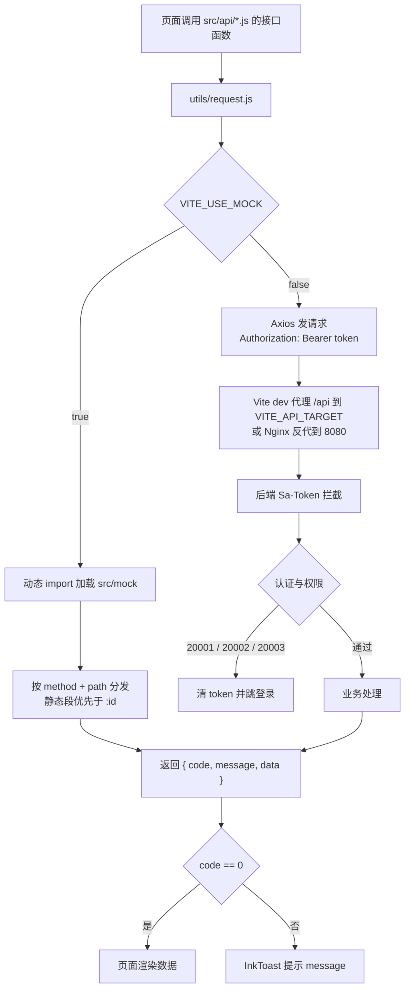

# 第四章 系统实现

> **本章写作约定**：本章给出系统的工程实现、模块实现、安全实现、前端实现、
> 演示数据实现与部署实现。所有实现描述均以仓库中**实际存在的代码、脚本与实测输出**为准，
> 每条结论后标注 `文件:行` 出处或实测命令。
>
> **数据口径提示（本章尤其重要）**：`sql/07` 口径 **1500 学生 / 386 活动 / 10719 报名 / 19319.3 小时**；
> 叠加 `sql/12` 后的**当前库中值** **1503 学生 / 389 活动**（报名与时长不变）；
> 前端 mock 口径 **12,480 报名 / 86,420 小时**（**不是真库数字**）。三者不可混用。

---

## 4.1 引言

### 4.1.1 实现工作的组织方式

项目由三人小组完成，实现阶段按开发计划书的第五至第八阶段推进
（`docs/高校志愿服务时长认证与公益画像数据分析系统_开发计划与分工.md:597-808`）。
为了让三人能真正并行，实现工作按**互不重叠的模块边界**切分：

| 批次 | 内容 | 并行方式 |
|---|---|---|
| 基础设施 | `vcp-common` + `vcp-framework` | 单人主导，是后续一切的前提 |
| 基础业务 | `vcp-system` → `vcp-org` | 串行（后者依赖前者定义的端口） |
| 核心业务 | `vcp-volunteer` / `vcp-certification` / `vcp-portrait` / `vcp-analytics` | **5 路并行**，一次性落地（`docs/后端进展与待办.md:227-229`） |
| 缺陷修复 | `vcp-certification` 与 `vcp-system` 两个模块 | 按**互不重叠的模块**切给两个并行子任务（同上 `:428-429`） |

> **为什么"按模块切"而不是"按功能切"**：模块之间的依赖规则是硬约束
> （`CLAUDE.md:87-89`），按模块切可以保证两个并行任务**不会改到同一个文件**。
> 这条经验在 `docs/后端进展与待办.md:429` 被明确写出。

### 4.1.2 实现规模的实测统计

| 项 | 数量 | 出处 |
|---|---|---|
| Maven 模块 | **11 个**（`mvn package` 全过） | `CLAUDE.md:72-85` |
| 数据库表 | **16 张** | `sql/02_schema.sql:3` |
| 数据库脚本 | **12 个**（含 1 个只读自检） | `sql/` 目录 |
| 后端接口 | **60 条路径 / 73 个「方法 + 路径」**（2026-09-26 实测；2026-09-24 为 59 / 72） | `docs/测试报告.md:16` |
| 前端页面 | **29 个** | `docs/前端进展与待办.md:34` |
| 前端接口调用 | **71 个**（2026-09-26 实测；2026-09-24 为 70） | `docs/测试报告.md:16` |
| 前端手写组件 | **21 个** | `docs/前端进展与待办.md:68-76` |
| ECharts 图表 | **13 个** | 同上 `:78-84` |
| mock 接口 | **60+ 个** | 同上 `:91` |
| 后端单元测试 | **0 个**（9 个模块 `src/test` 全为空目录） | `docs/测试报告.md:214` |

---

## 4.2 开发环境与工程结构

### 4.2.1 开发环境

| 项 | 版本 | 说明 |
|---|---|---|
| JDK | **21** | Boot 4 要求 21 |
| Maven | 3.9.16 | 镜像已配 `aliyun-public`（`mirrorOf: central`） |
| Node.js | `^22.18.0 \|\| >=24.12.0` | 只在构建机需要 |
| PostgreSQL | **18.6**（云库） | 库名 `volunteer_cert_portrait` |
| 开发机 | Windows + PowerShell | 项目全程在 Windows 上开发 |

出处：`docs/部署文档.md:37-42`、`:325-328`。

**开发环境的三个实测坑**（`docs/部署文档.md:44-55`、`:323-328`）：

1. **开发机 `JAVA_HOME` 指向 JDK 17**，而项目要 21（JDK 21 另装在 `C:\Apps\java\jdk-21.0.9+10`）。
   `deploy/vcp.service` 里 `ExecStart` 写绝对路径 `/usr/bin/java`，就是为了不吃 PATH 的亏。
2. **本机原先 `~/.m2` 下没有生效的 mirror**，构建时 Maven Central 返回 403；
   现已创建 `settings.xml` 配阿里云镜像，此后 `mvn -B package -DskipTests` 11 个模块 BUILD SUCCESS。
3. **沙箱里跑 Maven 需设** `MAVEN_OPTS=-Duser.home=<家目录> -Dmaven.repo.local=<本地仓库>`
   （`docs/后端进展与待办.md:418`）。

**本机没有 `psql`**：执行 SQL 用 JDBC 单文件程序，靠 `preferQueryMode=simple`
让 PostgreSQL 自己解析多语句，`DO $$...$$` 里的分号不会被切坏
（`docs/后端进展与待办.md:411-412`）。

### 4.2.2 后端工程结构（11 个模块）

```text
volunteer-cert-portrait-server/              # 聚合工程（父 POM，packaging=pom，管理版本）
├── pom.xml                                  # <java.version>21</java.version>
├── vcp-dependencies/                        # 独立 BOM（不继承聚合根，见踩坑）
├── vcp-common/                              # 公共基础模块（无业务依赖）
├── vcp-framework/                           # 框架基础设施模块
├── vcp-system/                              # 系统域（8 张表）
├── vcp-org/                                 # 志愿组织域（1 张表）
├── vcp-volunteer/                           # 志愿服务活动域（4 张表）
├── vcp-certification/                       # 时长认证域（2 张表）
├── vcp-portrait/                            # 公益画像域（1 张表）
├── vcp-analytics/                           # 数据分析域（只读聚合，无独立表）
└── vcp-boot/                                # 启动模块（唯一可执行 jar）
```

**唯一可执行产物**：`vcp-boot/target/vcp-boot-1.0.0.jar`（约 42 MB fat jar）
（`docs/部署文档.md:102`）。

**`vcp-dependencies` 不得声明 `parent` 为聚合根**：否则与聚合根的
`dependencyManagement` BOM 导入形成**循环**，Maven 直接拒绝读取整个工程。
pom 里已有注释说明，别"顺手补回去"（`CLAUDE.md` 踩坑第 1 条）。

### 4.2.3 前端工程结构

```text
volunteer-cert-portrait-web/
├── public/
├── scripts/verify-mock-data.mjs      # mock 数据自洽断言（31 项）
├── src/
│   ├── api/                          # 接口层（8 个文件 / 71 个调用）
│   ├── assets/
│   ├── components/                   # 21 个手写组件
│   │   ├── charts/                   # echarts.js（按需注册）+ options.js（13 个图表配置）
│   │   └── biz/                      # ChangePasswordDialog 等业务组件
│   ├── mock/                         # 本地 mock 层（60+ 接口，按 method + path 分发）
│   ├── router/                       # 三套布局的路由与守卫
│   ├── stores/                       # user（token/角色/权限）、dict
│   ├── styles/                       # tokens.css → base.css → ink.css
│   ├── utils/request.js              # Axios 封装 + mock 分流
│   └── views/                        # 29 个页面
├── .env.development / .env.production
├── package.json
└── vite.config.js
```

**接口层文件与调用数（实测，2026-09-26）**：

| 文件 | 导出接口数 |
|---|---|
| `api/system.js` | 20 |
| `api/volunteer.js` | **19**（原 18，B24 新增 `listMyAttendance`） |
| `api/analytics.js` | 10 |
| `api/auth.js` | 7 |
| `api/certification.js` | 6 |
| `api/org.js` | 4 |
| `api/portrait.js` | 4 |
| `api/attachment.js` | 1 |
| **合计** | **71**（2026-09-24 为 70） |

### 4.2.4 数据库脚本组织

12 个脚本按编号顺序执行，**完整顺序（整链实测约 16 秒）**：

```text
02 → 03 → 04 → 05 → 06 → 07 → 10 → 11 → 12，最后只读跑 09 复验
```

（`01_create_database.sql` 必须**单独执行**，`08` 仅老库需要 —— 见 2.5.7 节。）

**脚本设计的一条硬规则**：所有补列脚本都是
`ADD COLUMN IF NOT EXISTS` + `ON CONFLICT DO NOTHING`，
**只做加法、可重复执行**（`docs/后端进展与待办.md:179`）。

**`04_demo_data.sql` 是多语句隐式事务**：任何一条失败会**整批回滚**（不是"少几条数据"）。
改完务必实跑验证（`CLAUDE.md` 踩坑第 8 条）。

---

## 4.3 基础设施实现

### 4.3.1 `vcp-common` —— 公共基础模块

| 内容 | 说明 |
|---|---|
| `R<T>` 统一返回 | 只有 `code` / `message` / `data` 三个字段，成功 `code = 0` |
| `PageResult` | 分页统一 `{ total, list }` |
| `BaseEntity` | 公共字段基类（`create_time` / `update_time` / `deleted`） |
| 错误码体系 | 1xxxx 通用 / 2xxxx 认证权限 / 3xxxx 活动报名 / 4xxxx 时长认证 / 5xxxx 画像统计 |
| 状态枚举 | **10 个**状态枚举 |
| 工具类 | 字符串 / 时间 / 校验等 |

出处：`docs/待办清单.md:923-926`、`docs/知识库已确认项目选题与技术背景.md:155-162`。

> ⚠️ **`R<T>` 只有三个字段，不要给它加 `isXxx()` 之类的方法** ——
> Jackson 会把它当 JavaBean 属性序列化，导致**每个**接口响应都多一个字段
> （曾出现 `"success":false` 混进所有响应）。判断成功用 `code == R.SUCCESS`。
> 出处：`CLAUDE.md` 踩坑第 16 条。

**`vcp-common` 的依赖约束**：**无业务依赖**（`docs/知识库已确认项目选题与技术背景.md:119`），
是所有模块的公共底座（`业务模块 → vcp-framework → vcp-common`）。

### 4.3.2 `vcp-framework` —— 框架基础设施模块

| 包 | 内容 |
|---|---|
| `config/` | WebMvc、Jackson、MyBatis-Plus（分页插件）、跨域 |
| `security/` | Sa-Token 配置、`StpInterface` 权限实现、登录拦截器 |
| `context/` | 登录用户上下文（`LoginUser`、`SecurityUtils`、`AuthUtils`） |
| `web/` | 全局异常处理、请求日志过滤器、响应包装 |
| `mybatis/` | 字段自动填充（`create_time` 等）、逻辑删除 |
| `log/` | 操作日志注解 `@OperationLog` + AOP 切面 |
| `util/` | `PasswordUtils`（BCrypt） |

出处：`docs/知识库已确认项目选题与技术背景.md:164-171`、`docs/待办清单.md:924-925`。

**实测验证（基础设施批次）**：编译打包通过、应用启动成功（**3.3 秒**）、
`/doc.html` 与 `/v3/api-docs` 返回 200、未登录访问返回 `20001`
（`docs/待办清单.md:926`）。

#### 4.3.2.1 权限数据源的实现

```java
// volunteer-cert-portrait-server/vcp-framework/src/main/java/com/vcp/framework/security/StpInterfaceImpl.java:39-75
private static final Map<String, List<String>> ROLE_PERMS = Map.of(
        RoleCodeEnum.STUDENT.getCode(), List.of(/* 5 条 */),
        RoleCodeEnum.ORG_ADMIN.getCode(), List.of(/* 7 条 */),
        RoleCodeEnum.SCHOOL_ADMIN.getCode(), List.of(/* 17 条 */)
);
```

**三个实现要点**：

1. **`getPermissionList` 从会话读 `roleCode` 再查静态表**；
   取不到角色（会话缺失或角色码未写入）时**返回空集合，即不授予任何权限
   —— 宁可拒绝也不放行**（`StpInterfaceImpl.java:96-97`、`:104-110`）。
2. **刻意不走 `StpUtil.getRoleList(loginId)`**：那条路径会回调本类的 `getRoleList`，
   **形成无限递归**；角色码在登录成功时由登录接口写入会话
   （`StpInterfaceImpl.java:130-132`）。
3. **静态映射对外开放读取**：`getPermsByRoleCode(String)` 是 `public static`，
   因为角色管理页要展示每个角色的权限清单，而权限表在后端并不存在，
   这份静态映射就是**唯一事实来源**（`StpInterfaceImpl.java:77-91`）。

#### 4.3.2.2 全局异常与统一返回

- 全局异常处理器把业务异常与系统异常统一转成 `{code, message, data}` 外壳；
- **认证失败码 `20001/20002/20003` 前端命中即清 token 并跳登录**
  （`docs/前端进展与待办.md:90`）；
- **越权与数据范围外返回"不存在"**（`30001`/`30008`/`30011`），不复用 `20003`
  （`docs/后端进展与待办.md:263`）。

#### 4.3.2.3 ORM 配置与两个实测坑

| 配置 | 内容 | 坑 |
|---|---|---|
| 主键策略 | `id-type: auto`（对应 `BIGSERIAL`） | 配成默认的 `assign_id`（雪花 ID）会**绕过序列**并与脚本显式写入的初始 id 冲突（`sql/README.md:156-158`） |
| 分页插件 | `PaginationInnerInterceptor` | 类文件在 `mybatis-plus-jsqlparser` jar 里，包路径却是 `com.baomidou.mybatisplus.extension.plugins.inner`；`DbType` 常量是 **`POSTGRE_SQL`**（带下划线）（`CLAUDE.md` 踩坑第 12 条） |
| 字段自动填充 | `create_time` / `update_time` | — |
| 逻辑删除 | `deleted SMALLINT` | 仅业务数据表使用 |
| `returnInstanceForEmptyRow` | **保持默认 false** | 一行所有映射列都是 NULL 时这一行不返回对象而是塞 `null` —— 因此**投影查询至少要带一个恒非空列**（`CLAUDE.md` 踩坑第 18 条） |

#### 4.3.2.4 操作日志切面

- 注解 `@OperationLog(module, action, params, ...)` + AOP 切面写入 `operation_log`；
- **四类口令相关操作 `params = false`**：登录 / 注册 / 本人改密 / 管理员重置，
  避免明文口令被序列化进库永久留存；2026-09-24 实测确认这四类日志的 `params` 均为空
  （`docs/后端进展与待办.md:165-167`）。
- **已知缺口**：注解**缺 `target` 属性**，导致"操作对象"列恒空
  （`docs/测试报告.md:212`）。
- 实测日志落库：`operation_log` 留下 `module = 用户与权限` / `action = 启停学院` /
  `result = FAIL` 一行，证明 `@OperationLog` 生效
  （`docs/后端进展与待办.md:488`）。

#### 4.3.2.5 接口文档（Knife4j Next）

- 坐标 groupId 是 `com.baizhukui`（**不是** `com.github.xiaoymin`）（`CLAUDE.md:33`）；
- **`knife4j.enable` 默认为 `false` 且没有 `matchIfMissing`** ——
  不显式开启则增强能力静默失效，但 `/doc.html` 仍能打开，**极易误判为已接好**
  （`CLAUDE.md` 踩坑第 4 条）；
- 该开关**兼任"文档路径是否免登录"的总开关**（`CLAUDE.md` 踩坑第 5 条）：
  Sa-Token 拦截器覆盖 `/**` 后，`/doc.html`、`/webjars/**`、`/v3/api-docs/**`、`/knife4j/**`
  四个路径跟随 `knife4j.enable` 联动（实现在 `SaTokenConfig.DOC_EXCLUDE_PATHS`）。

### 4.3.3 跨域实现

```java
// vcp-framework 的 WebMvcConfig
// 开发态：allowedOriginPatterns("*") + allowCredentials(true)
// ⚠️ 不能用 allowedOrigins("*") 配 allowCredentials(true) —— Spring 的
//    validateAllowCredentials() 禁止该组合，会直接抛异常
// ⚠️ allowedHeaders 要放开 Content-Type（前端固定发 JSON）
```

出处：`CLAUDE.md` 踩坑第 13 条、`docs/下一步待办.md:221`。

生产态由 `application-prod.yml` 把 `allowed-origin-patterns` 由 `*` 收紧为白名单
（`docs/部署文档.md:188`）。

---

## 4.4 业务模块实现

### 4.4.1 `vcp-system` —— 系统域

**代码规模**：entity 8 / mapper 8 / dto 10 / vo 8 / service 接口 6 + 实现 7 / controller 7 /
事件监听器 1（`docs/后端进展与待办.md:138`）。

**接口清单**：见 3.7.3 节（`docs/后端进展与待办.md:142-156`）。

**七个刻意的实现取舍**（`docs/后端进展与待办.md:158-172`）：

| # | 取舍 | 理由 |
|---|---|---|
| 1 | **`sys_dict` 必须返回 `tone`** | 前端 `stores/dict.js` 的 `load()` 是**整体替换**语义，接口不返回 `tone` 会把所有状态标签刷成灰色 —— "不报错但页面全变样"的典型静默失效 |
| 2 | **通知按收件人一行存，用 `batch_no` 串批次** | `is_read` 天然是按人记的；删除时只有自己那一行的 id，不按批次整批删就会"删了但学生端还在" |
| 3 | **`operation_log` 不存 `role` 列** | 由 `user_id` 实时关联推导，冗余存一列在角色调整后会失真 |
| 4 | **四类口令操作不采集参数** | 请求体里是明文口令 |
| 5 | **停用 / 删除自己会被拒绝** | 管理员一旦把自己停掉，登录接口会以 `20002` 拒绝，而恢复又需要登录，**等于系统再也进不去** |
| 6 | **越权访问别人的通知报 `10004` 而不是 `20003`** | 报"无权限"等于确认这条通知存在 |
| 7 | **时间字段在服务端格式化成字符串** | 日志页与通知页直接渲染 `{{ row.time }}` / `{{ row.date }}`，返回 `LocalDateTime` 会带上 ISO 的 `T` |

**学生建档的实现（P1 缺陷的修复）**：

```text
StudentArchiveRegistrar.ensureArchive(userId, college)
  ├─ 入口一：AuthServiceImpl.java:208（学生注册）
  └─ 入口二：UserServiceImpl.java:166（管理员新增用户，仅学生角色）
```

- 与账号插入**同一事务**；
- 占位学号 **`S` + 六位零填充 userId**（如 `S001513`）；
- `total_duration` 写 0；`public_welfare_level` **留空**（由画像重算补写，
  这样 `vcp-system` **不必反向依赖** `vcp-portrait`）；**不建 `student_profile`**；
- 幂等：先按 `user_id` 查，并发撞唯一约束时捕获 `DuplicateKeyException` 转可读文案
  （catch 里**刻意不回查**：PostgreSQL 事务此时已 aborted，回查必然失败）。

出处：`docs/后端进展与待办.md:434`、`:436-440`。

**学院链路的实现**：

- 学院即 `sys_dict` 里 `dict_type = 'college'` 的字典行；
- 管理端 4 个接口（`CollegeController`），全部挂 `system:college:manage`；
- **学院校验收敛到 `DictService.containsEnabled(dictType, key)` 一处**，
  注册（`AuthServiceImpl`）与管理员新增用户（`UserServiceImpl`）两条写路径**共用**，
  失败文案逐字一致（"请选择学院"）——
  原先注册那份私有 `isCollegeInDict` 已删，免得两边慢慢漂移出"注册能选、管理端不能选"
  （`docs/后端进展与待办.md:475-476`）；
- **`sort` 留空或 ≤ 0 时取现有最大 `sort` + 1**（**不用行数 + 1** ——
  删过学院后行数与最大 `sort` 会脱节，补位会插到列表中间）（同上 `:461`）；
- **启停刻意不校验占用**：学院合并 / 停招时硬删会被占用校验挡住，
  只能靠停用让它从注册页下拉里消失（同上 `:462`）；
- 组织数经 `OrgCollegeCountPort` 端口由 `vcp-org` 统计，
  调用方用 `ObjectProvider.getIfAvailable()` 取，取不到或查询失败时按 0
  （缺这一列只影响展示，不该让整个列表页打不开）（同上 `:468`）。

**实测验证**：本机启动后跑了 **42 项端到端断言，全部通过** ——
覆盖登录 / 注册 / 退出、三类角色登录、按角色筛选用户、字典分组、日志落库与中文模块筛选、
公告群发与整批删除、学生越权被拒 `20003`、停用账号登录 `20002`、退出后 token 失效 `20001`、
逻辑删除后列表不可见等（`docs/后端进展与待办.md:174-176`）。

### 4.4.2 `vcp-org` —— 志愿组织域

**代码规模**：entity 1 / mapper 1 / dto 4 / vo 1 / service 接口 1 + 实现 2 / controller 1
（`docs/后端进展与待办.md:193`）。

**接口清单**：5 条，见 3.7.3 节（同上 `:197-203`）。

**四个实现取舍**（`docs/后端进展与待办.md:205-216`）：

| # | 取舍 | 理由 |
|---|---|---|
| 1 | **`DISABLED` 与 `REJECTED` 分离** | 停用不改变资质结论，历史活动与时长数据继续保留；只有已通过审核的组织允许启停 |
| 2 | **登录归属用端口接回** | `vcp-system` 定义 `OrgLookupPort`，`vcp-org` 提供实现；组织管理员登录后会话写入 `orgId`，**前端组织端页面不再只能回退到 id 1** |
| 3 | **审核结果通知负责人** | 新增单用户通知方法，**不复用群发公告逻辑**；审核通过/驳回各落一条系统通知，驳回理由写入正文 |
| 4 | **组织资料更新不带状态字段** | 状态、负责人账号、审核备注只能走对应接口，避免资料维护绕开状态机 |

**聚合指标的预留**：`OrgMetricsPort` —— `vcp-org` 不直接访问活动与认证表；
后续统计模块实现该端口后可填活动场次、签到率、通过率，**未实现时返回 0**
（`docs/后端进展与待办.md:215-216`）。

**实测验证**：11 个 Maven 模块 `package` 全部通过；启动后实测 8 个组织分页返回、
组织管理员登录得到 `orgId=1`、组织管理员读取与更新本组织成功、学生读取/更新返回 `20003`、
启停往返后状态恢复 `APPROVED`、非法审核动作返回 `10001` 且状态保持 `PENDING`
（`docs/后端进展与待办.md:222-225`）。

### 4.4.3 `vcp-volunteer` —— 活动与报名域

**代码规模**：**52 个文件**（含 4 个 Mapper XML），是最大的业务模块
（`docs/后端进展与待办.md:232`）。

**接口**：**19 个**（B24 于 2026-09-26 新增 `GET /api/v1/attendance/mine`，
原为 18 个），覆盖 `/activities`、`/categories`、`/signups`、`/attendance`
（`docs/测试报告.md:16`；模块级数值见附录 A.2）。

**四个实现要点**：

1. **报名占名额的原子实现（A3）**：

   ```sql
   UPDATE volunteer_activity
      SET signed_count = signed_count + 1
    WHERE id = ?
      AND signed_count < max_count;
   -- 影响行数 = 0 → 「已满」，返回 30006
   ```

   不做"先查再写"（存在 TOCTOU 窗口），也不用行锁（表里没有 `version` 列）
   （`docs/待办清单.md:202-205`）。

2. **签到窗口与惰性判定（A2）**：30 分钟为可调常量，
   **集中定义在 `vcp-volunteer` 的常量类里**（`docs/待办清单.md:200`）。
   窗口外签到返回 `10001 签到尚未开放，活动开始前 30 分钟才可签到`
   （`docs/测试报告.md:70-71`）。

3. **签到接口的学生身份定位**：`POST /api/v1/attendance/sign-in` 按**会话里的 `studentId`**
   定位本人，与 `StudentIdentityUtils` 的越权防护一致 ——
   因此用组织管理员 token 调用返回 `10003`
   （`docs/测试报告.md:72-73`）。

4. **数据范围一律以登录态为准**：**忽略前端传的 `studentId` / `orgId`**
   （`docs/后端进展与待办.md:262`）。

**活动图片上传的实现**（`docs/后端进展与待办.md:498-514`）：

| 项 | 实现 |
|---|---|
| 上传接口 | `POST /api/v1/attachments/images`，`multipart/form-data` 字段名 `file` |
| 文件目录 | 开发环境 `volunteer-cert-portrait-server/uploads/activities/年/月/UUID.jpg\|png`；演示图片固定放在 `uploads/demo/activities/` |
| 数据库 | `attachment` 保存 `biz_type=ACTIVITY`、`biz_id`、`file_url`、`file_size`、`content_type`、`caption`、`sort_order`；`volunteer_activity.cover` 保存封面 URL |
| 校验 | 仅 JPG/PNG，单张 ≤ 5MB；Java `ImageIO` 识别**真实格式**并限制最大像素；文件名由**服务端生成**，不采用客户端原始路径 |
| 权限 | `volunteer:activity:create` **或** `volunteer:activity:update` |
| 静态访问 | `/uploads/**` 由后端资源映射提供，Sa-Token 放行，带 `X-Content-Type-Options: nosniff` |
| 事务 | 活动保存失败会回滚 `attachment` 记录；**文件系统不在数据库事务内** → 旧文件不自动删除（已知限制） |

**实测**：组织管理员完整走通"上传 → 创建活动 → 详情返回封面和图片"；
学校管理员上传返回 `code=0`；`/uploads/demo/activities/*.png` 返回 200 且带 `nosniff`
（`docs/后端进展与待办.md:523-526`）。

### 4.4.4 `vcp-certification` —— 时长认证域

**代码规模**：**24 个文件**（`docs/后端进展与待办.md:232`）。
**接口**：**6 个**（`/durations`、`/duration-audits`）（同上 `:240`）。

**核心实现：时长反查报名的条件（P0 缺陷的修复点）**

```java
// DurationRefMapper.java:176 —— 反查 SQL 增加报名状态过滤
AND status IN ('APPROVED','COMPLETED')
```

**缺陷与后果**（`docs/测试报告.md:181-183`）：

> 原实现 `selectSignupId` **只过滤 `deleted = 0`**，而取消报名/驳回只改 `status`
> 不做逻辑删除（A7），于是"待审核 / 已驳回 / 已取消"的报名也能反查成功 →
> 组织端可提交时长 → 学校审核通过后**直接累加 `student_info.total_duration`**，
> 且**没有撤销接口**。

**修复内容**（同上 `:174-175`）：

- 反查 SQL 增加 `AND status IN ('APPROVED','COMPLETED')`；
- 并**纠正了该处 javadoc 里"取消 = 软删除"的错误前提**；
- 提交失败文案改为点明"报名未通过审核"：
  `DurationServiceImpl.java:158-163` 的
  `30008 该学生在此活动下的报名未通过审核（可能为待审核、已驳回、已取消，或该学生未报名）`，
  错误码 `SIGNUP_NOT_FOUND(30008)` 不变。

> **这条修复最值得写进论文的地方**：错误前提写在 javadoc 里 ——
> 代码注释里的一句"取消 = 软删除"与 A7 的实际实现相反，
> 这种"注释与实现不符"是**静态阅读发现不了的**，必须靠端到端实测。

**审核通过时的累计时长写入（A5）**：更新 `student_info.total_duration`
（`student_profile` 只是快照）。实测学生累计时长由 **0.0 变为 2.5**
（`docs/测试报告.md:90`）。

**审核流水**：每次提交/审核动作往 `duration_audit` 追加一行，
`action` 取 `SUBMIT` / `APPROVE` / `REJECT`（`sql/02_schema.sql:445-448`）。

**实测**：组织端提交时长成功（`code=0`）；学校端能看到待审记录（`hours=2.5`）并审核通过；
重复提交被拒（`10001 该学生此活动的服务时长已通过审核，无法重复提交`）
（`docs/测试报告.md:89-91`）。

### 4.4.5 `vcp-portrait` —— 公益画像域

**代码规模**：**21 个文件**（`docs/后端进展与待办.md:233`）。
**接口**：**5 个**（`/portraits`、`/portraits/me`、`/portraits/distribution`）（同上 `:241`）。

**核心实现**：

| 内容 | 实现位置/口径 | 出处 |
|---|---|---|
| 等级计算 | `PublicWelfareLevelEnum.of()`，输入 `student_info.total_duration`，输出等级名写回 `student_info.public_welfare_level` | `docs/公益等级与标签规则方案.md:164` |
| 枚举兼容 | **同时识别中文名与英文码**；VO 里一并返回 `levelCode` | `docs/后端进展与待办.md:270-272` |
| 标签计算 | 聚合 `activity_signup`（`status='COMPLETED'`）+ `volunteer_activity` + `activity_category`，写回 `student_profile.tags` | `docs/公益等级与标签规则方案.md:165` |
| 分类→标签映射 | `PortraitTagEnum.byCategoryCode`（**按 `code` 映射**，中文名只作兜底） | `docs/待办清单.md:289` |
| 手动重算 | `POST /api/v1/portraits/recompute`，**只写真正变化的行** | `docs/测试报告.md:97-98` |

**`distribution` 接口的实现踩坑与修法**（`docs/后端进展与待办.md:253-258`）：

- **现象**：首轮抛 NPE（`code=10000`）；
- **根因**：`.select(StudentProfile::getTags)` **只投影一列**，而 `student_profile`
  有 2 行 `tags` 为 NULL（31 行里），MyBatis 的 `returnInstanceForEmptyRow` 默认为 false，
  于是 `selectList` 返回 31 个元素、其中 **2 个是 `null`**，for 循环直接 NPE；
- **修法**：改为 `GROUP BY tags` + `COUNT(*)` **聚合下推**，并顺带修掉同源的
  `selectActivitySpan`（无已完成活动的学生会返回 `null` 而非空对象）；
- **规矩**（`CLAUDE.md` 踩坑第 18 条）：**任何投影查询至少要带一个恒非空列**
  —— 主键、外键或 `COUNT(*)`；**别去开全局的 `return-instance-for-empty-row`**。

**实测**：

| 接口 | 结果 | 出处 |
|---|---|---|
| `GET /portraits/me`（student） | `activityCount` 9、`totalHours` 22.6、`level` 四星志愿者、`levelCode` `FOUR_STAR`、3 个标签 | `docs/后端进展与待办.md:377` |
| `POST /portraits/recompute` | `scanned=1503, updated=3` | `docs/测试报告.md:97` |
| 重算后新学生等级 | 自动补写为"普通志愿者"（2.5 小时落在 `<3` 档） | 同上 `:89-90` |
| `GET /portraits/distribution` | 返回 **8 类**标签分布 | `docs/后端进展与待办.md:305-307` |

### 4.4.6 `vcp-analytics` —— 数据分析域

**代码规模**：**21 个文件**（`docs/后端进展与待办.md:233`）。
**接口**：**10 个**（`/analytics/*`）（同上 `:242`）。

**核心架构取舍**：**直接只读跨域表** —— 一次看板跨 **8 张表**，
走各域 Service 会退化成"查明细再内存聚合"，取舍写在 `AnalyticsMapper` 类注释里
（`docs/后端进展与待办.md:268-269`）。

**接口权限的一处刻意设计**：`/dashboard` **仅需登录**，刻意**不挂**
`analytics:dashboard:view`，否则学生端与组织端会被打成 `20003`
（`docs/后端进展与待办.md:248-249`）。

**实测输出（`07` 口径，`docs/后端进展与待办.md:376`）**：

| 指标 | 实测值 |
|---|---|
| 活动总数 | 386 |
| 报名总数 | 10719 |
| 累计时长 | 19319.3 小时 |
| 签到率 | **90.1%** |
| 时长审核通过率 | **75.6%**（5614 通过 / 1115 待审 / 694 驳回） |
| 学院维度 | 5 个学院各约 300 人 |
| 画像标签 | 8 类 |
| 趋势 | 12 个月 |
| 热力图 | 签到热力图 |

**权限门禁的实测**：学生打 `GET /analytics/overview` **正确返回 `20003`**
（`docs/后端进展与待办.md:250`）。

### 4.4.7 六个模块的实测验收

**2026-09-23 的三角色冒烟**：用 `admin` / `org_admin` / `student` 三个账号**实打 20 个请求，
20 个全部符合预期、日志零异常**（`docs/后端进展与待办.md:246`）：

| 请求 | 结果 |
|---|---|
| `GET /analytics/dashboard` 三个角色 | 都通（刻意不挂权限码） |
| 学生打 `GET /analytics/overview` | `20003`（权限门禁生效） |
| `GET /portraits` | `total=31` |
| `GET /durations` | `total=69` |
| `GET /activities` | `total=20` |
| `GET /signups` | `total=33` |
| `GET /attendance` | `total=11` |

**2026-09-25 整库重建后的三角色冒烟**：`/activities` 389、
`/analytics/dashboard` 报名 10719 / 时长 19319.3 / 签到率 90.1%
（`CLAUDE.md` 当前进度一节）。

---

## 4.5 安全实现

### 4.5.1 口令加密（B15）

**实现**：

```text
vcp-framework/pom.xml                       → 加 spring-security-crypto
                                              （版本由 Boot BOM 的 spring-security.version 管）
vcp-framework/.../util/PasswordUtils.java   → BCrypt 强度 10
                                              encode / matches / isEncoded / checkPolicy
                                              策略：6–32 位
```

出处：`docs/下一步待办.md:189-191`。

**五处单一出口**：登录校验、注册写入、管理员新增用户、本人改密、管理员重置
（`docs/下一步待办.md:192`）。

**刻意不做明文兜底**：`matches` 对"库里还是明文"的行**一律返回 false** ——
**留兜底等于加密白做**（同上 `:193`）。

**种子数据同步换密文**：`sql/03`（三个账号）、`sql/04`（组织管理员与学生）、
`sql/07`（批量学生）；并新增 **`sql/08_password_bcrypt.sql`**
（老库增量刷密文，可重复执行，末尾自检残留数）（同上 `:194-195`）。

**实测**：云库实跑 `08` → **1509 个账号 100% 为 60 位 `$2a$10$` 密文、明文残留 0**；
后端用明文 `123456` 登录成功（**证明比对走的是 BCrypt 而非字符串相等**）
（同上 `:196-197`）。

### 4.5.2 登录失败锁定

**实现**：`vcp-system/.../service/impl/LoginAttemptGuard.java`，
内存 `ConcurrentHashMap`（`docs/下一步待办.md:178-179`）。

**规则**：连续 **5 次**失败锁 **15 分钟**、登录成功清零、15 分钟无新失败则计数作废
（同上 `:179`）。

**三个刻意的取舍**（同上 `:180-181`）：

1. **单实例内存实现、重启即清空**；
2. **不落表列也不上 Redis** —— 加表列要动 `sql/02` 与 ER 图，工程未引 Redis；
3. **对不存在的用户名同样计数** —— 否则"第 5 次会不会被锁"就成了账号是否存在的**探针**。

**顺序要求**：锁定判定排在**查库与口令校验之前** ——
否则锁定期间正确口令能登录，且两条路径耗时不同会变成**旁路信息**（同上 `:182`）。

**错误码**：`ACCOUNT_LOCKED(20004)`，文案带剩余分钟数（同上 `:183`）。

**实测**（云库真后端，同上 `:183-185`）：

| 场景 | 结果 |
|---|---|
| 第 5 次错口令 | `20004 账号已被锁定，请 15 分钟后再试` |
| 锁定期内用**正确**口令 | 仍返回 `20004` |
| 不存在的账号 `probe_nobody_xyz` 第 5 次 | 同样返回 `20004`（与真实账号表现一致） |
| `admin` / `student` | 不受影响，照常登录 |

**未做**：验证码 —— 本项目无图片验证码基础设施，锁定已覆盖脚本化爆破（同上 `:186`）。

### 4.5.3 改密与重置

| 场景 | 接口 | 会话处理 | 错误码 |
|---|---|---|---|
| 本人改密 | `PUT /api/v1/auth/password`，body `{oldPassword, newPassword}` | 校验旧口令；改完**踢掉该账号其它会话、保留当前会话** | `OLD_PASSWORD_ERROR(20005)` |
| 管理员重置 | `PUT /api/v1/system/users/{id}/password`，body `{password}` | 留空重置为默认 `123456`；重置后 `StpUtil.logout(id)` 踢掉该账号**全部**会话 | — |

出处：`docs/下一步待办.md:200-204`。

**两个设计理由**（同上）：

- 本人改密**保留当前会话** —— "免得用户以为改密失败"；
- 管理员重置**踢全部会话** —— "重置的典型场景就是口令外泄"。

**前端实现**：新增共享组件 `src/components/biz/ChangePasswordDialog.vue`，
入口**三处**：学生「个人中心 → 账号安全」、组织端/学校端控制台侧栏
（**这两个角色没有个人中心页，这是他们唯一的自助改密入口**）、
用户管理页操作列的「重置密码」（同上 `:205-207`）。

**实测（云库真后端，12 项断言全过）**（同上 `:208-210`）：

| 断言 | 结果 |
|---|---|
| 改密成功 → 当前 token 仍可用 | ✅ |
| 原口令错 → `20005` | ✅ |
| 新旧相同 → `10001` | ✅ |
| 新口令过短 → `10001` | ✅ |
| 旧口令登录 → `20001`、新口令登录 → `0` | ✅ |
| 双 token 场景下改密后 **A 死 B 活** | ✅ |
| 管理员重置后该账号全部 token 失效、默认口令可登录 | ✅ |
| 学生越权重置他人 → `20003` | ✅ |

**另核对 `operation_log`**：「修改密码」「重置密码」两类记录的 `params` **均为空，口令未落日志**
（同上 `:211`）。

**前端口令框的一处修复**：`UserManageView.vue:330` 初始口令输入框原是 `type="text"`，
**明文回显**在屏幕上 → 改成 `type="password"` + `autocomplete="new-password"`；
新增的「重置密码」弹窗同样用 `type="password"`（同上 `:212-215`）。

### 4.5.4 上线口径三处收紧与凭证管理

**`application-prod.yml`**（新增于 2026-09-24）（`docs/下一步待办.md:224-226`）：

| 收口项 | 开发态 | prod 态 | 对应代码位置 |
|---|---|---|---|
| CORS | `*` | 白名单（占位值 `https://vcp.example.edu.cn`，**部署前必改**） | `WebMvcConfig.java:47`、`:50` |
| 接口文档 | `knife4j.enable: true`，文档路径免登录 | `false`，文档路径**不再放行** | `SaTokenConfig.java:43`、`:45` + `application.yml:109` |
| SQL 日志 | `logging.level.com.vcp: debug` | `info` | `application.yml:115` |

**不激活 prod 时行为与改动前逐项一致**（默认值仍为 `*` / `enable: true` / `debug`）
（`docs/下一步待办.md:226`）。

**jar 内配置排除**：`vcp-boot/pom.xml` 已按父 pom 的两段式结构补 `<resources>`，
**精确排除 `application-local.yml`**（模板 `application-local.yml.example` 仍随第二段进 jar）；
构建后已核对 jar 内不再有该文件（`docs/下一步待办.md:218-219`）。

**凭证读取顺序**：`application.yml` 的 `spring.config.import` 已按序尝试四个位置，
部署场景用最后一条 `optional:file:./config/application-local.yml`，
配合 `WorkingDirectory=/opt/vcp` 即读 `/opt/vcp/config/application-local.yml`；
或用环境变量 `VCP_DB_USERNAME` / `VCP_DB_PASSWORD`（**优先级更高**）
（`docs/部署文档.md:122-146`）。

> ⚠️ **缺凭证不会启动失败**：`@ConfigurationProperties` 绑定对解析不了的占位符**不报错**，
> 会把它当普通字符串用，应用照常启动 —— 要到**第一次访问数据库**才以认证失败暴露。
> 所以"服务起来了但一登录就报错"时，第一件事是检查凭证文件在不在、口令对不对
> （`CLAUDE.md` 踩坑第 17 条、`docs/部署文档.md:151-153`）。

---

## 4.6 前端实现

### 4.6.1 手写组件库（21 个）

不引入任何第三方 UI 库，全部按水墨风手写（`docs/前端进展与待办.md:68-76`）：

| 类别 | 数量 | 组件 |
|---|---|---|
| 通用 | 14 | `InkButton`、`InkTable`、`InkPagination`、`InkDialog`、`InkConfirm`、`InkToast`、`InkField`、`InkStat`、`InkSection`、`InkEmpty`、`InkTabs`、`InkProgress`、`StatusTag`、`InkImageUploader` |
| 业务 | 6 | `ActivityCard`、`PortraitSeal`、`RankList`、`OrgList`、`NoticeList`、`ChangePasswordDialog` |
| 图表容器 | 1 | `InkChart` |

**刻意不做的薄包装组件**：`InkInput` / `InkSelect` / `InkTextarea` / `InkDate` ——
表单控件直接用全局的 `.ink-input` / `.ink-select` / `.ink-textarea` 类，
**CSS 已经是这一层的抽象，再包一层组件只是多一层间接**（同上 `:76`）。

### 4.6.2 设计系统与样式三层

**引入顺序不可颠倒**：`tokens.css`（令牌）→ `base.css`（reset/无障碍/容器）→ `ink.css`（组件类）。
**令牌层没先加载，后面的组件类会全部取不到 CSS 变量**（`CLAUDE.md` 前端踩坑第 6 条）。

**视觉约束**：零圆角、细墨线分隔而非卡片阴影、区块间距 88px、标题走衬线体、数据走等宽体
（`docs/前端进展与待办.md:57`）。

**移植方式**：从原型 `styles_12-chinese-ink.html` **逐条移植，不是"参考风格重做"** ——
原型类名 `.od-*` **机械重命名**为 `.ink-*`，CSS 规则本身逐条照搬
（含 `nth-child(3n)` 去右边框这类细节）（同上 `:52-55`）。

**图表内圆角是刻意保留的**：原型对柱状图用了 `borderRadius: [6,6,0,0]`，
与页面 UI 的"零圆角"看似矛盾，但**这是原型的刻意选择**
（页面 chrome 零圆角、图表内元素轻微圆角），已照搬并在代码注释与 README 中标注，
**不要"统一"掉**（同上 `:479-482`）。

### 4.6.3 图表层实现

```javascript
// src/components/charts/options.js —— 13 个图表配置，写成 (data) => option 的纯函数
// 配色通过 getComputedStyle 从 :root 读取 —— CSS 是配色的唯一数据源
```

**三个实现要点**（`docs/前端进展与待办.md:78-84`）：

1. `options.js` 把原型 `ODCharts` 的 **13 个图表**改写成 `(data) => option` 的**纯函数**；
2. 配色通过 `getComputedStyle` 从 `:root` 读取 —— **CSS 是配色的唯一数据源，改令牌图表跟着变**；
3. `InkChart.vue` 负责挂载、`ResizeObserver` 自适应、`onBeforeUnmount` 销毁。

**ECharts 按需注册**（`src/components/charts/echarts.js:27-43`）：
6 类图表 + 7 个组件 + `LabelLayout` + `CanvasRenderer`（清单见 2.4.5 节）。

> **约束**：新增图表类型必须在此处补注册，否则运行时**静默不渲染且不报错**
> （`echarts.js:4`）。

### 4.6.4 接口层与 mock 分流

**分流实现**（`docs/前端进展与待办.md:87-91`）：

```javascript
// src/utils/request.js
// VITE_USE_MOCK === true  → 动态 import('@/mock') 走本地 mock
// VITE_USE_MOCK === false → 真实 axios，经 /api 代理打到后端
```

**请求分流与权限处理的完整链路**：



**必须用动态 `import()` 的四条理由**（`CLAUDE.md` 前端踩坑第 10 条）：

1. 静态 import 会让**整套 mock**（数据集 + 60 多个 handler，**含演示账号明文口令**）
   **无条件打进产物**，连 `VITE_USE_MOCK=false` 的正式部署包也一样；
2. mock 模块顶层**有副作用**（`loadPersistedUsers()` 读写 `localStorage`），
   tree-shaking **证明不了它无副作用**，于是即使 `USE_MOCK` 被常量折叠成 `false` 也删不掉；
3. **这不会报错**：部署包里只是多带了 52 kB 用不到的假数据，**只有 grep 产物才看得出来**；
4. 实测：静态 import 时 `request` chunk **165.0 kB**；改动态后 **113.0 kB**，
   且 `VITE_USE_MOCK=false` 时**连 mock chunk 都不生成**（死分支连同动态 import 一起被消除）。

**改完必须两条路径都验**：mock 关 → `grep -rl "vcp_mock_extra_users" dist/` 应无输出；
mock 开 → 截图脚本要重跑（同上）。

**mock 数据自洽校验**：`scripts/verify-mock-data.mjs`（`npm run verify:mock`）
把模拟数据的隐性约束写成 **31 项断言**（18 → 21 → 24 → 28 → 31 逐步扩充）
（`docs/前端进展与待办.md:100-105`、`:37`）。

> **为什么必须有这个脚本**：mock 的聚合数字之间有**隐性约束**
> （如"学院时长合计 = 累计志愿时长 = 86,420"），改一个数很容易让不同页面显示的数字互相打架
> （`CLAUDE.md` 前端踩坑第 7 条）。

**mock 路由的一个实现约束**：**静态段必须排在 `:id` 之前** ——
`/v1/activities/org-overview` 会被 `/v1/activities/:id` 抢先匹配，
把 `org-overview` 当成 id；同类的还有 `/v1/portraits/me`、`/v1/portraits/distribution`
（`CLAUDE.md` 前端踩坑第 4 条）。

**mock 数据文件的一个实现约束**：`src/mock/data/dataset.js` 的 import 要带 `.js` 后缀 ——
该文件会被 `scripts/verify-mock-data.mjs` 用 **Node 直接加载**，
而 Node 的 ESM 解析器不像 Vite 那样自动补扩展名（`CLAUDE.md` 前端踩坑第 5 条）。

### 4.6.5 路由与权限实现

| 项 | 实现 | 出处 |
|---|---|---|
| 三套布局 | `/student/*`、`/org/*`、`/admin/*`，登录/注册用空白布局 | `docs/前端进展与待办.md:95` |
| 菜单派生 | 路由 `meta` 携带 `{ title, roles, menu, group }`，**侧边栏菜单从路由表派生**，避免菜单和路由两份定义不同步 | 同上 `:96` |
| 守卫流程 | 无 token → `/login`（带 redirect 回跳）；有 token 无用户信息 → 拉取；角色不符 → `/403` | 同上 `:97` |
| 按钮级权限 | `v-perm` 指令，不满足时**把元素移出 DOM**，而非隐藏 | 同上 `:98` |
| 权限数据源 | 前端 `stores/user.js` 的 `ROLE_PERMS` 与后端 `StpInterfaceImpl` **逐条对应**，改动需两边同时改 | `StpInterfaceImpl.java:24-27` |

**前端状态枚举按后端对齐的历史**（`docs/前端进展与待办.md:490-499`）：
核对 `sql/02_schema.sql` 的列注释与 `sql/03_init_data.sql` 的 `sys_dict` 种子数据后，
发现前端有 **3 处码值对不上**，**已按后端对齐**：

| 字典类型 | 前端原值 | 已改为（后端值） |
|---|---|---|
| `attendance_status` | `UNSIGNED` | `NOT_SIGNED` |
| `notification_type` | `SYSTEM`/`ACTIVITY`/`AUDIT` | `SIGNUP`/`DURATION`/`SYSTEM` |
| `audit_action` | 缺 `SUBMIT` | 补上 `SUBMIT` |

**一条 Vue 3.5 的实测坑**：模板解析器**只在属性值含分号时才按"多语句"解析** ——
换行分隔、没有分号的多语句内联处理器会报
`Error parsing JavaScript expression: Unexpected token, expected ","`，
**会让整个 `vite build` 失败**。多语句一律抽成具名函数再 `@click="fn"`
（`CLAUDE.md` 前端踩坑第 1 条）。

### 4.6.6 构建与拆包实现

```javascript
// volunteer-cert-portrait-web/vite.config.js:45-47
advancedChunks: {
  groups: [{ name: 'echarts', test: /node_modules[\\/]echarts/ }],
},
```

**Vite 8 底层是 Rolldown 的两条硬约束**（`CLAUDE.md` 前端踩坑第 8 条）：

1. **`manualChunks` 不能传对象** —— 传 `{ echarts: ['echarts'] }` 这种对象形式会
   **直接让整个构建失败**（`Invalid type: Expected Function but received Object`，
   随后 `TypeError: manualChunks is not a function`），**只接受函数**；
   本项目改用 Rolldown 原生的 `advancedChunks.groups`；
2. **正则匹配路径分隔符必须用 `[\\/]` 而不是 `/`** —— Windows 上模块 id 是反斜杠，
   写成 `/node_modules\/echarts/` 会**匹配不到**（rolldown 文档明确警告，本项目正是 Windows 开发）。

**别被构建警告误诊**（`CLAUDE.md` 前端踩坑第 9 条）：
实测（2026-09-24）**主 chunk 一直只有 ~57 kB**，`request` chunk ~164 kB；
**超 500 kB 的是懒加载的 ECharts chunk（~653 kB）**，
它**不在** `dist/index.html` 的 modulepreload 列表里，只在打开图表页时才下载。
历史文档写的"ECharts 使主 chunk 超过 500 kB"是**错的** ——
真正被熔在一起的是 `options.js` 的图表配置 + ECharts，
rolldown 给那个 chunk 起了个 `options` 的名字，容易让人误以为是主包。
已用 `advancedChunks` 把两者拆开：`echarts` **653 kB** + `options` **9.9 kB**。

**dev server 代理可配置**（`vite.config.js:51-67`、`docs/前端进展与待办.md:514-528`）：

- 导出改成函数式 `defineConfig(({ mode }) => {...})`，
  用 `loadEnv(mode, process.cwd(), '')` 读环境变量；
- target 取 `env.VITE_API_TARGET || 'http://127.0.0.1:8080'`；
- **两个坑**：① `vite.config.js` 里 **`process.env` 拿不到 `.env` 文件里的变量**，
  必须用 `loadEnv` 读（第三个参数传 `''` 是为了把 `VITE_` 前缀之外的变量也一并加载）；
  ② **`.env.local` 的优先级低于 `.env.development`**
  （加载顺序 `.env` → `.env.local` → `.env.[mode]` → `.env.[mode].local`），
  所以 `.env.local` 只适合补 `.env.development` 里没有的变量；
  要覆盖 `VITE_USE_MOCK` 这种已有值，得用 `.env.development.local`。

---

## 4.7 演示数据实现

### 4.7.1 演示数据脚本的设计

演示数据由 `sql/04_demo_data.sql`（小规模）与 `sql/07_demo_scale.sql`（全量放大）实现，
另有 `sql/10`（基础数据 + 测试账号 + 学院字典）与 `sql/12`（图文演示数据）。

**`sql/07` 的实现要点**（`docs/后端进展与待办.md:322-364`）：

| 内容 | 实现 |
|---|---|
| 规模 | 学生 1500 / 活动 386 / 报名 10719 / 累计 19319.3 小时 |
| 确定性 | 全部用取模等**确定性算法**，无 `random()` |
| 名额下限 | 新活动名额 **46..75**（公式 `46 + ((n.seq * 7) % 30)`），并补幂等修正语句 |
| 报名上限 | 第五节报名数上限 **45**（`16 + ((a.id * 7919) % 30)`） |
| 五星档补充 | 新增"十之二、把高活跃学生**定向**补进五星档"一节 |
| 幂等守卫 | 第十节与第十之二节挂 `should_scale` 守卫（`sql/07_demo_scale.sql:539`、`:623`） |
| 末尾自检 | **6 项 / 9 条断言** |

**`sql/07` 的末尾自检输出（2026-09-25 实跑，逐字）**（`docs/测试报告.md:304`）：

```text
[07 自检] 全部通过：学生 1500 人、活动 386 场、报名 10719 条、累计时长 19319.3 小时
（演示账号 22.6 小时 / 标签 热心志愿者,长期坚持型,大型活动型）
```

> **该脚本重跑第二遍时输出与第一遍逐字相同**，可作"演示数据是确定性算法、不是 `random()`"的实证
> （`docs/测试报告.md:305`）。

**演示账号 `student` 的画像**（学生档案 id=1，姓名 张同学）：
**22.6 小时、四星志愿者、9 场活动**，标签「热心志愿者,长期坚持型,大型活动型」
（`docs/后端进展与待办.md:358-359`）。

**其他回填结果**（同上 `:360-364`）：

- `org_info` 四字段全填：`code` `ORG001`–`ORG008`、`college`（5 个学院）、
  `founded_at` 2015–2018、`member_count` 97–282；
- `activity_signup.reason` 空值从 **149/149 降到 49/10719**；
- `activity_category.remark` 补列并回填 6 条；
- `signed_count > max_count` 的活动 **0 条**。

### 4.7.2 为什么会有两组真库口径

**这是本章必须讲清楚的一件事**，否则论文里的数字会自相矛盾。

| 口径 | 数字 | 来源 |
|---|---|---|
| `07` 口径 | 1500 学生 / 386 活动 / 10719 报名 / 19319.3 小时 | `sql/07_demo_scale.sql` **提交那一刻**的口径 |
| 叠加 `12` 后（**当前库中值**） | **1503 学生 / 389 活动** | `sql/12_activity_images_demo.sql` 在 `07` 之后**增量**补入 |

**差 3 的原因**（`docs/测试报告.md:297-298`）：

- 学生 +3 = `12` 新建的 **3 个图文演示学生**；
- 活动 +3 = `12` 新建的 **3 场带图活动（id 387/388/389）**；
- **报名 10719 不变** —— `12` **不造报名**；
- **累计时长 19319.3 不变** —— `12` **不造时长**。

**为什么 `12` 必须放在最后**（`CLAUDE.md` 踩坑第 20 条）：

> `12_activity_images_demo.sql` 要**放最后**：它给三场图文演示活动定的名额是 **20 / 35 / 18**，
> 先跑 `12` 再跑 `07` 的话，`07` 的"名额下限 < 46 一律抬到 46"回填会把这几个数改掉。

**`12` 的内容**（`docs/后端进展与待办.md:521`）：
**5 个演示账号 + 1 个组织 + 3 个已发布活动 + 3 张图片元数据**，增量可重复执行。

### 4.7.3 演示数据的口径边界（防止混用）

| 口径 | 数字 | 性质 | 用在哪里 |
|---|---|---|---|
| `07` | 1500 / 386 / 10719 / 19319.3 | 真实数据库 | 测试报告第 8 节的行数核对、`sql/07` 自检输出 |
| 叠加 `12` | **1503 / 389** / 10719 / 19319.3 | **真实数据库，当前库中值** | 接口实测（`/activities` 389、看板 389 场）、画像重算 `scanned=1503` |
| 前端 mock | 12,480 报名 / 86,420 小时 | **不是真库数字** | 只在讲"前端脱离后端独立演示"时提及 |

出处：`docs/测试报告.md:15`、`:293-301`、`docs/待办清单.md:847-849`、
`docs/前端进展与待办.md:137`。

> ⚠️ **答辩材料里的数字必须标明是哪一套**（`docs/待办清单.md:849`）。
> 实测现存 `dist/` 就是 **mock 口径**（**2026-09-26 复核**：88 个文件 / 1,127,351 B、
> 最新写入 2026-09-26 11:47、`dist/assets/` 里有 `mock-D_UiLGVV.js` ≈ 48 KB；
> `.env.production.local` 当前不存在、`.env.production` 的 `VITE_USE_MOCK=true`），
> 直接拿它截图会**串口径**（同上 `:850-851`）。
> **正式部署前需用 `.env.production.local` 覆盖 `VITE_USE_MOCK=false` 再构建。**

### 4.7.4 演示数据的还原与踩坑

**端到端测试会写入真实数据**，测试后用 `cleanup.sql` + `fix7.sql` 完全还原并复核
（`docs/测试报告.md:282-291`）：

| 指标 | 测试后还原值 | 文档口径 | 结论 |
|---|---|---|---|
| 学生档案 | 1500 | 1500 | ✅ |
| 活动 | 386 | 386 | ✅ |
| 报名 | 10,719 | 10,719 | ✅ |
| 累计时长 | 19,319.3 | 19,319.3 | ✅ |
| `sql/09` 20 项自检违规合计 | 0 | 0 | ✅ |

**还原过程中发现的机制问题**（`docs/测试报告.md:307-309`）：

> `volunteer_activity.signed_count` 是**应用层维护的派生列**，
> 直接用 SQL 删 `activity_signup` 行**不会回退它**，会让 `sql/09` 第 7 项报出不一致。
> 手工清理数据后**必须同步重算该列**（`fix7.sql` 已按第 7 项的口径写成通用语句）。

**`sql/07` 首次实跑暴露的三处脚本缺陷**（`docs/后端进展与待办.md:331-348`）：

| # | 缺陷 | 后果 | 修法 |
|---|---|---|---|
| 1 | `DATE '2015-01-01' + ((id * 137) % 2920)` 是 `date + bigint`，而 PostgreSQL **只有 `date + integer`** | **脚本第一条 UPDATE 就报错，整批回滚** | 改为 `(((id * 137) % 2920)::int)` |
| 2 | 报名上限 8..39 场 → 人均只参与 5.5 场、最高 9 场 ≈ 37.2 小时 | **"五星志愿者（≥40 小时）"一档恒为空**，末尾自检第 3 项必然失败 | 改为 16..45 场 |
| 3 | 只靠调大报名数补不出五星档 | 总报名会冲到约 3 万条，而前端原型只有 12,480 条 | 新增"定向补进五星档"一节 |

**第十之二节为什么必须"定向补"**（`docs/后端进展与待办.md:342-345`）：

> 一次报名要过三层折算（85% `COMPLETED` × 90% 非缺勤 × 75% 时长审核通过 ≈ **57%**）
> 才变成一条有效时长，每条约 4 小时，40 小时需要约 18 次报名；
> 改为对累计 32..40 小时的学生**定向补 4 场 ≥4 小时的活动**。

> **这三处缺陷的共同教训**：`sql/07` **入库后从未执行过**，一跑就暴露三处问题。
> 这印证了项目工作方式约定里的第一条 ——
> "数据相关改动**必须实跑验证**，不能只看静态检查 ——
> 曾出现'静态检查全过、真跑就整批回滚'的情况"（`CLAUDE.md` 工作方式约定）。

---

## 4.8 部署实现

### 4.8.1 部署产物与步骤

| 步骤 | 命令/产物 | 出处 |
|---|---|---|
| ① 数据库 | 按 `sql/README.md` 顺序导入 12 个脚本 | `docs/部署文档.md:71-85` |
| ② 后端打包 | `mvn -B package -DskipTests` → `vcp-boot/target/vcp-boot-1.0.0.jar`（约 42 MB fat jar） | 同上 `:99-103` |
| ③ 后端上传 | `/opt/vcp/` + `/opt/vcp/config/` + `/opt/vcp/uploads/`，属主 `vcp` | 同上 `:110-116` |
| ④ 后端配置 | `/opt/vcp/config/application-local.yml` 或环境变量（权限 600） | 同上 `:122-146` |
| ⑤ 限制监听 | `--server.address=127.0.0.1`（**推荐做**，否则 8080 直接暴露在网上） | 同上 `:159-172` |
| ⑥ 起服务 | `deploy/vcp.service` → systemd，设 `SPRING_PROFILES_ACTIVE=prod` | 同上 `:174-182` |
| ⑦ 前端构建 | `.env.production` 的 `VITE_USE_MOCK` 改成 `false` → `npm ci && npm run build` | 同上 `:203-214` |
| ⑧ 前端上传 | `dist/*` → `/var/www/vcp/` | 同上 `:229-235` |
| ⑨ Nginx | `deploy/nginx.conf` → `/etc/nginx/conf.d/vcp.conf`（**必改 `server_name` 与 `root`**）→ `nginx -t` → reload | 同上 `:242-249` |
| ⑩ 验收 | 按第七节 8 条清单逐条过 | 同上 `:261-274` |

### 4.8.2 部署实现中最容易犯的错

**构建前忘了把 `VITE_USE_MOCK` 改成 `false`**（`docs/部署文档.md:203-207`）：

> **这是整个部署流程最容易犯的错**，因为**它不报错**：
> `VITE_USE_MOCK=true` 的产物页面能正常打开、有数据、有图表，看起来一切正常 ——
> 只是**根本不请求后端**，数字是 mock 的（12,480 报名 / 86,420 小时），
> 与真库（10,719 / 19,319.3）不是同一套。**演示时和论文里的数字对不上。**

**自检命令**：

```bash
grep -rl "vcp_mock_extra_users\|chenshiyuan@example.edu" dist/   # 应当无输出
```

**另外两个"不写会出事"的 Nginx 配置**（`docs/部署文档.md:255-257`）：

| 配置 | 不写会怎样 |
|---|---|
| `try_files $uri $uri/ /index.html;` | **刷新任何深层页面都 404**（history 路由的命门） |
| `proxy_pass http://127.0.0.1:8080;`（**结尾不带斜杠**） | 带了斜杠会剥掉 `/api` 前缀，后端**一律 404** |

### 4.8.3 部署的现状（如实记录）

**文档与配置侧已完成，未实际部署**（`docs/待办清单.md:854-863`）。

**已有实跑证据的部分**（`docs/部署文档.md:299-310`、`:329-332`）：

- `VITE_USE_MOCK=false` 构建通过、产物不含 mock、`request` chunk 113.0 kB；
- `pom.xml` 要求 Java 21（`volunteer-cert-portrait-server/pom.xml:23`）；
- `application.yml` 未配 `server.address`（默认 `0.0.0.0`）；
- `application-prod.yml` 三处收口、且不激活则不生效；
- Flyway 关闭、后端无 `context-path`；
- **后端已在开发机上用云库真实凭证起过并端到端实测通过** ——
  所以"起 jar → 连库 → 打接口"这条链路**已有实跑证据**。

**仍未核实的部分**（同上 `:312-319`）：

| 结论 | 为什么没核实 |
|---|---|
| `nginx.conf` 的语法正确性 | **编写它的机器上没装 nginx**，无法 `nginx -t` |
| 起 jar + Nginx 反代的实际联调 | 本机没有数据库凭证（`application-local.yml` 不在）时起不了后端 |
| `vcp.service` 在 systemd 上的行为 | 没有 Linux 环境可试 |
| `--server.address=127.0.0.1` 的实际效果 | 未实跑 |

**仍剩的验收动作**：在一台**干净机器**上照文档走一遍 + Nginx 托管与 history 回退实测
（`docs/待办清单.md:862`）。

---

## 4.9 工程验证与实测证据

### 4.9.1 四类验证手段

| 手段 | 脚本/命令 | 覆盖内容 | 最近实测 |
|---|---|---|---|
| 构建 | `mvn -B package -DskipTests` | 11 个模块编译打包 | **BUILD SUCCESS**（2026-09-25 重新打包） |
| 数据一致性 | `sql/09_consistency_check.sql`（**只读**） | 20 项数据检查 | **检查项总数 20、违规合计 0** |
| 端到端闭环 | `.tmp-verify/verify.ps1` | 三角色登录、修复项、流程、异常抽样 | **PASS 30 / SKIP 2 / FAIL 0** |
| 学院链路 | `.tmp-verify/verify-college-admin.ps1`、`verify-college.ps1` | 学院管理 41 项 + 注册链路 11 项 | **PASS 41 / FAIL 0**；**11 项全过** |
| 前端工程 | `npm run lint` / `npm run build` / `npm run verify:mock` | 静态检查、生产构建、mock 自洽 | exit 0 / exit 0 / **31 项全过** |
| 浏览器走查 | `.tmp-verify/walk.cjs` | 真后端逐页点检 | **25 个角色页 × 2 视口 = 50 条记录，0 信号** |

出处：`docs/测试报告.md:11`、`:17`、`:26-28`、`:122`、`:130-138`、`:231-236`。

### 4.9.2 端到端脚本的实现（`verify.ps1`）

脚本的七个步骤（`.tmp-verify/verify.ps1`）：

| 步骤 | 内容 | 行号 |
|---|---|---|
| 1 | 三个角色登录（断言 token 与 `studentId` / `orgId`） | `:29-38` |
| 2 | 四个功能缺口修复是否生效（分类说明、公告正文、学生年级、个人中心手机号/邮箱） | `:41-55` |
| 3 | 注册即建档（新学生可用学生端） | `:58-72` |
| 4 | 未通过审核的报名不能开时长（P0 修复验证） | `:75-91` |
| 5 | 流程测试 `TC-E`：报名 → 审核 → 签到 → 时长 → 审核 → 时长增加 | `:94-145` |
| 6 | 异常测试抽样（重复报名 `30007`、未登录 `20001`、越权 `20003`、时长重复提交） | `:148-156` |
| 7 | 清理本次测试产生的账号 | `:161-168` |

**脚本设计上的三处刻意处理**（都是实测踩出来的）：

1. **body 走临时文件**（`:10-16`）：
   "PowerShell 5.1 把内嵌双引号传给原生程序时会**丢引号**，
   直接 `-d '{"a":"b"}'` 会被服务端判成格式错误"；
2. **选活动必须限定"本组织"**（`:77-81`）：
   "数据集里还有别的组织的已发布活动（如 `demo_org_01` 的图文演示），
   取列表第一条会拿到别人组织的活动，后面用 `org_admin` 开时长会被 `10001` **正确拒绝**
   （不是缺陷）"；
3. **签到/签退受 A2 窗口约束**（`:106-117`）：
   "演示数据里已发布活动都在未来、已结束活动窗口早已关闭，
   所以这两步只在'本组织有进行中的活动'时才真正执行；
   窗口未开时记 `SKIP` 并**原样打印后端文案，不伪装成 PASS、也不算失败**"。

**脚本的三处修复历史**（`docs/测试报告.md:271-276`）—— 旧版跑不通，三处都在脚本侧：

| # | 问题 | 修法 |
|---|---|---|
| 1 | 注册请求体没带 `college`（B30 之后注册必填学院） | 补上 `college` |
| 2 | 选活动没限定"本组织" | 增加 `orgId` 过滤 |
| 3 | 签到/签退受 A2 窗口约束 | 改为记 `SKIP` 并原样打印后端文案 |

修完实跑：**PASS 30 / SKIP 2 / FAIL 0**（同上 `:276`）。

> ⚠️ **该脚本跑完会留下测试残留** —— 本轮是**重跑整条重建链**才把库恢复成干净口径的，
> 所以**不要写"verify 跑完库仍是 1503 / 10719 / 19319.3"**
> （`docs/测试报告.md:277-278`）。

### 4.9.3 真后端逐页点检

2026-09-25 补做的浏览器级验证（`docs/测试报告.md:231-236`）：

- 起 dev server（`http://localhost:5173`，`VITE_USE_MOCK=false`，代理打到本机 8080 的真后端）；
- 用 `.tmp-verify/walk.cjs` 走 **25 个角色页 × 2 视口 = 50 条记录**；
- **0 信号**：0 控制台报错 / 0 未捕获异常 / 0 失败请求 / 0 个 ≥400 响应 /
  0 横向溢出 / 0 零尺寸 canvas；
- **全站 0 处出现 mock 数字**（12,480 / 86,420 一次都没命中），页面上的数字就是真库的：
  **看板 389 场 / 10,719 人 / 19,319.3 小时 / 签到率 90.1%**；
  学生端 **22.6 小时、四星画像、9 场活动**；活动列表 3 张图文封面正常渲染。

### 4.9.4 工程踩坑汇总（实现阶段的"负资产清单"）

项目把踩过的坑固化为两份清单，共 **32 条**（后端 **22** 条 + 前端 10 条），
写在根 `CLAUDE.md`（`:103-244` 后端、`:245-305` 前端；**2026-09-26 由 30 条增至 32 条** ——
新增的正是 B32 / B33 两条横切缺陷的教训）。这些是**实现阶段最有价值的沉淀**，
因为它们记录的是"不报错但结果是错的"这类最难查的问题。节选与本论文强相关的几条：

| # | 坑 | 为什么危险 |
|---|---|---|
| 后端 4 | `knife4j.enable` 默认 `false` 且没有 `matchIfMissing` | 增强能力**静默失效**，但 `/doc.html` 仍能打开，**极易误判为已接好** |
| 后端 11 | Boot 4 迁移到 Jackson 3，包名 `tools.jackson` | 注入 `com.fasterxml` 那个会**直接启动失败** |
| 后端 14 | 在 `StpInterfaceImpl` 里调用 `StpUtil.getRoleList()` | **无限递归** |
| 后端 16 | 给 `R<T>` 加 `isXxx()` 方法 | Jackson 当属性序列化，**每个**响应都多一个字段 |
| 后端 17 | 缺凭证**不会启动失败** | 到第一次访问数据库才报认证失败 |
| 后端 18 | 投影查询只选一列 + 该列有 NULL | **不报 SQL 错、只在数据恰好有空值时炸** |
| 后端 19 | 云库动 DDL 前不清 `idle in transaction` 陈旧会话 | `DROP TABLE` **卡了 618 秒**，极易误判成"脚本慢" |
| 后端 21 | `ILIKE CONCAT('%', #{kw}, '%')` 在 PostgreSQL 下参数类型推不出来 | 关键字查询全线 `10000`；**直连跑同一条 SQL 却成功**，纯 SQL 复核查不出来 |
| 后端 22 | 用 `DateTimeFormatter.toString()` 取长度当模式串判据 | 判据恒真 → **静默丢字段**：报名截止时间的时分秒全被抹成 `23:59:59` |
| 前端 1 | Vue 3.5 多语句内联处理器缺分号 | **让整个 `vite build` 失败** |
| 前端 2 | 新增图表类型不补注册 | 运行时**静默不渲染且不报错** |
| 前端 8 | Rolldown `manualChunks` 传对象 / 正则用 `/` 而非 `[\\/]` | 前者**直接让构建失败**；后者在 Windows 上**匹配不到** |
| 前端 10 | mock 用静态 import | 整套 mock（**含演示账号明文口令**）被打进正式产物，**只有 grep 产物才看得出来** |

---

## 4.10 本章小结

本章给出了系统的完整实现：

1. **工程实现**：11 个 Maven 模块、16 张表、12 个 SQL 脚本、29 个前端页面、**71 个接口调用**；
   实现工作**按模块边界切分**以保证三人可并行（这是"禁止反向与循环依赖"这条规则的实际收益）。

2. **基础设施实现**：`vcp-common` 提供 `R<T>` / `PageResult` / 错误码 / 10 个状态枚举；
   `vcp-framework` 提供 Sa-Token 认证与权限数据源、全局异常、分页插件、字段自动填充、
   操作日志切面、Knife4j 文档。其中**权限数据源刻意不用 `StpUtil.getRoleList`**
   （会无限递归）、**静态映射对外开放读取**（因为后端没有权限表）。

3. **业务模块实现**：6 个业务模块全部落地，接口规模 **19**/6/5/10（volunteer/certification/portrait/analytics，
2026-09-26 实测；此前为 18/6/5/10）；
   实现阶段修掉了 **2 个必修缺陷**：
   - **P0**：`DurationRefMapper.selectSignupId` 只过滤 `deleted = 0`，
     导致未通过审核的报名也能开时长，且**没有撤销接口**；
   - **P1**：学生注册不建 `student_info`，会话 `studentId` 恒为 null，
     学生端整条链路全报 `10003` —— 而开发计划的**流程测试第一环就是"学生注册"**。

4. **安全实现**：BCrypt（强度 10、五处单一出口、不做明文兜底）、
   登录连续 5 次失败锁 15 分钟（对不存在的用户名同样计数、锁定判定前置）、
   本人改密踢其它会话 / 管理员重置踢全部会话、四类口令操作不采集日志参数、
   prod profile 三处收紧、凭证外置与 jar 排除本地配置。

5. **前端实现**：21 个手写组件、13 个图表（CSS 是配色的唯一数据源）、
   ECharts 按需注册、mock 动态 import 分流（`request` chunk 165.0 → 113.0 kB）、
   构建拆包（`echarts` 653 kB + `options` 9.9 kB，主 chunk 一直 ~57 kB）。

6. **演示数据实现**：确定性算法（取模而非 `random()`），
   `07` 口径 1500/386/10719/19319.3，叠加 `12` 后当前库为 1503/389（报名与时长不变）；
   `sql/07` 首次实跑暴露并修复了三处脚本缺陷（`date + bigint` 类型错误、
   五星档恒为空、定向补档缺失）。

7. **部署实现**：文档与配置已就绪（`docs/部署文档.md` + `deploy/nginx.conf` + `deploy/vcp.service`），
   **真机实操待做**；文档自己逐条标明了"哪些结论有实跑证据、哪些是照配置推的"。

8. **验证手段**：构建（11 模块 BUILD SUCCESS）、数据一致性（20 项违规合计 0）、
   端到端（PASS 30 / SKIP 2 / FAIL 0）、学院链路（PASS 41 / FAIL 0）、
   前端工程（lint/build/verify:mock 全过）、真后端逐页点检（50 条记录 0 信号）。

最后，本章如实收录了实现阶段积累的 **32 条踩坑清单**（后端 22 + 前端 10）。
这些坑的共同特征是"**不报错但结果是错的**" ——
它们是本项目在实现层面最真实的经验沉淀，也是答辩时"你真的写过这个系统"的最好证据。

**下一章**将给出系统测试的设计、执行结果与如实记录的受限项。
