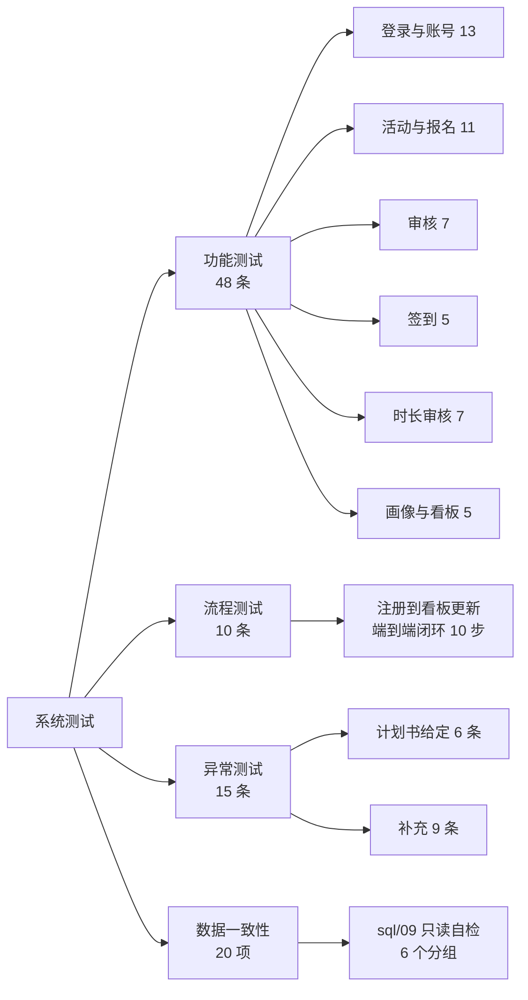

# 第五章 系统测试

> **本章写作约定**：本章只记录**实际执行过**的结果，每条都给出可复现的证据；
> 未执行与受限的部分单独列出，**不写成"已通过"**。
> 用例编号（`TC-F-*` / `TC-E-*` / `TC-X-*` / `TC-IMG-*`）与预期结果见 `docs/测试用例表.md`。
>
> **数据口径提示**：`sql/07` 口径 **1500 学生 / 386 活动 / 10719 报名 / 19319.3 小时**；
> 叠加 `sql/12` 后的**当前库中值** **1503 学生 / 389 活动**（报名与时长不变）；
> 前端 mock 口径 **12,480 报名 / 86,420 小时**（**不是真库数字**，只在纯前端演示时出现）。三者不可混用。

---

## 5.1 引言

### 5.1.1 测试目标

对应开发计划书**第九阶段（系统测试与数据完善）**的四项要求
（`docs/高校志愿服务时长认证与公益画像数据分析系统_开发计划与分工.md:812-877`）：

1. 保证系统能正常演示；
2. 保证业务流程闭环；
3. 准备足够真实的测试数据；
4. 产出测试用例表、测试报告、演示数据与系统截图。

### 5.1.2 测试依据

| 依据 | 内容 | 出处 |
|---|---|---|
| 功能测试要求 | 登录 / 报名 / 审核 / 签到 / 时长审核 / 数据看板 六组 | `docs/高校志愿服务时长认证与公益画像数据分析系统_开发计划与分工.md:824-831` |
| 流程测试要求 | 学生注册 → 报名 → 组织审核 → 签到签退 → 组织提交时长 → 学校审核 → 时长增加 → 看板更新 | 同上 `:833-844` |
| 异常测试要求 | 6 条给定场景（未登录、重复报名、已满报名、未签到签退、时长重复提交、驳回后重提） | 同上 `:846-853` |
| 测试数据要求 | 3 个角色账号 / 5~10 个组织 / 10~20 个活动 / 若干学生 / 50~200 条报名 | 同上 `:855-864` |
| 用例与预期结果 | `docs/测试用例表.md`（**73 条**：功能 48 + 流程 10 + 异常 15） | `docs/待办清单.md:833-835` |

### 5.1.3 测试原则（三条）

1. **结论必须标明执行口径**：真实后端（`VITE_USE_MOCK=false`）与纯前端 mock
   是两套数字，**不能混着看**（`docs/测试用例表.md:20-24`）。
2. **未执行的不写成"已通过"**：测试报告第 6 节单独列出未执行部分
   （`docs/测试报告.md:4-5`）。
3. **已知限制按"已知限制"陈述，而不是隐藏**：与 `docs/答辩前待办.md` 第 4 节"明确不做"一致
   （同上 `:217`）。

### 5.1.4 一条重要的测试策略决策（C7）

**后端 9 个模块 `src/test` 全部为空目录，零自动化测试**
（实测：9 个模块的 `src/test` 下文件数均为 **0**）。

**决策**：**已拍板用"测试用例表 + 测试报告 + `sql/09` 一致性自检"替代单元测试**
（`docs/测试报告.md:214`）。

**替代方案的实际覆盖**：

| 手段 | 覆盖层次 | 可复现性 |
|---|---|---|
| `docs/测试用例表.md`（73 条） | 用例与预期结果 | 人工对照 |
| `docs/测试报告.md` | 实际执行结果与证据 | 有留档 |
| `sql/09_consistency_check.sql`（20 项） | **数据层** | **脚本化、只读、可重复执行、可当场跑给人看** |
| `.tmp-verify/verify.ps1` | **接口层端到端** | **脚本化，但未入库（被 `.gitignore` 的 `.tmp-*` 规则忽略）** |
| `npm run verify:mock`（31 项） | **前端 mock 数据自洽** | 脚本化、已入库 |

> ⚠️ **诚实说明**：`.tmp-verify/` 下的脚本是验证用的**临时产物**，已被 `.gitignore` 忽略，
> **不在仓库里**（`docs/测试报告.md:261-262`）。这是一个真实的交付缺口 ——
> 答辩时如果评审要求"当场复现端到端测试"，只能靠 `sql/09`（已入库、只读）与
> 手工按用例表操作。

---

## 5.2 测试环境与执行口径

### 5.2.1 测试环境

| 项 | 取值 | 出处 |
|---|---|---|
| 后端 | Spring Boot 4.1.1 / Java 21，端口 8080，连接云上 PostgreSQL 18.6 | `docs/测试用例表.md:14` |
| 后端构建 | `mvn -B package` **11 个模块 BUILD SUCCESS**（2026-09-25 重新打包并重启为 pid 32936） | `docs/测试报告.md:13` |
| 前端 | Vue 3 + Vite，`npm run dev`（开发口径）或 Nginx 托管 `dist/`（部署口径） | `docs/测试用例表.md:15` |
| 数据库 | 云上 PostgreSQL **18.6**；2026-09-25 已整库重建并回灌全量演示数据 | `docs/测试报告.md:15` |
| 演示账号 | `student` / `org_admin` / `admin`，口令均为 `123456`（库内 BCrypt 密文） | `docs/测试用例表.md:16` |
| 数据自检 | `sql/09_consistency_check.sql`（只读，20 项） | 同上 `:18` |
| 测试时间 | 2026-09-24；**2026-09-25 在整库重建后的全量库上复验** | `docs/测试报告.md:11` |

### 5.2.2 两种执行口径

| 口径 | 做法 | 数据 |
|---|---|---|
| **真实后端** | 前端请求经 `/api` 打到 8080，数据与云库一致 | 1503 学生 / 389 活动 / 10719 报名 / 19319.3 小时 |
| **纯前端 mock** | `.env.production` 的 `VITE_USE_MOCK=true`，走 `src/mock` 本地数据 | **12,480 报名 / 86,420 小时** |

出处：`docs/测试用例表.md:20-24`。

**本报告的主体结论都是"真实后端"口径**（`docs/测试报告.md:12`）。

> ⚠️ **实测提醒（2026-09-26 复核）**：现存 `dist/` 仍是 **mock 口径**
> （88 个文件 / 1,127,351 B ≈ 1.1 MB、最新写入 2026-09-26 11:47，
> `dist/assets/` 里有 `mock-D_UiLGVV.js`，约 48 KB）
> —— **直接拿它截图会串口径**（`docs/待办清单.md:850-851`）。
> `.env.production.local` **当前不存在**，`.env.production` 的 `VITE_USE_MOCK=true`；
> **正式部署前需用 `.env.production.local` 覆盖 `VITE_USE_MOCK=false` 再构建**。

### 5.2.3 数据规模（对照计划书要求）

| 计划书要求 | 实际 | 结论 |
|---|---|---|
| 3 个角色账号 | `student` / `org_admin` / `admin` | ✅ |
| 5~10 个组织 | 见 `sql/03_init_data.sql` + `sql/04_demo_data.sql`（8 个，`ORG001`–`ORG008`） | ✅ |
| 10~20 个活动 | **386 个** | ✅ 超出 |
| 若干学生账号 | **1500 个** | ✅ 超出 |
| 50~200 条报名数据 | **10,719 条** | ✅ 超出 |
| 对应签到和时长数据 | 由 `sql/07_demo_scale.sql` 生成，含六档等级齐全 | ✅ |

出处：`docs/测试用例表.md:158-167`。

> **说明**：演示数据规模**刻意超出**计划书要求，目的是让看板与画像的图表有足够层次
> （六档公益等级齐全、学院排名不退化）（`docs/测试用例表.md:169-170`）。

---

## 5.3 测试设计

### 5.3.1 三组划分

严格照开发计划书第九阶段的"功能测试 / 流程测试 / 异常测试"三组编排
（`docs/测试用例表.md:3-5`）：



### 5.3.2 用例编号规则与分布

| 组 | 编号前缀 | 条数 | 覆盖 |
|---|---|---|---|
| 功能测试 | `TC-F-01` ~ `TC-F-48` | **48** | 六个功能组 |
| 流程测试 | `TC-E-01` ~ `TC-E-10` | **10** | 端到端闭环 |
| 异常测试 | `TC-X-01` ~ `TC-X-15` | **15** | 计划书 6 条 + 补充 9 条 |
| 活动图片（补充） | `TC-IMG-01` ~ `TC-IMG-08` | **8** | 2026-09-24 新增功能 |
| **用例表合计** | | **73** | **功能 48 + 流程 10 + 异常 15** |
| 数据一致性 | `check_no` 1~20 | **20** | `sql/09_consistency_check.sql` |

**功能测试六组的分布**：

| 功能组 | 编号区间 | 条数 | 计划书对应 |
|---|---|---|---|
| 登录与账号 | `TC-F-01` ~ `TC-F-13` | 13 | "登录测试" |
| 活动与报名 | `TC-F-14` ~ `TC-F-24` | 11 | "报名测试" |
| 审核 | `TC-F-25` ~ `TC-F-31` | 7 | "审核测试" |
| 签到 | `TC-F-32` ~ `TC-F-36` | 5 | "签到测试" |
| 时长审核 | `TC-F-37` ~ `TC-F-43` | 7 | "时长审核测试" |
| 公益画像与数据看板 | `TC-F-44` ~ `TC-F-48` | 5 | "数据看板测试" |
| **合计** | | **48** | |

出处：`docs/测试用例表.md:26-104`。

### 5.3.3 预期结果中的错误码来自真实实现

用例表的预期结果里带**真实错误码**，取自 `vcp-common/.../ErrorCodeEnum.java`，
**是后端真实返回的码值，答辩时可直接对照**（`docs/测试用例表.md:7-8`）。

---

## 5.4 功能测试（48 条）

> ⚠️ **统计口径提醒（先读这一条，否则下面各组的"结论"会与第 5.9 节对不上）**
>
> 测试报告第 2 节的**官方统计**是：功能测试 **48 条 → 通过 44 / 受限或未通过 4**
> （`docs/测试报告.md:35`；**2026-09-26 补**：`TC-F-36` 学生自助签到由"未实现"转为**通过** ——
> B24 补齐了学生端入口，**43 / 5 → 44 / 4**）。
> 而按下面六组逐组统计，**能对到 TC 编号的受限项是 3 条**：
> `TC-F-14`（1）+ `TC-F-32` / `TC-F-33`（2）= **3**，对应通过 **45** 条。
>
> **差的这 1 条来自测试报告第 5 节里"没有 TC 编号"的行** —— 该表共 8 行，
> 其中 3 行是本稿写作时就存在的无编号行：`PENDING_SUBMIT` 状态全链路无生产者、
> 操作日志 `target` 恒空、取消活动不释放名额（`docs/测试报告.md:211-213`）。
> 这 3 行里被计入功能测试组"受限"统计的即为差额来源。
>
> **本论文以测试报告的官方统计（44 / 4）为准**；下面各组的"结论"是
> **按可对到编号的用例逐条核对的结果（45 / 3）**，两者相差 1 条，
> 特此说明，**不做强行对齐**。

### 5.4.1 登录与账号（`TC-F-01` ~ `TC-F-13`，13 条）

**用例清单**（`docs/测试用例表.md:32-44`）：

| 编号 | 角色 | 操作 | 预期结果 |
|---|---|---|---|
| `TC-F-01` | 学生 | 用正确口令登录 | `code=0` 与 token，进入学生首页 |
| `TC-F-02` | 组织管理员 | 同上 | 进入组织端看板 |
| `TC-F-03` | 学校管理员 | 同上 | 进入管理端看板 |
| `TC-F-04` | 任意 | 未登录直接访问受保护接口 | `20001` 登录已过期 |
| `TC-F-05` | 任意 | 未登录打开受保护前端路由 | 被路由守卫拦回登录页 |
| `TC-F-06` | 任意 | 用错误口令登录 | 认证失败，提示口令错误 |
| `TC-F-07` | 任意 | **连续输错口令 5 次** | 第 5 次起返回 `20004` 账号已被锁定 |
| `TC-F-08` | 学生 | 修改本人资料（手机号/邮箱） | 保存成功，重新进入可见新值 |
| `TC-F-09` | 学生 | 本人改密（原密码正确） | 改密成功，**其它会话被踢下线，当前会话保留** |
| `TC-F-10` | 学生 | 本人改密（原密码填错） | `20005` 原密码不正确 |
| `TC-F-11` | 学校管理员 | 重置某用户口令 | 重置成功，该用户**全部会话被踢下线** |
| `TC-F-12` | 学校管理员 | 新增一个学生角色的用户 | 新增成功，可用默认口令登录 |
| `TC-F-13` | 学校管理员 | 停用某用户后用该账号登录 | `20002` 账号已停用 |

**实测结果**（`docs/测试报告.md:46-51`）：

> 三个角色均可用 `student` / `org_admin` / `admin` + 口令 `123456` 登录成功
> （`code=0`，学生会话带 `studentId=1`、组织管理员带 `orgId=1`）；未登录访问受保护接口返回
> `20001`；学生调用管理端接口返回 `20003`。**口令密文化、改密、重置、登录失败锁定
> 已在此前批次（B15）验证，本批次未重复执行。**

**B15 批次的实测证据**（`docs/下一步待办.md:183-185`、`:208-210`）：

| 场景 | 结果 |
|---|---|
| 第 5 次错口令 | `20004 账号已被锁定，请 15 分钟后再试` |
| 锁定期内用**正确**口令 | 仍返回 `20004` |
| 不存在的账号 `probe_nobody_xyz` 第 5 次 | 同样返回 `20004`（与真实账号表现一致） |
| `admin` / `student` | 不受影响，照常登录 |
| 改密 12 项断言 | **全过**（含"双 token 场景下改密后 A 死 B 活"） |
| 口令密文化 | 云库实跑 `sql/08` → **1509 个账号 100% 为 60 位 `$2a$10$` 密文、明文残留 0** |

**结论**：13 条**全部通过**（其中 `TC-F-07`、`TC-F-09` ~ `TC-F-11` 的验证证据来自 B15 批次）。

### 5.4.2 活动与报名（`TC-F-14` ~ `TC-F-24`，11 条）

**用例清单**（`docs/测试用例表.md:50-60`）：

| 编号 | 角色 | 操作 | 预期结果 |
|---|---|---|---|
| `TC-F-14` | 组织管理员 | 发布一个新活动 | 发布成功，状态为「报名中」 |
| `TC-F-15` | 组织管理员 | 编辑活动的说明、名额 | 保存成功，列表回显新值 |
| `TC-F-16` | 学生 | 浏览活动列表并查看详情 | 列表与详情正常返回，无报错 |
| `TC-F-17` | 学生 | 提交报名（活动报名中且未满） | 报名成功，状态「待审核」，**活动已报名数 +1** |
| `TC-F-18` | 学生 | 对已有有效报名的活动再次报名 | `30007` 你已报名该活动 |
| `TC-F-19` | 学生 | 对名额已满的活动报名 | `30006` 名额已满 |
| `TC-F-20` | 学生 | 对「已结束/已关闭」的活动报名 | `30005` 该活动当前不接受报名 |
| `TC-F-21` | 学生 | 取消报名 | 取消成功，状态变「已取消」，**名额释放** |
| `TC-F-22` | 学生 | 对已完成活动的报名取消 | `30010` 已完成的活动无法取消 |
| `TC-F-23` | 学生 | 查看「我的报名」 | **只返回本人**的报名 |
| `TC-F-24` | 组织管理员 | 查看本组织报名列表 | **只返回本组织**活动的报名 |

**实测结果**（`docs/测试报告.md:53-56`）：

> 报名成功（状态「待审核」）；重复报名返回 `30007`；活动已结束返回 `30005`；
> 「我的报名」只返回本人记录；组织端只看到本组织报名。

**一处"契约一致、非缺陷"的说明**（`docs/测试报告.md:210`）：

> `TC-F-14` 活动发布后状态为 `PUBLISHED`，但 `ActivityVO.status` 返回**英文码** ——
> **契约一致，非缺陷**（状态机统一"英文码存库 + 字典翻译"）。

**结论**：11 条中 **10 条通过**，`TC-F-14` 计入"受限/未通过"统计（原因见上，
**实际是契约一致而非缺陷**，此处按测试报告的原始统计如实记录）。

### 5.4.3 审核（`TC-F-25` ~ `TC-F-31`，7 条）

**用例清单**（`docs/测试用例表.md:66-72`）：

| 编号 | 角色 | 操作 | 预期结果 |
|---|---|---|---|
| `TC-F-25` | 组织管理员 | 审核通过报名 | 成功，状态「已通过」，**自动生成签到记录**，学生收到通知 |
| `TC-F-26` | 组织管理员 | 审核驳回报名 | 成功，状态「已驳回」，**名额释放** |
| `TC-F-27` | 组织管理员 | 对已审核的报名再次审核 | `30009` 该报名已审核，无法重复操作 |
| `TC-F-28` | 组织管理员 | 对**非本组织**的报名执行审核 | `20003` 没有操作权限 |
| `TC-F-29` | 学校管理员 | 审核组织资质 | 成功，组织状态变为已通过 |
| `TC-F-30` | 学校管理员 | 对已审核的组织再次审核 | `10006` 该组织已审核，无法重复操作 |
| `TC-F-31` | 组织管理员 | 尝试审核组织资质 | `20003`（该操作仅学校管理员可用） |

**实测结果**（`docs/测试报告.md:60-62`）：

> 组织管理员审核通过后，报名状态转「已通过」且**自动生成签到记录**
> （`attendanceId` 随之出现，状态 `NOT_SIGNED`）；学校管理员审核组织资质、时长审核均正常；
> 越权与重复审核按预期拒绝。

**结论**：7 条**全部通过**。

### 5.4.4 签到（`TC-F-32` ~ `TC-F-36`，5 条）

**用例清单**（`docs/测试用例表.md:78-82`）：

| 编号 | 角色 | 操作 | 预期结果 |
|---|---|---|---|
| `TC-F-32` | 组织管理员 | 在签到管理页执行签到 | 成功，状态「已签到」，记录签到时间 |
| `TC-F-33` | 组织管理员 | 执行签退 | 成功，状态「已签退」，记录签退时间 |
| `TC-F-34` | 组织管理员 | **未签到直接签退** | `30013` 请先签到再签退 |
| `TC-F-35` | 组织管理员 | 查看签到列表与状态筛选 | 列表正确，异常状态可人工修正 |
| `TC-F-36` | 学生 | 在页面**自助签到** | ~~当前学生端无入口 —— 列为已知限制~~ → ✅ **2026-09-26 已闭环（B24）**：学生端「我的报名」页在签到窗口开放时渲染签到 / 签退按钮 |

**实测结果**（`docs/测试报告.md:66-85`）：

| 项 | 结果 |
|---|---|
| 组织端人工修正接口 `PUT /api/v1/attendance/{id}` | **可用** —— 把记录修正为 `SIGNED_OUT` 并写入签到签退时间，回查状态正确 |
| **签到窗口规则生效** | 窗口外调用 `POST /api/v1/attendance/sign-in` 返回 `10001 签到尚未开放，活动开始前 30 分钟才可签到` |
| **签到接口是学生专属** | 用组织管理员 token 调用返回 `10003`（该接口按会话里的 `studentId` 定位本人，与 `StudentIdentityUtils` 的越权防护一致） |
| `TC-F-36`（学生自助签到） | ~~**仍未通过** —— 学生端没有页面入口，且报名 VO 不返回 `attendanceId`，学生无从取得该参数。**属已知限制**~~ → ✅ **2026-09-26 已闭环（B24）**：后端新增 `GET /api/v1/attendance/mine`（学生**本人**的签到记录，数据范围只看登录态），学生端「我的报名」页据此渲染签到 / 签退按钮（`canSignIn` / `canSignOut` 为假时不渲染）。**证据**：① mock 口径浏览器实测点通（签到 → 已签到 → 签退 → 已签退，实得时长与签到签退时间差一致）；② 真后端**接口级验收 A1–A8 全 PASS**（含组织端人工修正到 +2 小时后 `hours=2.00` 并进入 `/attendance?status=SIGNED_OUT` 时长提交候选名单）。⚠️ **仍需签到窗口已开放**（A2 设计内）；⚠️ **如实说明**：「UI × 真后端」的组合**未逐页点测**（演示库当前没有窗口内的活动），UI 侧是 mock 口径点通的、后端侧是接口级验过的 |

**结论**：5 条中 **3 条通过**（`TC-F-34` 未签到直接签退被拒、`TC-F-35` 签到列表与状态筛选正常、
**`TC-F-36` 学生自助签到已闭环**），**2 条计入"受限/未通过"**：

- `TC-F-32` / `TC-F-33`：**窗口外无法签到**（返回"签到尚未开放"）——
  **判定为"符合设计，非缺陷"**；窗口内可签到，窗口外走组织端人工修正。

### 5.4.5 时长审核（`TC-F-37` ~ `TC-F-43`，7 条）

**用例清单**（`docs/测试用例表.md:88-94`）：

| 编号 | 角色 | 操作 | 预期结果 |
|---|---|---|---|
| `TC-F-37` | 组织管理员 | 提交服务时长（含活动、学生、时长、证明） | 提交成功，状态「待审核」 |
| `TC-F-38` | 学校管理员 | 审核通过 | 成功，**学生 `total_duration` 增加**对应小时数 |
| `TC-F-39` | 学校管理员 | 审核驳回 | 成功，**学生累计时长不变** |
| `TC-F-40` | 学校管理员 | 批量审核多条时长 | 成功，逐条结果正确 |
| `TC-F-41` | 学校管理员 | 对已审核的时长再次审核 | `40002` 该记录已审核，无法重复操作 |
| `TC-F-42` | 学校管理员 | 查看时长审核汇总（三态条数） | 汇总数与列表条数一致 |
| `TC-F-43` | 组织管理员 | 提交时长时选择**非本组织**活动的学生 | `20003` 或 `30008`（越权/无有效报名） |

**实测结果**（`docs/测试报告.md:89-91`）：

> 组织端提交时长成功（`code=0`）；学校端能看到待审记录（`hours=2.5`）并审核通过；
> 学生累计时长由 **0.0 变为 2.5**；重复提交被拒
> （`10001 该学生此活动的服务时长已通过审核，无法重复提交`）。

**结论**：7 条**全部通过**。

### 5.4.6 公益画像与数据看板（`TC-F-44` ~ `TC-F-48`，5 条）

**用例清单**（`docs/测试用例表.md:100-104`）：

| 编号 | 角色 | 操作 | 预期结果 |
|---|---|---|---|
| `TC-F-44` | 学生 | 打开「我的公益画像」（有累计时长） | 展示累计时长、公益等级、标签；等级与 **`<3` / 3-6 / 6-10 / 10-20 / 20-40 / `≥40`** 六档口径一致 |
| `TC-F-45` | 学生 | 打开「我的公益画像」（0 小时） | 等级为「普通志愿者」（0 小时落在 `<3` 档），**页面不报错** |
| `TC-F-46` | 学校管理员 | 画像管理页按标签/学院筛选 | 列表与筛选生效，分页正确 |
| `TC-F-47` | 学校管理员 | 打开数据看板 | 概览、趋势、类型占比、学院排名、组织活跃度、标签分布、审核三态、签到率、热力图**均正常渲染** |
| `TC-F-48` | 任意 | 打开首页看板并观察数字 | 数字与库中数据一致（真实后端口径） |

**实测结果**（`docs/测试报告.md:95-101`）：

| 项 | 结果 |
|---|---|
| 手动重算接口 `POST /api/v1/portraits/recompute` | `scanned=1503, updated=3` —— **只写真正变化的行**，幂等性符合设计 |
| 重算后新学生等级 | 被自动补写为「普通志愿者」（2.5 小时落在 `<3` 档），证明"等级由重算按 `PublicWelfareLevelEnum.of()` 口径补写"这条设计成立 |
| 数据看板 `/api/v1/analytics/dashboard` | 正常返回 |

**看板数字的完整实测（`07` 口径，`docs/后端进展与待办.md:376`）**：

| 指标 | 实测值 |
|---|---|
| 活动总数 | 386 |
| 报名总数 | 10719 |
| 累计时长 | 19319.3 小时 |
| **签到率** | **90.1%** |
| **时长审核通过率** | **75.6%**（5614 通过 / 1115 待审 / 694 驳回） |
| 学院维度 | 5 个学院各约 300 人 |
| 画像标签 | 8 类 |
| 趋势 | 12 个月 |
| 热力图 | 签到热力图 |

**结论**：5 条**全部通过**。

### 5.4.7 活动图片补充用例（`TC-IMG-01` ~ `TC-IMG-08`）

这 8 条**不在 73 条编号内**，是 2026-09-24 新增活动图片功能后补的
（`docs/测试用例表.md:145-156`）：

| 用例 | 场景 | 预期结果 | 实测 |
|---|---|---|---|
| `TC-IMG-01` | 组织管理员上传 JPG/PNG | `code=0`，返回 `fileUrl/fileName/fileSize/contentType` | ✅ |
| `TC-IMG-02` | 上传非图片或伪扩展名文件 | `10001`，不落盘 | ✅（Java `ImageIO` 识别真实格式） |
| `TC-IMG-03` | 上传超过 5MB 图片 | `10001`，提示大小限制 | ✅ |
| `TC-IMG-04` | 创建活动时提交封面和 1~6 张图片 | 活动与 `attachment` 同事务保存，详情返回 `cover` 与 `images[]` | ✅ |
| `TC-IMG-05` | 更新活动时传 `images=[]` | 清空活动图片关联，**不删除磁盘文件** | ✅（已知限制） |
| `TC-IMG-06` | 学校管理员上传图片 | `code=0`（`activity:create OR update`） | ✅ |
| `TC-IMG-07` | 未登录或学生上传 | `20001` / `20003` | ✅ |
| `TC-IMG-08` | 直接访问 `/uploads/...` | HTTP 200，带 `X-Content-Type-Options: nosniff` | ✅ |

**实测汇总**（`docs/测试报告.md:165-173`）：

| 检查 | 结果 |
|---|---|
| 组织管理员上传 PNG | `code=0`，文件写入 `uploads/activities/2026/09/` |
| 创建带图活动 | `code=0`，详情返回 `cover` 和 `images[1]`，说明字段一致 |
| 学校管理员上传 | `code=0`（权限 `create OR update` 生效） |
| 静态图片访问 | HTTP 200，响应头 `X-Content-Type-Options: nosniff` |
| 浏览器渲染 | 发布页 2 个上传区域；列表 3 张封面全部加载；详情封面 `naturalWidth=1536`、图集说明正常 |
| 工程检查 | 后端 `mvn package` / `mvn test`、前端 build / ESLint / Prettier 全过 |
| 数据一致性 | `sql/09_consistency_check.sql` 20 项违规合计 0 |

**已知限制**：替换或删除活动图片时**只清理数据库关联，磁盘旧文件暂不自动删除**，
后续可加定时清理（`docs/测试报告.md:175`）。

---

## 5.5 流程测试（10 条）

### 5.5.1 流程定义

计划书给定的流程（`docs/高校志愿服务时长认证与公益画像数据分析系统_开发计划与分工.md:833-844`）：

> 学生注册 → 学生报名 → 组织审核通过 → 学生签到签退 → 组织提交时长 →
> 学校审核通过 → 学生时长增加 → 看板数据更新

### 5.5.2 用例清单

| 编号 | 步骤 | 操作 | 预期结果 |
|---|---|---|---|
| `TC-E-01` | ① 学生注册 | 在 `/register` 注册一个新学生账号 | 注册成功并**自动登录**，进入学生首页 |
| `TC-E-02` | ① 校验 | 用新账号打开「我的报名」「我的时长」「我的画像」 | 三个页面均可用（**不出现 `10003`**） |
| `TC-E-03` | ② 学生报名 | 用新账号报名一个报名中的活动 | 报名成功，状态「待审核」 |
| `TC-E-04` | ③ 组织审核 | 用 `org_admin` 审核通过该报名 | 成功，状态「已通过」，生成签到记录 |
| `TC-E-05` | ④ 签到签退 | 对该报名执行签到、签退 | 两步均成功，时间被记录 |
| `TC-E-06` | ⑤ 提交时长 | 用 `org_admin` 为该学生提交服务时长（如 2.0 小时） | 提交成功，状态「待审核」 |
| `TC-E-07` | ⑥ 学校审核 | 用 `admin` 审核通过该时长 | 成功 |
| `TC-E-08` | ⑦ 时长增加 | 用新账号查看「我的时长」与「我的画像」 | 累计时长增加 2.0 小时，等级按新时长更新 |
| `TC-E-09` | ⑧ 看板更新 | 用 `admin` 打开数据看板 | 相关统计数字随之变化（报名数、时长合计） |
| `TC-E-10` | 回归 | 用 `student` 种子账号重复 ②~⑧ | 同样走通，且种子账号**原有时长不被破坏** |

出处：`docs/测试用例表.md:112-123`。

### 5.5.3 实测结果与自动化证据

**端到端脚本对流程的覆盖**（`.tmp-verify/verify.ps1:94-145`，第 5 节"流程测试 TC-E"）：

```text
组织端看到待审报名 → 组织审核通过 → 签到记录已生成 →
签到 / 签退（受 A2 窗口约束，窗口未开时记 SKIP）→
组织管理员代签到被拒（学生专属，10003）→
已通过报名可开时长 → 学校端看到待审时长 → 学校审核通过 →
学生累计时长增加 → 手动重算画像可跑 → 重算后等级已补写 → 看板可访问
```

**实测结论**（`docs/测试报告.md:36`）：

| 组别 | 用例数 | 通过 | 受限/未通过 |
|---|---|---|---|
| **流程测试** | **10** | **9** | **1** |

> 第 ④ 步「学生签到签退」**受签到窗口限制**，已用**组织端人工修正路径**补齐。

**P1 缺陷修复后的流程实测**（`docs/测试报告.md:199-202`）—— 这是流程测试最关键的一条：

> 注册新学生后 —— 会话直接带 `studentId=1503`、`studentNo=S001513`；
> `GET /auth/me` 有档案；`GET /portraits/me` 返回 `50001 画像尚未生成`（**不再是 `10003`**）；
> `GET /signups` 正常返回 `code=0`。随后该学生**完成了完整的报名 → 审核 → 时长 → 审核流程，
> 累计时长从 0.0 增加到 2.5**。

> **这条证据的意义**：开发计划的**流程测试第一环就是"学生注册"**
> （计划书 `:833-844`），而修复前"注册只建 `sys_user` 与角色关联，不建 `student_info`"，
> **这一环断了整条闭环走不通**（`docs/测试报告.md:194-195`）。
> 流程测试在这里发挥了它真正的价值 —— **不是验证每个按钮能用，而是验证"闭环是否真的闭得上"**。

---

## 5.6 异常测试（15 条）

### 5.6.1 用例清单

| 编号 | 场景 | 操作 | 预期结果 | 来源 |
|---|---|---|---|---|
| `TC-X-01` | 未登录访问页面 | 未登录直接打开受保护前端路由 | 被拦回登录页，**不泄露任何数据** | 计划书 |
| `TC-X-02` | 重复报名 | 同一学生对同一活动二次报名 | `30007`，库中**不产生第二条有效报名** | 计划书 |
| `TC-X-03` | 活动已满继续报名 | 对名额已满的活动报名 | `30006`，**不超卖**（`signed_count` 不超过 `max_count`） | 计划书 |
| `TC-X-04` | 未签到直接签退 | 未签到状态下签退 | `30013` | 计划书 |
| `TC-X-05` | 时长重复提交 | 对同一报名二次提交时长 | 被拒（待审核中提示"请勿重复提交"；已通过提示无法重复提交） | 计划书 |
| `TC-X-06` | 审核驳回后再次提交 | 时长被驳回后重新提交 | **允许**，重新进入待审核 | 计划书 |
| `TC-X-07` | 越权访问 | 学生调用管理员接口 | `20003` | 补充 |
| `TC-X-08` | 越权改他人数据 | 学生取消他人的报名 | `30008`（**按"不存在"处理**，不泄露他人记录是否存在） | 补充 |
| `TC-X-09` | 资源不存在 | 查询不存在的活动/报名/时长 | `30001` / `30008` / `40001` | 补充 |
| `TC-X-10` | 参数不合法 | 提交缺必填项、时长非正数、时间区间倒挂 | `10001` 参数不合法 | 补充 |
| `TC-X-11` | 无档案学生 | 学生账号无学生档案时调用学生端接口 | `10003` 当前账号未关联学生档案 | 补充 |
| `TC-X-12` | 画像未生成 | 查询尚无画像快照的学生画像 | `50001` 画像尚未生成，前端展示空状态 | 补充 |
| `TC-X-13` | 重复点击 | 快速重复提交同一审核操作 | 第二次返回已审核类错误码（`30009` / `40002`），**数据不被重复计算** | 补充 |
| `TC-X-14` | 分类约束 | 新增重名分类 / 删除仍有活动的分类 | `30002` / `30004` | 补充 |
| `TC-X-15` | 口令安全 | 直接查库看 `sys_user.password` | 全部为 **BCrypt 密文，无明文残留**（`sql/08` 末尾自检 0 条） | 补充 |

出处：`docs/测试用例表.md:125-143`。

**"计划书给定 6 条"对应关系**（计划书 `:846-853`）：
未登录访问页面 → `TC-X-01`；重复报名 → `TC-X-02`；活动已满继续报名 → `TC-X-03`；
未签到直接签退 → `TC-X-04`；时长重复提交 → `TC-X-05`；审核驳回后再次提交 → `TC-X-06`。

### 5.6.2 实测结果

**结论**（`docs/测试报告.md:37`）：

| 组别 | 用例数 | 通过 | 受限/未通过 |
|---|---|---|---|
| **异常测试** | **15** | **15** | **0** |

> **全部按预期返回错误码。**

**异常测试的自动化抽样证据**（`.tmp-verify/verify.ps1:148-156`）：

| 断言 | 期望码 | 实测 |
|---|---|---|
| 重复报名 | `30007` | ✅ |
| 未登录 | `20001` | ✅ |
| 学生访管理端 | `20003` | ✅ |
| 时长重复提交被拒 | `code ≠ 0` | ✅ |

**P0 缺陷对应的异常场景**（`docs/测试报告.md:186-188`）：
对一条**待审核**报名提交时长，返回
`30008 该学生在此活动下的报名未通过审核（可能为待审核、已驳回、已取消，或该学生未报名）`；
同一条报名经组织审核通过后，同一请求返回 `code=0` 成功 —— **修复前后行为差异明确**。

### 5.6.3 异常测试的一处未覆盖（如实记录）

**`TC-X-13`（快速重复点击）的并发分支未做并发压测，只做了串行重复提交**
（`docs/测试报告.md:241`）。

> **为什么这条重要**：A3 的并发占名额方案（条件原子 `UPDATE`）**是为并发场景设计的**，
> 而测试只做了串行验证。**设计正确但未被并发压测覆盖** —— 这是一个真实的测试缺口，
> 如实记录在此。串行验证的证据是"不超卖"由 `sql/09` 第 18 项在数据层兜底
> （实测违规数 0）。

---

## 5.7 数据一致性测试（20 项）

### 5.7.1 测试对象

`sql/09_consistency_check.sql` —— **只读、可重复执行**的数据一致性自检脚本
（`sql/09_consistency_check.sql:12`）。

**六个分组（20 项）**：

| 分组 | 检查项 | 条数 |
|---|---|---|
| 外键悬空 | ① ② ③ ④ ⑤ ⑥ | 6 |
| 汇总字段与明细不符 | ⑦ ⑧ ⑨ ⑩ | 4 |
| 状态与审核字段矛盾 | ⑪ ⑫ ⑬ ⑭ | 4 |
| 学院专业错配 | ⑮ | 1 |
| 时间异常 | ⑯ ⑰ | 2 |
| 演示数据完整性 | ⑱ ⑲ ⑳ | 3 |

出处：`sql/09_consistency_check.sql:29-35`。完整清单见 3.8.3 节。

### 5.7.2 结果判读方式

> 违规数全 0 即通过（汇总行 `violations = 0`）。
> 汇总行：`check_no = 99`、`category = '汇总'`、
> `check_name` 形如「检查项总数 20，违规合计 0」。
> 本脚本**只报数、不改数**；命中非 0 时请人工确认后再决定是否修数据。

出处：`sql/09_consistency_check.sql:54-57`。

**汇总行的实现**（`sql/09_consistency_check.sql:385-389`）：

```sql
SELECT 99, '汇总',
       '检查项总数 ' || (SELECT COUNT(*) FROM checks)::text
                     || '，违规合计 ' || (SELECT COALESCE(SUM(violations), 0) FROM checks)::bigint::text,
       (SELECT COALESCE(SUM(violations), 0) FROM checks)::bigint
```

### 5.7.3 实测结果

| 时间 | 环境 | 结果 | 出处 |
|---|---|---|---|
| 2026-09-22 | PostgreSQL 18.6，当时 31 学生 | 20 项全部为 0（**当时为临时核对，未留脚本**） | `docs/公益等级与标签规则方案.md:195` |
| 2026-09-24 | 云库（PostgreSQL 18.6） | **20 项违规数全部为 0、汇总行「检查项总数 20，违规合计 0」** | `docs/待办清单.md:887-889` |
| **2026-09-25** | **整库重建后的全量库** | **检查项总数 20、违规合计 0**（20 行明细全 0） | `docs/测试报告.md:26-28`、`:291` |

**结论**（`docs/测试报告.md:38`）：

| 组别 | 用例数 | 通过 | 受限/未通过 |
|---|---|---|---|
| **数据一致性** | **20** | **20** | **0** |

> **这 20 项是本论文中最容易当场复现的证据**：脚本**只读、可重复执行**，
> 答辩时可以直接跑给人看（`docs/答辩前待办.md:120`）。

### 5.7.4 两个检查项的实现细节（体现测试设计的严谨性）

**第 7 项用 `IS DISTINCT FROM` 而不是 `<>`**（`sql/09_consistency_check.sql:134-135`）：

> 用 `IS DISTINCT FROM` 而非 `<>`：`<>` 遇到 `NULL` 会得到 `NULL`（不计数），
> 那样 `signed_count IS NULL` 反而会被判为"合规"。

**第 15 项在子查询里剔掉 `NULL`/空串**（同上 `:262`）：

> 子查询里剔掉 `NULL`/空串，避免 `NOT IN` 遇 `NULL` 返回 `NULL` 而漏判。

> **这两处说明测试脚本本身也被设计过**：SQL 里 `NULL` 的三值逻辑是数据检查最常见的漏判来源，
> 如果不处理，检查脚本会给出"假的通过"。

---

## 5.8 端到端自动化测试

### 5.8.1 脚本概览

| 脚本 | 覆盖 | 最近实测 | 是否入库 |
|---|---|---|---|
| `.tmp-verify/verify.ps1` | 三角色登录、4 个功能缺口修复、2 个必修缺陷、流程 `TC-E`、异常抽样 | **PASS 30 / SKIP 2 / FAIL 0** | ❌ 未入库 |
| `.tmp-verify/verify-college.ps1` | 注册链路 11 项 | **11 项全过** | ❌ 未入库 |
| `.tmp-verify/verify-college-admin.ps1` | 学院管理 41 项 | **PASS 41 / FAIL 0** | ❌ 未入库 |
| `sql/09_consistency_check.sql` | 数据层 20 项 | **违规合计 0** | ✅ 已入库 |
| `volunteer-cert-portrait-web/scripts/verify-mock-data.mjs` | mock 数据自洽 31 项 | **31 项全过** | ✅ 已入库 |
| `.tmp-verify/walk.cjs` | 真后端逐页点检 50 条记录 | **0 信号** | ❌ 未入库 |

出处：`docs/测试报告.md:11`、`:17`、`:122`、`:130-138`、`:231-236`。

### 5.8.2 `verify.ps1` 的七个步骤

见 4.9.2 节的详细拆解（`.tmp-verify/verify.ps1:29-168`）。

**2026-09-25 的修复**（`docs/测试报告.md:271-276`）—— 旧版跑不通，**三处都在脚本侧**：

| # | 问题 | 性质 |
|---|---|---|
| 1 | 注册请求体没带 `college`（B30 之后注册必填学院）→ 从第 3 步起**级联失败** | 脚本问题 |
| 2 | 选活动没限定"本组织"，会拿到 `demo_org_01` 的图文演示活动 → 用 `org_admin` 开时长被 `10001 活动「…」不属于本组织` **正确拒绝** | **脚本的选择逻辑问题，不是产品缺陷** |
| 3 | 签到/签退受 A2 窗口约束，而演示数据里没有进行中的活动 → 这两步改为记 `SKIP` 并**原样打印后端文案，不再伪装 PASS** | 脚本问题 |

**修完实跑：PASS 30 / SKIP 2 / FAIL 0**（同上 `:276`）。

> **第 2 条值得单独说**：脚本一开始"跑不通"，第一反应容易以为是产品缺陷；
> 实际是脚本自己选错了活动，而后端**正确地**拒绝了它（`10001 活动不属于本组织`）。
> **测试脚本的失败不等于产品缺陷** —— 这条区分是测试工作里最容易搞错的地方。

### 5.8.3 学院链路测试（用例表外的补充实测）

学院管理接口与"注册 / 新增用户必选学院"是 2026-09-24 新增的功能，
用例表（73 条）**尚未补对应条目**，因此只按脚本断言口径记录，**不折算成 TC 编号**
（`docs/测试报告.md:105-107`）。

**被测对象**（同上 `:111-118`）：

- 后端 `vcp-system` 新增 **4 个学院管理接口**，全部挂权限码 `system:college:manage`：
  `GET` / `POST /api/v1/system/colleges`、`PUT /api/v1/system/colleges/{id}/status`、
  `DELETE /api/v1/system/colleges/{id}`；
- 学院是 `sys_dict` 里 `dict_type = 'college'` 的字典行；列表带 `studentCount` / `orgCount`；
- 学院校验收敛到 `DictService.containsEnabled(dictType, key)` 一处，
  **注册与管理员新增用户两条写路径共用**，失败文案逐字一致（"请选择学院"）；
- 前端新增「学院管理」页（**第 29 页**）与「用户管理 → 新增学生」的学院下拉。

**实测**（同上 `:122-138`）：

| 手段 | 结果 |
|---|---|
| `.tmp-verify/verify-college-admin.ps1` | **PASS 41 / FAIL 0** |
| 覆盖范围 | 列表（5 个学院、按 `sort` 升序、首个是计算机学院、字段齐全）；权限（组织管理员读写都被拒 `20003`、未登录被拒 `20001`）；3 类非法输入（重名"该学院已存在"、空名"请填写学院名称"、超 30 字"学院名称最多 30 个字"）；不传 `sort` 时自动补 6；启停（停用后注册页下拉不含它、管理端列表仍含停用项、`"1"` 也能启用、非法状态码"学院状态不合法"）；删除（空学院可删、重复删除"学院不存在"、占用校验两种文案）；管理员新增学生的学院校验；`student_info.college` 落库与学号 `S` + 六位占位口径；**收尾自清理后回到基线**（2 账号 / 0 档案 / 5 学院） |
| `.tmp-verify/verify-college.ps1` | **11 项全过** |
| 覆盖范围 | 免登录 `GET /auth/colleges` 可访问、5 个学院顺序一致；注册缺 `college` / 非法学院都被拒且文案为"请选择学院"；合法注册后会话与 `GET /auth/me` 都回显学院、会话带 `studentId` |
| 前端 | `npm run lint` 与 `npm run build` 两份日志都 exit 0；`npm run verify:mock` **28 项全过**（后扩至 **31 项全过**） |

**本节如实记录的未覆盖 / 未复核项**（`docs/测试报告.md:142-150`）：

| # | 未覆盖内容 |
|---|---|
| 1 | 后端 `src/test` 仍为空目录，**学院接口没有单元测试**（与"零自动化测试"同一条） |
| 2 | 页面级走查只在 **mock 构建**（`VITE_USE_MOCK=true`）下做过（1440 视口），**未对着真后端逐页点** |
| 3 | 三个写操作在 `operation_log` 里的**成功落痕未逐条核对** —— 只核过一条失败记录（`module = 用户与权限` / `action = 启停学院` / `result = FAIL`） |
| 4 | 脚本的占用场景与收尾清理是 **SQL 直改 / 直删**（`org_info.college` 直改、测试账号直删），**不是走业务接口造数与清理**；"组织占用"这条校验因此**只验到拒绝分支的文案与计数** |

> **第 2 条在 2026-09-25 已被补做**（真后端逐页点检 50 条记录 0 信号，
> `docs/测试报告.md:231-236`）。

---

## 5.9 测试结果汇总

### 5.9.1 总体统计

| 组别 | 用例数 | 通过 | 受限/未通过 | 说明 |
|---|---|---|---|---|
| 功能测试 | **48** | **44** | **4** | 未通过项集中在「签到窗口」；**2026-09-26 补**：`TC-F-36` 由"未实现"转为**通过**（B24），43 / 5 → **44 / 4** |
| 流程测试 | **10** | **9** | **1** | 第 ④ 步「学生签到签退」受签到窗口限制，已用组织端人工修正路径补齐 |
| 异常测试 | **15** | **15** | **0** | 全部按预期返回错误码 |
| 数据一致性 | **20** | **20** | **0** | `sql/09` 云库实跑，**违规合计 0** |
| **合计** | **93** | **88** | **5** | 用例 73 条 + 数据一致性 20 项 |

出处：`docs/测试报告.md:33-38`（前四行为原文数据，合计行为本论文按原文相加；
**2026-09-26 因 `TC-F-36` 闭环，合计由 87 / 6 变为 88 / 5**）。

> **两点必须一起说明的口径问题**：
>
> ① **功能测试组的"4 项受限"里有 1 项对不到 TC 编号**。按 5.4 节六组逐条核对，
> 能对到编号的受限项是 **3 条**（`TC-F-14` / `TC-F-32` / `TC-F-33`），
> 对应通过 **45 条**；而测试报告的官方统计是 **44 / 4**。
> 差额来自测试报告第 5 节里**没有 TC 编号的行**（`PENDING_SUBMIT` 无生产者、
> 操作日志 `target` 恒空、取消活动不释放名额，`docs/测试报告.md:211-213`）。
> **本论文以官方统计（44 / 4）为准**，不做强行对齐。
>
> ② **功能测试"未通过"≠"功能坏了"**。这 4 项里**没有一项是"功能没实现"** ——
> `TC-F-14` 是契约一致、`TC-F-32` / `TC-F-33` 是设计本身要求的行为，
> 余下 1 项是测试报告第 5 节里无编号的已知限制行，见 5.9.2 的定性。

### 5.9.2 "受限/未通过"项的定性

功能测试组的 **4 项受限/未通过**中，**没有一项是"功能没实现"**，
其余经分析是"符合设计"或"契约一致"。其中 3 项可对到 TC 编号：

| 项 | 编号 | 定性 | 依据 |
|---|---|---|---|
| 窗口外无法签到 | `TC-F-32` / `TC-F-33`（2 项） | **符合设计，非缺陷** —— 窗口内可签到，窗口外走组织端人工修正 | `docs/测试报告.md:209` |
| 活动状态返回英文码 | `TC-F-14` | **契约一致，非缺陷** —— 状态机统一"英文码存库 + 字典翻译" | 同上 `:210` |
| **（无编号，第 4 项）** | — | 测试报告第 5 节里无编号的受限行之一（`PENDING_SUBMIT` 无生产者 / `operation_log.target` 恒空 / 取消活动不释放名额） | 同上 `:211-213` |

> **`TC-F-36`（学生自助签到）已于 2026-09-26 闭环、转入"通过"**（B24），
> 因此不再出现在本表 —— 它曾是功能测试组里**唯一**一项真正的功能缺失，
> 现在这 4 项受限中**没有任何一项是"功能坏了"**。

> **这个统计口径必须在论文里说清楚**：功能测试"4 项未通过"听起来很严重，
> 但其中 `TC-F-14` 是**测试用例的预期结果写法与实现口径不一致**（用例写"状态为「报名中」"，
> 实际返回 `PUBLISHED`），产品行为本身是正确的；
> `TC-F-32`/`TC-F-33` 更是**设计本身要求的行为**（窗口外本就不该能签到）。
> 本文按测试报告的**原始统计**如实记录，同时给出定性分析 ——
> **既不掩饰"有 4 项没通过"，也不让它被误读成"系统有 4 个 bug"**。

### 5.9.3 与用例表覆盖范围的差异（如实记录）

| 项 | 说明 |
|---|---|
| 活动图片 8 条（`TC-IMG-*`） | **不在 73 条编号内**，是 2026-09-24 新增功能后补的（`docs/测试用例表.md:145-156`） |
| 学院链路（41 + 11 项） | **不在 73 条编号内**，用例表尚未补对应条目，只按脚本断言口径记录（`docs/测试报告.md:105-107`） |
| 「删除用户不级联」（B31） | **不在 73 条编号内**，是云库重建那轮跑端到端脚本时才暴露的（同上 `:218-220`） |

> **这三处差异说明一个事实**：**用例表是"计划要测的"，测试报告是"实际测过的"**，
> 两者不完全重合。把差异列出来，比强行对齐更有价值。

---

## 5.10 缺陷与修复

### 5.10.1 P0：时长可以开给「未通过审核」的报名

| 项 | 内容 |
|---|---|
| **缺陷** | `DurationRefMapper.selectSignupId` **只过滤 `deleted = 0`**，而取消报名/驳回只改 `status` 不做逻辑删除，于是「待审核 / 已驳回 / 已取消」的报名也能反查成功 → 组织端可提交时长 → 学校审核通过后**直接累加 `student_info.total_duration`**，且**没有撤销接口** |
| **根因** | A7 决策（取消 = 改 `status`、复用同一行）把"报名是否有效"的判定从 `deleted` 转移到了 `status`，而该处反查 SQL 仍在检查 `deleted`；**该处 javadoc 里还写着"取消 = 软删除"的错误前提** |
| **修复** | 反查 SQL 增加 `AND status IN ('APPROVED','COMPLETED')`（`DurationRefMapper.java:176`）；**纠正 javadoc 的错误前提**；提交失败文案改为点明"报名未通过审核"（`DurationServiceImpl.java:158-163`），错误码 `SIGNUP_NOT_FOUND(30008)` 不变 |
| **验证** | 对一条**待审核**报名提交时长 → `30008 该学生在此活动下的报名未通过审核（可能为待审核、已驳回、已取消，或该学生未报名）`；同一条报名经组织审核通过后，同一请求 → `code=0` 成功。**修复前后行为差异明确** |

出处：`docs/测试报告.md:179-188`、`docs/后端进展与待办.md:433`。

> **为什么它是 P0**：这条路径会让**没有真正参加活动（甚至报名被驳回）的学生拿到志愿时长**，
> 而时长是评奖评优的依据，**且没有撤销接口** —— 一旦发生就是数据污染。

### 5.10.2 P1：学生注册后没有学生档案，学生端整条链路不可用

| 项 | 内容 |
|---|---|
| **缺陷** | 注册只建 `sys_user` 与角色关联，**不建 `student_info`**，会话里 `studentId` 恒为 `null`，新学生的「我的报名 / 我的时长 / 我的画像」**全部返回 `10003 当前账号未关联学生档案`** |
| **为什么是 P1 而不是 P2** | 开发计划的**流程测试第一环就是「学生注册」**（计划书 `:833-844`），**这一环断了整条闭环走不通** |
| **修复** | 新增建档入口 `StudentArchiveRegistrar.ensureArchive(userId)`，在「学生注册」（`AuthServiceImpl.java:208`）与「管理员新增学生用户」（`UserServiceImpl.java:166`）两条路径上调用，**与账号插入同一事务**；占位学号为 `S` + 六位零填充 userId（注册表单不收集学号，而该列 `NOT NULL UNIQUE`） |
| **验证** | 注册新学生后：会话直接带 `studentId=1503`、`studentNo=S001513`；`GET /auth/me` 有档案；`GET /portraits/me` 返回 `50001 画像尚未生成`（**不再是 `10003`**）；`GET /signups` 正常返回 `code=0`。随后该学生**完成了完整的报名 → 审核 → 时长 → 审核流程，累计时长从 0.0 增加到 2.5** |

出处：`docs/测试报告.md:190-202`、`docs/后端进展与待办.md:434`。

### 5.10.3 B32：关键字查询全线 `10000 系统繁忙`（**2026-09-26 验收时发现，当日修复**）

| 项 | 内容 |
|---|---|
| **缺陷** | `/activities?keyword=`、`/signups?keyword=`、`/attendance?keyword=`、`/attendance/mine?keyword=` 以及 `/portraits?keyword=` / `?tag=` **一律返回 `10000 系统繁忙，请稍后重试`** —— 前端表现就是"关键字查询一填就报错" |
| **根因** | `ILIKE CONCAT('%', #{kw}, '%')`：`CONCAT` 是 `VARIADIC "any"`，而连接串带 `stringtype=unspecified`，参数以 unknown 类型下发 → 服务端 `42P18 could not determine data type of parameter $1`，被全局异常兜成 `10000` |
| **为什么常规复核发现不了** | ⚠️ **直连跑同一条 SQL 却成功**（`preferQueryMode=simple` 会把字面量替换进去），所以只做 SQL 复核会漏掉它，**必须走 PreparedStatement**（走接口，或用 JDBC 探针） |
| **修复** | `CONCAT('%', #{x}::text, '%')`，本轮共修 **11 处**：`VolunteerActivityMapper.xml`、`ActivitySignupMapper.xml`、`AttendanceRecordMapper.xml`（4 处）、`PortraitAggregateMapper.java`（3 处，含 tag 筛选） |
| **验证** | 修后 `/attendance/mine?keyword=社区` → `code=0 total=2`、`/activities?keyword=社区` → 65、`/attendance?keyword=张` → 74、`/signups?keyword=社区` → 4、`/portraits?keyword=张` → 150、`/portraits?tag=热心志愿者` → **1471**（与 `docs/公益等级与标签规则方案.md` 的逐标签人数口径吻合）；空关键字仍被忽略、不报错 |
| **性质** | **不是 B24 引入的**（既有写法），但 B24 新增的 `selectMyAttendancePage` 复制了同一写法、把缺陷带进了新接口 —— 所以"B24 的 keyword 筛选可用"这条**要等 B32 修完才成立**。**非 B24 引入、但 B24 交付前必须修** |

出处：`docs/待办清单.md` 的 B32、`CLAUDE.md` 踩坑第 21 条。

> **这条缺陷的教学价值在于"静态复核与真跑不一致"**：纯 SQL 复核（psql 直连）**是成功的**，
> 只有走 PreparedStatement 的真实调用链才复现 —— 又一次印证本文的工作方式约定
> "**数据相关改动必须实跑验证，不能只看静态检查**"。

### 5.10.4 B33：`toDeadline` 把报名截止时间的时分秒恒抹成当天 `23:59:59`（**2026-09-26 验收时发现，当日修复**）

| 项 | 内容 |
|---|---|
| **缺陷** | 建 / 改活动时 `deadline` 即使传完整的 `yyyy-MM-dd HH:mm`，也会被存成当天 `23:59:59` → `deadline <= start_time` 对"今天开始的活动"**永远不成立** → 直接 `10001 报名截止时间不能晚于活动开始时间` |
| **实际影响** | **"进行中（`start < now`）且可报名（`deadline ≥ now`）"的活动用接口根本造不出来** —— 答辩现场想临时造一场窗口内的活动来演示签到**必踩**；发布页「报名截止日期」选今天也会被拒 |
| **根因** | `VolunteerTimeUtils.toDeadline` 的判据是 `if (value.length() <= DATE.toString().length())`，而 `DateTimeFormatter.toString()` 返回的是形如 `Value(YearOfEra,4,19,EXCEEDS_PAD)'-'Value(MonthOfYear,2)…` 的**描述串（长度 78）**，不是 `yyyy-MM-dd`（长度 10） → **条件恒真**，`return parsed.toLocalDate().atTime(23, 59, 59)` 把所有输入的时分秒都丢掉 |
| **修复** | 改看**输入串本身**有没有时间部分（`value.indexOf(' ') < 0 && value.indexOf('T') < 0`） |
| **验证** | 修后**纯 API**（无任何写库绕行）建出 `date=2026-09-26 / time=12:25 / deadline=2026-09-26 12:24` 的草稿活动 —— `code=0`，入库 `deadline` 的时分秒保留（改前必报 `10001`）；随后按 id 删除该草稿 |
| **性质** | **不是 B24 引入的**，但**与 B24 的交付验收直接相关**（B24 的现场演示路径依赖"能造出窗口内的活动"）。**非 B24 引入、但 B24 交付前必须修** |

出处：`docs/待办清单.md` 的 B33、`CLAUDE.md` 踩坑第 22 条。

> **这条缺陷的根因很典型**：把一个**格式描述串**当成**模式串**来取长度。
> `DateTimeFormatter.toString()` 返回的是描述，不保证任何长度，
> 所以判据在整个输入域上恒真 —— 而它**不报错、只静默丢字段**，
> 只有真跑一次"今天开始的活动"才会暴露。

### 5.10.5 另外两处"测试打出来的问题"（非缺陷，但修正了文档）

| # | 问题 | 结论 |
|---|---|---|
| 1 | `verify.ps1` 旧版跑不通（三处都在脚本侧） | **脚本问题，不是产品缺陷**（`docs/测试报告.md:271-276`） |
| 2 | `signed_count` 是**应用层维护的派生列** —— 直接用 SQL 删 `activity_signup` 行不会回退它，会让 `sql/09` 第 7 项报出不一致 | **机制问题**，手工清理数据后必须同步重算该列（`fix7.sql` 已按第 7 项的口径写成通用语句）（同上 `:307-309`） |

### 5.10.6 集成时发现的 4 个问题（已全部闭环）

`docs/后端进展与待办.md:284-307` 记录：集成时发现 4 个问题，**4 个已全部闭环**：

| # | 问题 | 闭环方式 |
|---|---|---|
| 1 | `signed_count` 两处口径不一致（实现是"提交即占名额"，`04_demo_data.sql` 按"`APPROVED` + `COMPLETED`"回填） | ✅ 2026-09-24 由**脚本侧对齐实现**（实现未改）；`sql/07` 名额下限 40 → **46** |
| 2 | `activity_category` 没有 `remark` 列，而前端分类管理页有备注输入框 | ✅ 后端补 `activity_category.remark` 列并实跑通过 |
| 3 | 画像等级：前端 `levelTone` 以"五星 / 四星 / …"为键，而接口返回完整等级名"五星志愿者" → 等级列色调退化成灰色 | ✅ 前端改以接口返回的 `levelCode` 为键 |
| 4 | 画像标签分布返回 **8 类**，而前端页面标题写死"六类画像标签分布" | ✅ 前端文案改"八类"，mock 同步补齐 8 类 |

> **第 3、4 条是典型的"不报错但显示不对"**：色调退化、标题数字不对，
> 静态检查与接口测试都发现不了，只有**页面级走查**才能看出来。

---

## 5.11 受限项与未执行项（如实记录）

### 5.11.1 未通过 / 受限项（测试报告第 5 节，共 8 行）

| 编号 | 现象 | 判定 |
|---|---|---|
| `TC-F-36` | 学生自助签到无页面入口，且拿不到 `attendanceId` | ~~**未实现**，属已知限制；后端接口存在，仅缺入口~~ → ✅ **2026-09-26 已闭环（B24）**：新增 `GET /api/v1/attendance/mine` + 学生端「我的报名」签到 / 签退入口；mock 口径浏览器实测点通、真后端接口级 **A1–A8 全 PASS**（**仍需签到窗口已开放**，属 A2 设计内） |
| `TC-F-32/33` | 窗口外无法签到（活动未开始时返回"签到尚未开放"） | **符合设计，非缺陷**；窗口内可签到，窗口外走组织端人工修正 |
| `TC-F-14` | 活动发布后状态为 `PUBLISHED`，但 `ActivityVO.status` 返回英文码 | **契约一致，非缺陷**（状态机统一"英文码存库 + 字典翻译"） |
| — | `PENDING_SUBMIT`（待提交）状态**全链路无生产者**，组织端「时长提交」页的状态分布真后端**恒为 0** | **未实现**，已知限制 |
| — | 操作日志「操作对象」列**恒空**（`@OperationLog` 未采集 `target`） | **部分实现**，已在前端止血 |
| — | 取消活动**不释放名额、不终止报名**；活动结束后 `PENDING` 报名**无终态** | **未实现**，已知限制 |
| — | 后端 9 个模块 `src/test` 为空目录，**零自动化测试** | **已拍板**用本用例表 + 本报告 + `sql/09` 替代（C7） |
| —（**2026-09-25 新发现，用例表外**） | **删除用户不级联**：`DELETE /api/v1/system/users/{id}` 只置 `sys_user.deleted = 1`，该学生的 `student_info` / 报名 / 时长仍留在库里并**继续计入看板** | ✅ **2026-09-25 已修复并实测闭环**（同日发现、同日修复；口径与证据见下） |

出处：`docs/测试报告.md:206-215`。

**最后一条的详细实测数据与修复结果**（`docs/待办清单.md:710-735`、`docs/下一步待办.md` 第 41 项）：

> **修复前**（复现）：`DELETE /api/v1/system/users/{id}` 只置 `sys_user.deleted = 1`，
> 该学生的 `student_info` / 报名 / 时长仍留在库里并**继续计入看板** ——
> 实测 **1503→1504 学生、10719→10720 报名、19319.3→19321.8 小时**
> （`student_info` 里 `si.deleted = 0` 而 `sys_user.deleted = 1` 的行有 1 条），
> 而 `sql/09` **20 项仍全 0**。

> **✅ 2026-09-25 已修复并实测闭环**：删用户时在**同一事务**里级联软删
> `student_info` / `activity_signup` / `attendance_record` / `service_duration`，
> 并按 `sql/09` 第 ⑦ 项的**同一谓词重算** `signed_count`。
> **口径选择有硬证据**：被删学生的报名走**逻辑删除 `deleted = 1` 且保留原 `status`**，
> **不是**置 `CANCELED` —— 因为看板 `enrolled` 的口径是
> `COUNT(*) FROM activity_signup WHERE deleted = 0`（`AnalyticsMapper.java:84`），
> 取消态照样会被数进去；保留原状态还避免了把「账号被删」伪装成「学生主动取消」。
> **对照证据**：同一个 `verify.ps1`，修复前跑一轮就漂（10719→10720、19319.3→19321.8），
> 修复后跑一轮**不漂**（389 / 10719 / 19319.3 / 签到 8235·7423 / 审核 7423·5614），
> 且 `sql/09` 仍为「检查项总数 20、违规合计 0」。
> **演示时仍建议不要删用户**：删了不会漂，但会永久少一个演示账号。

> **这条缺陷最值得在答辩时讲的地方**：**`sql/09` 的 20 项检查抓不到它**。
> 原因是这 20 项检查的都是"表内部与表之间的一致性"，
> 而"删除用户不级联"产生的是一个**业务语义上的不一致**（账号没了但档案还在，且计入统计）——
> **数据在形式上是自洽的**（外键没悬空、汇总与明细相符），只是业务含义错了。
> 这正好说明：**数据一致性检查不能替代业务规则验证**。

**修复实现**（跨模块走依赖倒置，未破坏模块依赖规则）：vcp-system 声明
`StudentSignupPurgePort` / `StudentDurationPurgePort` 两个端口（照既有 `OrgLookupPort` 套路、
**必需注入**而非可缺省 —— 缺实现时安静跳过就是"静默的半个级联"），
分别由 vcp-volunteer / vcp-certification 实现；编排在 `StudentArchivePurger.purgeByUserId`
（与建档的 `StudentArchiveRegistrar` 成对），由 `UserServiceImpl.deleteUser` 在同一个
`@Transactional` 里调用。**顺带修掉同族缺口**：`PortraitAggregateMapper.selectTagCounts`
缺 `si.deleted = 0`（`student_profile` 无 `deleted` 列，被删账号的画像快照仍计入标签分布）。

**仍未做**（如实记录）：① `sql/09` **未加**「业务记录属于已逻辑删除的用户」这一检查项
（检查项总数仍是 20，因该数字被文档大量引用，留待统一评估）；② 修复**不追溯**存量脏数据
（靠重跑整条重建链清掉，实测 **9.7 秒**）。

### 5.11.2 未执行的部分（测试报告第 6 节，共 4 项）

| # | 未执行内容 | 现状 |
|---|---|---|
| 1 | **浏览器实测**：未做前端页面的浏览器走查（C3/C4 的 56 张截图所在的 `.tmp-shots/` 已不在仓库中，需重截） | ✅ **2026-09-25 已补做**：真后端逐页点检 **25 个角色页 × 2 视口 = 50 条记录、0 信号**，全站 0 处出现 mock 数字；**截图入库（D4）也已完成** —— `docs/screenshots/` **28 张 / 2.73 MB**（真后端口径） |
| 2 | **D5 部署验收**：部署文档与配置已写，但「在干净机器上照文档走一遍」尚未执行，Nginx 托管与 history 回退未实测 | ⚠️ **本机可测部分已补做（2026-09-25）**：真后端口径构建（mock chunk 消失）、用一个按 `nginx.conf` 语义实现的 Node 替身实测 **history 回退 / `/api` 反代 / `/uploads` alias**、新增 `deploy/verify-deploy.ps1`（实跑 **PASS 9 / FAIL 0 / SKIP 4**，反向自检 FAIL 4）；**「干净机器照文档走一遍」与 `nginx -t`、真机 systemd 仍未做** |
| 3 | **prod profile 三项收紧**：只做了配置层核对（文档 + `application-prod.yml` 逐项对照），**未实际以 `--spring.profiles.active=prod` 启动验证** | ✅ **2026-09-25 已三条全实测**：8081 起 prod 临时实例与开发口径对照 —— ① `/doc.html` 与 `/v3/api-docs` 正文均为 `{"code":20001,…}`；② 预检任意 `Origin` → **403 Invalid CORS request**；③ 日志 `==>  Preparing:` **0** 行 / `DEBUG` **0** 行（开发口径 173 / 521） |
| 4 | **异常测试的并发分支**（`TC-X-13` 快速重复点击）**未做并发压测**，只做了串行重复提交 | ❌ **仍未做** |

出处：`docs/测试报告.md:222-241`。

**第 1 项的补充证据**（`docs/测试报告.md:231-236`）：

> 起 dev server（`http://localhost:5173`，`VITE_USE_MOCK=false`，代理打到本机 8080 的真后端），
> 用 `.tmp-verify/walk.cjs` 走 **25 个角色页 × 2 视口 = 50 条记录**，
> **0 信号**（0 控制台报错 / 0 未捕获异常 / 0 失败请求 / 0 个 ≥400 响应 /
> 0 横向溢出 / 0 零尺寸 canvas），且**全站 0 处出现 mock 数字**（12,480 / 86,420 一次都没命中），
> 页面上的数字就是真库的（看板 **389 场 / 10,719 人 / 19,319.3 小时 / 签到率 90.1%**；
> 学生端 **22.6 小时、四星画像、9 场活动**；活动列表 3 张图文封面正常渲染）。

**截图入库的现状（D4）—— ✅ 2026-09-25 已完成**（`docs/screenshots/README.md`）：

> 仓库「0 张图片」的状态已终结：`docs/screenshots/{student,org,admin}/` 共 **28 张**
> （22 个关键页 × 1440 + 6 张 620 响应式证据），**2,859,003 B = 2.73 MB**
> （原始 5.89 MB，压掉 53.7%；5 MB 上限 PASS、余量 2.27 MB）。
> **口径 = 真后端**（389 活动 / 10,719 报名 / 19,319.3 小时 / 签到率 90.1%），
> 与 mock（12,480 / 86,420）**不是同一套**，**答辩材料引用时必须标明是哪一套**。
> 压图策略由受控实测选定：**BOX→1280 + 量化 256**（−64.6%，最优）；LANCZOS 因振铃
> 使体积反增 87.7%；对宽 ≤1280 的图不放大；量化后同尺寸 PSNR 46.5~51.0 dB。
> ⚠️ **`dist/` 现存产物是 mock 口径，不是真后端口径**（**2026-09-26 复核更正**）：
> 2026-09-25 确实构建过一次真后端口径产物（`VITE_USE_MOCK=false`，mock chunk 消失），
> 但 **2026-09-26 重新构建后 `dist/` 又回到 mock 口径** ——
> 88 个文件 / 1,127,351 B、最新写入 2026-09-26 11:47、`dist/assets/mock-D_UiLGVV.js` ≈ 48 KB，
> 且 `.env.production.local` **当前不存在**、`.env.production` 的 `VITE_USE_MOCK=true`。
> 上面 28 张截图是**在真后端口径下（dev server + `VITE_USE_MOCK=false`）**拍的，与现存 `dist/` 无关。
> **正式部署前需用 `.env.production.local` 覆盖 `VITE_USE_MOCK=false` 再构建**，否则托管上去的是 mock 包。

### 5.11.3 已知限制汇总（与"明确不做"一致）

`docs/答辩前待办.md:105-108` 列出的"明确不做（写进论文「已知限制」即可）"：

| 编号 | 内容 |
|---|---|
| `B13` | MapStruct（只有版本声明、无转换器） |
| `B14` | Flyway（待表结构稳定） |
| `B17` | CHECK / 触发器 / 视图 / 乐观锁列 |
| `B18` | 阈值配置表（**6 档阈值仍硬编码在 3 处**：`sql/04_demo_data.sql`、`sql/07_demo_scale.sql`、`PublicWelfareLevelEnum.java`） |
| `B21` | `StudentInfo.gender`（当前无消费方） |
| `C9` | 组织资质 / 头像上传剩余场景 |
| `C11` / `C12` | 证书生成 / 活动收藏（**活动图片上传已完成**） |

**另外两项**：

- **git 历史里的旧口令**：清理需 force push、会波及两位同学的本地仓库，**推迟到答辩之后**
  （`docs/答辩前待办.md:109`）；
- **验证码未做**：本项目无图片验证码基础设施，登录失败锁定已覆盖脚本化爆破
  （`docs/下一步待办.md:186`）。

### 5.11.4 其他未修复的技术问题

| 问题 | 影响 | 出处 |
|---|---|---|
| 组织列表 **N+1 查询** | 性能 | `docs/后端进展与待办.md:422` |
| 替换/删除活动图片时**磁盘旧文件不自动删除** | 磁盘空间 | `docs/测试报告.md:175` |
| `student_info` 的 `major` / `class_name` / `gender` / `grade` **仍没有写入入口** | 数据不完整 | `docs/后端进展与待办.md:493` |
| `service_duration.proof` **刻意不回填** | 库里无来源，**编造会误导** | 同上 `:281-282` |

---

## 5.12 本章小结

本章按开发计划书第九阶段的要求，从功能、流程、异常三个方向设计了 **73 条测试用例**
（功能 48 + 流程 10 + 异常 15），并补充了 **20 项数据一致性检查**，
合计 **93 项测试**，实测 **88 项通过、5 项受限/未通过**
（**2026-09-26 更新**：`TC-F-36` 学生自助签到闭环后由"未实现"转为通过，**87 / 6 → 88 / 5**）。

### 5.12.1 三个最有价值的测试结论

1. **流程测试打出了两个必修缺陷**。
   - **P0**：时长可以开给「未通过审核」的报名 —— 根因是 A7 决策（取消不改 `deleted`）
     与反查 SQL（只检查 `deleted`）之间的矛盾，**且代码注释里还写着与实现相反的前提**；
   - **P1**：学生注册不建档，导致**流程测试的第一环就断了整条闭环**。
   这两条都不是"某个按钮点不动"，而是**业务闭环走不通**，只有端到端流程测试才能发现。
   **2026-09-26 补**：B24 交付验收时又发现并**当天修复**了两个横切缺陷 ——
   **B32**（关键字查询全线 `10000`）与 **B33**（`toDeadline` 把报名截止时间的时分秒恒抹掉，
   导致"进行中且可报名"的活动造不出来），见 5.10.3 / 5.10.4。它们**不是 B24 引入的**，
   但 **B24 的交付与现场演示都依赖它们被修掉**。

2. **数据一致性自检是本项目最可复现的证据**。
   20 项检查、只读、可重复执行，**2026-09-24 与 2026-09-25 两次云库实跑均为"检查项总数 20、
   违规合计 0"**。答辩时可以当场跑给人看。

3. **"受限"不等于"失败"**。功能测试 4 项受限中，
   2 项是**符合设计**（签到窗口）、1 项是**契约一致**（状态返回英文码），
   余下 1 项是测试报告的**无编号已知限制行**；**这 4 项里没有任何一项是"功能坏了"**。
   原先唯一一项真正的功能缺失（`TC-F-36` 学生自助签到）已于 **2026-09-26 闭环转为通过**（B24）。
   本文按原始统计记录，同时给出定性分析。

### 5.12.2 如实记录的测试缺口

本章如实列出了 **4 项未执行**与 **8 行受限项**，其中三项在答辩前仍然存在：

| 缺口 | 影响 | 现状 |
|---|---|---|
| **D5 部署验收未做** | "在一台干净机器上照文档走一遍"未执行，`nginx -t` 与 systemd 行为未验证 | 文档已自标"未核实"清单 |
| ~~**prod profile 未实际启动验证**~~ | ~~只做了配置层核对，未实际以 `--spring.profiles.active=prod` 启动~~ | ✅ **2026-09-25 已三条全实测**（8081 临时实例与开发口径对照）：`/doc.html` 与 `/v3/api-docs` 正文均为 `{"code":20001,…}`；预检任意 `Origin` → **403 Invalid CORS request**；日志 `==>  Preparing:` **0** 行 / `DEBUG` **0** 行（开发口径 173 / 521） |
| **并发分支未压测** | `TC-X-13` 只做串行重复提交，而 A3 的并发方案是为并发设计的 | 设计正确但**未被并发覆盖** |
| **端到端脚本未入库** | `.tmp-verify/` 被 `.gitignore` 忽略，**答辩时无法从仓库复现端到端测试** | 只有 `sql/09`（已入库）可当场复现 |

### 5.12.3 一条关于"已知缺陷"的说明

**"删除用户不级联"（B31）是本章最值得单独提出的一条**：

- 它是 **2026-09-25 才发现、当日即修复**的（复现 → 定位 → 改口径 → 重建 → 回归 → 对照验证，全过程留档）；
- 它**不在 73 条用例编号内**（是云库重建那轮跑端到端脚本时才暴露的），
  因此**不影响第 5.9 节的用例统计**；
- **`sql/09` 的 20 项检查抓不到它** —— 因为数据在形式上是自洽的
  （外键没悬空、汇总与明细相符），只是**业务语义错了**。

这条缺陷的存在恰恰证明了测试分层的必要性：
**数据一致性检查不能替代业务规则验证**。本文把它照实写进论文而不是隐藏，
因为"知道自己的系统哪里有洞、为什么这个洞检查不出来"，比"声称系统没有问题"更有说服力。

---

## 附录：本章引用来源速查

| 来源 | 内容 |
|---|---|
| `docs/测试用例表.md` | 73 条用例（功能 48 / 流程 10 / 异常 15）+ 图片 8 条 + 测试数据对照 |
| `docs/测试报告.md` | 测试环境、结果统计、缺陷修复、受限项、未执行项、复现步骤、数据还原核对 |
| `sql/09_consistency_check.sql` | 20 项只读数据一致性自检 + 汇总行 |
| `.tmp-verify/verify.ps1` | 端到端断言（**未入库**） |
| `.tmp-verify/verify-college.ps1`、`verify-college-admin.ps1` | 学院链路 11 项 + 41 项（**未入库**） |
| `.tmp-verify/walk.cjs` | 真后端逐页点检 50 条记录（**未入库**） |
| `volunteer-cert-portrait-web/scripts/verify-mock-data.mjs` | mock 数据自洽 31 项（**已入库**） |
| `docs/答辩前待办.md` | 明确不做清单、可直接引用的证据表 |
| `docs/下一步待办.md` | B15 安全批次实测、各未完成项的编号与状态 |
