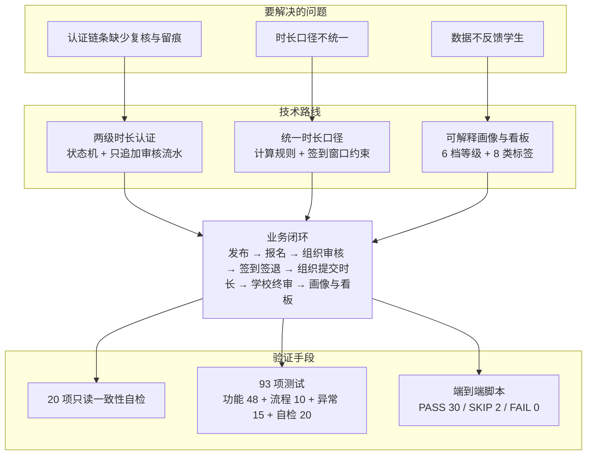
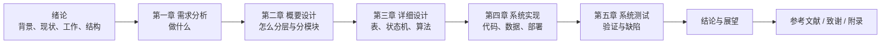

# 绪论

> **位置与编号**：本目录文件编号是**写作顺序**，不是合稿后的章节号。合稿顺序：摘要 →
> **绪论（本文件）** → 需求分析 → 概要设计 → 详细设计 → 系统实现 → 系统测试 → 结论与展望 →
> 参考文献 → 致谢 → 附录。章节号由 Word 排版统一处理。

> **引用口径**：正文 `[n]` 与 `参考文献.md` 的分组编号一一对应 —— 学术论文 `[1]`~`[10]`、
> 标准与规范性文件 `[11]`~`[15]`、其他公开文献 `[16]`~`[19]`、技术文档 `[20]`~`[29]`，
> 每条均带可核验的 URL 或 DOI，著录格式遵循 GB/T 7714-2015 [15]。
> 核验依据见 `docs/_handoff/agent-7-thesis-intro.md`，待补方向见 `参考文献.md` 第六节。

> **数据口径（全文通用）**：三套口径**不可混用** —— ① `sql/07_demo_scale.sql` 口径
> **1500 学生 / 386 活动 / 10719 报名 / 19319.3 小时**；② 叠加 `sql/12_activity_images_demo.sql`
> 后的当前库值 **1503 学生 / 389 活动**（报名与时长不变）；③ 前端 mock **12,480 报名 /
> 86,420 小时**，是纯前端演示假数据，**不是真库数字**。
> 依据：`docs/测试报告.md:15`、`docs/测试报告.md:283-291`、`docs/待办清单.md:847-849`。

---

## 1.1 研究背景与意义

### 1.1.1 志愿服务制度化把"服务时长"推成了对外凭证

《志愿服务条例》（国务院令第 685 号，2017 年 12 月 1 日起施行）第十九条要求志愿服务组织
如实记录志愿者信息，**按统一的信息数据标准录入国务院民政部门指定的志愿服务信息系统**，
并依据记录**无偿、如实出具**记录证明；第二十九条明确高等学校**可以将学生参与志愿服务活动
纳入实践学分管理** [11]。《志愿服务记录与证明出具办法（试行）》（民政部令第 67 号，
2021 年 2 月 1 日起施行）规定记录与出证须遵循**真实、准确、完整、无偿、及时**原则，
记录证明**应载明志愿服务时间、服务内容和记录单位**且**可经信息系统查验** [12]。

共青团中央与教育部《关于在高校实施共青团"第二课堂成绩单"制度的意见》要求第二课堂活动
**可记录、可评价、可测量、可呈现**，并把"志愿公益经历"列为基本内容之一 [14]；
团中央学校部在解读中把"客观记录"与"科学评价"列为首要两项功能 [16]。
三条文件指向同一结论：**服务时长不再只是"记一笔"，而要有统一口径、有审核责任、有留痕、
可查验，并能支撑评价与决策**。

### 1.1.2 传统时长认证方式的四个痛点

**载体分散。** 报名表、签到表、时长认定表分散在各组织手里，学生看不到"报名到哪一步"
"时长为什么还没到账"。

**认证链条缺少复核与留痕。** 常见做法是"组织自报时长、学校事后抽查"，没有强制的第二级审核，
也没有"谁提交、谁审核、何时审核、为什么驳回"的完整流水，与 [12] 要求的
"真实、准确、完整"存在实质差距 —— **"完整"也包括认证过程完整**。

**时长口径不统一，跨组织不可比。** 同样一场"两小时的活动"，有的按签退减签到的实际差值计，
有的按活动预计时长计，有的按组织申报值计；迟到早退、忘记签退、签到异常更是各按各的习惯处理，
导致**同一名学生在不同组织获得的时长不可比，学院与学校两级统计的总量也对不上**。
民政部《志愿服务信息系统基本规范》（MZ/T 061-2015）是我国志愿服务信息化领域第一个
全国性行业标准，规范了 9 类基础数据元与 9 项基本功能，并**把"信息共享与交换接口"
单列一章** [13] —— 可见"口径统一、数据互通"是行业公认的难点。

**数据只用于记录，不用于反馈。** 全校数据沉淀在表格里，既回答不了"哪个学院参与度高"
"哪类活动最缺人""参与是否具有持续性"，也无法反馈给学生本人，**缺少正向激励**。

### 1.1.3 信息化与数据化的价值

仅把发布、报名、签到搬到线上，只能解决第一个痛点（可查询），**解决不了后三个**。
系统须同时具备三种能力：**用状态机固化责任**（每一步流转都有明确的状态、操作角色与
前置条件）、**用算法统一口径**（把"时长怎么算""最多能记多少"写成全校共用的可执行规则）、
**用数据反哺激励**（把闭环数据聚合成学生画像与管理看板）。本课题据此设计：
以**多角色审核闭环**（组织提交时长 → 学校终审）固化责任，以**统一的时长计算规则与
签到窗口约束**统一口径，以**公益画像与数据分析看板**完成反馈闭环。完整链路为：
活动发布 → 学生报名 → 组织审核 → 签到签退 → 组织提交时长 → 学校审核 → 学生获得时长 →
公益画像与数据看板。

### 1.1.4 研究意义

**方法层面有三点贡献。** 其一，**把"多角色审核"落成可执行的工程结构**：用 5 个显式状态机
（活动 4 态、报名 5 态、签到 5 态、时长 4 态、组织 4 态）承载流转，用一张**只追加**的
`duration_audit` 流水表记录 `SUBMIT` / `APPROVE` / `REJECT` 三类动作；其中一个易混却直接
影响正确性的约定是**状态值 `APPROVED` / `REJECTED` 与动作值 `APPROVE` / `REJECT` 不同形**
（`sql/02_schema.sql:448`）。其二，**给出"不引入区块链"的可信存证折中方案**：区块链方案在
**校内单一信任域**下运维成本与收益并不匹配，本课题改为在关系数据库内用"**单一权威值 +
画像快照 + 只追加审核流水 + 20 项只读一致性自检**"实现同等强度的可追溯与可核验
（`sql/09_consistency_check.sql`）。其三，**给出面向公益场景的可解释画像规则**：
6 档等级与 8 类标签的阈值、判定条件与并列打破规则全部显式化（分类并列按**分类 id 升序**
打破，**不用中文名排序** —— 中文串排序依赖数据库 collation），且**不依赖机器学习模型**。

**工程实践层面**完整走通了"需求 → 设计 → 实现 → 测试"四阶段，并留下**可核查的证据链**；
三人小组在 11 个 Maven 模块上并行开发的组织方式也具有参考价值。

---

## 1.2 国内外研究现状

本节按六个方向综述，每个方向统一回答：**这一方向在做什么 → 局限在哪里 → 本课题的差异**。

### 1.2.1 志愿服务管理与时长记录的信息化

**已有工作。** **标准与制度线**：《志愿服务条例》与《志愿服务记录与证明出具办法（试行）》
确立了记录的法定地位与"真实、准确、完整、无偿、及时"原则 [11][12]；MZ/T 061-2015 给出
技术底座 —— 9 类基础数据元、9 项基本功能，以及独立成章的"信息共享与交换接口" [13]。
**系统实现线**：典型做法是"前后端分离 + 活动发布 / 报名 / 审核 / 签到 / 统计"，
例如有研究基于 Spring Boot 与微信小程序实现校园志愿者管理系统，并实现基于地理位置的
服务验证与多角色协同管理 [19]；也有研究从体系构建角度给出分层架构与权限分级方案 [17]。

**局限。** 落点集中在**流程线上化**，时长多为"组织方录入即生效"的单点数据：标准规定了
"要有志愿服务时间数据元"，但不适合规定"这条时长具体怎么算出来"；实现类工作通常把时长
统计放在管理员的统计功能里 [19]，缺少**由组织提交、由学校终审**的两级认证，
也缺少对迟到早退、忘记签退等边界情况的统一规则。

**本课题的差异。** 把时长做成**显式状态机 + 只追加流水**的认证链：学校终审 `APPROVE` 后
才累加累计时长，`REJECT` 则允许重新提交并**追加新的 `SUBMIT` 流水而不覆盖驳回历史**；
计算规则固化为可执行算法（以签退减签到的实际差值为准，缺签退或签到状态为 `ABNORMAL` 时
取活动预计时长，上限为**活动预计时长 1.5 倍**）。

### 1.2.2 高校第二课堂成绩单与综合素质评价

**已有工作。** 《关于在高校实施共青团"第二课堂成绩单"制度的意见》把第二课堂定位为与
第一课堂协同育人的工作体系，要求实现"可记录、可评价、可测量、可呈现"，并将
"志愿公益经历"列为五项基本内容之一 [14]。团中央学校部在解读中把成绩单功能归纳为
客观记录、科学评价、促进成长等六个方面，并把成绩单定位为"学校人才培养评估、
学生综合素质评价、社会单位招录高校毕业生的重要依据" [14][16]。《志愿服务条例》
第二十九条关于"纳入实践学分管理"的规定 [11]，则为时长与学分、评奖评优之间的换算
提供了法规依据。

**局限。** 制度层面要求"客观记录 + 科学评价"，但**落到技术实现时，"评价"往往退化为
"总时长"这一个标量**：学生看到的是"我一共做了多少小时"，看不到"我偏向哪类服务"
"参与是否持续"。同时，学院与学校两级可能各自维护一套台账，**同一名学生的时长在不同
层级、不同用途下可能出现不一致的口径**，而制度文本并不规定技术上的唯一数据源。

**本课题的差异。** 从数据模型层面消除口径分歧：明确**以 `student_info.total_duration`
为唯一权威值**，时长审核通过时由后端累加；`student_profile` 只作**画像快照**，
可随时由权威值重算（A5 决策）。在此之上，画像把"总时长"这一个标量扩展为**"总量 + 结构"**：
6 档公益等级给出总量分层，8 类公益标签给出参与结构（"热心志愿者""长期坚持型"
两个行为标签，加上六个互斥的类型标签）。

### 1.2.3 可信存证技术在公益与志愿服务场景中的应用

**已有工作。** 这是与志愿时长最直接相关的一条技术路线，动机是**解决记录的可信性与
可追溯性**。有研究提出基于区块链的志愿服务时间记录系统，由**智能合约保证有效的时间认定**，
使志愿者时间不受不当人为干预 [7]；有研究提出基于区块链的志愿时间银行 VOLTimebank，
采用**委托权益证明（DPOS）**共识选出审计者，**审计者的主要职责就是审核志愿者提供的
服务** [8]；有研究把时间银行做成移动端系统并集成 MultiChain，由组织向参与志愿活动的成员
发放自有时间代币，交易元数据写入区块使记录不可篡改 [9]；国内也有工作采用 FISCO BCOS
联盟链存储志愿服务数据，用 Solidity 智能合约记录参与人员、活动记录、服务时长与积分 [18]。

**局限。** 其一，**成本与收益的匹配问题**：区块链方案要引入节点、共识、智能合约与钱包，
运维复杂度显著上升；而高校志愿服务处在**校内单一信任域**内，"防篡改"的对手方并不是
恶意节点，而是**记录疏漏与口径分歧**，区块链并未直接解决后者。其二，
**链上可信不等于业务正确**："记录写入不可篡改"并不回答"时长按什么规则计算"
"谁有权终审""驳回后能否重提"。其三，**集成成本**：这些工作多为面向特定场景的原型，
与高校既有的学工、教务系统的对接方式未充分展开。

**本课题的差异。** **不引入区块链**，而是在关系数据库内用四种手段达到面向校内场景
足够强度的可追溯与可核验：**只追加的审核流水表**、**显式的状态机与前置守卫**
（未通过审核的报名不允许开时长）、**单一权威值加可重算快照**、以及**20 项只读一致性
自检脚本**（可重复执行，答辩现场即可复现）。在单一信任域内，**可信性可以由
"可复现的检查"提供，而不必由"分布式共识"提供**。

### 1.2.4 教育数据挖掘与学生画像

**已有工作。** 学生画像的技术基础是教育数据挖掘（Educational Data Mining，EDM）。
国内综述指出 EDM 运用教育学、计算机科学、心理学和统计学等多学科理论技术解决教育研究与
教学实践中的问题 [1]；国际上的十年系统综述（2013—2023 年）梳理了分类、回归、聚类、
关联规则挖掘等技术在教育中的应用，并专门讨论了**数据伦理、隐私与安全**带来的挑战 [10]。
在画像方法层面，有研究提出面向高校精准思政的学生画像方法，给出**分级标签体系**
（把标签组织为标签树，逐级细化到可直接映射数据资源表的叶子标签），并指出
**标签树并不唯一**，其设计受工作经验与历史统计结论影响 [2]。

**局限。** 其一，**数据源偏"学习行为"**：数据多来自在线学习平台、教务系统与网络行为
日志 [1][10]，面向**志愿服务/公益活动**这一细分场景的画像研究相对少见。其二，
**画像与业务系统往往分离**，缺少"业务闭环产生数据 → 画像反馈给学生 → 激励再次参与"
的回路。其三，**标签体系依赖经验**：标签数量可以很多，但对具体场景而言
"哪些标签是可解释、可复算、能被学生看懂的"缺少取舍标准 [2]。

**本课题的差异。** 画像数据**完全来自系统自身的业务闭环**（报名、签到、时长审核），
天然具备"闭环产生数据 → 画像反馈"的回路。标签体系刻意做**减法**：只保留 6 档等级与
8 类标签，判定条件都是可复算的规则（如"热心志愿者"= 累计有效时长大于 0，
"长期坚持型"= 已完成活动次数不少于 3），**不使用需要训练数据的模型** ——
画像要给学生看、要给评审解释，**可解释性比模型复杂度更重要**。未落地项如实记录：
6 档等级阈值仍硬编码在 3 处，未集中成配置表。

### 1.2.5 多角色审核工作流与访问控制模型

**已有工作。** 审核流程建模主要沿工作流与 Petri 网方向展开。有研究提出以**审批角色为中心、
以消息为流转机制、以规则为流程控制逻辑**的审批业务工作流模型，用以克服传统面向过程建模
缺乏流程柔性与系统灵活性的缺点 [5]；也有研究把 Petri 网建模用于文件审批系统，
利用化简规则验证模型的**结构正确性**，并通过可覆盖树分析**可达性、活性、有界性**，
从而在建模阶段排除活锁与死锁 [6]。权限模型方面，基于角色的访问控制（RBAC）是事实上的
主流选择：经典文献提出了由四种参考模型构成的 RBAC 框架，用于理解 RBAC 并对其实现分类 [4]；
国内综述则聚焦 RBAC 中的**约束**，指出约束是保证 RBAC 安全原则得以实施的前提 [3]。

**局限。** 其一，**研究关注点与工程关注点存在落差**：审批工作流研究多关注流程建模的
形式化与结构性质 [5][6]，而对"状态字段与动作字段要不要区分命名""驳回后重新提交应覆盖
还是追加历史""取消操作应改状态还是做逻辑删除"这类**直接决定实现正确性的细节**讨论不多。
其二，**RBAC 的落地形态存在场景差异**：RBAC 研究多关注约束的表达能力与形式化 [3][4]，
对"角色固定为三个、权限边界完全静态"的轻量场景讨论较少；在这类场景下为形式上的
"动态权限"额外引入角色—权限关联表，反而增加了与代码映射表不一致的风险。

**本课题的差异。** 其一，**不引入工作流引擎**，用 5 个显式状态机加守卫条件实现多角色审核。
其二，**把易错约定显式化并纳入验证**：状态值与动作值不同形、取消报名只改 `status` 不软删、
驳回重提追加流水不覆盖历史 —— 这些约定写进设计文档，并由 20 项一致性自检与 93 项测试用例
覆盖。其三，**权限刻意不建表**：系统只有 3 个角色、共 29 条权限码（学生 5 条、组织管理员
7 条、学校管理员 17 条），权限映射以静态表形式写在 `StpInterfaceImpl.java:39-75` ——
当角色与权限边界完全静态时，**代码里的映射表就是最不容易漂移的那份真相**。

### 1.2.6 技术栈与工程实践

**已有工作。** 后端采用 Spring Boot 4.1.1（2026 年 8 月发布，含 98 项缺陷修复、
文档改进与依赖升级）[20]，它是 2025 年 11 月发布的 Spring Boot 4.0.0 的后续维护版本 [21]，
其系统要求明确 JDK 21 在支持范围内 [22]；持久层采用 MyBatis-Plus 3.5.17，官方安装文档
明确 Spring Boot 4 必须使用 `mybatis-plus-spring-boot4-starter`（自 3.5.13 起提供）[24]；
认证采用 Sa-Token 1.46.0 [25][26]；接口文档采用 Knife4j Next [27]；数据库采用 PostgreSQL；
前端采用 Vue 3 [28] 与 Apache ECharts [29]。依赖版本的可用性可通过 Maven 中央仓库核对 [23]。

**局限。** 官方文档给出的是**通用做法**，而**具体版本组合的边界往往"文档没写、
踩了才知道"**。例如 Spring Boot 4 已把 `spring-boot-starter-aop` 改名为
`spring-boot-starter-aspectj`，旧坐标在 4.x 下没有发布且不在 BOM 内；Spring Boot 4
迁移到 Jackson 3，容器自动配置的 `ObjectMapper` 包名是 `tools.jackson`；
MyBatis 的 `returnInstanceForEmptyRow` 默认为 false，当一行所有映射列都是 NULL 时该行
不返回对象、而是往 `List` 里塞一个 `null`，**不报 SQL 错、只在数据恰好有空值时抛空指针**。

**本课题的差异。** 把上述经验沉淀为两份可复用清单：**版本兼容性约束**（明确每个组件
"必须用哪个坐标、为什么不能用另一个"）与**30 条踩坑记录**（后端 20 条 + 前端 10 条）。
两份清单记录的都是"**不报错但结果是错的**"的问题 —— 这类问题无法靠编译器和单元测试发现。

### 1.2.7 研究现状小结与本文定位

综合六个方向可见，已有工作分别在**流程线上化**、**制度与评价要求**、**记录可信性**、
**数据分析方法**、**流程与权限建模**和**工程实践**上各有积累，但落到"高校志愿服务
时长认证"这一具体场景时，**三个环节同时缺失**：**两级时长认证**（已有系统多是
"活动发布 + 报名 + 记录"的流程管理，时长由组织方单点录入即生效，标准规定了数据元与
功能项但不适合规定审核责任链 [13][19]）、**统一口径的时长计算规则**（时长怎么算、
最多能记多少、异常签到怎么处理各行其是，导致跨组织数据不可比、两级统计对不上）、
**面向学生的画像反馈**（数据止步于统计报表，学生看不到自身参与结构 [2][17]）。

**本文的定位，就是把这三者合成一个闭环**：用两级审核解决"认证"，用统一算法与窗口约束
解决"口径"，用可解释画像与看板解决"反馈"，并用 20 项一致性自检与 93 项测试把三者的
一致性变成可验证的工程指标。三条取舍贯穿全文：与区块链路线相比，本文以"可复现的检查"
替代"分布式共识" [7][8][9][18]；与纯数据分析路线相比，本文选择可解释的规则画像而非
机器学习模型 [1][2][10]；与工作流引擎方案相比，本文选择显式状态机而非通用流程引擎 [5][6]。
它们服从同一个约束：**在三人小组、一学期、单体部署的条件下，把工程做完整、
把证据留清楚，比把技术堆复杂更有价值**。

下图给出本文的研究内容与技术路线。

---

## 1.3 本文主要工作

本文的工作按"需求 → 设计 → 实现 → 测试"四阶段组织，共五项，逐项对应后续五章。

**工作一：以三条路径收敛需求，并把歧义项显式拍板（对应第一章）。**
需求沿三条路径收敛：开发计划书给定的功能范围是主干；**29 个已实现页面的反推**是发现
"文档未写但实际需要"的主要手段；文档中 12 处未定义或互相矛盾之处被集中登记为
"需要先拍板"的 A 组，逐项给出结论、理由与落地位置。这一步把"文档里没写"变成了
"有据可依的决定"。

**工作二：给出总体架构与数据库总体设计（对应第二章）。**
系统采用前后端分离加后端**模块化单体**架构：11 个 Maven 模块中 8 个承载业务，
16 张表按业务域归属到 6 个模块；依赖规则是"禁止反向依赖与循环依赖，跨模块只调用对方
Service 接口，禁止直接访问对方 Mapper 与表"。本章记录两条**刻意的例外**：数据分析模块
直接只读跨域表（一次看板跨 8 张表，走各域 Service 会退化成"查明细再内存聚合"）；
跨模块"回读"通过端口接口实现、由上层模块提供实现，**依赖方向不变**。

**工作三：完成字段级详细设计，并把关键决策写成可论证的结论（对应第三章）。**
本章包含 16 张表的字段级设计、5 个状态机、12 项关键设计决策（A1 至 A12）与画像算法，
其中三处最值得展开。**A1 与 A2 是两条互补约束**：签到窗口管的是"**能不能**签到与签退"
（允许的最大计时倍数是 `1 + 1/预计时长`），1.5 倍封顶管的是"**最多能记多少**时长"，
因此活动预计时长小于 2 小时时 1.5 倍封顶才是更紧的约束。**A3 的并发方案**：报名占名额把
判断条件下推到 `WHERE` 子句，一条 `UPDATE` 同时解决原子性与超卖，**不需要额外的
`version` 乐观锁列**。**A5 的权威值口径**：以 `student_info.total_duration` 为唯一权威值，
`student_profile` 只作可重算快照。

**工作四：完成系统实现并沉淀工程经验（对应第四章）。**
后端 6 个业务模块全部落地，前端 29 个页面与接口层 70 个调用与后端契约对齐、零缺失；
安全方面实现 BCrypt 口令存储与登录连续 5 次失败锁定 15 分钟；演示数据用**确定性算法**
（取模）而非随机函数生成。实现阶段修复了两个必修缺陷：**时长可以开给未通过审核的报名**
（根因是"取消不改逻辑删除"的决策与只检查逻辑删除的反查语句之间的矛盾），
以及**学生注册不建档**导致学生端整条链路报错。

**工作五：以分层测试验证系统，并如实记录缺口（对应第五章）。**
测试由 73 条用例（功能 48、流程 10、异常 15）、20 项数据一致性检查与端到端自动化脚本
（PASS 30 / SKIP 2 / FAIL 0）组成，合计 93 项，实测 87 项通过、6 项受限。其中一条
**至今未修**的缺陷值得单独提出：删除用户不级联，其学生档案、报名与时长仍留在库中并继续
计入看板 —— 而**20 项数据一致性检查抓不到它**，因为数据在形式上是自洽的，只是业务语义
错了。这恰好证明数据一致性检查不能替代业务规则验证。

**贯穿五项工作的关键技术点**汇总如下。

| # | 技术点 | 内容 | 位置 |
|---|---|---|---|
| 1 | A1 + A2 互补约束 | 窗口限制"能不能签"，1.5 倍封顶限制"最多记多少" | 第三章 3.4.1 / 3.4.2 |
| 2 | A3 原子占名额 | 判断条件下推 `WHERE`，无需乐观锁列 | 第三章 3.4.3 |
| 3 | A5 权威表 | `student_info` 为唯一权威值，画像仅作可重算快照 | 第三章 3.4.5 |
| 4 | 6 档 8 类画像 | 规则可解释、可复算，不依赖训练数据 | 第三章 3.5 |
| 5 | 20 项一致性自检 | 只读、可重复执行，把冗余字段风险变成可验证指标 | 第三章 3.8 / 第五章 5.7 |
| 6 | 依赖倒置端口 | 端口由上层声明、下层实现，依赖方向不变 | 第二章 2.3.3 |
| 7 | 三套口径显式分离 | `07` 口径、叠加 `12` 后、前端 mock，不可混用 | 第一章 1.8.3 / 第四章 4.7.2 |

---

## 1.4 论文组织结构

全文共五章，加上绪论、结论与展望、参考文献、致谢与附录，组织结构如下。

| 顺序 | 部分 | 主要内容 |
|---|---|---|
| 前置 | 摘要与关键词 | 研究背景、方法、结果与结论（另行撰写） |
| — | **绪论（本文件）** | 研究背景与意义、研究现状、主要工作、组织结构 |
| 第一章 | **需求分析** | 选题来源、需求获取与 A 组 12 项拍板、定位与范围、三角色与权限、功能与非功能需求、用例与流程、需求边界 |
| 第二章 | **概要设计** | 总体与部署架构、模块划分与依赖规则、前端总体设计、数据库总体设计、接口约定、安全设计 |
| 第三章 | **详细设计** | 16 张表字段级设计、5 个状态机、12 项关键决策、画像算法、流程时序、一致性设计 |
| 第四章 | **系统实现** | 环境与工程结构、基础设施、6 个业务模块、安全、前端、演示数据、部署、验证证据 |
| 第五章 | **系统测试** | 测试环境与口径、测试设计、三组测试、一致性测试、端到端自动化、缺陷与受限项 |
| 后置 | **结论与展望** | 工作总结、创新点、不足与后续工作 |
| 后置 | **参考文献** | 学术论文、标准与规范性文件、其他公开文献、技术文档四组 |
| 后置 | **致谢** | 指导教师、同学与家人的感谢（个人信息留待本人填写） |
| 后置 | **附录** | 数据库表清单、接口清单、状态码字典、测试用例编号对照 |

各章之间的逻辑关系如下图所示。

> **关于章节编号**：本目录的文件编号（`01` 至 `05`）是**写作顺序**，合稿时的章节号由
> Word 排版统一处理。若院系要求"绪论"不计入正文章节编号，则正文第一章即为需求分析；
> 若要求计入，则本文件即为第一章，后续各章依次顺延。

---

## 1.5 本章小结

1. **问题来源是制度要求与工作现状之间的落差**：法规与制度要求志愿服务记录真实、准确、
   完整、无偿、及时且可经信息系统查验 [11][12]，第二课堂活动可记录、可评价、可测量、
   可呈现 [14][16]；而高校实际做法仍以纸质与表格为主，存在载体分散、缺少复核留痕、
   口径不统一、数据不反馈四个痛点。

2. **研究现状的结论是"三个环节同时缺失"**：已有系统多是"活动发布 + 报名 + 记录"的
   流程管理，缺"组织提交—学校终审"的两级认证、缺统一口径的时长计算规则、
   缺面向学生的画像反馈。本文把这三者合成一个闭环，即本文的定位。

3. **本文的工作按四阶段组织、对应五章**，关键技术点集中在七处（见 1.3 节末表），
   其中三条取舍立场贯穿全文：不引入区块链、不使用机器学习模型、不引入工作流引擎。
   它们服从同一个约束 —— 在三人小组、一学期、单体部署的条件下，把工程做完整、
   把证据留清楚，比把技术堆复杂更有价值。

**下一章（第一章 需求分析）**将在本章界定的问题范围基础上，给出需求的获取路径、
系统的定位与边界、三个角色的权限模型、功能与非功能需求，并如实划定需求边界。
